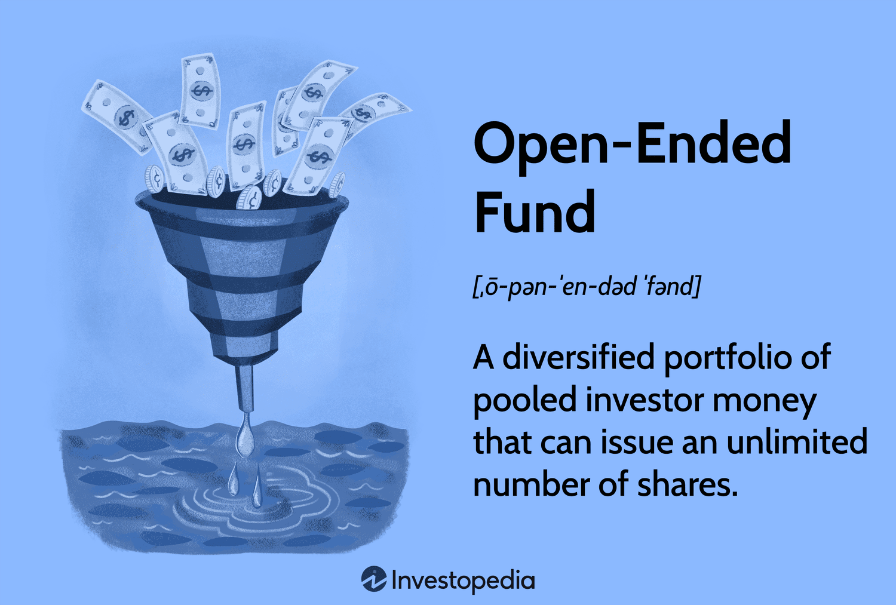

## Table of Contents

## What is an Open-Ended Investment Company (OEIC)?

An Open-Ended Investment Company (OEIC) is a type of investment fund where the number of shares can change based on investor demand. When people want to buy shares, the OEIC creates new shares, and when people want to sell their shares, the OEIC buys them back. This is different from a closed-ended fund, where the number of shares stays the same after the initial offering.

OEICs are popular because they offer flexibility and are easy to buy and sell. They pool money from many investors to invest in a variety of assets like stocks, bonds, and property. This allows individual investors to have a diversified portfolio without needing a lot of money. The price of an OEIC share is based on the total value of its investments, divided by the number of shares in circulation.

## How does an OEIC differ from a closed-end fund?

An OEIC and a closed-end fund are both types of investment funds, but they work differently. An OEIC can create new shares when people want to buy them and buy back shares when people want to sell them. This means the number of shares in an OEIC can go up or down based on what investors want. On the other hand, a closed-end fund has a fixed number of shares. Once it's set up, it doesn't create new shares or buy back old ones. If you want to buy or sell shares in a closed-end fund, you have to do it on the stock market, just like buying or selling any other stock.

Because of these differences, the way you buy and sell shares in an OEIC is easier and more flexible than in a closed-end fund. With an OEIC, you can usually buy or sell shares directly from the fund at the end of each day, based on the value of the fund's investments. With a closed-end fund, the price of the shares can be different from the value of the fund's investments because it depends on what other people on the stock market are willing to pay. This can sometimes make closed-end funds trade at a discount or a premium to their actual value.

## What are the main advantages of investing in an OEIC?

One big advantage of investing in an OEIC is that it's easy to buy and sell shares. Since an OEIC can create new shares when you want to buy and buy back shares when you want to sell, you don't have to worry about finding someone else to trade with. This makes it simple and quick to get your money in or out of the fund. Plus, the price you get is based on the value of all the investments in the fund, so it's fair and straightforward.

Another advantage is that OEICs let you spread your money across lots of different investments without needing a lot of money yourself. They pool money from many investors and use it to buy a mix of things like stocks, bonds, and property. This means you can have a diversified portfolio, which can lower your risk. It's like putting all your eggs in different baskets, but you only need to buy one basket - the OEIC.

## Can you explain the structure of an OEIC?

An OEIC is set up as a company, but it's different from a normal company. Instead of having just one type of share, an OEIC has two kinds of shares: one for investors who want to buy and sell shares easily, and another for the people who manage the fund. The shares for investors are called "retail shares," and they are what you buy when you want to invest in the OEIC. The shares for the managers are called "management shares," and they give the managers control over how the fund is run.

The way an OEIC works is pretty simple. When you want to buy shares in an OEIC, the fund creates new shares for you. When you want to sell your shares, the fund buys them back from you. This means the total number of shares can change all the time, depending on what investors want. The price of each share is based on the total value of everything the fund owns, divided by the number of shares out there. This makes it easy and fair for everyone who invests in the fund.

## How are shares in an OEIC bought and sold?

When you want to buy shares in an OEIC, you tell the fund, and they make new shares just for you. The price you pay is based on what all the things the fund owns are worth, divided by how many shares there are. This way, everyone pays a fair price. You can usually buy shares at the end of each day, so you know exactly what you're getting.

If you want to sell your shares, you tell the fund, and they buy them back from you. They take your shares out of the total number of shares. The price you get is also based on what all the things the fund owns are worth, divided by how many shares are left. This makes it easy and fair for everyone who wants to sell their shares.

## What role does the fund manager play in an OEIC?

The fund manager is really important for an OEIC. They are the ones who decide what the fund will invest in. They look at all the different things like stocks, bonds, and property, and pick the ones they think will do well. This means they are in charge of making sure the fund's money is used in the best way possible.

The fund manager also has to keep an eye on how the investments are doing. If something isn't working out, they might sell it and buy something else. They also handle buying back shares from people who want to sell and making new shares for people who want to buy. This helps keep the fund running smoothly and makes sure everyone who invests in the OEIC gets a fair deal.

## How is the net asset value (NAV) of an OEIC calculated?

The net asset value (NAV) of an OEIC is like figuring out how much the whole fund is worth and then dividing that by the number of shares people own. To do this, the fund manager adds up the value of all the things the fund owns, like stocks and bonds. They also take away any money the fund owes, like fees or debts. What's left is the total value of the fund, which is called the net asset value.

Once they have the net asset value, they divide it by the total number of shares that people have in the fund. This gives them the price of one share. So, if you want to buy or sell a share, you'll know exactly how much it's worth based on this calculation. It's a fair way to make sure everyone gets the same price, whether they're buying or selling.

## What are the typical fees associated with OEICs?

When you invest in an OEIC, you usually have to pay some fees. One common fee is the initial charge, which you pay when you first buy shares. This fee helps cover the costs of setting up your investment. Another fee you might see is the annual management fee, which is a percentage of the total value of your investment that you pay each year. This fee pays for the fund manager's work in picking and managing the investments.

There can also be other fees, like the exit fee, which you might have to pay if you decide to sell your shares. Some OEICs also charge performance fees if the fund does really well. These fees are meant to reward the fund manager for doing a good job. It's important to check all the fees before you invest, because they can add up and affect how much money you make from your investment.

## How does taxation work for investors in an OEIC?

When you invest in an OEIC, you need to think about taxes. If you make money from your investment, like when the value of your shares goes up or when you get dividends, you might have to pay taxes on that money. In many places, the money you make from selling your shares at a higher price than you bought them is called capital gains, and you might have to pay capital gains tax on it. Dividends are payments the fund makes to you from its profits, and you might have to pay income tax on those.

The tax rules can be different depending on where you live and the kind of OEIC you invest in. Some OEICs are set up in a way that can help you save on taxes, like ones that invest in things that get special tax treatment. It's a good idea to talk to a tax advisor to understand how taxes will affect your investment in an OEIC. They can help you figure out what you might have to pay and how to make the most of your investment.

## What are the regulatory requirements for OEICs?

OEICs have to follow a lot of rules to make sure they are safe and fair for everyone who invests in them. In the UK, these rules come from the Financial Conduct Authority (FCA). The FCA makes sure that OEICs tell investors everything they need to know about the fund, like what it invests in and how much it costs. OEICs also have to keep their money separate from the money of the people who run the fund, so if something goes wrong with the company, your investment is still safe.

Another important rule is that OEICs have to be open and honest about how they are doing. They have to tell investors how much their shares are worth every day and give regular updates on the fund's performance. This helps investors make good choices about their money. The FCA also checks that the people running the OEIC are doing a good job and following all the rules.

## How do OEICs handle liquidity and redemption of shares?

OEICs handle liquidity and redemption of shares in a way that makes it easy for investors to get their money in and out of the fund. When you want to buy shares, the OEIC creates new shares for you. This means there's always enough liquidity, or available money, for you to buy shares whenever you want. The price you pay is based on the total value of everything the fund owns, divided by the number of shares. This makes sure everyone pays a fair price.

When you want to sell your shares, the OEIC buys them back from you. This is called redemption. The fund takes your shares out of the total number of shares and gives you money based on the current value of the fund's investments. This way, you can get your money out quickly and easily. The OEIC makes sure there's enough cash on hand to buy back shares without having to sell off investments quickly, which helps keep the fund stable and fair for everyone.

## What advanced strategies can be used by expert investors in OEICs?

Expert investors in OEICs can use a strategy called tactical asset allocation. This means they change what the fund invests in based on what's happening in the market. For example, if they think stocks are going to do well, they might put more money into stocks. If they think bonds are a better choice, they might switch to bonds. This can help the fund do better than just sticking to one type of investment all the time. It's like moving money around to where it can grow the most.

Another strategy is using derivatives, which are special kinds of investments that can help manage risk or make more money. For example, an expert investor might use options or futures to protect the fund from big drops in the market or to make money if the market goes up. This can be tricky and needs a lot of know-how, but it can help the fund do well even when things are uncertain. It's like having a safety net or a way to bet on what might happen next in the market.

## What is an OEIC?

An Open-Ended Investment Company (OEIC) is an investment fund domiciled in the United Kingdom, characterized by its ability to provide investors with a diversified investment portfolio managed by professional fund managers. These investment vehicles are designed to be flexible, allowing the issuance and redemption of shares based on investor demand. This feature distinguishes OEICs from closed-ended funds, where shares are traded on the stock exchange, and the number of shares is fixed. As a result, OEICs are highly liquid, enabling investors to enter and [exit](/wiki/exit-strategy) their investment positions with relative ease.

OEICs offer a wide range of investment strategies tailored to meet the diverse needs of investors. These strategies can range from conservative approaches focused on income generation to more aggressive tactics aimed at capital growth. By offering this variety, OEICs cater to investors with different risk tolerances and financial goals.

The regulation of OEICs is overseen by the Financial Conduct Authority (FCA) in the UK, which ensures that these funds operate with a level of investor protection and reliability. FCA regulation mandates transparency and accountability, providing investors with confidence in their investment choices.

One of the key features of OEICs is the calculation of their Net Asset Value (NAV). The NAV is determined daily by dividing the total value of the fund's assets, less any liabilities, by the number of shares outstanding. This calculation provides a transparent basis for share pricing and enables investors to assess the value of their holdings accurately. The NAV can be expressed mathematically as:

$$
\text{NAV} = \frac{\text{Total Assets - Liabilities}}{\text{Number of Shares Outstanding}}
$$

This daily evaluation ensures that investors have up-to-date information regarding the performance and value of their investments, thus facilitating informed decision-making.

## References & Further Reading

[1]: ["Intelligent Algorithmic Trading Systems: Develop and Implement Cutting-edge AI for Algorithmic Trading Strategies"](https://www.researchgate.net/publication/378548435_Algorithmic_Trading_and_AI_A_Review_of_Strategies_and_Market_Impact) by Sourav Ghosh

[2]: Jones, C. M. (2013). ["What Do We Know About High-Frequency Trading?"](https://papers.ssrn.com/sol3/papers.cfm?abstract_id=2236201) The Review of Financial Studies, Volume 26, Issue 8, pp. 2221-2236.

[3]: ["The UK Open-Ended Investment Company Guide"](https://finbold.com/guide/the-rise-of-uks-open-ended-investment-companies/) by Deloitte

[4]: Narang, R. K. (2013). ["Inside the Black Box: The Simple Truth About Quantitative Trading"](https://www.amazon.com/Inside-Black-Box-Quantitative-Trading/dp/0470432063) Wiley Finance Series.

[5]: Kissell, R. (2013). ["The Science of Algorithmic Trading and Portfolio Management"](https://www.sciencedirect.com/book/9780124016897/the-science-of-algorithmic-trading-and-portfolio-management) Academic Press.