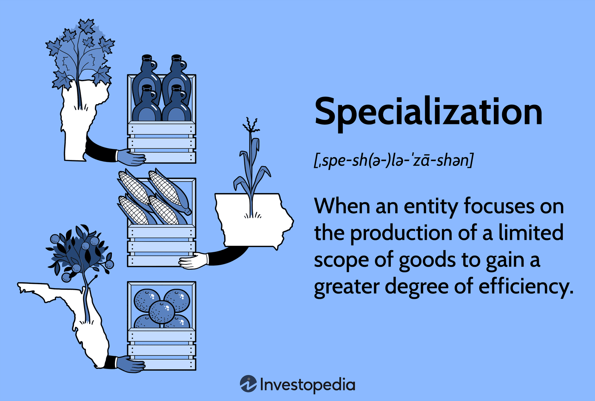

The dynamic world of trading is undergoing a remarkable transformation with the advent of advanced technology. This evolution is opening new avenues and strategies for investors worldwide, enhancing both the scope and the sophistication of trading practices. Among these developments, the interplay between the force open concept and algorithmic trading stands out as particularly intriguing. 

This article seeks to unpack these concepts, define their core principles, and examine their practical applications within the trading industry. The force open concept refers to a trading function where a trader opens a new position that is in the opposite direction to an existing one in the same market. This strategy is often employed to maintain market exposure while simultaneously placing counter bets, thereby providing an edge in hedging risk during volatile market conditions. 



On the other hand, algorithmic trading, or algo trading, utilizes computer programs to execute trades based on specific, pre-established criteria. This approach offers significant advantages in terms of speed, efficiency, and the removal of emotional biases from trading decisions. By swiftly analyzing market data and executing trades at optimal moments, algorithms hold the potential to maximize trading performance. 

Exploring the synergy between these two paradigms promises fresh insights into the future of trading. Whether you are an experienced trader or just beginning, gaining a solid grasp of these concepts can illuminate new possibilities for engaging with and navigating complex financial markets. This article will explore what force open entails, its broader implications, and how integrating algorithmic trading can enhance its application, thereby shaping the evolving landscape of modern trading.

## Table of Contents

## Understanding the Force Open Concept

The force open concept is a distinctive trading strategy where a trader intentionally opens a new position in the opposite direction to an existing position in the same market. This approach is strategically employed to maintain exposure while balancing opposing bets and is frequently utilized in hedging strategies.

The primary advantage of the force open function is that it allows traders to adopt a flexible approach, enabling them to strategically manage their trades without automatically closing out existing positions, as occurs with a force close function. Force open provides traders with greater control over their trade intentions, allowing them to react dynamically to market changes.

One of the main benefits of the force open strategy is its applicability in volatile market conditions. In environments where rapid price movements are commonplace, traders can leverage short-term market fluctuations without nullifying their previous market commitments. For example, if a trader holds a long position, predicting an upward price movement in the asset, but notices a temporary trend indicating a downward movement, they can open a short position. This move offers room to profit from the temporary downtrend while still maintaining the long position should the initial upward trend resume.

Additionally, the mechanics of force open are essential for risk management. Traders can use this strategy to hedge existing positions, thereby potentially minimizing losses and securing profits in volatile markets. By managing opposing positions, the force open concept provides a useful tool for traders looking to balance risk and reward.

In summary, force open is a versatile trading strategy that offers significant benefits in terms of control, flexibility, and risk management. It allows traders to take advantage of short-term price movements and maintain their market exposure, often resulting in more informed and advantageous trading decisions.

 to Algorithmic Trading

Algorithmic trading, often referred to as algo trading, involves the use of computer programs to execute trades based on a set of pre-defined instructions. These instructions can include timing, price, quantity, or any mathematical model. The key advantage of [algorithmic trading](/wiki/algorithmic-trading) is the speed and precision it offers. Computers can monitor multiple markets and execute orders at a faster rate than a human trader.

Speed is a critical [factor](/wiki/factor-investing) in financial markets, where the ability to capitalize on short-lived trading opportunities can be the difference between profit and loss. With algorithmic trading, trades can be executed in milliseconds, significantly faster than manual trading. This rapid execution is particularly beneficial in high-frequency trading ([HFT](/wiki/high-frequency-trading-strategies)), where the trading horizon is extremely short, often measured in seconds or fractions of a second.

Efficiency is another significant benefit. Algorithms can process vast amounts of data, identify trading opportunities, and execute trades without the latency inherent in human decision making. This efficiency reduces transaction costs and can improve the overall profitability of trading strategies.

One of the profound effects of algorithmic trading is the removal of human emotions from trading decisions. Fear and greed, often the causes of irrational decision-making in trading, are eliminated when trades are executed by computer algorithms. The adherence to pre-defined rules ensures that trades are not influenced by the emotional biases that can lead to suboptimal decision-making.

Algorithmic trading also enables the systematic exploitation of market inefficiencies. For example, algorithms can be designed to engage in [arbitrage](/wiki/arbitrage), capturing price differentials across different markets or financial instruments. These opportunities, however small or brief, can be consistently exploited for profit.

A popular use of algorithms is in [statistical arbitrage](/wiki/statistical-arbitrage), where algorithms use statistical methods to exploit price discrepancy between related securities. Here's a simple example in Python of how one might use a moving average crossover strategy, a basic algorithmic trading strategy:

```python
import pandas as pd
import numpy as np

# Assume 'data' is a pandas DataFrame with historical price data
# with a 'Close' column

def moving_average_crossover_strategy(data, short_window=40, long_window=100):
    signals = pd.DataFrame(index=data.index)
    signals['signal'] = 0.0

    # Create short and long simple moving averages
    signals['short_mavg'] = data['Close'].rolling(window=short_window, min_periods=1, center=False).mean()
    signals['long_mavg'] = data['Close'].rolling(window=long_window, min_periods=1, center=False).mean()

    # Create signals
    signals['signal'][short_window:] = np.where(
        signals['short_mavg'][short_window:] > signals['long_mavg'][short_window:], 1.0, 0.0)

    # Generate trading orders
    signals['positions'] = signals['signal'].diff()

    return signals

# Example usage:
# signals = moving_average_crossover_strategy(data)
```

Understanding the role of algorithmic trading is crucial for traders seeking to optimize their performance in contemporary markets. As financial markets continue to evolve and the [volume](/wiki/volume-trading-strategy) of data accessible to traders increases, the dependence on algorithmic solutions for trade execution will likely expand, driving further innovations and efficiencies in the industry.

## Integrating Force Open with Algorithmic Trading

Combining the force open strategy with algorithmic trading offers a compelling advancement for traders striving to increase their responsiveness to market fluctuations. By integrating these concepts, traders can exploit the benefits provided by each to achieve greater efficiency and adaptability in their trading operations.

Algorithmic trading enables the automatic execution of trades based on a set of predefined criteria. This integration with force open allows the execution of trades in the opposite direction to current positions once specific market conditions are met. This capability enhances trader agility, allowing them to capitalize on short-term market movements while retaining existing positions. For instance, if a trader holds a long position but market indicators suggest a potential decline, an algorithm could automatically open a short position to hedge against potential losses, thus optimizing the overall market exposure.

The primary advantage of this integration is the minimization of human error and emotional decision-making. Algorithms can swiftly process vast amounts of market data, identifying patterns and executing trades with a precision unattainable through manual trading. This can be particularly advantageous in volatile markets where rapid decisions are crucial. As an example, implementing the force open strategy through Python might involve using libraries such as `pandas` for data analysis and `TA-Lib` for technical indicator calculations to trigger trades:

```python
import pandas as pd
import talib

# Example market data
data = pd.read_csv('market_data.csv')
close_prices = data['Close']

# Calculate simple moving average
sma_short = talib.SMA(close_prices, timeperiod=20)
sma_long = talib.SMA(close_prices, timeperiod=50)

# Trigger force open strategy when short SMA crosses below long SMA
for i in range(1, len(close_prices)):
    if sma_short[i-1] > sma_long[i-1] and sma_short[i] < sma_long[i]:
        # Example force open action: open a short position
        print(f"Force open short position at index {i}")

```

Moreover, algorithmic trading aids in refining hedging strategies, ensuring traders can preserve their market exposure and mitigate risks efficiently. Force open, when automated, enables the system to make swift corrections to market positions, providing a safety net against adverse price movements.

The synergy between force open strategies and algorithmic trading redefines the execution of trades, presenting opportunities for innovative risk management and speculative trading strategies. By leveraging this integration, traders can utilize technology to develop dynamic strategies that are future-ready, ensuring a competitive edge in today's fast-paced financial landscape. The utilization of advanced computing power and sophisticated algorithms translates to an environment where informed, rapid, and accurate decisions are standard, ultimately improving the trade execution process and market adaptation.

## Key Considerations and Risks

While the integration of force open strategies and algorithmic trading offers distinct advantages in terms of efficiency and responsiveness, several risks and considerations must be scrutinized to ensure successful implementation.

Technical failures pose a significant challenge. Algorithmic trading systems rely heavily on technological infrastructure, making them susceptible to glitches, connectivity issues, and software malfunctions. Such failures can lead to unintended trades or missed opportunities, potentially resulting in costly financial mistakes. Therefore, robust technical support and a reliable IT infrastructure are imperative to mitigate these risks.

Market [volatility](/wiki/volatility-trading-strategies) is another critical factor. In highly volatile markets, price fluctuations can occur rapidly, affecting the performance and reliability of trading algorithms. Algorithms must be capable of adapting to sudden market shifts to ensure they execute trades effectively. High-frequency trading environments often experience extreme volatility, necessitating dynamic and flexible algorithms.

The precision of algorithms is crucial for successful trades. Algorithms must be meticulously programmed to perform specific tasks under defined conditions. Minor errors in algorithm coding can lead to significant financial losses. Hence, thorough testing and validation are essential to ensure that algorithms function as intended. Backtesting strategies on historical data and simulating algorithm performance under different market scenarios can help identify potential issues before deployment.

Regulatory considerations also demand attention. Different jurisdictions may have varying regulatory requirements for algorithmic trading. Traders must ensure compliance with financial regulations to avoid legal repercussions. Regular monitoring of regulatory changes and updates in trading laws is necessary to stay compliant.

Monitoring and adjusting algorithms in real-time are critical for maintaining optimal performance. Markets are dynamic, and conditions can change abruptly, requiring updates or adjustments to trading algorithms. Real-time monitoring systems facilitate timely interventions, allowing traders to modify strategies if necessary.

Effective risk management strategies, such as [backtesting](/wiki/backtesting) and regular updates to trading algorithms, are vital to mitigate potential risks. Backtesting involves running algorithms on historical data to evaluate their performance and identify weaknesses. Regular updates ensure that algorithms incorporate new market data and adapt to evolving conditions.

In conclusion, while integrating force open strategies with algorithmic trading can enhance trading capabilities, traders must carefully address these considerations and risks. Establishing a comprehensive understanding and implementing robust risk management measures are crucial for maximizing the benefits of these advanced trading techniques.

## Conclusion

The fusion of force open strategies with algorithmic trading signals a significant advancement in modern trading techniques. By understanding and applying these concepts, traders can enhance their ability to navigate complex markets more effectively. This integration between force open strategies—where traders maintain the flexibility to open positions in the opposite direction of existing bets—and algorithmic processes—facilitating speed and precision—offers numerous advantages. Notably, it enables more efficient hedging, ensuring that traders can safeguard their positions against unfavorable market shifts while simultaneously capitalizing on short-term price movements.

Additionally, the capability for rapid trade execution minimizes latency, which is crucial in volatile markets where prices may fluctuate rapidly within milliseconds. Algorithmic trading, by its nature, allows for the formulation of pre-defined strategies, leading to optimized market exposure. As trading technology continues to evolve, incorporating improvements in data processing and [machine learning](/wiki/machine-learning) techniques, the combination of force open strategies with algorithmic implementations remains pivotal. It supports traders not only in risk management but also in maximizing returns by leveraging automated, data-driven insights.

Traders who embrace these innovations and integrate them into their trading toolbox may find themselves better positioned to capitalize on market opportunities. As algorithms grow increasingly sophisticated, the potential for continued refinement of these strategies will likely persist, offering those who remain at the forefront of these developments the competitive edge needed in today’s fast-paced financial markets.

## References & Further Reading

[1]: Bergstra, J., Bardenet, R., Bengio, Y., & Kégl, B. (2011). ["Algorithms for Hyper-Parameter Optimization."](https://papers.nips.cc/paper/4443-algorithms-for-hyper-parameter-optimization) Advances in Neural Information Processing Systems 24.

[2]: ["Advances in Financial Machine Learning"](https://www.amazon.com/Advances-Financial-Machine-Learning-Marcos/dp/1119482089) by Marcos Lopez de Prado

[3]: ["Evidence-Based Technical Analysis: Applying the Scientific Method and Statistical Inference to Trading Signals"](https://www.amazon.com/Evidence-Based-Technical-Analysis-Scientific-Statistical/dp/0470008741) by David Aronson

[4]: ["Machine Learning for Algorithmic Trading"](https://github.com/PacktPublishing/Machine-Learning-for-Algorithmic-Trading-Second-Edition) by Stefan Jansen

[5]: ["Quantitative Trading: How to Build Your Own Algorithmic Trading Business"](https://books.google.com/books/about/Quantitative_Trading.html?id=j70yEAAAQBAJ) by Ernest P. Chan