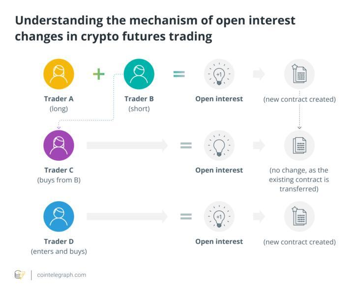

## Table of Contents

## What is open interest in financial markets?

Open interest is a term used in financial markets to describe the total number of outstanding derivative contracts, like futures or options, that have not been settled. For example, if someone buys a futures contract and another person sells it, the open interest goes up by one. This number helps traders understand how much interest there is in a particular market or contract.

Changes in open interest can give clues about the market's direction. If open interest is increasing, it often means that new money is coming into the market, which can signal that the current trend, whether up or down, might continue. On the other hand, if open interest is decreasing, it might mean that the market is losing interest, and the trend could be nearing its end. By watching open interest, traders can make better decisions about when to buy or sell.

## How is open interest different from trading volume?

Open interest and trading volume are two different things in the financial markets. Open interest is the total number of futures or options contracts that are still open, meaning they haven't been closed or settled yet. It shows how many people are still interested in a particular contract. On the other hand, trading volume is the total number of contracts that were traded during a specific time, like a day. It tells you how active the market was on that day.

Think of it this way: if you see a lot of people buying and selling a contract in one day, that's high trading volume. But if many of those contracts are new and haven't been closed yet, that's what increases open interest. So, trading volume can go up and down every day, but open interest changes more slowly because it's about the total number of contracts that are still open over time. Both numbers are important, but they tell you different things about what's happening in the market.

## What does a change in open interest indicate about market sentiment?

A change in open interest can tell us a lot about how people feel about the market. If open interest is going up, it means more people are getting involved in the market. They are opening new contracts instead of just trading the ones that are already there. This usually means that people believe the market trend, whether it's going up or down, will keep going. It's like more people jumping on a bandwagon because they think it's going to keep moving in the same direction.

On the other hand, if open interest is going down, it can mean that people are losing interest in the market. They might be closing their contracts because they think the market trend is about to change or stop. This can be a sign that the current trend might be coming to an end. So, by watching how open interest changes, you can get a sense of whether people are feeling confident or unsure about where the market is headed.

## How is open interest calculated in futures and options markets?

Open interest in futures and options markets is calculated by keeping track of the number of contracts that are still open at the end of each trading day. When someone buys a new futures or options contract and someone else sells it, the open interest goes up by one. This happens because a new contract has been created. But if someone who already owns a contract sells it to someone who already has an opposite position, the open interest doesn't change because the contract is just being transferred, not created or closed.

On the other hand, if someone who owns a contract decides to sell it and close their position, and the person buying it is opening a new position, then the open interest goes down by one. This is because one open contract has been closed. By keeping track of these changes every day, exchanges can report the total number of open contracts, which is the open interest. This number helps traders understand how many people are still interested in a particular market or contract.

## Can you explain the role of open interest in determining market liquidity?

Open interest plays a big role in showing how liquid a market is. Liquidity means how easy it is to buy or sell something without affecting its price too much. If a market has high open interest, it means there are a lot of people with open contracts. This usually makes it easier to find someone to trade with, so the market is more liquid. More people being involved means you can usually buy or sell your contracts quickly and at a good price.

On the other hand, if open interest is low, it can mean the market is less liquid. With fewer people holding open contracts, it might be harder to find someone to trade with. This can make it tougher to buy or sell, and you might have to accept a worse price. So, by looking at open interest, traders can get a sense of how easy or hard it will be to trade in that market.

## What are the implications of high open interest for a particular contract?

High open interest for a particular contract means that a lot of people are interested in it. When many people are holding onto open contracts, it usually makes the market more active and easier to trade in. This is good because it means you can buy or sell your contracts more easily and at better prices. It's like having a busy marketplace where there are always people ready to trade with you.

However, high open interest can also mean that big changes might happen. If everyone with open contracts decides to act at the same time, like if they all want to sell, it could cause big price swings. This can be risky because the market might become more unpredictable. So, while high open interest can make trading easier, it's also important to be careful because it might lead to sudden changes in the market.

## How does open interest affect the price movement of a security?

Open interest can influence the price movement of a security by showing how many people are interested in it. When open interest goes up, it usually means more people are buying new contracts instead of just trading the old ones. This can make the price of the security go up because more people believe it will keep going in the same direction. It's like more people betting on the price to rise or fall, which can push the price that way.

On the other hand, if open interest goes down, it might mean people are losing interest and closing their contracts. This can make the price of the security less stable or even start to move in the opposite direction. When fewer people are holding onto contracts, it can signal that the current trend might be ending, and the price could change more easily. So, watching open interest helps traders guess where the price might go next.

## What are some common strategies traders use in response to changes in open interest?

Traders often use changes in open interest to decide when to buy or sell. If they see open interest going up, they might think more people believe the price will keep going the same way. So, they might buy more contracts if the price is going up, hoping to make money as it keeps rising. Or, if the price is going down and open interest is increasing, they might sell more contracts, expecting the price to fall further. This is because more people getting involved usually means the trend is strong.

On the other hand, if open interest starts to go down, traders might get worried. They might think the current trend is getting weaker and could change soon. So, they might start to close their positions to avoid losing money. For example, if they were betting on the price to go up and see open interest dropping, they might sell their contracts to lock in profits before the price starts to fall. By watching open interest, traders try to guess what other people might do next and plan their moves accordingly.

## How can open interest be used to predict potential price breakouts?

Open interest can help traders guess when a big price change might happen. When open interest goes up a lot while the price stays in a tight range, it can mean a lot of people are getting ready for a big move. They are betting that the price will break out of its current range. If the price is stuck but open interest is climbing, it's like a lot of people are holding their breath, waiting for something to happen. When the price finally breaks out, it can move a lot because so many people are ready to act.

Traders look for these signs to decide when to buy or sell. If they see open interest going up and the price getting ready to break out of its range, they might buy if they think the price will go up, or sell if they think it will go down. By watching open interest, traders can get a sense of how many people are waiting for a big move and be ready to act when it happens.

## What are the limitations of using open interest as a sole indicator for trading decisions?

Open interest can help traders understand what might happen in the market, but it's not perfect to use by itself. One big problem is that it doesn't tell you everything. Open interest shows how many people are interested in a contract, but it doesn't say if they think the price will go up or down. So, if open interest goes up, it could mean more people think the price will go up, or it could mean more people think it will go down. You need other information to figure that out.

Another issue is that open interest can change for reasons that don't have anything to do with the price. For example, if a big trader decides to close a lot of contracts, open interest might go down even if everyone else still thinks the price will keep moving the same way. Also, open interest doesn't show you the whole picture of what's happening in the market. You need to look at other things like the price, trading volume, and news to make good trading decisions. So, while open interest can be helpful, it's best to use it with other indicators to get a better idea of what's going on.

## How do market makers and institutional investors influence open interest?

Market makers and institutional investors have a big impact on open interest because they often trade a lot of contracts. When market makers create new contracts to help people buy and sell, open interest goes up. They do this to make sure there are always contracts available for people to trade. Institutional investors, like big banks or funds, also buy and sell a lot of contracts. When they open new positions, it can increase open interest a lot because they trade in big amounts. So, both market makers and institutional investors can make open interest go up by creating and holding onto new contracts.

On the other hand, when market makers or institutional investors decide to close their positions, open interest can go down. If a market maker sees that fewer people want to trade a certain contract, they might close some of their own contracts, which makes open interest drop. Institutional investors might also close their positions if they think the market is about to change direction or if they want to take their money out. So, their decisions to close contracts can lower open interest. Because of this, the actions of market makers and institutional investors can really move open interest in big ways.

## Can you discuss advanced analytical techniques involving open interest, such as the Open Interest Put/Call Ratio?

The Open Interest Put/Call Ratio is a way to see what people think about the market by looking at the number of open put options compared to call options. A put option is a bet that the price will go down, and a call option is a bet that the price will go up. If the ratio is high, it means more people are betting that the price will go down, which might mean they are worried about the market. If the ratio is low, it means more people are betting that the price will go up, which can show they feel good about the market. Traders use this ratio to guess what might happen next in the market and make their trading choices based on it.

Another advanced technique is to look at how open interest changes in different price ranges, called "Open Interest Distribution." This helps traders see where a lot of people have bought or sold contracts. If there's a lot of open interest at a certain price, it can act like a wall that the price has trouble moving past. Traders might use this information to guess where the price might stop or change direction. By understanding where open interest is high, traders can make better guesses about where the price might go next and plan their trades accordingly.

## What is Open Interest?

Open interest refers to the total number of outstanding derivative contracts, such as options or futures, that have not yet been settled. It is a critical feature of these financial instruments, serving as a key indicator of market activity and sentiment.

Open interest is calculated by tallying the total number of open positions in the market. These positions include both buying (long) and selling (short) contracts. The formula for calculating open interest is straightforward: 

$$
\text{Open Interest} = \text{Number of Long Contracts} = \text{Number of Short Contracts}
$$

This metric increases when new contracts are created and decreases when contracts are either closed or expire. Importantly, it does not change when a trader merely opens a long and closes a short position or vice versa.

The significance of open interest lies in its ability to provide insights into market trends and potential future movements. A rising open interest generally indicates increased participation in the market, suggesting that new money is coming into the market. This influx could signal a continuation of the current trend. Conversely, declining open interest may suggest that the current trend is losing [momentum](/wiki/momentum), as positions are being closed or contracts are being allowed to expire without any new contracts opening to replace them.

Open interest is often compared to trading [volume](/wiki/volume-trading-strategy), although they reflect different aspects of market activity. Volume measures the total number of contracts traded within a specific period, providing a sense of the market's current activity level. Unlike open interest, volume resets each day to zero. While both metrics can indicate market activity levels, open interest gives a clearer picture of the market's commitment to a trend. For instance, a high volume with no change in open interest might indicate that many positions are being closed as quickly as they are opened, possibly pointing to a consolidation or congestion phase in the market.

In practical terms, monitoring changes in open interest alongside price movements can help traders and analysts gauge the strength or weakness of a market trend, assist in decision-making, and predict potential reversals. This makes open interest a valuable tool for those involved in markets dealing with futures and options.

## References & Further Reading

[1]: Bergstra, J., Bardenet, R., Bengio, Y., & Kégl, B. (2011). ["Algorithms for Hyper-Parameter Optimization."](https://dl.acm.org/doi/10.5555/2986459.2986743) Advances in Neural Information Processing Systems 24.

[2]: ["Advances in Financial Machine Learning"](https://www.amazon.com/Advances-Financial-Machine-Learning-Marcos/dp/1119482089) by Marcos Lopez de Prado

[3]: ["Evidence-Based Technical Analysis: Applying the Scientific Method and Statistical Inference to Trading Signals"](https://www.amazon.com/Evidence-Based-Technical-Analysis-Scientific-Statistical/dp/0470008741) by David Aronson

[4]: ["Machine Learning for Algorithmic Trading"](https://github.com/stefan-jansen/machine-learning-for-trading) by Stefan Jansen

[5]: ["Quantitative Trading: How to Build Your Own Algorithmic Trading Business"](https://www.amazon.com/Quantitative-Trading-Build-Algorithmic-Business/dp/1119800064) by Ernest P. Chan