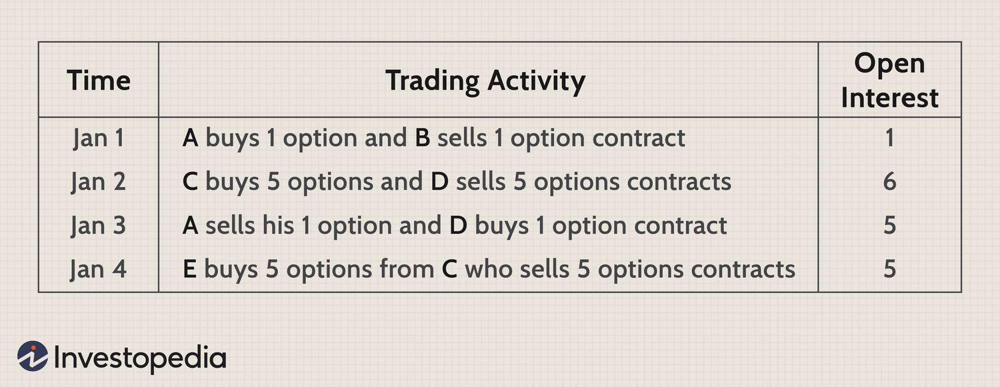

## Table of Contents

## What is open interest in financial markets?

Open interest is a term used in financial markets to describe the total number of outstanding derivative contracts, such as futures or options, that have not been settled. For example, if someone buys a futures contract and another person sells it, the open interest increases by one because a new contract has been created. Open interest gives traders an idea of the market's liquidity and the strength behind price movements. When open interest rises, it often means that new money is coming into the market, showing increased interest and potential for bigger price moves.

Changes in open interest can also tell us about the market's direction. If open interest increases during a price rise, it suggests that the upward trend is strong and likely to continue. On the other hand, if open interest decreases while prices are going up, it might mean that the trend is losing steam and could reverse soon. Traders use this information to make better decisions about when to buy or sell, helping them understand whether a price move is backed by new money or just existing positions being shuffled around.

## How is open interest different from trading volume?

Open interest and trading volume are two different things in the world of trading. Open interest is the total number of futures or options contracts that are still open, meaning they haven't been closed or settled yet. It shows how many people are holding positions in the market at any given time. On the other hand, trading volume is the total number of contracts that were traded during a specific period, like a day. It tells you how many contracts changed hands, but it doesn't tell you if those contracts were new or just existing ones being passed around.

Think of it this way: if you and your friend trade a baseball card back and forth several times in a day, the trading [volume](/wiki/volume-trading-strategy) for that day would be high because the card changed hands a lot. But the open interest would still be just one, because there's only one card in play. Open interest gives you a sense of the market's overall interest and potential for big moves, while trading volume shows you how active the market was on that day. Both are important, but they tell you different things about what's happening in the market.

## Why is open interest important for traders and investors?

Open interest is important for traders and investors because it shows how many people are interested in a market. When open interest goes up, it means more people are getting involved, which can make the market more active and possibly lead to bigger price changes. Traders look at open interest to see if a market trend is strong. If open interest is increasing while prices are going up, it suggests that the trend might keep going because more people are betting on it.

On the other hand, if open interest is going down while prices are moving, it might mean that the trend is losing strength and could change direction soon. This helps traders decide when to buy or sell. Open interest also tells traders about the market's [liquidity](/wiki/liquidity-risk-premium), which is how easy it is to buy or sell without affecting the price too much. A high open interest usually means the market is more liquid, making it easier for traders to get in and out of positions. So, by watching open interest, traders and investors can make smarter choices about their trades.

## How is open interest calculated?

Open interest is calculated by keeping track of the number of open contracts in the market. When someone buys a new futures or options contract, and someone else sells a new one, the open interest goes up by one. This happens because a new contract has been created. If an existing contract is just being passed from one person to another, the open interest stays the same because no new contract was created.

On the other hand, if someone closes out their position by doing the opposite trade, like selling a contract they previously bought, the open interest goes down by one. This happens because the contract is no longer open. By adding up all the new contracts and subtracting all the closed ones, you get the total open interest, which shows how many contracts are still open in the market.

## Can you explain how open interest changes with new trades?

Open interest changes based on whether new contracts are being made or old ones are being closed. When someone buys a new futures or options contract and another person sells it, open interest goes up by one. This is because a brand new contract has been created. If someone who already has a contract just sells it to someone else, the open interest doesn't change. That's because the same contract is just moving from one person to another, and no new contract is made.

On the other hand, if someone decides to close their position by doing the opposite trade, like selling a contract they bought earlier, the open interest goes down by one. This happens because the contract is no longer open. By keeping track of all these new contracts and closed ones, we can figure out the total open interest, which tells us how many contracts are still open in the market.

## What does an increase in open interest indicate about a market?

An increase in open interest means more people are getting involved in the market. When open interest goes up, it usually means new money is coming in. This can make the market more active and might lead to bigger price changes. Traders see this as a sign that the market trend could keep going strong because more people are betting on it.

For example, if prices are going up and open interest is also going up, it suggests that the upward trend has strong support and might continue. This is because more people are buying into the trend, showing confidence in the direction of the market. So, an increase in open interest can give traders a clue about the market's strength and potential future moves.

## How can open interest be used to confirm trends?

Open interest can help traders figure out if a market trend is strong or not. When prices are going up and open interest is also going up, it means more people are buying into the trend. This shows that the trend might keep going because there's strong support from new money coming in. Traders see this as a good sign that the upward trend could continue.

On the other hand, if prices are going up but open interest is going down, it might mean the trend is losing strength. Fewer people are getting involved, which could mean the trend might not last long. By looking at open interest, traders can get a better idea of whether a trend is likely to keep going or if it might be time to sell.

## What are the limitations of using open interest as an indicator?

Open interest can be a useful tool, but it has some limitations. One big problem is that it doesn't tell you everything about the market. Open interest only shows how many contracts are open, but it doesn't say why people are buying or selling. For example, if open interest goes up, it could mean more people are betting on a trend, but it could also mean people are buying options to protect against a price drop. So, you need to look at other things, like trading volume and price action, to get the full picture.

Another limitation is that open interest can be hard to understand by itself. It's better when you use it with other indicators. If you only look at open interest, you might miss important signs from the market. For example, if open interest goes down, it might mean the trend is weak, but if the trading volume is still high, it could mean the market is still active. So, it's important to use open interest along with other tools to make better trading decisions.

## How does open interest affect options pricing?

Open interest can affect options pricing because it shows how many people are interested in a certain option. When open interest is high, it means more people are trading that option, which usually makes the market more liquid. A liquid market is easier to trade in, so the price of the option might be more stable and closer to its fair value. Traders like liquid markets because they can buy and sell options without worrying too much about big price swings.

On the other hand, if open interest is low, it means fewer people are trading that option, which can make the market less liquid. In a less liquid market, it can be harder to buy or sell options without moving the price a lot. This can make the option's price more unpredictable and possibly more expensive because traders might want a higher reward for taking on more risk. So, open interest can give traders an idea of how easy or hard it might be to trade an option, which can influence how much they're willing to pay for it.

## Can you describe how open interest is reported and where to find this data?

Open interest is reported by exchanges like the Chicago Mercantile Exchange (CME) or the Options Clearing Corporation (OCC). These organizations keep track of how many futures or options contracts are open at the end of each trading day. They usually share this information on their websites or through financial data services. You can find open interest data in daily reports, which show the total number of open contracts for different types of futures and options.

To find this data, you can go to the websites of these exchanges. For example, the CME Group has a section called "Market Data" where you can look up open interest for various futures contracts. Another place to find open interest data is through financial data platforms like Bloomberg or Reuters, which often provide detailed reports and charts. These platforms might require a subscription, but they can give you a lot of information about open interest and other market data.

## What advanced strategies involve the use of open interest data?

Traders use open interest data in some smart ways to make better choices about their trades. One way is by looking at the open interest of different strike prices in options markets. If open interest is high at a certain strike price, it might mean a lot of people think the price will hit that level. Traders can use this info to pick options that are popular and might have a good chance of making money. Another way is by watching how open interest changes over time. If open interest is going up while prices are going up, it might mean the trend is strong and could keep going. This can help traders decide if they should keep their positions or get out.

Another advanced strategy is using open interest to find out where big traders, like institutions, are putting their money. If open interest suddenly goes up a lot at certain strike prices, it might mean big traders are making big bets. By watching these changes, smaller traders can try to follow the moves of the big players and maybe make some money too. Open interest can also help traders see if the market is getting ready for a big move. If open interest is growing fast in both call and put options, it might mean the market is expecting a big price swing. Traders can use this info to get ready for possible big changes in the market.

## How does open interest in futures markets differ from that in options markets?

Open interest in futures markets and options markets works in similar ways, but there are some key differences. In futures markets, open interest shows the total number of futures contracts that are still open and haven't been settled. When someone buys a new futures contract and someone else sells it, the open interest goes up by one because a new contract has been created. If an existing contract is just traded from one person to another, the open interest doesn't change. Futures contracts are agreements to buy or sell something at a set price in the future, so open interest in futures tells you how many of these agreements are still active.

In options markets, open interest also shows the total number of options contracts that are still open. Options give the buyer the right, but not the obligation, to buy or sell something at a set price before a certain date. When someone buys a new options contract and someone else sells it, the open interest goes up by one because a new contract has been created. If someone closes their position by doing the opposite trade, like selling an option they bought earlier, the open interest goes down by one. The big difference is that options have different strike prices and expiration dates, so open interest in options can give you more detailed information about what prices people are betting on and when they expect those prices to happen.

## What is Understanding Open Interest?

Open interest is a key concept in the derivatives market, signifying the total number of futures or options contracts that are active. This means these contracts remain open and have not yet reached expiration, been exercised by the parties involved, or closed through offsetting positions. Open interest serves as an indicator of market participation, reflecting the number of outstanding long or short positions maintained by traders.

To understand open interest more clearly, consider it as a tally of market commitment. Each open contract represents either a buyer with a long position or a seller with a short position. For example, if trader A buys a futures contract from trader B, and neither has [exit](/wiki/exit-strategy)ed their positions by selling or buying back, this transaction adds one to the open interest count. Conversely, should either party close their position, the open interest is reduced by one.

Tracking changes in open interest is significant for understanding market strength. An increase in open interest suggests new capital entering the market, possibly indicating a reinforcement of the current trend, as more participants commit their capital under the prevailing market sentiment. Mathematically, open interest ($OI$) at any given time can be expressed as:

$$
OI = \text{Total contracts opened} - \text{Total contracts closed}
$$

Where:
- Total contracts opened refers to the cumulative addition of newly initiated contracts.
- Total contracts closed accounts for contracts nullified via expiration or offset transactions.

In contrast, a decline in open interest might hint that the current trend is weakening, as traders begin to close their positions, signaling a possible shift or consolidation in the market. Analyzing these changes assists traders and analysts in assessing the overall health and [momentum](/wiki/momentum) of market movements, ultimately influencing decision-making and strategic adjustments. Understanding open interest thus empowers traders to make better-informed predictions regarding the potential continuation or reversal of market trends.

## References & Further Reading

[1]: ["Advances in Financial Machine Learning"](https://www.amazon.com/Advances-Financial-Machine-Learning-Marcos/dp/1119482089) by Marcos Lopez de Prado

[2]: ["Evidence-Based Technical Analysis: Applying the Scientific Method and Statistical Inference to Trading Signals"](https://www.amazon.com/Evidence-Based-Technical-Analysis-Scientific-Statistical/dp/0470008741) by David Aronson

[3]: ["Machine Learning for Algorithmic Trading, 2nd Edition"](https://www.oreilly.com/library/view/machine-learning-for/9781839217715/) by Stefan Jansen

[4]: ["Quantitative Trading: How to Build Your Own Algorithmic Trading Business"](https://www.amazon.com/Quantitative-Trading-Build-Algorithmic-Business/dp/1119800064) by Ernest P. Chan

[5]: Hull, J. (2017). ["Options, Futures, and Other Derivatives"](https://archive.org/details/options-futures-and-other-derivatives). Pearson.

[6]: Bookstaber, R. (2007). ["A Demon of Our Own Design: Markets, Hedge Funds, and the Perils of Financial Innovation"](https://rpc.cfainstitute.org/en/research/financial-analysts-journal/2007/a-demon-of-our-own-design-markets). Wiley.