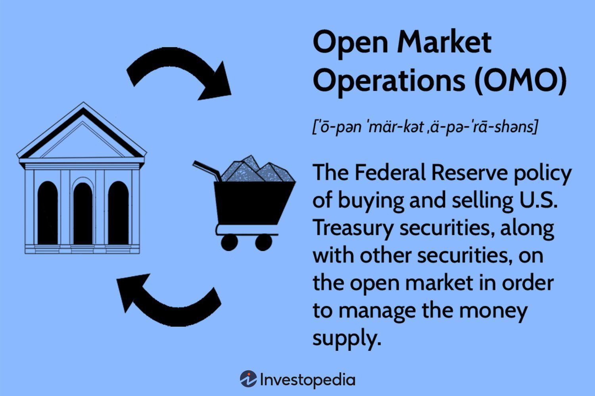

## Table of Contents

## What is an open market economic system?

An open market economic system is a type of economy where people and businesses can buy and sell things freely. In this system, the government does not control prices or tell businesses what to produce. Instead, prices and what gets made are decided by what people want and are willing to pay for. This is called supply and demand. If lots of people want something, the price goes up. If not many people want it, the price goes down.

In an open market, competition is important. Businesses try to make better products or sell them for less money to attract customers. This can lead to more choices and better quality for people buying things. However, it can also mean that some businesses might fail if they can't compete well. The government's role in an open market is usually to make sure that businesses follow rules and to help keep the economy stable, but it does not run the businesses itself.

## How does an open market economic system differ from a closed market system?

An open market economic system is one where people and businesses can trade freely with each other and with other countries. Prices and what gets produced are decided by what people want to buy and sell, not by the government. This means that if people want more of something, its price might go up, and if they want less, the price might go down. In an open market, businesses compete with each other to offer the best products at the best prices, which can lead to more choices and better quality for buyers.

A closed market system, on the other hand, is more controlled by the government. In a closed market, the government might decide what gets produced, how much it costs, and who can buy or sell it. Trade with other countries might be limited or not allowed at all. The idea is to protect local businesses and keep the economy stable, but it can also mean fewer choices and higher prices for people because there's less competition.

The main difference between the two is how much the government is involved. In an open market, the government's role is usually smaller, focusing on making sure businesses follow rules and keeping the economy stable. In a closed market, the government plays a bigger role, controlling more of what happens in the economy.

## What are the key characteristics of an open market economy?

An open market economy is all about freedom. In this kind of economy, people and businesses can buy and sell things without the government telling them what to do. Prices go up or down based on what people want to buy and what businesses want to sell. This is called supply and demand. If lots of people want something, the price might go up because it's in high demand. If not many people want it, the price might go down because there's more supply than demand. This system encourages businesses to compete with each other to offer the best products at the best prices, which can lead to more choices and better quality for buyers.

Competition is a big part of an open market economy. Businesses try to make better products or sell them cheaper to get more customers. This can be good for people because it gives them more options and can lead to lower prices. However, it can also be tough on businesses that can't keep up with the competition. They might have to close down if they can't make enough money. The government's job in an open market is usually to make sure everyone plays fair and to help keep the economy running smoothly, but it doesn't run the businesses itself. This means that while the government has some control, the main decisions about what to produce and how much to charge are made by the people and businesses in the market.

## What are the benefits of an open market economic system for consumers?

In an open market economic system, consumers have more choices. Because businesses compete with each other, they try to make better products or sell them at lower prices to attract customers. This means that consumers can pick the products they like the most or the ones that are the best value for their money. If a business does not offer good products or fair prices, consumers can just go to another business that does. This competition helps keep prices down and quality up, which is good for people buying things.

Another benefit for consumers is that new and innovative products come to the market more often. In an open market, businesses are always trying to come up with new ideas to stay ahead of their competition. This means that consumers get to try new things and benefit from new technologies and improvements. Over time, this can lead to better products and services that make life easier or more enjoyable for people.

## How do businesses operate within an open market economy?

In an open market economy, businesses have the freedom to decide what to produce and how much to charge for their products. They look at what people want to buy and try to meet those needs. If a lot of people want something, businesses might make more of it and might charge a higher price because they know people are willing to pay for it. On the other hand, if not many people want something, businesses might lower the price or stop making it altogether. This system encourages businesses to be flexible and quick to respond to what consumers want.

Competition is a big part of how businesses operate in an open market. They have to compete with other businesses to attract customers. This means they need to offer good products at good prices. If they don't, people will just go to another business that does. This competition can be tough, and sometimes businesses that can't keep up might have to close down. But it also pushes businesses to innovate and improve, which can lead to better products and services for everyone.

## What role does government play in an open market economic system?

In an open market economic system, the government's role is mainly to make sure that businesses play fair and follow the rules. This means the government creates laws and regulations to protect consumers and ensure that businesses compete in a way that is honest and safe. For example, the government might set rules about product safety, environmental protection, and fair labor practices. By doing this, the government helps to maintain a level playing field where businesses can compete without cheating or harming people or the environment.

The government also works to keep the economy stable. This can involve things like setting interest rates, managing the money supply, and sometimes stepping in to help during economic downturns. The idea is to create an environment where businesses can thrive and grow, which in turn creates jobs and helps the economy as a whole. However, the government does not usually tell businesses what to produce or set prices directly, as these decisions are left to the businesses themselves based on what people want to buy.

## How does competition work in an open market economy?

Competition in an open market economy means businesses are always trying to do better than each other. They want to attract more customers, so they work hard to make their products better or sell them for less money. If one business makes a great new product, other businesses might try to make something even better or cheaper. This competition helps keep prices down and quality up because businesses know that if they don't offer good value, people will just go to another business that does.

Sometimes, competition can be tough. If a business can't keep up with others, it might have to close down. But this also means that businesses are always trying to come up with new ideas and improve their products. This can lead to new and better things for people to buy. Overall, competition in an open market economy pushes businesses to do their best, which is good for everyone who buys things.

## What are the potential drawbacks of an open market economic system?

One potential drawback of an open market economic system is that it can lead to inequality. Because businesses compete to make the most money, some people might get very rich while others struggle to make ends meet. This can create a big gap between the rich and the poor. Also, businesses might not always treat their workers fairly. They might pay low wages or have bad working conditions to keep their costs down and stay competitive. This can be hard on workers and their families.

Another issue is that an open market economy can be unstable. Prices can go up and down a lot because they depend on what people want to buy and sell. If something happens that makes people stop buying, like a big economic problem, businesses might have to close down and people might lose their jobs. This can make life hard for a lot of people. The government might have to step in to help, but it can be tricky to fix everything quickly.

Lastly, some people might not have access to important things like healthcare or education because they can't afford them. In an open market, these services are often provided by businesses that charge money. If someone doesn't have enough money, they might not be able to get the help they need. This can make life unfair and difficult for those who are already struggling.

## How does an open market economy affect global trade?

An open market economy encourages global trade because it lets businesses buy and sell things with other countries without many restrictions. In an open market, if a business can make something cheaper or better than businesses in other countries, it can sell those things around the world. This can help the country's economy grow because it brings in money from other places. It also means that people in the country can buy things from other countries that might be cheaper or better than what's made at home. This can lead to more choices and better products for everyone.

However, an open market economy can also create some problems with global trade. If businesses in one country can make things much cheaper, maybe because they pay their workers less, it can be hard for businesses in other countries to compete. This can lead to businesses closing down and people losing their jobs. Also, if one country is selling a lot of things to another country, it might make the second country rely too much on the first one. If something goes wrong, like a big economic problem or a trade dispute, it can cause big problems for the country that depends on those imports.

## What historical examples illustrate the success or failure of open market economies?

One historical example of a successful open market economy is the United States after World War II. During this time, the U.S. government reduced its control over the economy and let businesses and people make more of their own decisions. This led to a lot of growth and innovation. Companies like Apple and Microsoft started and grew into big businesses that made new products people wanted. This helped create a lot of jobs and made life better for many people. The U.S. became a leader in technology and business, showing how an open market can help an economy grow.

On the other hand, the economic crisis in Russia during the 1990s shows how an open market economy can fail if it's not managed well. After the fall of the Soviet Union, Russia tried to move from a closed, government-controlled economy to an open market economy very quickly. This led to a lot of problems. Many businesses and people did not know how to work in an open market, and some people took advantage of the situation to make a lot of money in unfair ways. This caused a lot of inequality and made life hard for many people. It shows that moving to an open market economy needs to be done carefully to avoid big problems.

## How can policy influence the effectiveness of an open market economic system?

Policy can make a big difference in how well an open market economy works. Governments can create rules that help businesses compete fairly and protect people from being treated badly. For example, laws about product safety and fair labor practices can make sure that businesses don't cut corners to save money. Also, policies like taxes and interest rates can help keep the economy stable. If the government sets these right, it can help businesses grow and create jobs, which is good for everyone.

But if policies are not good, they can cause problems. If the government does not have enough rules, some businesses might cheat or treat their workers badly to make more money. This can hurt people and make the economy unfair. Also, if the government does not manage the economy well, like setting taxes too high or interest rates too low, it can lead to big problems like inflation or a recession. So, good policies are important to make sure an open market economy works well and helps everyone.

## What advanced economic theories support or critique open market economic systems?

One advanced economic theory that supports open market economies is the theory of comparative advantage. This theory says that countries should focus on making things they are good at and trade with other countries for things they are not as good at making. In an open market, this can help everyone because countries can buy and sell things with each other more easily. This can make the economy grow and help people have more choices and better products. Economists like Adam Smith and David Ricardo helped develop these ideas, and they believe that open markets can lead to more wealth and better lives for people.

On the other hand, some theories critique open market economies. For example, Keynesian economics, named after John Maynard Keynes, argues that open markets can be unstable and might need government help to work well. Keynes believed that during bad economic times, like a recession, the government should step in to help by spending money and creating jobs. This can keep the economy from getting too bad. Another critique comes from theories about income inequality, like those from economists like Thomas Piketty. They argue that open markets can make rich people richer and poor people poorer, which can make life unfair and hard for many people. These theories suggest that the government should do more to make sure everyone has a fair chance in an open market economy.

## References & Further Reading

[1]: Bergstra, J., Bardenet, R., Bengio, Y., & Kégl, B. (2011). ["Algorithms for Hyper-Parameter Optimization."](https://papers.nips.cc/paper/4443-algorithms-for-hyper-parameter-optimization) Advances in Neural Information Processing Systems 24.

[2]: ["Advances in Financial Machine Learning"](https://www.amazon.com/Advances-Financial-Machine-Learning-Marcos/dp/1119482089) by Marcos Lopez de Prado

[3]: ["Evidence-Based Technical Analysis: Applying the Scientific Method and Statistical Inference to Trading Signals"](https://www.amazon.com/Evidence-Based-Technical-Analysis-Scientific-Statistical/dp/0470008741) by David Aronson

[4]: ["Machine Learning for Algorithmic Trading"](https://github.com/stefan-jansen/machine-learning-for-trading) by Stefan Jansen

[5]: ["Quantitative Trading: How to Build Your Own Algorithmic Trading Business"](https://github.com/LucindaYa/quant-resources/blob/master/Quantitative%20Trading%20How%20to%20Build%20Your%20Own%20Algorithmic%20Trading%20Business.pdf) by Ernest P. Chan