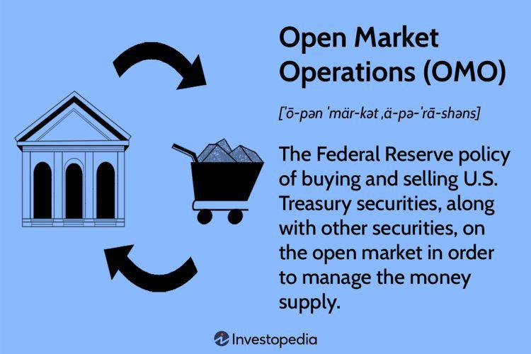

The interconnected nature of economic policy, interest rates, open market operations, and algorithmic trading significantly impacts modern financial markets. These components form a complex landscape that shapes the environment in which traders operate. Understanding their roles and interactions is essential for developing effective trading strategies and optimizing market participation.

Economic policies, including fiscal and monetary strategies, influence interest rates, which are crucial levers for managing inflation and stimulating economic growth. Central banks and governmental bodies adjust these rates, affecting borrowing costs and investment decisions across the economy. This direct influence on market conditions can also sway investor sentiment, causing shifts in financial market performance.



Open market operations, conducted by central banks, involve the buying and selling of government securities. These operations are instrumental in managing liquidity within the banking system, thereby implementing monetary policy. Changes in these operations can have profound effects on interest rates, impacting broader economic activities and financial markets.

Algorithmic trading, a method increasingly dominating modern markets, employs sophisticated algorithms to execute trades at high speeds, significantly enhancing trading efficiency and precision. With the integration of big data and machine learning, these systems are capable of identifying trading opportunities rapidly and adapting to market conditions. However, the interplay between algorithmic trading and economic policy is intricate. Algo trading must account for policy shifts and interest rate changes, which can lead to market volatility or systemic disruptions if not managed correctly.

To leverage these tools effectively, traders need to craft strategies that account for the dynamic interactions among these components. By integrating insights from economic policies and utilizing advanced algorithmic trading systems, market participants can better navigate the complexities of contemporary finance, enhancing their ability to capitalize on emerging opportunities.

## Table of Contents

## Understanding Economic Policy and Interest Rates

Economic policy is a crucial aspect of governmental strategies aimed at regulating economic activity through the implementation of fiscal and monetary measures. Fiscal policy generally involves taxation and government spending to influence the economy. In contrast, monetary policy primarily revolves around the management of interest rates and the money supply to achieve macroeconomic objectives such as controlling inflation, consumption, growth, and liquidity.

Interest rates serve as a fundamental tool of monetary policy. By adjusting interest rates, central banks can exert significant influence over economic activities like borrowing, spending, and investment. When a central bank lowers interest rates, it generally aims to stimulate economic growth by making borrowing cheaper, thereby encouraging businesses to invest and consumers to spend. Conversely, increasing interest rates can help control inflation by discouraging borrowing and spending, thereby cooling down an overheated economy.

Central banks, such as the Federal Reserve in the United States, regularly assess economic conditions to determine appropriate [interest rate](/wiki/interest-rate-trading-strategies) levels. These decisions are based on various economic indicators, including inflation rates, employment figures, and gross domestic product (GDP) growth. The adjustments in interest rates are informed by economic theories that correlate lower rates with increased money supply and higher rates with a restricted money supply.

Economic policies have a profound impact on financial markets and investor sentiments. For instance, a decision to lower interest rates may result in a bullish market response, as lower borrowing costs can enhance corporate profitability and consumer spending, leading to higher stock prices. Conversely, a hike in interest rates might trigger bearish market responses due to increased costs of borrowing and potential slowdown in economic activities.

The relationship between economic policies and interest rate adjustments is pivotal in maintaining market stability and fostering growth. Policymakers must balance the need for economic growth with the risks of inflation. This delicate balance involves carefully crafted interest rate policies that can preemptively address or respond to economic challenges.

In summary, understanding the interplay between economic policy and interest rates is crucial for comprehending their combined impact on market conditions, which continuously shapes investor behavior and financial market outcomes.

## The Role of Open Market Operations

Open market operations are a central component of monetary policy execution, conducted by central banks to regulate the supply of money circulating in the economy. These operations primarily entail the buying and selling of government securities in the open market, a process that directly influences the [liquidity](/wiki/liquidity-risk-premium) levels in the banking system. The central bank's primary objective in engaging in open market operations is to maintain target interest rates, thereby stabilizing economic growth and controlling inflation.

A pivotal institution in the United States for steering open market operations is the Federal Open Market Committee (FOMC). The FOMC convenes regularly to assess economic conditions and to determine necessary adjustments to the federal funds rate, which is the interest rate at which banks lend to each other overnight. By altering the supply of reserves available to the banking system, the Federal Reserve can influence the federal funds rate to align with its monetary policy goals. When the Federal Reserve buys government securities, it injects liquidity into the banking system, often lowering interest rates, which can stimulate borrowing and investment. Conversely, selling government securities can extract liquidity, potentially increasing interest rates and dampening economic activity.

The impact of open market operations on interest rates is significant because these rates serve as benchmarks for other interest rates in the economy, affecting everything from consumer loans to corporate borrowing costs. For instance, an increase in the federal funds rate typically leads to higher costs of borrowing across the financial system, which can slow down consumer spending and corporate investment, potentially leading to slower economic growth.

To comprehend the function and significance of open market operations, consider the following basic mathematical expression of the money multiplier effect in a fractional reserve banking system:

$$
M = \frac{1}{R}
$$

where $M$ is the money multiplier and $R$ is the reserve requirement ratio. By modifying the available reserves through open market operations, the central bank impacts the overall money supply that banks can theoretically generate, which in turn influences economic activity levels.

In practical terms, the outcomes of open market operations are reflected promptly in financial markets. Changes in interest rates affect asset valuations, guiding investor behaviors and expectations. Consequently, these operations are a fundamental tool for central banks not only in achieving monetary policy targets but also in managing economic stability and growth. By strategically altering the money supply, central banks attempt to guide economies towards more stable inflation levels and sustainable economic progress, underscoring the critical importance of open market operations in contemporary monetary policy frameworks.

## Algorithmic Trading: A Modern Approach

Algorithmic trading, often referred to as algo trading, represents a significant shift in how financial markets operate. By utilizing pre-defined criteria and sophisticated algorithms, it allows for the execution of trades at unprecedented speeds and frequencies. This technological advancement leverages big data analytics and [machine learning](/wiki/machine-learning) techniques to uncover trading opportunities and optimize strategies.

Modern trading systems are built on the foundation of processing vast amounts of data to identify patterns and trends that may inform trading decisions. Machine learning models, particularly those focused on predictive analytics, are employed to enhance the accuracy of these strategies. For instance, algorithms can analyze historical price data, news sentiment, and even social media trends to forecast market movements.

The integration of [algorithmic trading](/wiki/algorithmic-trading) into financial markets has substantially increased trading precision, efficiency, and [volume](/wiki/volume-trading-strategy). By automating decision-making processes, it reduces human error and allows for the execution of complex trading strategies that were previously infeasible. Algorithms can be programmed to react to market conditions within milliseconds, taking advantage of fleeting opportunities that might be missed by manual trading methods.

However, the rise of algorithmic trading is not without its challenges. One significant risk is increased market [volatility](/wiki/volatility-trading-strategies). The speed at which algorithms react can lead to rapid shifts in market prices, occasionally resulting in flash crashes or significant market disruptions. These occurrences can be exacerbated by the phenomenon of algorithmic trading systems interacting with each other in unforeseen ways, potentially leading to systemic risks.

Furthermore, the relationship between algorithmic trading and economic policy, particularly interest rates, is becoming more pronounced. Changes in interest rates and open market operations can have immediate effects on algorithmically-driven markets. For example, trading algorithms might be designed to respond to signals or announcements from central banks, such as adjustments in interest rates or other monetary policy measures, by executing corresponding trading strategies.

As financial markets continue to evolve with technology, the role of algorithmic trading is set to expand further. Market participants must remain vigilant to the risks and continue refining their strategies to accommodate both technological advancements and economic policy changes. By harnessing the power of algorithms, traders can potentially achieve substantial gains, provided they manage the accompanying risks effectively.

## Incorporating Economic Policies into Algorithmic Strategies

Traders utilize algorithmic strategies to integrate economic policies and interest rate changes into their operations to maximize efficiency and respond to market dynamics. Economic data and indicators play a crucial role in these strategies, as they are incorporated into predictive models designed to forecast market shifts and guide informed trading decisions. The integration of these indicators helps traders anticipate potential movements in the market, providing them a competitive advantage in executing timely trades.

Machine learning (ML) techniques significantly enhance the adaptability and precision of algorithmic trading systems in response to changing monetary policies and evolving market trends. By employing various ML algorithms, such as supervised learning for predicting market conditions or unsupervised learning for identifying patterns in data, traders can develop models that dynamically adjust to new information. This adaptability allows trading algorithms to evolve alongside market conditions, ensuring that they remain effective in light of new economic data, such as interest rate announcements or changes in government policy.

To design algorithms that effectively respond to economic events like Federal Open Market Committee (FOMC) meetings, traders often use event-driven strategies. These strategies involve monitoring key economic events and utilizing historical data to predict potential market outcomes. For example, an algorithm may track FOMC meeting schedules and analyze past market reactions to interest rate changes to predict future movements. This kind of predictive modeling can be implemented using Python libraries such as `pandas` for data manipulation and `scikit-learn` for machine learning.

Incorporating these strategies, traders have successfully implemented economic policy data into their algorithmic trading models. For instance, the use of sentiment analysis on economic reports and news articles can provide insights into market sentiment, which can be quantified and fed into trading algorithms. This approach allows the algorithms to react not only to quantitative data but also to qualitative factors that influence market perceptions.

Examples of successful implementations include the use of neural networks in predicting the impact of interest rate changes on stock prices. By training these networks on historical data that includes various economic indicators and interest rate adjustments, traders can develop robust models capable of accurate predictions. Additionally, [reinforcement learning](/wiki/reinforcement-learning), where algorithms learn optimal trading strategies through trial and error in a simulated environment, has been employed to fine-tune responses to economic policy changes.

Overall, the integration of economic policies into algorithmic trading strategies is essential for developing sophisticated trading systems capable of navigating the complexities of modern financial markets. By leveraging economic data and machine learning, traders can construct algorithms that not only respond to but also anticipate market dynamics, enhancing their ability to make informed and profitable decisions.

## The Benefits and Risks of Algorithmic Trading with Economic Insights

Algorithmic trading, commonly referred to as algo trading, provides traders with the ability to execute trades with remarkable speed and accuracy. This precision is crucial in fast-paced financial markets where opportunities may arise and dissipate in moments. By leveraging algorithmic systems, traders can efficiently process large volumes of data, swiftly responding to market signals and optimizing their strategies for profit maximization.

One compelling advantage of algorithmic trading is its ability to incorporate economic policy insights into trading algorithms. This integration allows traders to refine their market strategies by predicting the impacts of fiscal and monetary policy changes. For instance, algorithms can be tailored to respond to interest rate adjustments, central bank announcements, or changes in government fiscal policies. This predictive capacity can significantly enhance a trader's ability to anticipate market movements and make informed decisions.

However, along with its advantages, algorithmic trading also poses several risks. A key concern is market volatility, which can be exacerbated by unexpected economic announcements. For example, if the Federal Reserve unexpectedly changes interest rates, algorithms coded with certain assumptions may react too swiftly, leading to increased volatility and potential losses. In such volatile environments, the very speed and efficiency of algo trading can lead to adverse outcomes if not properly managed.

To mitigate these risks, robust risk management techniques are essential. Traders need to design algorithms that incorporate stop-loss mechanisms and limit orders to manage potential losses effectively. Furthermore, diversification across various asset classes and markets can help absorb shocks from unexpected market movements. Regular [backtesting](/wiki/backtesting) and stress testing of algorithms under different market scenarios can also provide traders with the confidence that their strategies will perform as expected when faced with real-world challenges.

In conclusion, the integration of economic policy data within algorithmic trading frameworks offers both opportunities and challenges. While it enables precision in market strategies, it demands careful consideration of risk management to prevent undesirable outcomes from rapid market adjustments. By balancing these factors, traders can harness the benefits of algo trading while safeguarding against its inherent risks.

## Conclusion

The synergy between economic policy, interest rates, open market operations, and algorithmic trading significantly shapes the landscape of modern financial markets. Understanding the interactions among these components is crucial for developing effective trading strategies. Economic policies, particularly through interest rate adjustments and open market operations, directly influence market liquidity and investor behavior. Algorithmic trading, leveraging advanced technologies such as machine learning, offers traders the ability to adapt rapidly to these economic signals, enhancing market precision and efficiency.

Traders who effectively integrate insights from economic policies with sophisticated algorithmic systems can exploit market inefficiencies and respond adeptly to policy shifts. For example, algorithms designed to interpret data from Federal Open Market Committee (FOMC) announcements or interest rate changes can optimize trading decisions and maximize returns.

As financial markets continue to evolve, with increasing complexity and volatility, staying informed and adaptable is vital for traders. Advances in data analytics and algorithmic methodologies provide opportunities to navigate these challenges effectively. Python, widely used in financial technology, illustrates how traders can harness economic data and algorithmic trading strategies. For instance:

```python
import pandas as pd
import numpy as np
# Example of a simple moving average strategy in Python
def calculate_moving_average(data, window_size):
    return data.rolling(window=window_size).mean()

data = pd.Series([1, 2, 3, 4, 5, 6, 7, 8, 9, 10])
moving_average = calculate_moving_average(data, window_size=3)
print(moving_average)
```

By employing algorithmic trading and leveraging economic insights, market participants can effectively manage the complexities ingrained in modern finance and capitalize on emerging market opportunities. This intricate interplay mandates a continuous learning approach, ensuring that traders remain equipped to thrive in an ever-changing financial milieu.

## References & Further Reading

[1]: ["Monetary Policy and Open Market Operations"](https://courses.lumenlearning.com/wm-macroeconomics/chapter/monetary-policy-and-open-market-operations/) - Federal Reserve

[2]: ["Advances in Financial Machine Learning"](https://www.amazon.com/Advances-Financial-Machine-Learning-Marcos/dp/1119482089) by Marcos Lopez de Prado

[3]: ["The Basics of Algorithmic Trading: Concepts and Examples"](https://www.investopedia.com/articles/active-trading/101014/basics-algorithmic-trading-concepts-and-examples.asp) - Investopedia

[4]: Taylor, J. B. (1993). ["Discretion versus Policy Rules in Practice"](https://web.stanford.edu/~johntayl/Onlinepaperscombinedbyyear/1993/Discretion_versus_Policy_Rules_in_Practice.pdf) - NBER Working Paper No. 4684

[5]: ["Machine Learning for Algorithmic Trading"](https://github.com/stefan-jansen/machine-learning-for-trading) by Stefan Jansen

[6]: ["Quantitative Trading: How to Build Your Own Algorithmic Trading Business"](https://www.amazon.com/Quantitative-Trading-Build-Algorithmic-Business/dp/1119800064) by Ernest P. Chan