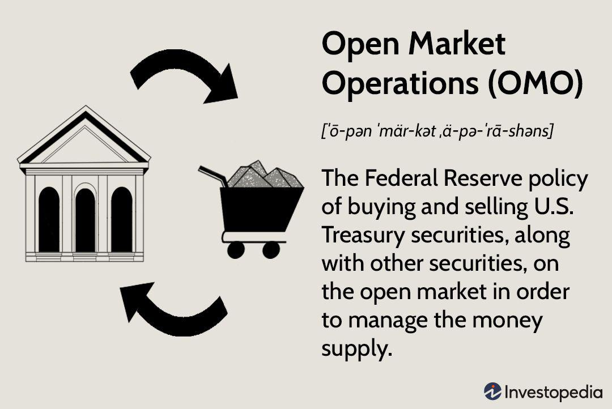

## Table of Contents

## What is an open-market transaction?

An open-market transaction is when a company buys or sells its own stock on the stock market, just like anyone else can. This is different from other ways a company might buy or sell its stock, like giving it to employees or doing a private deal with someone. When a company does an open-market transaction, it follows the same rules as everyone else trading on the stock market.

Companies might do open-market transactions for different reasons. If a company thinks its stock is a good investment, it might buy its own stock to show confidence and possibly increase the stock price. On the other hand, if a company needs money, it might sell its stock on the open market. These transactions can affect the stock's price and how investors see the company.

## How does an open-market transaction differ from other types of transactions?

An open-market transaction is when a company buys or sells its own stock on the public stock market, following the same rules as everyone else. This is different from other types of transactions where a company might not use the public market. For example, a company might give stock to its employees as part of their pay, or it might do a private deal with a big investor. These other ways don't involve the open market and can have different rules and effects.

In an open-market transaction, the company acts just like any other buyer or seller on the stock market. This means the price is set by what people are willing to pay or sell for at that moment. Other types of transactions, like giving stock to employees, don't change the stock price right away because they happen outside the open market. Also, private deals might be done at a special price agreed upon by the company and the investor, which can be different from the current market price.

## What are the key components of an open-market transaction?

An open-market transaction happens when a company buys or sells its own stock on the public stock market. The key part of this is that the company follows the same rules as everyone else trading on the market. This means the price of the stock is set by what people are willing to pay or sell for at that moment. The company can't control the price; it has to go with what the market decides.

Another important part is that these transactions are open to everyone. Anyone can see them happening and can buy or sell the stock at the same time. This openness helps keep things fair and transparent. When a company does an open-market transaction, it's showing everyone what it's doing with its stock, which can affect how investors see the company and the stock's price.

## Can you explain the process of an open-market transaction from start to finish?

When a company decides to do an open-market transaction, it starts by making a plan. They might want to buy back their own stock because they think it's a good investment, or they might want to sell some stock to raise money. Once they've made their plan, they tell their brokers, who are like helpers that work on the stock market. The brokers then go to the stock market and start buying or selling the stock, following the rules of the market. The price of the stock is decided by what people are willing to pay or sell for at that moment, so the company can't control the exact price.

As the brokers buy or sell the stock, other people on the stock market can see what's happening. This is because open-market transactions are public, so everyone can see the trades as they happen. If the company is buying back its stock, this might make the stock price go up because it shows the company thinks its stock is valuable. If they're selling stock, it might make the price go down because it looks like the company needs money. Once the brokers have bought or sold the amount of stock the company wanted, the transaction is done. The company then has to report what they did to the public, to keep everything transparent and fair.

## Who are the typical participants in open-market transactions?

The main participants in open-market transactions are the company itself and the brokers who work for them. When a company wants to buy or sell its own stock, it uses brokers to do this on the stock market. Brokers are like helpers who know how to trade on the stock market and follow its rules. They [carry](/wiki/carry-trading) out the company's plan to buy or sell stock, and they do this in a way that everyone can see.

Other participants in open-market transactions are the regular investors and traders on the stock market. These are people or organizations that buy and sell stocks every day. They might not know that the company is buying or selling its own stock, but they can see the trades happening. Their actions, along with the company's, help decide the price of the stock. Everyone follows the same rules, so it's fair for all.

## What are the common reasons companies engage in open-market transactions?

Companies often engage in open-market transactions to buy back their own stock. They might do this because they think their stock is a good investment. When a company buys its own stock, it can show other investors that the company believes in itself. This can make the stock price go up because it shows confidence. Also, buying back stock can be a way for the company to use extra money it has, instead of keeping it in the bank or spending it on something else.

Another reason companies do open-market transactions is to sell their stock. They might need money for things like growing the business, paying off debts, or funding new projects. When a company sells its stock on the open market, it can raise money from a lot of different investors. This can be a good way to get money quickly, but it might also make the stock price go down if investors think the company is selling because it's in trouble. Both buying and selling stock on the open market can affect how investors see the company and the stock's price.

## How do open-market transactions affect a company's stock price?

When a company buys its own stock on the open market, it can make the stock price go up. This happens because the company is showing that it thinks its stock is a good investment. When other investors see this, they might think the stock is valuable too, and they might want to buy it. This increased demand can push the price higher. Also, when a company buys back its stock, there are fewer shares available on the market, which can also help the price go up because there's less supply.

On the other hand, when a company sells its stock on the open market, it can make the stock price go down. This is because selling stock might make investors think the company needs money, which could be a sign of trouble. When investors see this, they might want to sell their shares, which increases the supply of the stock and can lower the price. The way the stock price moves depends on how investors see the company's actions and what they think it means for the future.

## What are the regulatory requirements for conducting open-market transactions?

When a company wants to do an open-market transaction, it has to follow rules set by the government and the stock market. These rules are there to make sure everything is fair and open. For example, the company has to tell everyone what it's doing. This is called disclosure. They have to say how many shares they're buying or selling and why they're doing it. This helps investors know what's going on and make good choices.

Also, the company can't just do whatever it wants. There are rules about when and how they can buy or sell their stock. They can't do it in a way that tricks people or makes the stock price move in a bad way. The company has to use brokers, who are like helpers that know the rules of the stock market. The brokers make sure the company follows all the rules when they buy or sell the stock. This keeps everything honest and fair for everyone.

## How do insider trading laws impact open-market transactions?

Insider trading laws are important rules that stop people who work at a company from using secret information to make money. These laws affect open-market transactions because company insiders, like top managers or board members, can't buy or sell the company's stock if they know something important that other investors don't know. For example, if a manager knows the company is about to announce great news, they can't buy the stock on the open market before the news comes out. This keeps things fair for everyone.

When a company does an open-market transaction, it has to be careful about insider trading laws. The company can't use secret information to decide when to buy or sell its own stock. They have to make sure their trades are done in a way that follows the rules. If they don't, they could get in big trouble. So, these laws make sure that open-market transactions are honest and fair, just like all other trades on the stock market.

## What strategies can companies use to optimize their open-market transactions?

Companies can use a few smart strategies to make their open-market transactions work better. One good way is to time their trades well. They might want to buy back their stock when the price is low, so they get more shares for their money. Or, if they need to sell stock, they might wait for a time when the price is high to get more money. Another strategy is to do their trades slowly over time, instead of all at once. This can help keep the stock price from moving too much and can make the market more stable.

Another strategy is to be clear about what they're doing. When a company tells everyone why it's buying or selling its stock, it can help investors trust them more. This can make the stock price more stable and can make the company look good. Also, companies can use special plans called 10b5-1 plans. These plans let the company set up trades ahead of time, so they can buy or sell stock without worrying about insider trading laws. This can help them do their trades in a safe and smart way.

## Can you discuss a case study where an open-market transaction significantly impacted a company?

In 2018, Apple Inc. announced a massive stock buyback program, which is a type of open-market transaction. They said they would buy back $100 billion worth of their own stock. This was a big deal because it showed that Apple thought its stock was a good investment. When Apple started buying back its stock, it helped push the stock price up. Investors saw this as a sign that Apple believed in its future, and they wanted to buy the stock too. The stock price went up a lot, and it made Apple's shareholders happy because their shares were worth more money.

This open-market transaction had a big impact on Apple. It not only made the stock price go up, but it also showed everyone that Apple had a lot of extra money. Instead of spending that money on something else, Apple chose to give it back to its shareholders by buying back stock. This made investors trust Apple more and think the company was doing well. It also made Apple's stock more valuable, which helped the company in the long run.

## What are the future trends and potential changes in regulations affecting open-market transactions?

In the future, open-market transactions might change because of new technology and rules. More companies might use computer programs to decide when to buy or sell their stock. These programs can look at a lot of information very quickly and make smart choices. This could make open-market transactions happen faster and be more accurate. Also, companies might use social media and other new ways to tell everyone about their plans. This can help them be more open and make investors trust them more.

Rules about open-market transactions might also change. Governments and stock markets might make new rules to stop bad things like insider trading. They might want to make sure that everyone knows what companies are doing with their stock. This could mean more rules about telling everyone about open-market transactions. Also, there might be new rules about how companies can use computer programs to trade. These rules would be there to make sure everything is fair and honest for everyone who buys and sells stock.

## References & Further Reading

[1]: Narang, R. K. (2009). ["Inside the Black Box: The Simple Truth About Quantitative Trading."](https://onlinelibrary.wiley.com/doi/book/10.1002/9781118267738) John Wiley & Sons.

[2]: Aldridge, I. (2013). ["High-Frequency Trading: A Practical Guide to Algorithmic Strategies and Trading Systems,"](https://www.amazon.com/High-Frequency-Trading-Practical-Algorithmic-Strategies/dp/1118343506) 2nd Edition. Wiley.

[3]: Hurd, M. (2018). ["Algorithmic Trading: Winning Strategies and Their Rationale"](https://www.wiley.com/en-us/Algorithmic+Trading%3A+Winning+Strategies+and+Their+Rationale-p-9781118746912) Wiley.

[4]: Kissell, R. L. (2013). ["The Science of Algorithmic Trading and Portfolio Management."](https://www.sciencedirect.com/book/9780124016897/the-science-of-algorithmic-trading-and-portfolio-management) Academic Press.

[5]: Cartea, Á., Jaimungal, S., & Penalva, J. (2015). ["Algorithmic and High-Frequency Trading."](https://assets.cambridge.org/97811070/91146/frontmatter/9781107091146_frontmatter.pdf) Cambridge University Press.