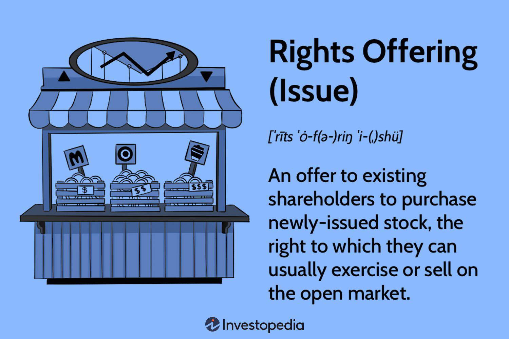

Equity investment provides a multitude of methods for companies to generate capital, each offering distinct advantages and challenges. Stock offerings remain a cornerstone of this financial strategy, serving as a conduit for businesses to distribute additional shares either to the public at large or to existing shareholders. Notably, rights issues and open offers stand out as two prevalent forms of stock offerings due to their straightforward mechanisms and effectiveness in capital accumulation.

Rights issues grant existing shareholders the opportunity to purchase additional shares at a discount before they are accessible to the broader market. This not only incentivizes current stakeholders with potential value gains but also ensures that their ownership percentage in the company remains relatively intact post-issue. In contrast, open offers present a slightly different approach. While similar in intent to rights issues, open offers are non-renounceable—meaning the buying rights are inseparable from the shares themselves. This characteristic can influence shareholder strategies and decisions significantly.



The advent of algorithmic trading has profoundly transformed how investors approach stock offerings. With the ability to execute trades based on pre-set criteria, algo trading enhances the speed and efficiency of transactions. This technological advancement enables investors to react swiftly to announcements concerning stock offerings and capitalize on price movements. Algorithms analyze vast amounts of data instantaneously, identifying lucrative opportunities in real-time, thus optimizing investor responses in scenarios involving rights issues and open offers.

This article examines the mechanics of stock offerings and explores how algorithmic trading reshapes capital-raising strategies, offering valuable insights into their implications for investors in a highly dynamic market.

## Table of Contents

## Understanding Stock Offerings: Rights Issue vs. Open Offer

A stock offering is a financial instrument that businesses use to issue new shares, either to the general public or to existing shareholders, to raise capital. This is a critical mechanism for securing funds for expansion, debt repayment, or other corporate objectives. Among the prevalent types of stock offerings are rights issues and open offers, each with its own set of characteristics and implications for both the issuing company and its shareholders.

A rights issue provides existing shareholders the exclusive opportunity to purchase additional shares, typically at a price lower than the current market value. This discount incentivizes shareholders to buy more shares, thereby contributing additional capital to the company. An advantage of a rights issue is that it maintains the proportionate ownership of existing shareholders, provided they take up their rights fully. This method of stock offering is particularly advantageous for companies seeking to raise funds while ensuring that current shareholders can maintain their relative ownership and influence within the company. Rights issues are usually renounceable, meaning shareholders can opt to sell their rights on the open market, offering flexibility to those who might not wish to invest more capital.

In contrast, an open offer operates under a similar principle but is non-renounceable. This means that shareholders cannot sell or transfer their rights independently of the shares. The non-renounceable nature of open offers potentially limits existing shareholders' ability to capitalize on the rights without investing additional funds. An open offer still enables a company to raise capital effectively but may necessitate more careful consideration by existing shareholders regarding their participation, as they do not have the option to sell their rights if they choose not to exercise them.

Both rights issues and open offers play indispensable roles in capital markets by enabling companies to fund growth or restructuring while simultaneously offering existing investors a chance to either maintain or increase their stake. However, the choice between the two can significantly impact a company's shareholder dynamics and market perception, with rights issues providing more flexibility and open offers offering a straightforward, non-transferable investment opportunity.

## How Algorithmic Trading is Transforming Stock Offerings

Algorithmic trading, commonly referred to as algo trading, has significantly transformed the landscape of stock offerings by introducing enhanced efficiency and precision in trade execution. At its core, [algorithmic trading](/wiki/algorithmic-trading) involves the use of advanced mathematical models and pre-set rules to automate trading decisions. This automation allows for the rapid execution of trades under optimal conditions, minimizing human error and maximizing the potential for profit.

The rapid response capability of algorithmic trading systems is particularly advantageous during stock offering announcements and subsequent price fluctuations. In traditional trading, investors may struggle to react in real-time to such market events due to the inherent limitations of manual processing. However, algorithms can process data at lightning speed, enabling traders to react almost instantaneously to changes. For instance, upon the announcement of a rights issue or an open offer, these systems can adjust trading strategies automatically to capitalize on the new information, thus exploiting any market inefficiencies.

One of the key strengths of algorithmic trading lies in its ability to analyze vast amounts of market data to identify profitable opportunities. Algorithms are designed to sift through this data, recognizing patterns and trends that human traders might overlook. During rights issues and open offers, where the [volume](/wiki/volume-trading-strategy) of data and speed of market movements can be overwhelming, algorithms provide a decisive advantage. By considering historical data, market sentiment, and other relevant factors, these systems can predict future price movements, allowing investors to make informed decisions about buying or selling shares.

The role of [artificial intelligence](/wiki/ai-artificial-intelligence) (AI) in enhancing algorithmic trading cannot be overstated. AI technologies, such as [machine learning](/wiki/machine-learning) and natural language processing, contribute to the development of sophisticated trading strategies. These AI-driven systems continually learn and adapt to new market conditions, refining their decision-making capabilities over time. For example, machine learning algorithms can be trained to recognize complex patterns associated with successful stock offerings, thus improving their predictive accuracy and strategic outputs.

Furthermore, the integration of AI with algorithmic trading allows for the automation of bespoke investment strategies tailored to specific stock offerings. Investors can customize algorithms to target particular market scenarios, such as volatile price changes post-announcement, ensuring that their investment approaches are not only automated but also strategically aligned with their financial goals.

In conclusion, the transformative impact of algorithmic trading on stock offerings is evident in the increased speed, accuracy, and efficiency with which trades are executed. By leveraging AI and advanced data analytics, algo trading empowers investors to navigate the complexities of rights issues and open offers, ultimately enhancing their ability to optimize returns in the fast-paced world of equity investment.

## The Financial Implications of Rights Issues and Open Offers

When companies raise capital through rights issues or open offers, existing shareholders often face the challenge of stock dilution. This dilution occurs when new shares are issued, resulting in a decrease in the ownership percentage of existing shareholders. The implications of such dilution can be significant, potentially impacting shareholder value and voting power.

The timing and pricing of these issues are critical factors that influence market perception and investor behavior. Companies aiming to minimize negative reactions must carefully consider market conditions and set attractive prices for new shares. A well-timed offering that aligns with favorable market trends can enhance a company’s financial position and investor confidence, whereas poorly timed issues can lead to a decline in stock prices and shareholder dissatisfaction.

Furthermore, rights issues and open offers often signal strategic moves by companies, such as plans for expansion, capital expenditure, or debt repayment. Companies pursuing aggressive growth strategies might use these methods to fund projects or acquisitions, presenting a positive outlook to investors who anticipate future returns. Conversely, offerings motivated by debt repayment may raise concerns about the company's financial health, potentially leading to a bearish sentiment.

Successful deployment of rights issues and open offers typically reflects strong shareholder confidence and company stability. A well-received offering indicates that investors trust the company’s vision and management. This confidence, in turn, can stabilize share prices and support the company's long-term objectives.

Overall, the financial implications of rights issues and open offers are multifaceted, affecting not just stock dilution but also market dynamics and investor sentiment. When executed strategically, these capital-raising mechanisms can strengthen a company's financial foundation and align with shareholder interests.

## Strategies for Investors: Leveraging Algorithmic Trading

Investors aiming to navigate stock offerings effectively should consider a strategic approach that combines [fundamental analysis](/wiki/fundamental-analysis) with the power of algorithmic trading. This combination can aid in refining investment decisions through data-driven insights and timely action.

Fundamental analysis remains a cornerstone for understanding a company's intrinsic value and its future potential. It evaluates financial statements, management quality, industry positioning, and market conditions. However, integrating these qualitative insights with algorithmic tools augments the analytical depth and precision, helping investors to react swiftly to opportunities presented by stock offerings.

Staying informed about market reactions to new stock offerings is crucial for investors eyeing optimal purchase timings. Algorithmic trading systems excel in swiftly analyzing vast quantities of real-time data, including price movements, order flow, and market sentiment. For instance, upon the announcement of a rights issue, an algorithm can instantly assess the historical performance of similar announcements, market conditions, and compute a concise response strategy. This capability helps investors capitalize on price inefficiencies and align their timing with market trends.

Algorithmic trading can be tailored to align with specific shareholder interests and the nuances of various offer types. Custom algorithms can incorporate personalized heuristics that account for individual risk preferences, [liquidity](/wiki/liquidity-risk-premium) needs, and tax considerations. For example, Python can be employed to create scripts that filter stocks based on criteria such as [volatility](/wiki/volatility-trading-strategies), projected returns, or dividend yield within the context of rights issues or open offers:

```python
import pandas as pd

# Define a function to filter stocks based on criteria
def filter_stocks(df, volatility_threshold, min_return, min_dividend_yield):
    return df[(df['Volatility'] < volatility_threshold) &
              (df['Projected Return'] > min_return) &
              (df['Dividend Yield'] > min_dividend_yield)]

# Example DataFrame with stock data
stock_data = pd.DataFrame({
    'Stock': ['A', 'B', 'C'],
    'Volatility': [0.15, 0.20, 0.10],
    'Projected Return': [0.08, 0.15, 0.05],
    'Dividend Yield': [0.03, 0.02, 0.04]
})

# Filter stocks meeting custom criteria
filtered_stocks = filter_stocks(stock_data, 0.18, 0.07, 0.03)
print(filtered_stocks)
```

Using technology, investors are better positioned to manage risks and optimize their portfolios throughout the lifecycle of stock offerings. Algorithms can monitor portfolio performance, assess risk exposures, and execute trades to maintain target allocations automatically. They provide an objective framework for making decisions, reducing the impact of human biases and emotions.

In conclusion, leveraging algorithmic trading allows investors to enhance their strategies in an increasingly complex market landscape. By integrating it with traditional analysis, investors can optimize decision-making processes, ensuring that they not only maintain but also grow their investments amidst the dynamic nature of stock offerings.

## Conclusion

Stock offerings, particularly rights issues and open offers, present a dual-edged sword for investors, combining both challenges and opportunities. The challenges often stem from the potential dilution of existing shares and the strategic timing required to optimize financial outcomes. However, with the advent of algorithmic trading, investors are better positioned than ever to navigate these complexities. Algorithms offer a foundation for informed, timely, and precise trading actions by leveraging large datasets and sophisticated analytical models.

The integration of algorithmic trading with stock offerings is rapidly becoming a cornerstone for modern investors looking to capitalize on the volatile landscape of the stock market. This technological synergy enables investors to execute trades in milliseconds, ensuring they capture optimal price points and capitalize on market fluctuations sparked by stock offering announcements. Algorithms also help in parsing through investor sentiment, corporate earnings reports, and macroeconomic indicators to provide a comprehensive view of potential investment outcomes.

For investors willing to embrace these technological advancements, the benefits are substantial. By incorporating algorithmic trading strategies, they can maximize returns while minimizing risks associated with market timing and stock dilution. This is particularly crucial in a dynamic market environment where speed and accuracy are paramount. With these strategies, investors are not merely reacting to market changes but are proactively positioning themselves to exploit these opportunities for better financial performance. This proactive approach, powered by cutting-edge trading technology, represents a significant step forward in optimizing portfolios during stock offerings.

## References & Further Reading

[1]: Bergstra, J., Bardenet, R., Bengio, Y., & Kégl, B. (2011). ["Algorithms for Hyper-Parameter Optimization."](https://dl.acm.org/doi/10.5555/2986459.2986743) Advances in Neural Information Processing Systems 24.

[2]: ["Advances in Financial Machine Learning"](https://www.amazon.com/Advances-Financial-Machine-Learning-Marcos/dp/1119482089) by Marcos Lopez de Prado

[3]: ["Evidence-Based Technical Analysis: Applying the Scientific Method and Statistical Inference to Trading Signals"](https://www.amazon.com/Evidence-Based-Technical-Analysis-Scientific-Statistical/dp/0470008741) by David Aronson

[4]: ["Machine Learning for Algorithmic Trading"](https://github.com/stefan-jansen/machine-learning-for-trading) by Stefan Jansen

[5]: ["Quantitative Trading: How to Build Your Own Algorithmic Trading Business"](https://www.amazon.com/Quantitative-Trading-Build-Algorithmic-Business/dp/1119800064) by Ernest P. Chan