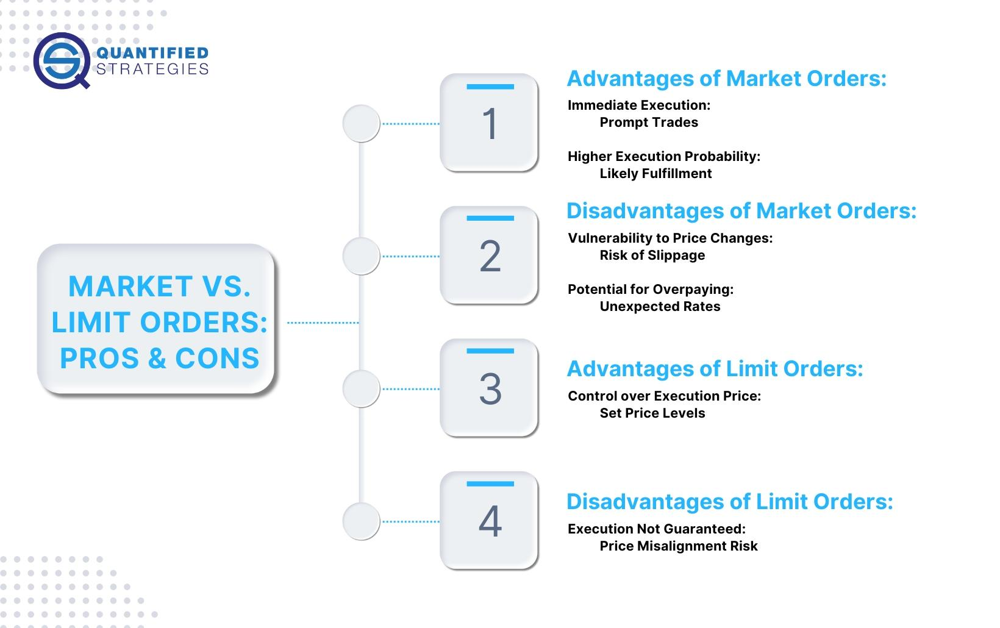

## Table of Contents

## What is an open order in trading?

An open order in trading is an order to buy or sell a security that has been placed but not yet executed or canceled. When you place an open order, it means you want to make a trade, but the trade hasn't happened yet. This can happen for many reasons, like waiting for the right price or waiting for certain market conditions.

Open orders stay active until they are either filled or canceled. For example, if you set an open order to buy a stock at a specific price, the order will only go through if the stock reaches that price. If the stock never reaches that price, the order will stay open until you decide to cancel it or it expires, depending on the rules of your trading platform.

## How does an open order differ from a closed order?

An open order is like a request to buy or sell something that hasn't happened yet. It's waiting for the right moment, like the right price or the right time. If you want to buy a toy but only if it's on sale, you'd place an open order for it. The order stays open until the toy goes on sale, or until you decide you don't want it anymore, or until the store says the offer is no longer valid.

A closed order, on the other hand, is a request that has already been completed or canceled. It's done and over with. If you bought the toy because it went on sale, that's a closed order. Or if you changed your mind and canceled your request to buy the toy, that's also a closed order. Once an order is closed, it's no longer active, and you can't do anything more with it.

## What are the common types of open orders?

There are several types of open orders, each serving a different purpose. A market order is the simplest type. It's an order to buy or sell a security at the best available price right away. If you want to buy a stock and you don't care about the exact price, you'd use a market order. A limit order is another common type. It's an order to buy or sell a security at a specific price or better. If you want to buy a stock but only if it's at a certain price or lower, you'd use a limit order.

Another type of open order is a stop order, which is used to limit losses or protect profits. A stop order becomes a market order once a certain price is reached. For example, if you own a stock and want to sell it if the price drops to a certain level, you'd use a stop order. There's also a stop-limit order, which combines features of stop and limit orders. It becomes a limit order once a certain price is reached, meaning it will only go through at that price or better. These are the main types of open orders traders use to manage their trades effectively.

## How do you place an open order?

To place an open order, you need to use a trading platform or a brokerage service. First, you log into your account and find the section where you can place orders. Then, you choose the type of order you want, like a market order, limit order, stop order, or stop-limit order. Next, you enter the details of your order, like the stock or security you want to buy or sell, the number of shares, and the price if you're using a limit or stop order. After you've entered all the details, you submit the order. Once it's submitted, it becomes an open order, waiting to be filled or canceled.

Different trading platforms might have slightly different steps, but the basic process is the same. Some platforms might have a button or tab labeled "Trade" or "Order Entry" where you can start the process. Others might let you place an order directly from a stock's detail page. It's important to double-check all the details before you submit the order because once it's open, it will follow the instructions you've given until it's filled or canceled.

## What are the benefits of using open orders in trading?

Using open orders in trading can help you manage your trades better. They let you set specific conditions for buying or selling, so you don't have to watch the market all the time. For example, if you want to buy a stock but only if it goes down to a certain price, you can set a limit order. This way, you can go about your day and the order will go through automatically if the stock hits that price.

Open orders also help you limit your losses and protect your profits. If you own a stock and you're worried it might go down, you can set a stop order to sell it at a certain price. This can help you avoid losing more money than you're comfortable with. It's like having a safety net for your investments. By using open orders, you can make your trading strategy work more smoothly and with less stress.

## What are the risks associated with open orders?

Open orders can be risky because they might not work out the way you planned. For example, if you set a limit order to buy a stock at a certain price, but the stock never reaches that price, you might miss out on buying it at all. Or if you set a stop order to sell a stock to limit your losses, the price might drop so fast that your order doesn't get filled at the price you wanted, and you end up selling at a lower price than you hoped.

Another risk is that market conditions can change quickly. If you leave an open order for a long time, the reasons you placed the order might not be valid anymore. For instance, if you set a limit order to buy a stock because you thought it was a good deal, but then the company's news changes and the stock becomes less valuable, your order might go through at a price that's no longer a good deal. It's important to keep an eye on your open orders and be ready to adjust or cancel them if things change.

## How do market conditions affect open orders?

Market conditions can change how open orders work. If the market is moving fast, your open order might not get filled at the price you wanted. For example, if you set a stop order to sell a stock to limit your losses, but the stock price drops very quickly, your order might go through at a lower price than you planned. This is because the market might not have enough time to fill your order at your desired price before the price changes even more.

Also, if the market is not moving much, your open order might stay open for a long time without being filled. If you set a limit order to buy a stock at a certain price, but the stock never reaches that price, your order will just sit there. This can be frustrating because you might miss out on other opportunities while waiting for your order to be filled. It's important to keep an eye on market conditions and be ready to adjust or cancel your open orders if things change.

## What causes an open order to remain unfilled?

An open order can stay unfilled if the market doesn't reach the price you set. For example, if you want to buy a stock but only if it's at a certain price, your order will wait until the stock hits that price. If the stock never gets there, your order just sits there, waiting. This can happen if the market is calm and not moving much, or if the stock is not very popular and doesn't trade often.

Another reason an open order might not get filled is if there are not enough buyers or sellers. If you want to buy a stock, but nobody is selling it at the price you want, your order won't go through. The same thing happens if you want to sell a stock, but nobody is buying it at your price. Sometimes, the market can be too busy or too slow, and your order might get stuck in the middle, waiting for the right match.

## How can traders manage and monitor their open orders effectively?

Traders can manage and monitor their open orders by using the tools provided by their trading platform. Most platforms have a section where you can see all your open orders at a glance. You can check the status of each order, see if it's still waiting to be filled, or if it's been partially filled. It's a good idea to check this section often to make sure your orders are doing what you want them to do. If you see that an order isn't working out, you can cancel it or change it to something that might work better.

It's also helpful to set up alerts or notifications on your trading platform. These can let you know when your open orders are filled, or if the market is getting close to the price you set. This way, you don't have to watch the market all the time, but you'll still know what's happening with your orders. Keeping a close eye on market conditions and being ready to adjust your orders if things change can help you manage your trades better and avoid missing out on opportunities or losing more money than you planned.

## What advanced strategies can be employed with open orders?

Traders can use open orders to set up more complex trading strategies. One common strategy is called "bracket orders," where you place a main order to buy or sell a stock, and then you set up two other orders to automatically manage your profits and losses. For example, after buying a stock, you might set a stop-loss order to sell it if the price drops too much, and a limit order to sell it if the price goes up to a certain level. This way, you can automatically protect your investment without having to watch the market all the time.

Another advanced strategy is using "trailing stop orders." These are like stop orders, but they move with the market. If you own a stock and want to sell it if the price starts to drop, you can set a trailing stop order. The order will follow the stock's price as it goes up, but if the price starts to go down, the order will trigger and sell the stock. This can help you lock in profits as the stock price rises, but also protect you from big losses if the price suddenly falls. Using these strategies with open orders can make your trading more flexible and help you manage your investments better.

## How do different trading platforms handle open orders?

Different trading platforms handle open orders in their own way, but they all have similar basic features. Most platforms let you see all your open orders in one place, so you can check on them easily. You can usually see if an order is waiting to be filled, or if it's been partially filled. If you need to change or cancel an order, you can do that from this section too. Some platforms might show you more details, like how long the order has been open or how close the market is to filling it.

Some trading platforms also let you set up special types of open orders, like bracket orders or trailing stop orders. These can help you manage your trades better without having to watch the market all the time. For example, you might set up a bracket order to automatically sell a stock if it goes up or down to certain prices. Other platforms might have different tools, like alerts or notifications, to let you know when your open orders are filled or when the market is getting close to your set price. It's good to learn how your trading platform works so you can use these features to manage your open orders effectively.

## What are the regulatory considerations for open orders in different markets?

Different markets have different rules about open orders. In the United States, the Financial Industry Regulatory Authority (FINRA) and the Securities and Exchange Commission (SEC) set rules to make sure trading is fair and safe. For example, they might have rules about how long an open order can stay active before it expires. They also have rules to prevent things like "spoofing," where someone places fake open orders to trick other traders. These rules help keep the market honest and protect investors.

In other countries, like in Europe, the rules might be different. The European Securities and Markets Authority (ESMA) sets rules for trading in the European Union. They might have different time limits for open orders or different ways to handle them. It's important for traders to know the rules in their market because breaking them can lead to fines or other problems. No matter where you trade, understanding the local regulations helps you use open orders the right way and avoid any trouble.

## References & Further Reading

[1]: Bergstra, J., Bardenet, R., Bengio, Y., & Kégl, B. (2011). ["Algorithms for Hyper-Parameter Optimization."](https://dl.acm.org/doi/10.5555/2986459.2986743) Advances in Neural Information Processing Systems 24.

[2]: ["Advances in Financial Machine Learning"](https://www.amazon.com/Advances-Financial-Machine-Learning-Marcos/dp/1119482089) by Marcos Lopez de Prado

[3]: ["Evidence-Based Technical Analysis: Applying the Scientific Method and Statistical Inference to Trading Signals"](https://www.amazon.com/Evidence-Based-Technical-Analysis-Scientific-Statistical/dp/0470008741) by David Aronson

[4]: ["Machine Learning for Algorithmic Trading"](https://github.com/stefan-jansen/machine-learning-for-trading) by Stefan Jansen

[5]: ["Quantitative Trading: How to Build Your Own Algorithmic Trading Business"](https://www.amazon.com/Quantitative-Trading-Build-Algorithmic-Business/dp/1119800064) by Ernest P. Chan