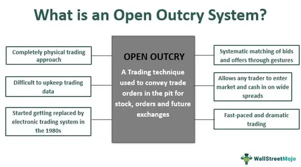

The trading landscape has undergone a remarkable transformation over the years, shifting from traditional methods to incorporating advanced technologies. For decades, open outcry represented the very heart of financial markets, providing a dynamic and vibrant platform for trading. This historical system, characterized by traders vocally proclaiming bids and offers and employing elaborate hand signals, was renowned for its role in price discovery and market transparency. In bustling trading pits, open outcry facilitated direct interaction and instantaneous negotiation between traders, forming the backbone of stock and futures exchanges for much of the 20th century.

However, as technological advancements surged forward, the introduction of electronic trading began to reshape financial markets, offering new levels of speed, efficiency, and accuracy. The rapid proliferation of sophisticated algorithms in trading systems marks a significant leap forward, enabling real-time data analysis and automated trade execution. Algorithmic trading has not only improved market efficiency but also enhanced liquidity, ushering in an era where trades can be executed at a fraction of the time once possible.



This article provides a comprehensive analysis of the open outcry trading system, chronicling its evolution, eventual decline, and replacement by electronic and algorithmic trading paradigms. By examining these milestones in trading history, we can understand the technological advancements that have redefined how markets operate and led us into the present-day digital trading environment.

## Table of Contents

## What is Open Outcry?

Open outcry is a traditional method of trading where traders vocally communicate buy and sell orders on the floors of stock and futures exchanges. This communication method involves a combination of verbal signals and hand gestures, creating a dynamic and bustling trading environment. Historically, open outcry was the cornerstone of market activity, facilitating direct interactions among traders and ensuring a fast-paced exchange of information.

In an open outcry system, traders gather in a specific area, often called a "pit," where they vociferously announce their intentions to buy or sell specific quantities of assets at defined prices. Hand signals are utilized to convey large amounts of information quickly and clearly, a crucial feature in the cacophonous setting of an active trading floor. This system excelled in promoting transparency and efficient price discovery, as it allowed market participants to observe and react instantaneously to trades and price fluctuations.

The openness of this system meant that anyone present could see and hear the transactions taking place, theoretically leading to fairer pricing as all parties had access to the same information. Moreover, the physical presence of traders and their direct interactions fostered a unique sense of accountability and trust, attributes that were pivotal in maintaining the integrity of the trading process.

Despite its advantages, open outcry has largely been replaced by electronic trading systems. These systems provide a more efficient, faster, and sometimes more secure means of executing trades. While open outcry is still utilized in certain markets today, it has become an exception rather than the rule, marking the end of an era and the beginning of more technologically advanced trading paradigms.

## The Decline and Transition to Electronic Trading

Technological advancements in the late 20th century significantly transformed the landscape of financial trading, leading to the adoption of electronic trading platforms. Electronic trading systems emerged as a superior alternative to the traditional open outcry method due to their ability to provide faster, more accurate, and efficient trade execution. 

The limitations of open outcry, notably its reliance on human interaction and physical presence, became apparent as the [volume](/wiki/volume-trading-strategy) and complexity of transactions increased. Electronic trading systems, in contrast, allow for the automation of trades, reducing the time it takes to execute an order from minutes to fractions of a second. This shift not only enhances speed but also minimizes the potential for human error, thereby increasing the accuracy and reliability of trade executions.

Moreover, electronic systems eliminate the geographical constraints imposed by the physical trading floors inherent in open outcry. Traders can now participate in markets globally from remote locations, thereby linking international financial markets in real-time and increasing market [liquidity](/wiki/liquidity-risk-premium).

The transition from traditional to electronic trading was not abrupt but rather a gradual evolution. Initially, exchanges adopted hybrid systems combining both open outcry and electronic methods. However, as technological confidence and infrastructure improved, most exchanges fully transitioned to electronic trading. Prominent examples include the NASDAQ, which has been electronic since its inception, and the New York Stock Exchange (NYSE), which completed its transition towards electronic trading while still retaining a minimal presence of open outcry for specific transactions [1]. Despite the widespread adoption of electronic trading, a few exchanges, especially commodity-based ones like the Chicago Board Options Exchange (CBOE), continue to maintain open outcry sessions alongside electronic services, catering to traders who prefer the traditional method's interaction nuances.

This paradigm shift also required modifications in regulatory frameworks to address concerns related to speed, transparency, and fairness, setting a new benchmark for how financial markets operate worldwide.

---
[1] McGowan, M. J. (2010). The Rise of Computerized High Frequency Trading: Use and Controversy. *Duke Law School*, (67), 875-889.

## Algorithmic Trading and its Impacts

Algorithmic trading revolutionized financial markets by automating the process of executing trades. By leveraging computer algorithms, traders can analyze extensive market data and execute trades efficiently, based on predetermined criteria. This advancement has increased market efficiency and liquidity, offering numerous benefits to traders and the financial system as a whole.

The core mechanism behind [algorithmic trading](/wiki/algorithmic-trading) involves the development of complex algorithms that can process vast amounts of market information in real-time. These algorithms can identify trading opportunities that may be imperceptible to human traders due to their speed and precision. For instance, they can exploit small price discrepancies across different markets or financial instruments, effectively conducting [arbitrage](/wiki/arbitrage) with minimal delay.

Algorithmic trading greatly enhances market liquidity, as trades executed by algorithms generally occur at a [high frequency](/wiki/high-frequency-trading) and in sizable volumes, ensuring that there is a consistent supply and demand for securities. This results in tighter bid-ask spreads and more stable pricing. By automating routine tasks, algorithms reduce transaction costs and minimize the risk of human error, allowing traders to implement and manage large-scale trading strategies seamlessly.

High-frequency trading ([HFT](/wiki/high-frequency-trading-strategies)), a subset of algorithmic trading, exemplifies the sophistication of these systems. HFT strategies focus on executing a high volume of trades at extremely rapid speeds, often within microseconds. These trades capitalize on minute market fluctuations, requiring advanced technological infrastructure and co-location services to minimize latency. Firms engaged in HFT deploy complex statistical models and [machine learning](/wiki/machine-learning) techniques to predict short-term market trends and swiftly act on them.

An example of a simple trading algorithm in Python could look like this:

```python
import pandas as pd

# Sample function to simulate a basic moving average cross strategy
def moving_average_strategy(data, short_window, long_window):
    data['Short_MA'] = data['Price'].rolling(window=short_window, min_periods=1).mean()
    data['Long_MA'] = data['Price'].rolling(window=long_window, min_periods=1).mean()

    data['Signal'] = 0.0
    data['Signal'][short_window:] = np.where(data['Short_MA'][short_window:] > data['Long_MA'][short_window:], 1.0, 0.0)
    data['Position'] = data['Signal'].diff()

    return data

# Hypothetical market data
market_data = pd.DataFrame({
    'Price': [100, 102, 101, 105, 108, 110]
})

# Apply strategy
short_window = 2
long_window = 3
trade_signals = moving_average_strategy(market_data, short_window, long_window)
print(trade_signals)
```

As algorithmic and high-frequency trading methods continue to evolve, they pose significant challenges to market stability and fairness, such as market manipulation and flash crashes. Regulators are tasked with implementing controls to mitigate these risks while fostering innovation. Nonetheless, algorithmic trading remains a cornerstone of modern financial markets, underscoring the pivotal role of technology in transforming trade execution and market dynamics.

## Comparing Open Outcry with Algorithmic Trading

Open outcry and algorithmic trading represent two distinct paradigms in the trading landscape, each with its own set of characteristics and advantages. Open outcry, prevalent in traditional trading environments, relied heavily on personal interactions and intuitive decision-making processes. Traders communicated buying and selling orders on the trading floor through vocal expressions and hand signals, creating a dynamic and human-centric trading atmosphere. This method facilitated a nuanced understanding of market movements as traders could gauge sentiment through direct observation and interactions with other market participants.

In contrast, algorithmic trading emerged as a response to advancements in technology, offering unprecedented speed and precision through data-driven strategies. Algorithms are designed to analyze market data continuously and execute trades based on predefined criteria, minimizing human intervention. This data-centric approach allows for rapid processing of vast amounts of information, providing traders with the ability to capitalize on market opportunities and access global markets more efficiently than traditional open outcry systems.

One of the primary differences between these two systems is the reliance on speed and automation in algorithmic trading, compared to the qualitative aspects inherent in open outcry. Algorithmic trading systems can execute thousands of trades within milliseconds, a capability beyond the reach of human traders operating in an open outcry environment. This technological advantage enhances market liquidity and enables strategies like high-frequency trading (HFT), which depend on executing a high volume of trades in short timeframes to exploit minute price discrepancies.

Furthermore, algorithmic trading offers accessibility to a broader range of markets and securities, allowing participants to engage in diverse trading strategies that span different time zones and geographical locations. This global reach contrasts with the localized nature of open outcry, where trading was predominantly confined to the specific jurisdiction of the exchange floor.

Despite the efficiencies brought by algorithmic trading, open outcry holds a unique value in its ability to interpret and react to complex market signals that are not easily quantifiable. The human element involved in open outcry enabled traders to incorporate elements of psychology and sentiment analysis into their decision-making processes, which are not inherently present in algorithm-driven environments.

Ultimately, while algorithmic trading is characterized by data efficiency, speed, and global access, open outcry provided rich, person-to-person interactions and a profound understanding of market subtleties. Each system embodies strengths that have shaped the evolution of trading practices, reflecting broader shifts in market dynamics and technological capabilities.

## The Future of Trading Systems

Trading technology continues to undergo substantial evolution, driven by advances in [artificial intelligence](/wiki/ai-artificial-intelligence) (AI) and blockchain technology. AI, with its capacity for machine learning and data analysis, offers the potential to further refine algorithmic trading systems by enabling real-time data processing and pattern recognition. Algorithms enhanced by AI can analyze vast datasets to identify trading opportunities that are not immediately apparent to human traders, leading to potentially more efficient market behavior and higher profitability.

Blockchain technology, with its decentralized and immutable ledger, represents another significant development poised to impact trading systems. It promises enhanced transparency, security, and efficiency in trade execution and settlement processes. Blockchain can facilitate peer-to-peer trading and smart contracts, reducing dependency on intermediaries and lowering transaction costs. Additionally, the use of blockchain could help in improving the auditability and traceability of trades, leading to increased trust and compliance with regulatory standards.

Despite the dominance of electronic trading, certain markets and commodities may still find traditional methods like open outcry beneficial. For example, specific futures markets, particularly those involving complex and less liquid contracts, might continue to value the nuanced, human interactions offered by open outcry systems. However, these instances are likely to become exceptions rather than the norm as technology advances.

Maintaining a balance between innovation and regulation is crucial in the evolving landscape of trading technologies. As trading systems become more complex, regulatory bodies face the challenge of ensuring that innovations do not outpace their ability to enforce rules that preserve market integrity and protect investors. Effective regulation should foster innovation while mitigating risks, such as market manipulation and technological failures. Therefore, regulators must collaborate with technologists and market participants to create a balanced framework that supports sustainable growth and transparency in financial markets.

In summary, the future of trading systems is likely to be characterized by a blend of cutting-edge technology and regulatory vigilance, striving to maintain equitable and open markets. While new technologies promise significant advancements in market logistics and functionality, they also require thoughtful integration into existing systems to ensure they contribute positively to market evolution.

## Conclusion

The transformation from open outcry to algorithmic trading highlights a significant progression in trading technologies. Historically, open outcry facilitated vibrant interactions on trading floors, contributing to transparency and a keen understanding of market dynamics. As a system, it enabled traders to leverage human intuition and real-time verbal and non-verbal communication to facilitate trade executions. Despite its decline in favor of electronic systems, the core principles and psychological elements inherent in open outcry continue to inform the analysis of market behavior today.

Algorithmic trading has introduced an era marked by speed, precision, and efficiency. By employing complex algorithms, trades can be executed in microseconds, driven by data and pre-defined criteria. This technological shift has significantly increased market accessibility and liquidity, allowing participants across the globe to engage in financial markets with more ease and efficiency. Alongside these advancements, however, lie challenges associated with increased dependence on technology, such as the risk of flash crashes and the potential for market manipulation by sophisticated algorithms.

Additionally, the evolution of trading systems continues as artificial intelligence and blockchain technologies emerge, promising further innovations. AI has the potential to enhance predictive capabilities and decision-making processes, while blockchain offers transparency and security through decentralized ledgers. As these technologies gain traction, it becomes imperative to establish robust regulatory frameworks that ensure market integrity and protect against systemic risks.

In conclusion, while electronic and algorithmic methods have largely overshadowed traditional trading systems like open outcry, the latter’s legacy continues to offer valuable insights into market psychology and dynamics. The ongoing advancement in trading technologies augurs well for greater efficiency and inclusivity, but also demands careful navigation of regulatory challenges to maintain fair and transparent financial markets.

## References & Further Reading

[1]: McGowan, M. J. (2010). The Rise of Computerized High Frequency Trading: Use and Controversy. *Duke Law School*, (67), 875-889.

[2]: Harris, L. (2003). *Trading and Exchanges: Market Microstructure for Practitioners*. Oxford University Press.

[3]: Domowitz, I. (1993). Automating the Price Discovery Process: Some International Comparisons and Regulatory Implications. *The Journal of Financial Services Research*, 6(4), 305-326.

[4]: Aldridge, I. (2013). *High-Frequency Trading: A Practical Guide to Algorithmic Strategies and Trading Systems*. Wiley.

[5]: Kaufman, P. J. (2013). *Trading Systems and Methods*. Wiley.

[6]: Hasbrouck, J. (2007). *Empirical Market Microstructure: The Institutions, Economics, and Econometrics of Securities Trading*. Oxford University Press.