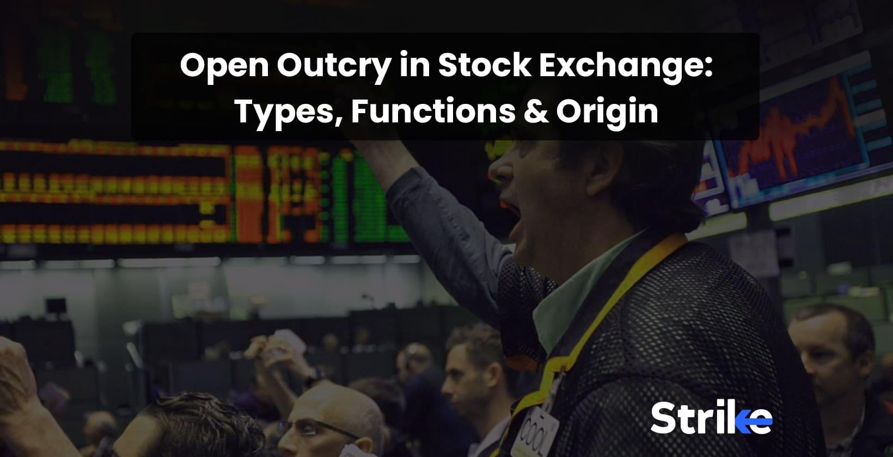

## Table of Contents

## What is open outcry?

Open outcry is a way of trading that happens in a special place called a trading pit. Traders use hand signals and shout to buy and sell things like stocks or commodities. This method has been used for a long time, especially in places like the Chicago Mercantile Exchange. It's very lively and can look a bit chaotic, but it helps traders communicate quickly without needing technology.

Even though open outcry is old-fashioned, it's still used sometimes because it can be faster and more personal than trading on a computer. However, with the rise of electronic trading, open outcry is becoming less common. Many trading pits have closed down, and most trading now happens online. Still, some traders and markets prefer the traditional way of open outcry because it allows for direct interaction and can be more exciting.

## How does the open outcry system work?

The open outcry system works in a special place called a trading pit. Traders stand in a circle or in a designated area and use hand signals and shouting to communicate. They make specific movements with their hands to show if they want to buy or sell, and they shout out prices to make deals. This system lets traders see and hear each other directly, which can help them make quick decisions. It's like a lively market where everyone is trying to get the best deal.

Even though it might seem chaotic, open outcry has its own rules and signals that traders learn. For example, if a trader wants to buy, they might hold up a certain number of fingers to show how many contracts they want, and shout out the price they're willing to pay. If someone agrees to that price, they make a deal right there. This way of trading can be faster than using computers because traders can react instantly to what's happening around them. However, as more trading moves online, open outcry is used less often, but it's still valued for its direct and immediate communication.

## What are the main components of an open outcry trading floor?

The main parts of an open outcry trading floor are the trading pit, the traders, and the hand signals and shouting they use. The trading pit is a special area where traders stand close together to buy and sell things like stocks or commodities. It's usually a circle or a rectangle, and it's where all the action happens. Traders are the people who work in the pit. They come from different companies and have different jobs, like buying and selling for their clients or for their own company.

The other important parts are the hand signals and shouting that traders use to communicate. Each signal and shout has a special meaning, like showing how many contracts they want to buy or sell, or what price they're willing to pay. This way, traders can quickly tell each other what they want to do without needing to write anything down or use a computer. Even though it can look chaotic, everyone in the pit knows the signals and can understand what's going on.

## What types of signals and gestures are used in open outcry trading?

In open outcry trading, traders use a lot of hand signals and shouting to communicate. Each signal has a special meaning. For example, if a trader wants to buy, they might hold up their hand with the palm facing out and move it up and down. The number of fingers they show tells other traders how many contracts they want to buy. If they want to sell, they might hold their hand with the palm facing in and move it side to side. The price they're willing to pay or accept is shouted out loud so everyone can hear.

These signals and shouts help traders make deals quickly without needing to write anything down or use a computer. For example, a trader might shout "50!" to show they want to buy at a price of 50. If another trader agrees, they can make a deal right away. The signals and shouts are like a special language that everyone in the trading pit understands. Even though it can look chaotic, it's a fast and effective way to trade.

## What are the advantages of open outcry over electronic trading?

Open outcry has some advantages over electronic trading. One big advantage is that it lets traders talk to each other face-to-face. This can help them understand what other traders are thinking and feeling, which can be important when making deals. When traders can see and hear each other, they might be able to make better decisions because they can react quickly to what's happening around them. This direct communication can also help build trust between traders, which is important in the trading world.

Another advantage of open outcry is that it can be faster than electronic trading in some situations. In a busy trading pit, traders can make deals in just a few seconds because they're all standing close together and using hand signals and shouting. This speed can be really helpful when the market is moving quickly and traders need to act fast. Even though electronic trading is very fast too, the direct and immediate nature of open outcry can sometimes give traders an edge.

## What are the disadvantages of open outcry compared to electronic trading?

One big disadvantage of open outcry compared to electronic trading is that it can be less accurate. In a busy trading pit, it's easy for traders to make mistakes when they're using hand signals and shouting. They might misunderstand each other or miss important information because it's so loud and chaotic. Electronic trading, on the other hand, uses computers that can keep track of everything perfectly and make sure all the numbers are right.

Another disadvantage is that open outcry can be slower than electronic trading in some ways. Even though traders in a pit can make deals quickly, they still have to be in the same place at the same time. Electronic trading lets people trade from anywhere in the world, at any time, without needing to be in a specific location. This makes electronic trading more convenient and can help more people take part in the market. Plus, electronic systems can handle a lot more trades at once than a trading pit can.

## How has the use of open outcry evolved over time?

Open outcry used to be the main way people traded things like stocks and commodities. It started a long time ago, and it was used in big places like the Chicago Mercantile Exchange. Traders would stand in a special area called a trading pit and use hand signals and shouting to make deals. This way of trading was very lively and could be really fast because traders could see and hear each other directly. But it also had some problems, like it could be hard to keep track of everything and mistakes could happen because it was so chaotic.

Over time, electronic trading started to become more popular. Computers and the internet made it possible for people to trade from anywhere, without needing to be in a trading pit. This was a big change because electronic trading could be more accurate and handle a lot more trades at once. As a result, many trading pits closed down, and open outcry became less common. But some markets and traders still use open outcry because they like the direct and immediate communication it offers. So while open outcry isn't used as much as it used to be, it still has a place in the trading world.

## What major events contributed to the decline of open outcry?

The main reason open outcry started to be used less was because of electronic trading. Computers and the internet made it possible for people to trade from anywhere, without needing to be in a special place like a trading pit. This was a big change because electronic trading could handle a lot more trades at once and was more accurate. It also let more people take part in the market because they didn't have to be in the same place at the same time. As a result, many big trading places, like the Chicago Mercantile Exchange, started to use electronic systems more and more.

Another big event that helped move away from open outcry was the financial crisis in 2008. During this time, many people lost trust in the old ways of trading, and they looked for new and more reliable ways to trade. Electronic trading seemed safer and more transparent, so more traders and companies switched to it. This made open outcry even less common. Even though some markets still use open outcry because they like the direct and immediate communication, it's not as popular as it used to be.

## Which financial markets still use open outcry and why?

Some financial markets still use open outcry because it can be faster and more personal than trading on a computer. One of these markets is the Chicago Mercantile Exchange (CME), which uses open outcry for some of its products, especially in the trading of futures contracts. Traders at the CME like open outcry because they can see and hear each other directly, which helps them make quick decisions and understand what other traders are thinking.

Another market that still uses open outcry is the New York Mercantile Exchange (NYMEX), where traders sometimes use it for trading commodities like oil and gas. They use open outcry because it allows for direct interaction and can be more exciting. Even though electronic trading is more common now, some traders and markets prefer the traditional way of open outcry because it lets them react instantly to what's happening around them.

## How does open outcry affect market liquidity and price discovery?

Open outcry can help make markets more liquid and help traders find the right price for things. When traders stand in a trading pit and use hand signals and shouting, they can see and hear each other directly. This helps them make deals quickly and easily. When more traders are making deals, it means there are more buyers and sellers in the market. This makes the market more liquid, which means it's easier for people to buy and sell things without big changes in price. So open outcry can help keep the market moving smoothly.

Open outcry also helps with price discovery, which is how traders figure out what things are worth. In a trading pit, traders can see and hear what other traders are doing and saying. This helps them understand if the price is too high or too low. If a lot of traders want to buy something, the price might go up. If a lot of traders want to sell, the price might go down. By watching and listening to each other, traders can quickly find the right price for things. This makes the market more efficient and helps everyone get a fair deal.

## What role does technology play in the transition from open outcry to electronic trading?

Technology has been really important in moving from open outcry to electronic trading. Computers and the internet made it possible for people to trade without needing to be in a special place like a trading pit. Instead of using hand signals and shouting, traders can now use computer screens and keyboards to make deals. This change started a long time ago and has made trading a lot easier and more accurate. Electronic trading can handle a lot more trades at once and can keep track of everything perfectly, which is something open outcry couldn't do as well.

The rise of technology also made it possible for more people to take part in the market. Before, traders had to be in the same place at the same time to trade. But now, with electronic trading, people can trade from anywhere in the world, at any time. This has made the market more open and convenient. Even though some markets still use open outcry because they like the direct and immediate communication, technology has made electronic trading the main way people trade today.

## What are the future prospects for open outcry in global financial markets?

The future of open outcry in global financial markets looks like it will keep getting smaller. Electronic trading has become the main way people trade because it's faster, more accurate, and can handle a lot more trades at once. As technology keeps getting better, more and more markets will probably switch to electronic systems. This means fewer trading pits and less need for the hand signals and shouting that open outcry uses. Even though some traders still like the direct and immediate communication of open outcry, the trend is moving towards electronic trading.

However, open outcry might not disappear completely. Some markets, like the Chicago Mercantile Exchange and the New York Mercantile Exchange, still use it for certain products because they value the personal interaction and quick decision-making it allows. These markets might keep using open outcry for special situations or specific products where the direct communication is really important. So while open outcry might become less common, it could still have a small place in the trading world, especially for traders who prefer the traditional way of doing things.

## References & Further Reading

[1]: McGowan, M. J. (2010). The Rise of Computerized High Frequency Trading: Use and Controversy. *Duke Law School*, (67), 875-889.

[2]: Harris, L. (2003). *Trading and Exchanges: Market Microstructure for Practitioners*. Oxford University Press.

[3]: Domowitz, I. (1993). Automating the Price Discovery Process: Some International Comparisons and Regulatory Implications. *The Journal of Financial Services Research*, 6(4), 305-326.

[4]: Aldridge, I. (2013). *High-Frequency Trading: A Practical Guide to Algorithmic Strategies and Trading Systems*. Wiley.

[5]: Kaufman, P. J. (2013). *Trading Systems and Methods*. Wiley.

[6]: Hasbrouck, J. (2007). *Empirical Market Microstructure: The Institutions, Economics, and Econometrics of Securities Trading*. Oxford University Press.