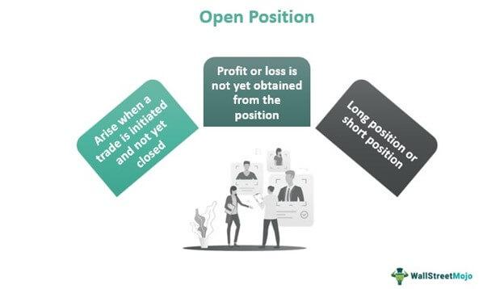

In the rapidly evolving world of finance, traders and investors are constantly seeking strategies that offer a competitive edge. The advent of algorithmic trading has significantly transformed financial markets, enhancing their efficiency and prompting investors to exploit sophisticated trading algorithms. This shift has brought about a concentrated focus on various financial metrics that can provide deeper insights into market dynamics. One crucial metric that traders are increasingly attending to is the open position ratio. This ratio serves as a pivotal indicator of market sentiment, offering a glimpse into the proportion of open long or short positions for a particular asset.

The open position ratio is not just a passive indicator; it plays an active role in shaping trading strategies. By analyzing this ratio, traders can gain a nuanced understanding of market sentiment, helping them anticipate potential trends or reversals. This metric becomes more powerful when integrated into algorithmic trading strategies, enabling the automation of decision-making processes based on real-time data rather than human intuition alone. In this article, we focus on the concept of open position ratios, their significance in trading strategies, and how they synergize with algorithmic trading to craft a robust financial metrics investing approach.



Additionally, we will explore practical tips, recommend best practices, and acknowledge potential risks associated with utilizing open position ratios alongside algorithmic trading. This comprehensive approach aims to equip traders with the knowledge and tools needed to navigate the complexities of modern financial markets effectively.

## Table of Contents

## Understanding Financial Metrics in Algorithmic Trading

Financial metrics are indispensable tools in the landscape of algorithmic trading, providing a framework for evaluating both the performance and viability of trading strategies. At the core of these evaluations are key performance indicators such as Return on Investment (ROI), volatility, and the Sharpe ratio, each offering unique insights into different facets of trading efficiency and risk assessment.

ROI is a straightforward metric that measures the profitability of an investment relative to its cost. It is calculated as:

$$
\text{ROI} = \left( \frac{\text{Net Profit}}{\text{Cost of Investment}} \right) \times 100
$$

This metric is crucial for traders to determine the effectiveness of their trading strategies by evaluating the returns received over a given period relative to the initial investments made. High ROI values typically indicate successful strategies, but it should be analyzed alongside other metrics to account for risk and market conditions.

Volatility measures the degree of variation in the price of a financial instrument over time. It is often calculated using the standard deviation or variance of returns. High [volatility](/wiki/volatility-trading-strategies) indicates significant price swings, presenting both risks and opportunities for traders. Algorithmic trading systems use volatility to gauge the stability of a market, adapt trading conditions, and exploit price movements for potential profit.

The Sharpe ratio is another critical metric, designed to assess the risk-adjusted return of an investment. The formula for the Sharpe ratio is:

$$
\text{Sharpe Ratio} = \frac{E[R] - R_f}{\sigma}
$$

where $E[R]$ is the expected return, $R_f$ is the risk-free rate, and $\sigma$ is the standard deviation of the excess return. This metric helps traders determine how much return they are receiving for the risk they are taking, with higher Sharpe ratios indicating more favorable risk-adjusted returns.

Algorithmic trading capitalizes on these metrics by allowing for the automation of trade executions based on pre-defined criteria, thus enhancing the speed and accuracy of trades. By systematically leveraging financial metrics, algorithms can be programmed to execute trades only when specific conditions are met, ensuring a more disciplined and less emotionally-driven approach to trading.

Incorporating financial metrics into algorithms ensures continuous and robust performance analysis. Through [backtesting](/wiki/backtesting) and real-time evaluation, traders can optimize their strategies, ensuring that they remain effective under different market conditions. By rigorously assessing these metrics, algorithmic traders can fine-tune their strategies, aiming for maximized returns while controlling for risk.

## The Open Position Ratio: Key Insights

The open position ratio serves as a vital metric in gauging market sentiment by reflecting the proportion of open long and short positions in a particular asset. It plays a fundamental role in helping traders comprehend where the market bias currently lies, offering signals that can herald potential reversals or the continuation of trends.

#### Market Sentiment Indicator

At its core, the open position ratio provides a measure of market sentiment. It indicates the aggregated stance of traders, whether they predominantly expect the asset's price to increase (long positions) or decrease (short positions). This aggregate market bias is critical for traders seeking to align their strategies with prevailing market conditions.

#### Predicting Reversals and Trends

By examining the distribution between long and short positions, the open position ratio becomes instrumental in predicting market reversals and trends. For instance, if there is an overwhelming number of long positions, it might indicate bullish sentiment, but it can also suggest an overbought market ripe for a potential reversal. Conversely, a high number of short positions could indicate bearish sentiment or a potential relief rally if the asset is oversold.

#### Analytical Application

When analyzing the open position ratio, traders use it in conjunction with other technical indicators to validate trading signals. For example, if technical indicators suggest an upward trend, but the open position ratio shows a high number of short positions, it might denote a contrarian opportunity. This multi-faceted analysis helps traders refine their strategies and make informed decisions.

#### Strategy Adjustment

The dynamic nature of markets necessitates that traders adjust their strategies based on real-time data insights provided by the open position ratio. This involves reallocating resources, hedging positions, or modifying exposure levels to align with the anticipated market movements.

In summary, the open position ratio is not merely a number but a reflection of collective psychological sentiment. By incorporating it into their analytic frameworks, traders gain a clearer picture of market dynamics, enabling more strategic and timely trades.

## Combining Algorithmic Trading with Open Position Ratios

Trading algorithms are designed with the primary aim of automating trade decisions based on pre-defined rules and strategies. They optimize trading processes by incorporating financial metrics such as return on investment (ROI), volatility, and Sharpe ratio, which serve to enhance decision-making efficiency. By integrating these metrics, trading algorithms can adjust their strategies to optimize performance in real-time.

The open position ratio further complements [algorithmic trading](/wiki/algorithmic-trading) by providing critical insights into market conditions. This metric represents the ratio of open long positions to open short positions within a given market or for a specific financial asset. By interpreting whether long positions predominate over short positions or vice versa, traders gain an understanding of market sentiment, which helps anticipate potential market movements.

Combining the analytical power of algorithmic trading with the insight provided by open position ratios fosters a holistic approach to trading. Algorithms, equipped with the analysis of the open position ratio, can execute trades based on comprehensive and up-to-date information, reducing reliance on human intuition or emotional biases. This synergy ensures trades are performed based on statistical data analysis rather than subjective judgment, allowing for more precise and efficient execution.

Consider the implementation of a Python-based algorithm that uses open position ratios to inform its trading decisions. Here's a conceptual example:

```python
def execute_trade(position_ratio, threshold=0.7):
    if position_ratio > threshold:
        return "Execute Short Trade"
    elif position_ratio < 1 - threshold:
        return "Execute Long Trade"
    else:
        return "Hold Position"

# Example input: current open position ratio
current_ratio = 0.65  
decision = execute_trade(current_ratio)
print(decision)
```

In this example, the algorithm evaluates the open position ratio. If the ratio exceeds a certain threshold, indicating a strong market sentiment for long or short positions, the algorithm decides on the appropriate trade action. This model demonstrates how algorithms can leverage open position ratios to make informed decisions in a consistent and timely manner.

The integration of algorithmic trading with open position ratios provides traders with a dual advantage: rapid execution based on quantitative metrics and a strategic understanding of market sentiment. This combination can lead to improved trade outcomes by systematically adapting to market conditions in real-time. By relying on a data-driven and systematic approach, traders enhance their capability to navigate the complexities of financial markets effectively.

## Benefits of an Open Position Ratio Strategy

Implementing open position ratios as a part of a trading strategy offers a multitude of advantages that can significantly enhance the decision-making process for traders. First and foremost, it provides a comprehensive understanding of market sentiment, a critical [factor](/wiki/factor-investing) in anticipating and reacting to price movements. By analyzing the proportion of open long or short positions, traders gain insights into prevailing market biases, which can signal potential reversals or trends. This improved market visibility may lead to increased success rates in executing trades, as traders can better align their strategies with market dynamics. 

When the open position ratio is integrated with algorithmic trading, it affords traders the capability to respond more swiftly to market fluctuations. Algorithms that incorporate open position ratios can be programmed to execute trades based on real-time adjustments in market sentiment, bypassing the slower process of human interpretation. This automation leads to increased trading efficiency, as decisions are made and executed at a speed and consistency beyond manual capabilities. The combination of algorithmic trading with the systematic analysis of open position ratios allows for optimized trade execution, reducing latency and enhancing the overall profitability of trading strategies.

## Risks and Limitations

Integrating open position ratios and algorithmic trading systems offers a strategic advantage, but it also introduces notable risks and limitations that traders must navigate carefully. One of the primary concerns is market volatility. Financial markets are inherently unpredictable, and algorithms might not adequately respond to sudden fluctuations that deviate from historical data and patterns. For example, during high volatility events like geopolitical crises or unexpected economic announcements, algorithms that rely heavily on past trends might misjudge market movements, leading to suboptimal trade execution or significant financial losses.

Moreover, over-reliance on algorithms and open position ratios without appropriate human oversight can exacerbate these risks. While algorithms can process data faster than a human can, they lack the nuanced understanding of context and sentiment that experienced traders provide. During market anomalies, such as flash crashes or [liquidity](/wiki/liquidity-risk-premium) crises, the absence of human intervention can result in algorithms executing trades based on misinformed positions, potentially leading to catastrophic financial outcomes. 

The limitations of algorithmic systems also stem from their dependence on historical data: they are typically trained on past market behavior, assuming that future conditions will bear some resemblance to the past. However, this assumption does not always hold. For instance, a Python-based trading strategy might use historical time series data to compute the moving averages of a currency pair:

```python
import pandas as pd

# Sample code to calculate moving averages
data = pd.read_csv('market_data.csv')
data['SMA_10'] = data['price'].rolling(window=10).mean()
data['SMA_50'] = data['price'].rolling(window=50).mean()

# Simple trading decision based on moving average crossover
def trading_signal(row):
    if row['SMA_10'] > row['SMA_50']:
        return 'Buy'
    elif row['SMA_10'] < row['SMA_50']:
        return 'Sell'
    else:
        return 'Hold'

data['Signal'] = data.apply(trading_signal, axis=1)
```

While this example demonstrates a simple moving average strategy, it is subject to the limitations discussed. The assumption that past price movements can reliably predict future trends may fail in periods of unprecedented market conditions, underlining the importance of human oversight in decision-making processes.

In addressing these risks, traders should continuously refine their models and ensure that there is a robust mechanism for human intervention when necessary. This involves not only ongoing monitoring and updating of algorithms but also incorporating signals that may alert human operators to re-evaluate or override automated decisions when market behaviors suggest potential errors.

## Tips and Best Practices

Traders utilizing algorithmic strategies in financial markets must prioritize the regular updating and backtesting of their algorithms. This practice ensures that trading models remain relevant and effective amidst constantly evolving market conditions. Backtesting involves simulating a trading strategy using historical data to understand its performance over time, allowing for the identification of potential weaknesses or inefficiencies in the algorithm. By refining algorithms based on backtest results, traders can enhance their models' predictive accuracy and risk management capabilities.

Incorporating open position ratios as a confirmation tool, rather than relying on them as the sole basis for trading decisions, helps mitigate risks associated with market volatility. Open position ratios, which provide insights into the proportion of market participants holding long or short positions, should be used in conjunction with other indicators and metrics to form a holistic view of market sentiment. This multi-faceted approach can provide a more reliable basis for decision-making and improve trading outcomes.

Continuous learning and adaptation to external factors affecting markets are essential for sustained trading success. Traders should remain informed about geopolitical events, economic data releases, and other developments that could influence market dynamics. This awareness enables traders to adjust their strategies proactively, ensuring they are well-positioned to respond to new opportunities or risks.

To facilitate these practices, traders can utilize the following Python snippet for a simple backtest framework:

```python
import pandas as pd

def backtest_strategy(data, signal_column, price_column):
    data['Strategy_Returns'] = data[signal_column] * data[price_column].pct_change()
    cumulative_returns = (1 + data['Strategy_Returns']).cumprod() - 1
    return cumulative_returns

# Example usage
# df is a DataFrame containing market data with 'Signal' and 'Price' columns
# Signal column: 1 for buy, -1 for sell/short, 0 for do nothing
cumulative_strategy_returns = backtest_strategy(df, 'Signal', 'Price')
print(cumulative_strategy_returns)
```

This code evaluates a trading signal by calculating cumulative returns based on the input signals and price data, thus allowing for straightforward performance analysis and strategy optimization. By integrating such tools with strategic insights, traders can fortify their investment approaches against the unpredictable nature of financial markets.

## Conclusion

The integration of financial metrics, open position ratios, and algorithmic trading strategies forms a powerful approach to contemporary investing. Utilizing these elements enables traders to harness data-driven insights, providing a structured basis for making informed decisions. Financial metrics such as return on investment (ROI) and volatility offer a quantitative assessment of trading performance, supplementing the capabilities of algorithmic systems that automate trade execution. 

Leveraging open position ratios further augments this strategy by offering real-time insights into market sentiment, enabling traders to anticipate potential market trends or reversals. The combination of these tools offers a nuanced understanding of market dynamics, empowering traders to execute trades with greater precision and potentially higher success rates.

While these technological advancements offer a competitive edge, it is crucial for traders to remain vigilant and adaptable to the ever-evolving financial landscape. Markets are inherently volatile and can be influenced by unforeseeable events, creating scenarios that even the most advanced algorithms may not predict. Therefore, human discretion and oversight remain essential components of a robust trading strategy. 

By balancing the use of technology with traditional market analysis, traders can enhance their investment strategies. Staying informed and continuously learning about external factors enables traders to refine their approaches, leading to improved outcomes. As the integration of algorithmic trading with financial metrics becomes more prevalent, the traders who successfully combine technological precision with strategic adaptability are likely to excel in achieving their investment goals.

## References & Further Reading

[1]: Bergstra, J., Bardenet, R., Bengio, Y., & Kégl, B. (2011). ["Algorithms for Hyper-Parameter Optimization."](https://dl.acm.org/doi/10.5555/2986459.2986743) Advances in Neural Information Processing Systems 24.

[2]: ["Advances in Financial Machine Learning"](https://www.amazon.com/Advances-Financial-Machine-Learning-Marcos/dp/1119482089) by Marcos Lopez de Prado

[3]: ["Evidence-Based Technical Analysis: Applying the Scientific Method and Statistical Inference to Trading Signals"](https://www.amazon.com/Evidence-Based-Technical-Analysis-Scientific-Statistical/dp/0470008741) by David Aronson

[4]: ["Machine Learning for Algorithmic Trading"](https://github.com/stefan-jansen/machine-learning-for-trading) by Stefan Jansen

[5]: ["Quantitative Trading: How to Build Your Own Algorithmic Trading Business"](https://www.amazon.com/Quantitative-Trading-Build-Algorithmic-Business/dp/1119800064) by Ernest P. Chan