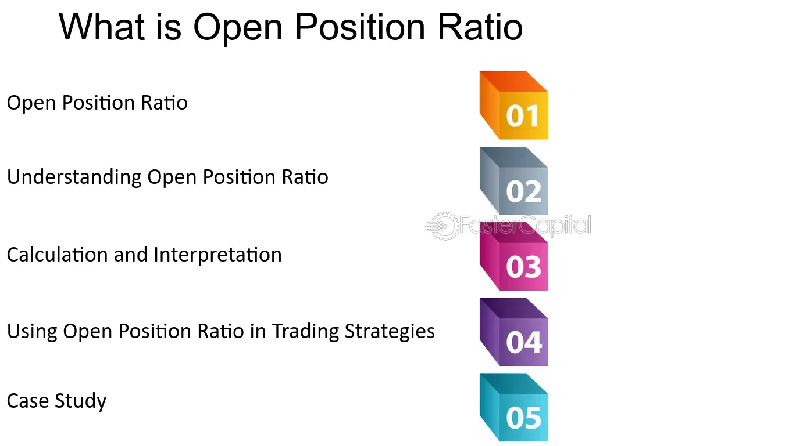

## Table of Contents

## What is the Open Position Ratio?

The Open Position Ratio is a way to measure how many people are betting on a market to go up compared to those betting on it to go down. It's often used in financial markets like forex, where traders can take positions that the value of one currency will rise or fall against another. The ratio is calculated by dividing the number of long positions (bets that the market will go up) by the number of short positions (bets that the market will go down). This gives traders an idea of the overall market sentiment.

Understanding the Open Position Ratio can help traders make better decisions. If the ratio is high, it means more traders think the market will go up, which might suggest the market is overbought and could soon fall. On the other hand, a low ratio means more traders are betting on a fall, which might indicate the market is oversold and could rise soon. However, it's important to use this ratio along with other tools and not rely on it alone, as market sentiment can change quickly.

## Why is the Open Position Ratio important in trading?

The Open Position Ratio is important in trading because it shows what other traders are thinking about the market. It tells you how many people are betting that the market will go up compared to those betting it will go down. This can help you understand if most traders feel positive or negative about the market. If you see that a lot more people are betting on the market to go up, it might mean the market is too high and could soon drop. On the other hand, if more people are betting on a drop, the market might be too low and could soon rise.

However, the Open Position Ratio is just one piece of the puzzle. It's like a snapshot of what traders are thinking at a certain time, but their feelings can change fast. That's why smart traders use the Open Position Ratio along with other tools, like looking at the price charts or reading news about the market. By using all these tools together, traders can make better guesses about where the market might be heading next.

## How is the Open Position Ratio calculated?

The Open Position Ratio is calculated by dividing the number of long positions by the number of short positions. Long positions are bets that the market will go up, while short positions are bets that the market will go down. For example, if there are 100 long positions and 50 short positions, the Open Position Ratio would be 100 divided by 50, which equals 2. This means there are twice as many bets on the market going up as there are on it going down.

This ratio is important because it gives traders a quick look at what other people are thinking about the market. If the ratio is high, it means more traders believe the market will rise, which might suggest the market could be overbought and due for a drop. If the ratio is low, it means more traders are betting on a fall, suggesting the market might be oversold and ready for a rise. However, traders should use the Open Position Ratio along with other tools, because market feelings can change quickly.

## Can you explain the Open Position Ratio with a simple example?

Imagine there's a game where you can bet if the price of a toy will go up or down. If 20 people bet that the price will go up (these are long positions) and 10 people bet that the price will go down (these are short positions), the Open Position Ratio is calculated by dividing the number of long positions by the number of short positions. So, in this case, it's 20 divided by 10, which equals 2. This means there are twice as many people betting that the price of the toy will go up than those betting it will go down.

This ratio is useful because it tells you what other people think about the price of the toy. If a lot more people are betting on the price going up, it might mean that the price is too high and could soon drop. If more people are betting on the price going down, it might mean the price is too low and could soon rise. But remember, this is just one piece of information, and people's opinions can change quickly, so it's good to look at other things too before making a decision.

## What does a high Open Position Ratio indicate?

A high Open Position Ratio means that a lot more people are betting that the market will go up than betting it will go down. It's like if you see 10 friends saying a movie will be great, but only 2 saying it will be bad. This could mean that the market is getting too high and might soon drop. It's a sign that many traders think the price will keep going up, which can sometimes mean the price is overbought.

However, just because the Open Position Ratio is high doesn't mean you should immediately think the market will fall. It's just one clue among many. You should also look at other things like news about the market or what the price has been doing lately. Using all this information together helps you make a smarter guess about where the market might be headed next.

## What does a low Open Position Ratio suggest?

A low Open Position Ratio means that more people are betting the market will go down than betting it will go up. Imagine if only a few of your friends think a new video game will be awesome, but a lot more think it will be boring. This could mean the market is getting too low and might soon rise. It's a sign that many traders believe the price will keep falling, which can sometimes mean the price is oversold.

However, a low Open Position Ratio by itself isn't enough to decide what to do. It's just one piece of the puzzle. You should also check out other things like news about the market or how the price has been moving lately. By looking at all this information together, you can make a better guess about where the market might be going next.

## How does the Open Position Ratio affect market sentiment?

The Open Position Ratio shows what traders are thinking about the market. It tells us if more people are betting that the market will go up or down. If the ratio is high, it means lots of people think the market will go up, which makes the market feel very positive. But if it's too high, it might mean the market is too high and could soon drop, making people feel a bit worried. On the other hand, if the ratio is low, it means more people think the market will go down, which can make the market feel negative. But if it's too low, it might mean the market is too low and could soon rise, giving people hope.

This ratio can change how people feel about the market because it shows what other traders are doing. If you see a lot of people betting on the market going up, you might feel more confident and want to bet the same way. But if you see a lot of people betting on a drop, you might feel more cautious. However, the Open Position Ratio is just one piece of the puzzle. Smart traders look at other things too, like news and price charts, to get a full picture of how the market might move next.

## In what ways can traders use the Open Position Ratio to inform their trading decisions?

Traders can use the Open Position Ratio to get a quick idea of what other people think about the market. If the ratio is high, it means more traders are betting that the market will go up. This might make a trader think the market is too high and could soon drop, so they might decide to sell or wait for a better time to buy. On the other hand, if the ratio is low, it means more people are betting the market will go down. This might make a trader think the market is too low and could soon rise, so they might choose to buy or hold off on selling.

However, the Open Position Ratio is just one tool among many. Smart traders don't rely on it alone. They also look at other things like news about the market, how prices have been moving, and other indicators. By putting all this information together, traders can make better guesses about where the market might go next. This helps them decide whether to buy, sell, or do nothing at all.

## How does the Open Position Ratio vary across different financial instruments?

The Open Position Ratio can be different for different financial instruments like stocks, forex, and commodities. In the forex market, where traders bet on one currency going up or down against another, the ratio can show how many people are betting on a currency to rise compared to those betting on it to fall. For example, if a lot of traders think the US dollar will go up against the euro, the Open Position Ratio for the USD/EUR pair might be high. In the stock market, the ratio shows how many traders are betting on a stock's price to go up versus down. If a company like Apple has a high ratio, it means more traders think its stock price will rise.

The Open Position Ratio can also change based on how popular or well-known a financial instrument is. For big and popular instruments like major currency pairs in forex or well-known stocks, the ratio might be more stable because a lot of traders are watching and betting on them. But for less popular instruments, like smaller stocks or exotic currency pairs, the ratio can change a lot more because fewer people are trading them, and their opinions can shift quickly. Understanding how the Open Position Ratio works for different instruments helps traders make better guesses about where the market might go next.

## What are the limitations of relying solely on the Open Position Ratio for trading?

Relying only on the Open Position Ratio for trading can be risky because it's just one piece of information. The ratio shows what other traders are thinking right now, but people's minds can change fast. If you only look at the ratio, you might miss important news or changes in the market that could affect prices. Also, the ratio doesn't tell you why people are betting the way they are. They might know something you don't, or they might just be guessing wrong.

Another problem is that the Open Position Ratio can be different for different types of financial instruments. What works for forex might not work the same way for stocks or commodities. If you only use the ratio without looking at other things like price charts or market news, you might make bad trading decisions. Smart traders use the Open Position Ratio along with other tools to get a full picture of the market before deciding what to do.

## How can the Open Position Ratio be integrated into a broader trading strategy?

The Open Position Ratio can be a helpful part of a bigger trading plan. It shows what other traders are thinking about the market, which can give you clues about whether the market might go up or down soon. If you see a high ratio, it means more people are betting on the market going up, so you might think about selling or waiting for a better time to buy. If the ratio is low, more people are betting on a drop, so you might want to buy or hold off on selling. But remember, the Open Position Ratio is just one piece of the puzzle. It doesn't tell you the whole story, so you shouldn't make big decisions based on it alone.

To use the Open Position Ratio well, you need to look at other things too. Check the news to see if anything big is happening that could affect the market. Look at price charts to see how the market has been moving lately. Use other tools like technical indicators to get more clues about where the market might go next. By putting all this information together, you can make smarter guesses about the market and decide whether to buy, sell, or do nothing. This way, the Open Position Ratio helps you make better trading decisions, but it's not the only thing you should look at.

## What advanced techniques can be used to analyze trends in the Open Position Ratio over time?

To analyze trends in the Open Position Ratio over time, traders can use moving averages. A moving average smooths out the ratio's ups and downs over a certain period, like a week or a month, to show if the trend is going up or down. If the moving average of the Open Position Ratio is going up, it means more and more people are betting on the market to rise. If it's going down, more people are betting on a fall. This can help traders see if the market sentiment is changing slowly over time, rather than just looking at the ratio for one day.

Another technique is to compare the Open Position Ratio with other indicators, like the Relative Strength Index (RSI) or the Moving Average Convergence Divergence (MACD). These indicators can show if the market is overbought or oversold, which can give more clues about what might happen next. For example, if the Open Position Ratio is high and the RSI is also high, it might mean the market is very overbought and could soon drop. By looking at the Open Position Ratio along with these other tools, traders can get a better idea of the market's direction and make smarter trading decisions.

## What is the importance of understanding financial metrics in algorithmic trading?

Financial metrics are indispensable tools in the landscape of algorithmic trading, providing a framework for evaluating both the performance and viability of trading strategies. At the core of these evaluations are key performance indicators such as Return on Investment (ROI), volatility, and the Sharpe ratio, each offering unique insights into different facets of trading efficiency and risk assessment.

ROI is a straightforward metric that measures the profitability of an investment relative to its cost. It is calculated as:

$$
\text{ROI} = \left( \frac{\text{Net Profit}}{\text{Cost of Investment}} \right) \times 100
$$

This metric is crucial for traders to determine the effectiveness of their trading strategies by evaluating the returns received over a given period relative to the initial investments made. High ROI values typically indicate successful strategies, but it should be analyzed alongside other metrics to account for risk and market conditions.

Volatility measures the degree of variation in the price of a financial instrument over time. It is often calculated using the standard deviation or variance of returns. High [volatility](/wiki/volatility-trading-strategies) indicates significant price swings, presenting both risks and opportunities for traders. Algorithmic trading systems use volatility to gauge the stability of a market, adapt trading conditions, and exploit price movements for potential profit.

The Sharpe ratio is another critical metric, designed to assess the risk-adjusted return of an investment. The formula for the Sharpe ratio is:

$$
\text{Sharpe Ratio} = \frac{E[R] - R_f}{\sigma}
$$

where $E[R]$ is the expected return, $R_f$ is the risk-free rate, and $\sigma$ is the standard deviation of the excess return. This metric helps traders determine how much return they are receiving for the risk they are taking, with higher Sharpe ratios indicating more favorable risk-adjusted returns.

Algorithmic trading capitalizes on these metrics by allowing for the automation of trade executions based on pre-defined criteria, thus enhancing the speed and accuracy of trades. By systematically leveraging financial metrics, algorithms can be programmed to execute trades only when specific conditions are met, ensuring a more disciplined and less emotionally-driven approach to trading.

Incorporating financial metrics into algorithms ensures continuous and robust performance analysis. Through [backtesting](/wiki/backtesting) and real-time evaluation, traders can optimize their strategies, ensuring that they remain effective under different market conditions. By rigorously assessing these metrics, algorithmic traders can fine-tune their strategies, aiming for maximized returns while controlling for risk.

## References & Further Reading

[1]: Bergstra, J., Bardenet, R., Bengio, Y., & Kégl, B. (2011). ["Algorithms for Hyper-Parameter Optimization."](https://dl.acm.org/doi/10.5555/2986459.2986743) Advances in Neural Information Processing Systems 24.

[2]: ["Advances in Financial Machine Learning"](https://www.amazon.com/Advances-Financial-Machine-Learning-Marcos/dp/1119482089) by Marcos Lopez de Prado

[3]: ["Evidence-Based Technical Analysis: Applying the Scientific Method and Statistical Inference to Trading Signals"](https://www.amazon.com/Evidence-Based-Technical-Analysis-Scientific-Statistical/dp/0470008741) by David Aronson

[4]: ["Machine Learning for Algorithmic Trading"](https://github.com/stefan-jansen/machine-learning-for-trading) by Stefan Jansen

[5]: ["Quantitative Trading: How to Build Your Own Algorithmic Trading Business"](https://www.amazon.com/Quantitative-Trading-Build-Algorithmic-Business/dp/1119800064) by Ernest P. Chan