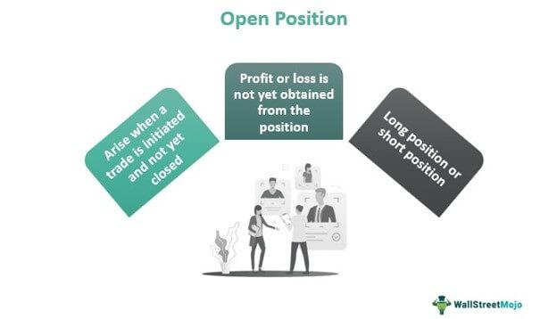

In today's rapidly evolving economic landscape, the dynamics of job vacancies, employment opportunities, and the labor market are constantly shifting. This fluidity is largely influenced by technological advancements, economic fluctuations, and global events. In particular, the role of digital technology has become increasingly prominent, with algorithmic trading emerging as a powerful tool within financial markets. By automating complex trading processes, algorithmic trading has transformed how trades are executed and analyzed, offering new efficiencies and capabilities.

Understanding these trends is critical for both job seekers and employers. For job seekers, aligning skills with market demands is essential, while employers must navigate these changing dynamics to identify talent and maintain competitiveness. The interplay between labor market trends and algorithmic trading is particularly significant, as advancements in financial technologies can lead to shifts in the demand for certain skill sets, changing the landscape of employment opportunities.

This article explores the intersection of the labor market and algorithmic trading, examining how these factors interplay to influence job vacancies and employment opportunities. By analyzing market trends, we aim to provide insights into the current state and future outlook of these areas, assisting individuals and organizations in making informed decisions.

As we engage with these themes, it becomes evident that both job seekers and employers need to adapt to the ongoing changes. Algorithmic trading, characterized by the use of sophisticated algorithms and data analytics, requires new skill sets such as expertise in programming, data analysis, and machine learning. This evolution presents both challenges and opportunities, impacting not only the financial sector but also the broader job market landscape.

Describing the effects of these developments, we consider how digital transformation and data-centric technologies are reshaping employment structures. While these innovations can create new opportunities, they also necessitate a rethinking of traditional employment models. Through this exploration, we aim to equip readers with the knowledge necessary to navigate the complexities of today's labor market and prepare for a future where technology continues to drive significant change.

## Table of Contents

## The Current State of Job Vacancies

The global job market is undergoing profound transformations, primarily due to technological advancements and economic variables. These changes have been further accelerated by the COVID-19 pandemic, which imposed significant disruptions and led to an evolving job landscape. Interestingly, despite these challenges, certain sectors have demonstrated remarkable resilience and continued growth in job vacancies, illuminating emerging trends within the labor market.

One of the critical drivers of this change is the accelerated shift towards a digital economy. The increasing integration of technology in everyday business operations has amplified the demand for tech-related skills and roles. For instance, occupations in data analysis, software development, and information technology have seen significant surges in demand, as companies are compelled to innovate and adapt to digital methodologies. This demand aligns with a broader trend documented by studies, indicating that nearly all sectors, from finance to healthcare, are investing heavily in digital transformation to remain competitive and efficient (OECD, 2021).

Understanding these trends is imperative for job seekers aiming to align their skill sets with current and future market demands. A recent analysis by the World Economic Forum (2020) highlights that roles requiring expertise in [artificial intelligence](/wiki/ai-artificial-intelligence), [machine learning](/wiki/machine-learning), and cloud computing are among the fastest-growing, with employers prioritizing digital literacy and problem-solving skills. As a result, job seekers are increasingly encouraged to pursue continuous learning and skill development in these areas to maintain a competitive edge.

Moreover, sectors outside traditional tech domains are also embracing digital tools, creating a hybrid demand for skills. For example, the retail and logistic industries are incorporating data analytics and automation to optimize supply chains and enhance customer experiences, thereby generating opportunities for tech-savvy professionals within these fields. According to the McKinsey Global Institute (2022), this hybridization indicates a convergence of technology and conventional sectors, resulting in a diversified job market.

In conclusion, the current state of job vacancies is characterized by a significant tilt towards digital skills and competencies, driven by technological advancements and economic adaptations necessitated by the pandemic. For job seekers, understanding these trends provides valuable insights, enabling them to strategically position themselves within this dynamic landscape. By focusing on skill enhancement and remaining adaptable to new technologies, individuals can better navigate the evolving job market and explore emerging opportunities.

## Employment Opportunities in a Digital Era

Digital transformation has significantly reshaped the employment landscape, generating a wide array of opportunities in various sectors. The rise of digital technologies and the increasing reliance on data-driven decisions have led to a heightened demand for professionals in fields such as data science, cybersecurity, and software development. These roles are crucial as organizations strive to harness technological advancements to maintain competitiveness and drive growth. 

In data science, professionals analyze complex data sets to generate actionable insights, which can optimize business processes, enhance customer experiences, and drive strategic decision-making. According to LinkedIn's 2022 Emerging Jobs report, data science roles have continued to see substantial growth, reflecting the integral role data plays in modern businesses. Similarly, the escalating number of cyber threats has amplified the necessity for cybersecurity experts. Organizations are investing in robust security infrastructure to protect sensitive information, leading to substantial hiring in this domain ([Cybersecurity Ventures](https://cybersecurityventures.com/jobs/)).

Software development has seen an unprecedented surge, driven by the need to design and implement new applications and digital platforms. Programming skills, particularly in languages such as Python, JavaScript, and Java, are in high demand, enabling developers to create scalable and efficient software solutions. The adaptation of cloud technologies and artificial intelligence is further fueling this demand, as companies migrate to cloud-based systems and integrate AI to automate processes and enhance operational efficiency.

The advent of remote working, accelerated by the COVID-19 pandemic, has expanded employment possibilities beyond traditional geographic boundaries. This shift has allowed companies to source talent from a global pool, fostering diversity and enabling employees to work from virtually anywhere. The increased availability of digital communication tools and collaboration platforms has facilitated this transition, allowing continuous interaction and project management across different time zones. According to a report by McKinsey, remote work could account for up to 25% more workers than previously expected, across sectors that are adaptable to location-independent tasks ([McKinsey & Company](https://www.mckinsey.com/featured-insights/future-of-work/the-future-of-work-after-covid-19)).

Furthermore, the gig economy, characterized by short-term, flexible jobs, has benefited from this digital era, providing new opportunities for freelancers and contract workers. Platforms such as Upwork and Fiverr have become instrumental in connecting skilled professionals with organizations seeking temporary expertise, thus reshaping traditional employment models.

In summary, digital transformation has unlocked numerous employment opportunities by driving demand for specialized skills in data science, cybersecurity, and software development. The rise of remote work has further broadened these prospects, allowing both employers and employees to transcend geographical constraints. As technology continues to evolve, it is expected that these trends will persist, continuously reshaping how, where, and in what capacity people work.

## Impact of Algorithmic Trading on Financial Employment

Algorithmic trading, commonly referred to as algo trading, employs sophisticated computer algorithms to execute high-frequency trading ([HFT](/wiki/high-frequency-trading-strategies)) decisions. This automation and data-driven approach have significantly transformed the financial markets by enhancing trading efficiency and precision, while simultaneously minimizing the potential for human error. As a result, algo trading occupies a critical position in modern financial ecosystems.

The primary advantage of algo trading is its ability to process vast amounts of data in real-time, allowing traders to respond instantaneously to market changes. This speed and efficiency are crucial given the complexity and [volume](/wiki/volume-trading-strategy) of transactions in today's global markets. Algorithms are designed to identify profitable trading opportunities, execute orders at optimal prices, and manage risks by analyzing historical and real-time data patterns.

Despite these benefits, algo trading necessitates a workforce skilled in programming, data analysis, and machine learning. Proficiency in languages such as Python or C++ is essential for developing and maintaining the sophisticated algorithms that drive these trading systems. Moreover, data scientists and analysts play a pivotal role in interpreting the insights generated from large datasets, enabling traders to make informed decisions.

These technological advancements have led to a paradigm shift in financial employment sectors. Traditional roles are evolving or diminishing, giving way to new positions that require a deep understanding of both financial markets and advanced technological competencies. Financial institutions are now prioritizing the recruitment of individuals adept in quantitative analytics, algorithm development, and risk management.

The rise of algo trading also presents challenges. There is a growing need for regulatory oversight to ensure market stability and prevent potential systemic risks associated with automated trading. Moreover, the reliance on algorithms poses cybersecurity threats, requiring organizations to invest in robust security measures to protect sensitive financial data and prevent hacking.

In essence, the impact of [algorithmic trading](/wiki/algorithmic-trading) on financial employment is profound, fostering an industry that values technological prowess alongside traditional financial expertise. For professionals in the financial sector, staying competitive means embracing continuous learning and adapting to technological innovations that are reshaping the landscape of financial markets.

## Advantages and Disadvantages of Algo Trading

Algorithmic trading, often abbreviated as algo trading, confers several substantial advantages that have rendered it an integral component of modern financial markets. Primarily, algo trading enhances the accuracy and speed of trade execution. By leveraging sophisticated algorithms, trades can be executed in fractions of a second, far quicker than any human trader could achieve. This ability to rapidly act upon market signals increases the potential for capitalizing on fleeting opportunities and optimizing returns.

Another significant benefit of algo trading is its capability to manage large volumes of trades efficiently. Algorithms can dissect and execute massive transactions in a fraction of the time required by traditional methods. This efficiency improves market [liquidity](/wiki/liquidity-risk-premium), as the constant buying and selling activity facilitated by algorithms ensures a more stable flow of transactions. Consequently, markets can operate more smoothly, with reduced bid-ask spreads, benefiting all participants through decreased transaction costs.

Despite its advantages, algo trading is not without its drawbacks. One of the principal concerns is the dependency on technology, which introduces risks related to market stability. Algorithms can malfunction, and when they do, the outcomes can be detrimental, potentially leading to significant market disruptions. For instance, the infamous "Flash Crash" of 2010, where the Dow Jones Industrial Average dropped by about 1,000 points within minutes, was partly attributed to erroneous algorithmic trades.

Moreover, the digital infrastructure that underpins algo trading is susceptible to cybersecurity threats. The increasing sophistication of cyber attacks means that trading platforms must be rigorously protected to prevent unauthorized access or data breaches, which could compromise the integrity of financial markets.

In summary, while algorithmic trading delivers transformative benefits in terms of speed, accuracy, and efficiency, it also necessitates an ongoing assessment of stability and security risks. Market participants must continually refine their systems to safeguard against the inherent vulnerabilities associated with this predominantly technology-driven trading mechanism.

## Preparing for the Future Job Market

The rapid evolution of the job market necessitates a proactive approach to skill development and adaptability in emerging technologies. To thrive in this dynamic environment, job seekers must prioritize continuous learning, particularly in the fields of data science and information technology (IT). The growing importance of these domains is driven by the increasing reliance on digital solutions and the integration of advanced technologies across industries.

Data science, a discipline that involves extracting insights from structured and unstructured data, is crucial for businesses seeking to make informed decisions. A foundational understanding of data manipulation, statistical analysis, and machine learning techniques is essential for professionals in this area. For those keen on entering or advancing in the data science field, proficiency in programming languages such as Python or R, coupled with knowledge of data visualization tools like Tableau or Power BI, is highly beneficial.

In the IT sector, the demand for expertise in areas such as cloud computing, cybersecurity, and software development continues to rise. Cloud computing, which enables on-demand access to computing resources, requires skills in platforms like Amazon Web Services (AWS), Microsoft Azure, and Google Cloud. Cybersecurity, vital for protecting organizational data against cyber threats, demands knowledge in network security, encryption techniques, and risk management frameworks. Meanwhile, software development remains a cornerstone of the IT industry, with languages such as Java, JavaScript, and C# being particularly valuable.

To equip themselves for future challenges, employers must also cultivate organizational adaptability. This involves fostering a culture of innovation and flexibility, where ongoing skills training and knowledge sharing are integral elements. Encouraging interdisciplinary collaboration can spur creativity and drive the development of novel solutions to complex problems. By investing in employee development programs and creating pathways for career advancement, organizations can attract and retain top talent, further ensuring their resilience in a fluctuating job market.

In conclusion, as technological advances continue to reshape the employment landscape, both individuals and organizations must remain vigilant and responsive to emerging trends. By committing to an ethos of continuous learning and adaptability, they can navigate the complexities of the future job market with confidence and foresight.

## Conclusion

The changing dynamics of job vacancies and the labor market, coupled with the rise of algorithmic trading, present a multifaceted landscape that impacts both job seekers and employers. This evolving environment necessitates a proactive approach to understanding and navigating technological and economic shifts. As we have examined, technological advancements are reshaping market demands, necessitating new skills and fostering novel employment opportunities, particularly in sectors like data science, cybersecurity, and software development. 

Algorithmic trading epitomizes the profound changes brought by technology in the financial sector. It underscores the importance of acquiring expertise in programming, data analysis, and machine learning, which are critical for future job markets. While algorithmic trading enhances market efficiency and accuracy in transactions, it also raises concerns about cybersecurity and market stability, challenges that require strategic planning and robust solutions.

For individuals, continuous education and upskilling are paramount. Embracing lifelong learning in emerging technologies not only enhances employability but also bolsters career resilience against economic fluctuations. For organizations, fostering flexible, adaptable structures and promoting a culture of innovation will be essential to meet evolving market demands and to harness the potential of new technologies.

Ultimately, by recognizing these emerging trends and responding strategically, both individuals and organizations can position themselves advantageously for the future. This approach will be instrumental in achieving sustainable growth and securing employment in an increasingly digital and algorithm-driven world.

## References & Further Reading

[1]: ["OECD Employment Outlook 2021"](https://www.oecd.org/en/publications/oecd-employment-outlook-2021_5a700c4b-en.html) - OECD.

[2]: ["The Future of Jobs Report 2020"](https://www.weforum.org/publications/the-future-of-jobs-report-2020/) - World Economic Forum.

[3]: ["The Future of Work After COVID-19"](https://www.mckinsey.com/featured-insights/future-of-work/the-future-of-work-after-covid-19) - McKinsey & Company.

[4]: ["2022 Emerging Jobs Report"](https://business.linkedin.com/talent-solutions/emerging-jobs-report) - LinkedIn.

[5]: ["Cybersecurity Jobs Report"](https://cybersecurityventures.com/jobs/) - Cybersecurity Ventures.

[6]: ["Digital America: A Tale of the Haves and Have-Mores"](https://www.mckinsey.com/~/media/McKinsey/Industries/Technology%20Media%20and%20Telecommunications/High%20Tech/Our%20Insights/Digital%20America%20A%20tale%20of%20the%20haves%20and%20have%20mores/Digital%20America%20Full%20Report%20December%202015.pdf) - McKinsey Global Institute. 

[7]: ["Advances in Financial Machine Learning"](https://www.amazon.com/Advances-Financial-Machine-Learning-Marcos/dp/1119482089) by Marcos Lopez de Prado.

[8]: ["Machine Learning for Algorithmic Trading"](https://www.amazon.com/Machine-Learning-Algorithmic-Trading-alternative/dp/1839217715) by Stefan Jansen.

[9]: ["Quantitative Trading: How to Build Your Own Algorithmic Trading Business"](https://books.google.com/books/about/Quantitative_Trading.html?id=j70yEAAAQBAJ) by Ernest P. Chan.