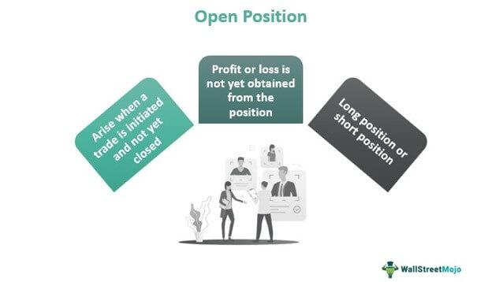

## Table of Contents

## What is an open position in trading?

An open position in trading is when a trader buys or sells a financial asset and has not yet closed the trade. It means the trade is still active and can make more profit or loss depending on how the market moves. For example, if you buy a stock, you have an open position until you sell that stock.

When you have an open position, you need to keep an eye on the market because the value of your asset can change. If the market goes up and you bought the asset, your open position can make you more money. But if the market goes down, you might lose money. That's why traders often set stop-loss orders to limit their losses if the market moves against them.

## How does an open position differ from a closed position?

An open position is when you have bought or sold something in the market and you haven't finished the trade yet. It's like you've started a game but haven't finished it. You still own the thing you bought or owe the thing you sold, and its value can change as the market moves. This means you can make more money if the market goes your way, or lose money if it doesn't.

A closed position is when you finish the trade. If you bought something, you sell it back. If you sold something, you buy it back. Once you do this, the trade is over, and you can't make any more money or lose any more money from that trade. It's like finishing the game and knowing exactly how much you won or lost.

## What are the basic types of open positions in trading?

In trading, there are two basic types of open positions: long positions and short positions. A long position is when you buy an asset, like a stock or a currency, hoping its price will go up. You own the asset and can make money if its value increases. For example, if you buy a stock at $50 and it goes up to $60, you can sell it for a $10 profit.

A short position is the opposite. You sell an asset you don't own, hoping its price will go down. You borrow the asset to sell it, and if the price drops, you buy it back cheaper and return it to the lender, keeping the difference as profit. For instance, if you sell a stock at $50 and it drops to $40, you can buy it back at $40, return it, and make a $10 profit.

Both types of positions can be risky. With a long position, you can lose money if the price goes down. With a short position, the risk is even higher because there's no limit to how high the price can go, which means your losses can be much bigger if the market moves against you.

## How can one initiate an open position in the stock market?

To start an open position in the stock market, you first need to decide if you want to buy a stock (go long) or sell a stock you don't own (go short). If you want to buy a stock, you can do this through a brokerage account. You log into your account, choose the stock you want to buy, and enter the number of shares and the price you're willing to pay. Once you click 'buy', you own the stock and have an open long position.

If you want to go short, the process is a bit different. You need to find a broker that allows short selling and borrow the shares you want to sell. You then sell these borrowed shares at the current market price. You have an open short position until you buy the shares back to return them to the lender. Both buying and short selling involve risks, so it's important to understand the market and have a plan before you start.

## What are the risks associated with maintaining an open position?

Keeping an open position in trading can be risky. When you have an open position, the price of the asset you own or have sold short can change. If you bought a stock and its price goes down, you could lose money. If you sold a stock short and its price goes up, you could lose money too. The longer you keep your position open, the more time the market has to move against you, which means you could lose more money.

Another risk is that the market can be unpredictable. News events, economic reports, or even rumors can make prices go up or down suddenly. If you're not watching your open position closely, you might miss these changes and not be able to close your position in time to limit your losses. That's why it's important to have a plan for managing your open positions, like setting stop-loss orders to automatically close your position if the market moves against you too much.

## How does leverage affect the risk of an open position?

Leverage lets you control a bigger position with less money. It's like borrowing money to invest more than you have. If you use leverage and the market goes your way, you can make more money because you're trading with more money than you actually have. But if the market goes against you, you can lose more money too. That's because you still have to pay back what you borrowed, even if your investment loses value.

Using leverage makes the risk of an open position bigger. If you have an open position with leverage and the price moves against you, your losses can grow faster. This is because you're using borrowed money, and if the market moves too far against you, you might get a margin call. A margin call means you have to put more money into your account or close your position to cover the losses. So, leverage can make your open position more exciting but also more dangerous.

## What strategies can be used to manage the risk of open positions?

One way to manage the risk of open positions is by using stop-loss orders. A stop-loss order is like a safety net. It automatically closes your position if the price goes down too much. This means you can limit how much money you might lose if the market moves against you. It's a good idea to set your stop-loss at a price you're okay with losing, so you don't get surprised by big losses.

Another strategy is to keep an eye on the market and be ready to close your position if things don't go as planned. This means checking the news and watching how the price of your asset is moving. If you see the market going against you, you might want to sell your stock or buy back the one you sold short before the losses get too big. Being ready to act quickly can help you avoid big losses.

You can also manage risk by not using too much leverage. Leverage can make your profits bigger, but it can also make your losses bigger. If you use less leverage, you won't lose as much money if the market moves against you. It's a good idea to only use as much leverage as you're comfortable with, so you can sleep at night knowing your risks are under control.

## How do market conditions influence the decision to keep an open position?

Market conditions can really affect whether you should keep an open position or close it. If the market is doing well and the price of your asset is going up, you might want to keep your position open because you could make more money. But if the market is shaky or there's bad news that could make prices go down, you might want to close your position to avoid losing money. It's important to keep an eye on things like economic reports, news events, and even what other traders are doing because all these can change how the market moves.

Sometimes, you might see the market going through a lot of ups and downs, which can be a sign that it's risky to keep your position open. If you think the market might keep moving against you, it's a good idea to close your position to limit your losses. On the other hand, if the market seems stable and you believe it will keep going in your favor, you might choose to keep your position open to see if you can make more profit. Always think about what's happening in the market and how it might affect your open position.

## What is the impact of overnight fees on open positions?

Overnight fees, also called swap fees, are costs you might have to pay when you keep an open position overnight. These fees are charged by brokers for holding a position from one trading day to the next. If you're trading currencies or other financial products that use leverage, you might see these fees. The fees can be small, but if you keep your position open for a long time, they can add up and eat into your profits.

The impact of overnight fees depends on what you're trading and how long you keep your position open. If you're trading something like [forex](/wiki/forex-system), where overnight fees are common, you need to think about these costs when deciding whether to keep your position open. If the fees are high and you don't think the market will move enough to cover them, it might be better to close your position. But if you believe the market will move in your favor and the potential profit is bigger than the fees, it might be worth keeping your position open.

## How can technical analysis be used to monitor open positions?

Technical analysis is a way to look at charts and numbers to help you decide what to do with your open positions. It involves looking at things like moving averages, support and resistance levels, and other patterns on a chart. These tools can help you see if the price of the asset you're trading is likely to go up or down. For example, if you see that the price is hitting a resistance level and starting to go down, you might want to close your open position to avoid losing money. On the other hand, if the price breaks through a resistance level, it might be a good sign to keep your position open because the price could keep going up.

By using technical analysis, you can set clear rules for when to keep your open position and when to close it. For instance, you might decide to close your position if the price goes below a certain moving average, or you might keep it open if the price stays above a support level. This can help you make decisions based on what the market is actually doing, rather than just guessing. It's like having a map to guide you through the ups and downs of the market, helping you manage your open positions more effectively.

## What are advanced techniques for hedging open positions?

Hedging is a way to protect your open positions from losing too much money if the market moves against you. One advanced technique for hedging is using options. Options give you the right to buy or sell an asset at a certain price in the future. If you have an open position in a stock, you can buy a put option to sell that stock at a set price. This way, if the stock price drops, you can still sell it at the higher price you set with the option, which limits your losses. Another way to hedge is by using futures contracts. Futures are agreements to buy or sell an asset at a future date for a price you decide now. If you're worried about the price of your open position going down, you can sell a futures contract at the current price, and if the market falls, you'll make money on the futures to offset your losses on the open position.

Another advanced hedging technique is using pairs trading. This involves taking two positions at the same time: one long and one short. You choose two assets that usually move together, like two stocks in the same industry. If you think one stock might do better than the other, you buy the one you think will go up (go long) and sell the other one (go short). This way, if the market goes down, the losses on your long position might be offset by gains on your short position. It's like balancing your risks so that no matter which way the market moves, you're protected. These advanced hedging techniques can be a bit tricky, but they can help you manage the risks of your open positions more effectively.

## How do regulatory changes affect the management of open positions?

Regulatory changes can have a big impact on how you manage your open positions. When rules change, they can affect what you're allowed to do with your trades. For example, if the government decides to put new limits on how much leverage you can use, you might have to close some of your open positions or change how you trade. Also, if new rules make it harder to short sell, you might need to adjust your strategy if you have open short positions. Keeping up with these changes is important because they can change the risks and costs of keeping your positions open.

Sometimes, regulatory changes can also affect the overall market, which can make your open positions more risky. If new rules make it harder for companies to do business, their stock prices might go down, and that could hurt your open positions. Or, if new rules make certain investments more popular, the prices might go up, which could be good for your positions. Either way, you need to stay informed about regulatory changes and be ready to adjust your trading plan to manage your open positions effectively.

## References & Further Reading

[1]: Bergstra, J., Bardenet, R., Bengio, Y., & Kégl, B. (2011). ["Algorithms for Hyper-Parameter Optimization."](https://dl.acm.org/doi/10.5555/2986459.2986743) Advances in Neural Information Processing Systems Volume 24.

[2]: ["Advances in Financial Machine Learning"](https://www.amazon.com/Advances-Financial-Machine-Learning-Marcos/dp/1119482089) by Marcos Lopez de Prado

[3]: ["Evidence-Based Technical Analysis: Applying the Scientific Method and Statistical Inference to Trading Signals"](https://www.amazon.com/Evidence-Based-Technical-Analysis-Scientific-Statistical/dp/0470008741) by David Aronson

[4]: ["Machine Learning for Algorithmic Trading"](https://github.com/stefan-jansen/machine-learning-for-trading) by Stefan Jansen

[5]: ["Quantitative Trading: How to Build Your Own Algorithmic Trading Business"](https://www.amazon.com/Quantitative-Trading-Build-Algorithmic-Business/dp/1119800064) by Ernest P. Chan