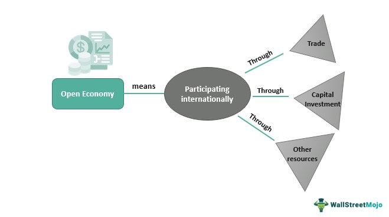

Algorithmic trading, also known as algo trading, has transformed financial markets by allowing traders to execute orders with increased speed and precision through the use of pre-programmed trading instructions. These algorithms utilize computer systems to automatically make decisions about buying or selling financial instruments like stocks, options, and futures. Among the various functionalities that enhance the efficiency of algorithmic trading, the 'open rotation' system is particularly significant in the options market. 

The open rotation system is a pre-market routine used to facilitate the smooth commencement of trading in options. It plays a critical role in determining the opening price of options contracts by processing initial orders and quotes, effectively laying the groundwork for market activity as the trading day begins. This process is comparable to the 'at-the-opening' order concept in the stock market, which seeks to execute trades at the official opening price. 



Understanding the intricacies of open rotation helps traders optimize their strategies, allowing them to react robustly to price movements that are crucial at the beginning of trading. This system can be especially vital during volatile market conditions, helping traders mitigate risks and seize opportunities as they emerge. 

This article aims to address some of the common questions surrounding the open rotation system within the context of algorithmic trading. By comprehending the mechanics and benefits of open rotation, traders—and their automated systems—can improve their decision-making processes and potentially enhance trading outcomes.

## Table of Contents

## What is Open Rotation?

Open rotation is a critical mechanism in the options market that initiates the trading process at the beginning of each trading day. This system is designed to establish the opening prices for options by processing initial orders and quotes. The primary function of open rotation is analogous to the 'at-the-opening' order in stock trading, where trades are executed at the market's opening price, providing a clear market opening valuation.

The process of open rotation begins with the collection and evaluation of orders and quotes submitted prior to the market opening. During this phase, the system aggregates buy and sell orders to determine the equilibrium price at which the maximum number of options can be traded. This price is then set as the opening price for the options, thereby ensuring a fair and orderly market opening.

In some scenarios, open rotation may also involve specific market orders that remain active throughout the early trading rotation. These orders are typically structured to execute at the best available price during the opening sequence, contributing to a more robust price discovery process.

The framework of open rotation ensures that all market participants have equal access to price information at the start of trading, which is crucial for maintaining transparency and fairness in the options market. As the day progresses, the prices established during the open rotation provide a reference point for subsequent trading activities, facilitating informed decision-making for traders and investors.

Open rotation serves as an integral part of a well-functioning options market by helping establish initial pricing, which in turn supports [liquidity](/wiki/liquidity-risk-premium) and market efficiency. Understanding this mechanism is essential for traders seeking to optimize their trading strategies in [algorithmic trading](/wiki/algorithmic-trading) environments.

## Understanding the Open Rotation Process

Open rotation is a systematic process that plays a crucial role in the options market at the start of each trading day. It is designed to ensure an orderly beginning to the trading session by determining the opening prices for options based on pre-existing orders and quotes. The initiation of open rotation begins with the acceptance of orders for a series of call options that expire soonest with the lowest strike price. This prioritization ensures that options with more immediate relevance to market participants are addressed first.

The progression through the options series follows a structured path where after the near-term call options are dealt with, the process transitions to options with further-out expirations. This systematic approach ensures that there is a fair opportunity for all options series to be included in the opening determination.

Once the cycle for call options concludes, the process shifts focus to put options. The sequence starts with those put options that bear the highest strike prices and possess the nearest expiration dates. This order of operations for put options mirrors that of the call options, maintaining consistency in how the market opens each trading day.

The duration necessary to complete the open rotation can vary and is influenced by several factors, with trading [volume](/wiki/volume-trading-strategy) being the most significant. High trading volumes in either the underlying stock or the options themselves can extend the time required for open rotation as more orders and quotes need to be processed to establish a clear opening price. Conversely, lighter trading volumes might result in a quicker open rotation process. 

Understanding the nuances of this process is essential for traders looking to optimize their strategies. Being aware of the sequence and the factors affecting the open rotation allows traders to time their orders effectively, thus minimizing risks and maximizing potential gains.

## Special Considerations for Open Rotation

Open rotation orders, integral to options trading, do not necessitate execution at the opening bell. This flexibility is particularly useful during fast market conditions, where [volatility](/wiki/volatility-trading-strategies) is high and rapid price fluctuations occur. During such times, open rotation serves as a balancing mechanism, facilitating price discovery and aligning supply and demand forces in the options market.

If a stock undergoes a trading halt, all connected options trades cease as well. The open rotation process is subsequently reinitiated once the market reopens. This ensures that the price determination process accurately reflects any significant market developments that occurred during the halt.

Effectively managing risks during open rotation periods is crucial for traders. Understanding market conditions can significantly influence the application of stop and limit orders, which serve as essential tools for risk management. Stop orders activate a market order once a predetermined price is reached, acting as a safeguard against significant losses. On the other hand, limit orders determine the maximum or minimum price at which a trader is willing to execute a trade, ensuring trades occur within desired price parameters.

For instance, consider a Python script that calculates the optimal stop and limit prices based on historical volatility and market conditions:

```python
def calculate_stop_limit_prices(current_price, historical_volatility, sensitivity=1.5):
    stop_price = current_price - (historical_volatility * sensitivity)
    limit_price = current_price + (historical_volatility * sensitivity)
    return stop_price, limit_price

# Example usage
current_price = 100.0
historical_volatility = 2.0
stop, limit = calculate_stop_limit_prices(current_price, historical_volatility)
print(f"Stop Price: {stop}, Limit Price: {limit}")
```

This code snippet demonstrates how traders can establish stop and limit prices dynamically, adapting to market changes. By leveraging such strategies, traders can mitigate potential losses and preserve capital efficiency, with careful consideration of how open rotation's mechanisms impact the broader options trading dynamics.

## FAQs About Open Rotation in Algo Trading

**What is the primary purpose of open rotation in options trading?**

The primary purpose of open rotation in options trading is to facilitate an orderly and efficient market opening by establishing a fair opening price for options contracts. This mechanism begins with accepting initial orders and quotes, ensuring a transparent process that balances buy and sell interests. It provides a clear starting point for trading activities, particularly for options with varying expiration dates and strike prices.

**How does open rotation differ from day-to-day options trading?**

Open rotation is distinct from regular options trading primarily due to its timing and procedural nature. While day-to-[day trading](/wiki/day-trading-spy) is continuous and driven by market demand throughout the trading session, open rotation occurs specifically at the start of the trading day. During open rotation, the sequence of processing options—beginning with call options and then moving to put options—is methodically followed to determine opening prices. This stands in contrast to the usual bid-ask interactions seen during the day.

**Are there specific strategies traders should consider during open rotation?**

Traders might consider employing strategies that focus on volatility and liquidity during open rotation. An understanding of market trends and order flow at the start of the day can present opportunities in options pricing due to temporary imbalances. Strategies like "straddles" or "strangles," which capitalize on expected volatility without predicting market direction, can be effective. Additionally, traders may prioritize limit orders over market orders to manage execution prices more precisely.

**How does electronic trading affect open rotation practices?**

Electronic trading has significantly streamlined open rotation processes by increasing transparency and efficiency. The automation and speed provided by electronic systems allow for faster order matching and execution, reducing human error and latency. Advanced algorithms can process vast amounts of data and make real-time decisions, enhancing the accuracy and reliability of price discovery during open rotation.

**Can open rotation orders be modified or canceled during the trading day?**

Yes, open rotation orders can typically be modified or canceled after the opening rotation phase is completed and normal trading resumes. Before the market opens, there might be restrictions on modifying certain order types to maintain stability and prevent disorderly behavior. However, post-open modifications and cancellations can be made as market conditions change, allowing traders flexibility in their strategies.

## Conclusion

Understanding open rotation and its significance in the options market can empower traders to make informed decisions. Open rotation serves as a critical mechanism in determining the opening prices of options, thus playing a pivotal role in shaping trading strategies. By efficiently processing large volumes of orders, it helps market participants access crucial price information necessary for optimizing their trading activities.

Leveraging insights from the open rotation system can enhance strategy efficiency by ensuring that traders are operating with precise and timely data. This optimization can translate into better alignment with market dynamics, reduced latency in trade execution, and improved order pricing accuracy. As a result, traders who effectively utilize open rotation insights can potentially achieve better returns on their investments by executing strategies that are more attuned to the current market environment.

Continued education and adaptation to market conditions are vital for sustainable success in algorithmic trading. As markets evolve and new trading technologies emerge, staying informed about changes and improvements in systems such as open rotation is crucial. Traders should be prepared to adjust their strategies in response to fluctuations in market volatility, advancements in trading algorithms, and alterations in regulatory frameworks. By maintaining a commitment to learning and flexibility, traders can enhance their competitiveness and increase their likelihood of success in the fast-paced world of algorithmic trading.

## References & Further Reading

[1]: Jain, P. K. (2005). ["Financial Market Design and the Equity Premium: Electronic vs. Floor Trading"](https://onlinelibrary.wiley.com/doi/10.1111/j.1540-6261.2005.00822.x) The Review of Financial Studies, 18(4), 1171-1200.

[2]: Hasbrouck, J. (2003). ["Intraday Price Formation in U.S. Equity Index Markets"](https://onlinelibrary.wiley.com/doi/10.1046/j.1540-6261.2003.00609.x) The Journal of Finance, 58(6), 2375-2400.

[3]: Harris, L. (2003). ["Trading and Exchanges: Market Microstructure for Practitioners"](https://www.amazon.com/Trading-Exchanges-Market-Microstructure-Practitioners/dp/0195144708) Oxford University Press.

[4]: Aldridge, I. (2013). ["High-Frequency Trading: A Practical Guide to Algorithmic Strategies and Trading Systems"](https://www.ahmetbeyefendi.com/wp-content/uploads/2020/07/High-Frequency-Trading-Irene-Aldridge.pdf) Wiley Finance.

[5]: Kissell, R. (2013). ["The Science of Algorithmic Trading and Portfolio Management"](https://www.sciencedirect.com/book/9780124016897/the-science-of-algorithmic-trading-and-portfolio-management) Academic Press.