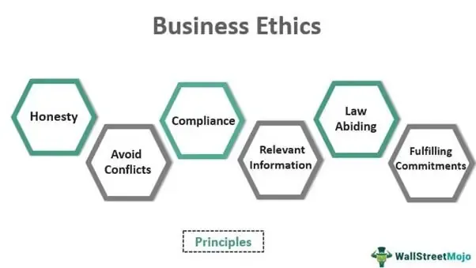

In the digital era, algorithmic trading has emerged as a cornerstone of financial markets, providing traders with the ability to execute complex strategies at speeds that far exceed human capabilities. With the increasing reliance on these automated systems, the financial landscape has transformed, allowing for more dynamic and efficient market interactions. However, the power of algorithmic trading is accompanied by significant responsibilities. The inherent opacity of certain trading algorithms and platforms often leads to mistrust among market participants, posing potential systemic risks.

This article examines the critical need for incorporating open-source software, open standards, and transparency within the world of algorithmic trading. These elements are essential for fostering trust and minimizing the risks associated with automated trading systems. By integrating open-source principles, traders and developers gain access to shared knowledge and collaborative development, enhancing the reliability and innovation of trading algorithms. Open standards ensure interoperability between diverse systems, facilitating smoother operations and reducing the likelihood of errors and latency.

Transparency, meanwhile, plays a vital role in ensuring accountability and fairness within trading practices. A clearer understanding of algorithmic decision-making processes can mitigate risks, such as those leading to flash crashes or manipulative behaviors. This transparency is increasingly being advocated by regulatory authorities to protect investors and maintain market integrity.

The convergence of these principles has the potential to transform market dynamics, creating more equitable financial systems. By fostering an environment that prioritizes openness, the industry can move towards a more democratized framework, where competition and innovation thrive on a level playing field. This article explores the benefits and challenges that accompany this transition, highlighting how embracing openness can contribute to the evolution of more resilient and fair trading systems.

## Table of Contents

## Understanding Algorithmic Trading

Algorithmic trading is a method that utilizes computer algorithms to automate the buying and selling of financial assets. These algorithms are designed to monitor market data, identify trading opportunities, and execute trades at speeds unreachable by human traders. The process involves complex mathematical models and statistical analyses to make quick, informed decisions that optimize trading strategies.

The primary advantage of algorithmic trading is its speed and precision. Algorithms can process vast amounts of data and execute orders within milliseconds, capitalizing on market movements before they are apparent to human traders. This rapid decision-making capability can lead to improved trading efficiency and profitability. For instance, an algorithm could be programmed to execute trades when the price of a stock crosses a certain threshold, or when specific market indicators align.

However, the effectiveness of [algorithmic trading](/wiki/algorithmic-trading) hinges on the robustness of the systems in place. Algorithms must be thoroughly tested and monitored to ensure they perform reliably under varying market conditions. A slight error in the code or an unexpected market event can lead to significant financial losses. For instance, the infamous "flash crash" of 2010, where the U.S. stock market plummeted nearly 1,000 points in minutes, was partly attributed to algorithmic trading gone awry.

Traditional algorithmic trading systems are often proprietary, creating a black box scenario. In such cases, the inner workings and decision-making processes of the algorithms remain hidden, which can obscure understanding and accountability. This opacity is a growing concern as algorithmic trading becomes more prevalent across global markets. The lack of transparency can lead to mistrust among stakeholders, including traders, investors, and regulatory bodies, as they are unable to fully comprehend how decisions are made or identify potential biases within the system.

In response, there has been a growing call for greater openness and accountability in algorithmic trading. Stakeholders advocate for systems that allow for transparency in the development and execution of trading algorithms. By enabling a clearer view into these processes, trust can be fostered, and systemic risks mitigated. Transparent algorithms also allow for external auditing and verification, thereby ensuring fairness and reducing the potential for market manipulation.

The drive towards openness is not just a theoretical concern; it has real-world implications for the stability and integrity of financial markets. As markets continue to evolve, so too must the frameworks that support algorithmic trading. Ensuring that these systems are transparent, accountable, and equitable is a critical challenge for the industry moving forward.

## The Role of Open Source in Algorithmic Trading

Open-source software has fundamentally transformed algorithmic trading by making sophisticated trading tools accessible to a broader range of market participants. Traditionally, the creation and implementation of algorithmic trading systems required substantial financial investment in proprietary software, limiting participation to large financial institutions. However, the advent of open-source platforms such as OpenAlgo and StockSharp has democratized this space, allowing individual traders and smaller firms to engage in algorithmic trading without incurring prohibitive costs.

Platforms like OpenAlgo remove financial barriers by providing essential trading frameworks that can be customized and deployed with minimal setup costs. Open-source systems are not just cost-effective; they also embrace a collaborative development model. This openness fosters a community-driven approach where developers around the world can contribute code, scrutinize existing algorithms, and enhance the system’s capabilities and security. This peer review process is crucial for identifying and resolving potential vulnerabilities, thereby improving the overall robustness of trading systems.

The ability to collaborate on open-source projects also accelerates the pace of innovation in algorithmic trading. Developers can build upon pre-existing solutions, bypassing the need to reinvent the wheel and allowing them to focus on refining strategies and implementing cutting-edge technologies. For instance, developers can integrate [machine learning](/wiki/machine-learning) techniques directly into trading algorithms, leveraging community contributions to optimize predictive models for better decision-making.

Open-source platforms facilitate transparency as well. By providing access to the underlying code, traders and researchers can better understand the intricacies of algorithmic strategies and their implications on trading behavior. This transparency enhances trust in the systems being used, encouraging wider adoption and fostering a more inclusive financial ecosystem.

In summary, the role of open-source software in algorithmic trading is multifaceted, providing cost efficiency, promoting collaboration and innovation, and ensuring transparency and security. As the financial industry continues to evolve, open-source methodologies will likely remain a cornerstone for developing fair and equitable trading systems.

## Importance of Open Standards

Open standards play a significant role in enhancing the efficiency and effectiveness of algorithmic trading systems. By ensuring that software and systems can interoperate seamlessly, open standards facilitate the smooth exchange of data and enable different trading platforms to communicate efficiently. This capability is particularly crucial in a field where microseconds can determine the success or failure of a trade. 

In the trading environment, the ability for systems to communicate effectively reduces both latency and the likelihood of errors, which can lead to costly mistakes or missed trading opportunities. For example, common communication protocols and data formats, such as FIX (Financial Information eXchange), enable diverse systems to share information promptly and reliably, ensuring that all trading participants have access to the same data in a timely manner. This level of interoperability is vital for maintaining a competitive and efficient market structure.

Furthermore, adherence to open standards encourages competition and innovation. By providing a set of universally accepted guidelines, open standards lower the barriers to entry for new players in the market. Innovators can develop new technologies and trading strategies without being hindered by compatibility issues with existing systems. This openness not only levels the playing field but also spurs advancements in trading technology, offering more choices and better solutions to market participants.

In an industry where technological evolution is constant, the implementation of open standards serves as a catalyst for progress. As systems become more interoperable, they enable comprehensive integration across a broader range of services and applications. This integration can drive down costs, improve performance, and enhance the overall quality of services offered in the financial markets.

Ultimately, the advocacy for open standards in algorithmic trading is about building a more robust, transparent, and inclusive financial system. As open standards continue to gain traction, they represent a critical component in the drive toward a more equitable trading ecosystem, enabling a broader range of market participants to engage and succeed in the financial markets.

## Transparency in Algorithmic Trading

Transparency in algorithmic trading plays a critical role in mitigating risks associated with opaque systems, which have been linked to significant issues like flash crashes and market manipulation. A flash crash refers to a rapid, deep, and volatile drop in security prices occurring within an extremely short time frame, often triggered by automated trading programs. The infamous Flash Crash of May 6, 2010, where the Dow Jones Industrial Average plunged about 1,000 points within minutes, highlighted the vulnerabilities posed by non-transparent algorithmic trading. Understanding the logic behind trading algorithms can reduce such risks and foster a more stable trading environment.

Regulatory bodies worldwide are increasingly emphasizing the need for transparency in algorithmic trading to promote fair trading practices and safeguard investors. For instance, the European Union's Markets in Financial Instruments Directive II (MiFID II), which took effect in 2018, imposes stringent requirements on algorithmic traders to disclose their trading strategies and maintain rigorous records. The U.S. Securities and Exchange Commission (SEC) also encourages transparency through various guidelines to ensure algorithms do not lead to unfair market advantages or systemic issues.

Transparency enables stakeholders, such as regulators, investors, and even trading firms, to audit algorithms effectively. This auditability ensures that algorithms comply with regulatory standards and adhere to best practices in risk management. By examining the decision-making processes embedded within these algorithms, stakeholders can better assess their potential impact on market dynamics. Such auditing mechanisms can lead to improved accountability and trust among market participants.

Adopting transparency in algorithmic trading involves sharing critical aspects of trading algorithms, such as decision-making logic, risk management protocols, and data utilization methods. While complete openness in proprietary algorithms might not be feasible due to the competitive landscape, transparency concerning their operational impact is essential. Through the creation of transparent trading environments, stakeholders can identify early warning signs of market anomalies or manipulative behaviors, thereby enhancing market integrity.

One approach to achieving increased transparency is incorporating machine-readable reporting standards that facilitate the automatic processing of algorithmic trading activities. These standards enable effective monitoring by regulatory bodies without overly burdening trading firms with disclosure requirements. By striking a balance between transparency and proprietary interests, the financial industry can work towards a trading ecosystem that is both innovative and stable.

In conclusion, transparency in algorithmic trading is not merely a regulatory requirement but a crucial component for ensuring the resiliency and fairness of modern financial markets. By enabling thorough audits and fostering trust among stakeholders, transparency supports an environment where safe and equitable trading practices can thrive, thus contributing to the long-term sustainability of financial markets.

## Challenges and Considerations

While openness in trading platforms offers numerous advantages, it is not without its challenges. A major concern is the potential for security vulnerabilities. Open-source software, by its very nature, makes its source code available to everyone. This transparency can be a double-edged sword. While it allows for peer review and community-driven improvements, it also provides malicious actors with the opportunity to identify and exploit weaknesses in the system. To mitigate such risks, robust security protocols and regular audits are essential components of any open-source trading platform.

Intellectual property (IP) concerns also arise when transparency is prioritized. For traders and firms that rely on proprietary algorithms for a competitive edge, the disclosure of these algorithms, even in a limited capacity, can pose a significant threat. A delicate balance must be struck between maintaining competitive advantage and contributing to an open, transparent trading environment. Implementing partial transparency where only certain aspects of an algorithm, such as its impact or general approach, are disclosed could be one way to address these concerns.

Additionally, findings ways to foster innovation without compromising on openness is a key challenge. Industry standards play a critical role here. Developing standards that encourage interoperability and innovation while offering protection for proprietary technologies is a complex task. Standards should be devised with input from a diverse array of stakeholders—including regulators, developers, traders, and financial institutions—to ensure they are comprehensive and fair.

The establishment of open standards can facilitate competition and innovation, but it requires careful consideration to ensure these standards do not become overly burdensome or restrictive. Policymakers and industry leaders must work collaboratively to create an environment where open-source and proprietary systems can coexist, promoting an innovative yet secure algorithmic trading landscape.

## Conclusion

Embracing open-source principles, open standards, and transparency in algorithmic trading has the potential to create more resilient and equitable trading systems. Open-source software democratizes access to trading technologies, enabling both large and small participants to benefit from advanced tools previously reserved for well-capitalized institutions. This democratization can lead to a more level playing field, where competitive advantages are driven by innovation and strategy rather than access to expensive proprietary technologies.

Open standards play a crucial role in ensuring interoperability among various trading systems, thus reducing friction and latency in communications. By fostering an environment where systems can communicate effectively, open standards enhance the efficiency of the financial markets, potentially reducing errors and increasing the speed of transactions. This environment encourages new entrants, allowing for increased competition and innovation.

Transparency is essential in building trust among market participants. When algorithmic trading strategies and systems are transparent, it allows investors and regulatory bodies to scrutinize decision-making processes and ensure that operations are conducted fairly and without manipulation. This transparency helps mitigate systemic risks, such as flash crashes, by providing greater oversight and understanding of how algorithms function under various market conditions.

Balancing the openness with intellectual property concerns and competitive advantage remains a challenge. Traders may hesitate to reveal proprietary algorithms due to potential exploitation by competitors. However, by establishing robust industry standards that address these concerns, transparency can coexist with innovation without stifling competitive edges.

As the financial landscape continues to transform with technological advancements, fostering an ecosystem that prioritizes openness will be key to sustainable growth. The intersection of open-source principles, open standards, and transparency in algorithmic trading not only promotes a more equitable market but also aligns with global trends towards inclusive and fair financial systems. This shift signifies a promising future where financial markets are governed by principles that prioritize collaboration, accountability, and growth.

## References & Further Reading

[1]: OpenAlgo. (n.d.). ["OpenAlgo: Algorithmic Trading Framework."](https://www.openalgo.com/) Retrieved from OpenAlgo website.

[2]: StockSharp. (n.d.). ["Free trading and financial markets software"](https://stocksharp.com/). Retrieved from StockSharp website.

[3]: Markov, I., & Lopez de Prado, M. (2017). ["Financial Markets and Systemic Risk"](https://link.springer.com/article/10.1007/s11408-019-00341-4). Physica A: Statistical Mechanics and its Applications.

[4]: European Securities and Markets Authority (ESMA). (n.d.). ["Market in Financial Instruments Directive (MiFID II)."](https://www.esma.europa.eu/press-news/esma-news/esma-updates-its-mifid-ii-qas-market-structures-and-transparency-topics) Retrieved from ESMA website.

[5]: U.S. Securities and Exchange Commission (SEC). (n.d.). ["SEC's Office of Analytics and Research: Equity Market Structure Literature Review."](https://www.sec.gov/) Retrieved from SEC website.

[6]: Hasbrouck, J., & Saar, G. (2013). ["Low-latency trading"](https://www.sciencedirect.com/science/article/abs/pii/S1386418113000165). The Journal of Finance, 68(6), 2939-2944.