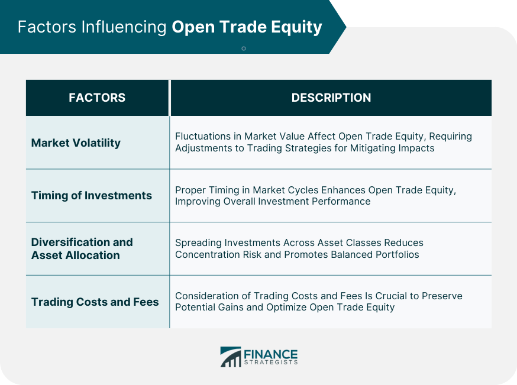

## Table of Contents

## What is Open Trade Equity?

Open Trade Equity, often abbreviated as OTE, is the unrealized profit or loss in a trading account from positions that have not yet been closed. It represents the difference between the current market value of an open position and the price at which the position was opened. For example, if you bought a stock at $50 and it's now worth $60, your OTE would be a $10 profit per share. However, this profit is only on paper until you sell the stock.

Understanding OTE is important for traders because it helps them assess the performance of their current investments without actually selling them. It can influence decisions about whether to hold onto a position in hopes of further gains or to cut losses if the market moves against them. OTE can change constantly as market prices fluctuate, so it's a dynamic measure that traders need to keep an eye on.

## How is Open Trade Equity calculated?

Open Trade Equity is calculated by figuring out the difference between the price you bought something at and its current price in the market. If you bought a stock for $100 and it's now worth $120, your Open Trade Equity would be $20 for each share you own. This $20 is what you would gain if you sold the stock at that moment. But, if the stock's price dropped to $90, your Open Trade Equity would be a loss of $10 per share.

This calculation is done for all the open positions in your trading account. If you have multiple stocks or other investments, you add up the Open Trade Equity for each one to get your total Open Trade Equity. It's important to remember that this number changes all the time because market prices are always moving. So, your Open Trade Equity today might be different tomorrow.

## Why is Open Trade Equity important for traders?

Open Trade Equity is important for traders because it shows them how much money they could make or lose right now if they sold their investments. It's like a sneak peek at their possible profit or loss without actually selling anything. This helps traders see if their choices are working out or if they need to make changes. For example, if a trader sees that their Open Trade Equity is going up, it might mean their stock picks are doing well, and they might decide to keep holding onto them.

Also, Open Trade Equity helps traders manage their risk. If a trader notices that their Open Trade Equity is dropping a lot, it might be a sign to sell and cut their losses before they get even bigger. This way, traders can make smart decisions about when to hold onto their investments and when to let them go. Keeping an eye on Open Trade Equity helps traders stay on top of their game and make the best choices for their money.

## Can you explain the difference between Open Trade Equity and Realized Profit?

Open Trade Equity is the money you could make or lose right now if you sold your investments. It's like a guess of how much you might gain or lose, but it's not real until you actually sell. For example, if you bought a stock for $50 and it's now worth $60, your Open Trade Equity would be $10 per share. But if the stock price goes down to $40, your Open Trade Equity would be a loss of $10 per share. This number changes all the time because the market is always moving.

Realized Profit, on the other hand, is the actual money you make or lose when you sell your investments. It's real because you've done the trade and the money is in your account. If you bought a stock for $50 and sold it for $60, your Realized Profit would be $10 per share. Once you sell, your Open Trade Equity turns into Realized Profit or Realized Loss. So, Open Trade Equity is what you could make or lose right now, and Realized Profit is what you actually made or lost after selling.

## How does Open Trade Equity affect margin requirements?

Open Trade Equity can change how much money you need to keep in your trading account, which is called the margin requirement. When you trade on margin, you borrow money from your broker to buy investments. If your Open Trade Equity goes up, it means your investments are doing well, and you might need less money in your account to cover the margin because the value of your investments is higher.

But if your Open Trade Equity goes down, it means your investments are not doing as well, and you might need to put more money into your account to meet the margin requirement. This is because the value of your investments is lower, and the broker wants to make sure you have enough money to cover the loan they gave you. So, keeping an eye on your Open Trade Equity is important because it can affect how much money you need to keep in your account to keep trading.

## What impact does Open Trade Equity have on portfolio management?

Open Trade Equity helps people who manage their investments, or portfolios, see how their choices are doing without selling anything. It shows them the money they could make or lose right now if they sold their investments. This helps them decide if they should keep their investments or sell them. For example, if the Open Trade Equity is going up, it might mean their choices are good, and they might want to keep holding onto their investments. If it's going down, they might need to think about selling to avoid losing more money.

Keeping an eye on Open Trade Equity also helps people manage their whole set of investments better. They can see which parts of their portfolio are doing well and which parts are not. This can help them decide where to put more money or where to take money out. For instance, if one stock is doing really well and has a high Open Trade Equity, they might decide to invest more in that stock. On the other hand, if another stock is doing poorly, they might sell it to cut their losses. By watching Open Trade Equity, people can make smarter choices about their investments and keep their portfolio in good shape.

## How can Open Trade Equity be used to assess trading strategy performance?

Open Trade Equity is a useful tool for figuring out how well a trading strategy is working. By looking at the Open Trade Equity, traders can see if their strategy is making money or losing money without actually selling their investments. If the Open Trade Equity is going up, it means the strategy might be working well because the value of the investments is increasing. But if the Open Trade Equity is going down, it could mean the strategy needs to be changed because the investments are losing value.

Traders can also compare the Open Trade Equity of different strategies to see which one is doing better. For example, if a trader has two different strategies and one has a higher Open Trade Equity, it might be a sign to focus more on that strategy. By keeping an eye on Open Trade Equity over time, traders can make smart decisions about whether to stick with their current strategy or try something new. This helps them improve their trading and make more money in the long run.

## What are common strategies to manage Open Trade Equity?

One common way to manage Open Trade Equity is by setting stop-loss orders. This means telling your trading platform to sell an investment if it drops to a certain price. This helps you limit how much money you could lose. If your Open Trade Equity is going down a lot, a stop-loss order can help you sell before the loss gets too big. Another strategy is to take profits when your Open Trade Equity is high. If you see that your investments are doing really well, you might decide to sell some of them to lock in the profit.

Another approach is to use a trailing stop. This is like a stop-loss order, but it moves up as the price of your investment goes up. This way, you can keep some of the gains if the price keeps going up, but you can also sell if the price starts to drop. Diversifying your investments is also a good idea. By spreading your money across different types of investments, you can balance out the ups and downs of your Open Trade Equity. If one investment is doing poorly, another might be doing well, which can help keep your overall Open Trade Equity more stable.

## How does volatility affect Open Trade Equity?

Volatility means how much the price of something goes up and down. When the market is very volatile, the price of your investments can change a lot in a short time. This can make your Open Trade Equity go up and down a lot too. If the price of your investment goes up quickly, your Open Trade Equity will go up, showing a bigger possible profit. But if the price drops quickly, your Open Trade Equity will go down, showing a bigger possible loss. So, when the market is very volatile, you need to watch your Open Trade Equity more closely because it can change a lot.

Because of this, traders often use strategies to manage their Open Trade Equity during volatile times. They might set stop-loss orders to sell their investments if the price drops too much, which can help limit how much they could lose. Or they might take profits when their Open Trade Equity is high, to lock in the money they've made. By keeping an eye on their Open Trade Equity and using these strategies, traders can handle the ups and downs that come with a volatile market.

## Can Open Trade Equity be negative, and what does that signify?

Yes, Open Trade Equity can be negative. This happens when the current price of your investment is lower than the price you paid for it. For example, if you bought a stock for $50 and it's now worth $40, your Open Trade Equity would be a negative $10 per share. This negative number shows how much money you would lose if you sold the investment right now.

A negative Open Trade Equity means you're currently losing money on paper. It's a sign that your investment isn't doing well at the moment. Traders need to watch their Open Trade Equity closely, especially if it's negative, because it can help them decide whether to keep holding onto the investment, hoping it will go back up, or to sell it to cut their losses before they get even bigger.

## How do different types of financial instruments influence Open Trade Equity?

Different types of financial instruments can affect Open Trade Equity in various ways because each type has its own way of moving in the market. For example, stocks can be very up and down, especially if they are from smaller companies or industries that change a lot. This means your Open Trade Equity for stocks might go up and down a lot too. On the other hand, bonds are usually more stable, so the Open Trade Equity for bonds might not change as much. Options and futures are different because they have an expiration date, which can make their prices change a lot as that date gets closer, leading to bigger swings in Open Trade Equity.

Also, some financial instruments like mutual funds and ETFs (exchange-traded funds) hold a bunch of different investments inside them. This can make your Open Trade Equity for these instruments more stable because the ups and downs of different investments can balance each other out. But if the whole market is going down, your Open Trade Equity for these can still go down too. Understanding how different types of financial instruments work can help you guess how your Open Trade Equity might change and make better choices about what to invest in.

## What advanced techniques can be used to optimize Open Trade Equity in algorithmic trading?

In [algorithmic trading](/wiki/algorithmic-trading), one advanced technique to optimize Open Trade Equity is using [machine learning](/wiki/machine-learning) algorithms. These algorithms can look at a lot of data from the past to find patterns and make guesses about how the market might move in the future. By using this information, traders can make better choices about when to buy or sell investments. This can help keep Open Trade Equity higher because the algorithms can find good times to trade that a person might miss.

Another technique is using risk management strategies like dynamic position sizing. This means changing how much money you put into each trade based on how risky it is and how the market is doing. If the market is very up and down, you might put less money into each trade to keep your Open Trade Equity from going down too much. On the other hand, if the market is stable and your strategy is working well, you might put more money into trades to try to make more money. By doing this, you can keep your Open Trade Equity more stable and maybe even make it grow.

## What is Open Trade Equity (OTE)?

Open Trade Equity (OTE) refers to the unrealized gain or loss on open derivative positions, representing the variance between the current market value of these positions and their original cost. Fundamentally, OTE offers traders a dynamic reflection of their financial standing with respect to active trades, enabling them to gauge prospective profit or loss. 

Mathematically, OTE can be expressed as:

$$
\text{OTE} = (\text{Current Market Price} - \text{Initial Price}) \times \text{Number of Contracts}
$$

This calculation provides a quantitative measure of the economic outcome if the positions were to be closed immediately at current market prices. By monitoring OTE, traders are equipped with real-time insights, allowing them to assess the profitability of their trading activities. This is particularly essential as financial markets are inherently volatile, making constant evaluation a necessity.

In practice, a trader with a positive OTE can anticipate a profit from closing their positions under current market conditions, whereas a negative OTE forecasts a potential loss. This anticipation aids traders in making more informed decisions about whether to maintain, augment, or diminish their positions. In both manual and automated trading, consistently tracking OTE ensures that traders can adapt their strategies promptly in response to market fluctuations, optimizing their chances for financial success.

## What is the importance of OTE in trading?

Open Trade Equity (OTE) plays a crucial role in trading by providing traders with valuable information for managing risks associated with open positions. Risk management is a cornerstone of successful trading, and understanding OTE allows traders to gauge the potential profitability or risks of their open positions. This knowledge enables traders to make informed decisions about whether to hold onto a position in hopes of further gains or to liquidate it to lock in profits or cut losses. 

In margin trading, where borrowed funds are used to increase the potential return of an investment, maintaining an awareness of OTE is particularly important. This is because OTE directly impacts the available equity in a trader’s account. The formula for calculating available margin is:

$$
\text{Available Margin} = \text{Account Equity} - \text{Used Margin}
$$

Here, account equity includes OTE. If a trader's OTE is positive, it increases overall equity, thus expanding the available margin for further trades. Conversely, a negative OTE diminishes equity and restricts available margin, potentially leading to margin calls where the trader must deposit additional funds to maintain the position.

A positive OTE suggests a potential profit, thereby influencing a trader's decision to continue holding the position in anticipation of even greater returns. Alternatively, a negative OTE indicates impending losses, prompting traders to reassess their strategies. Traders may choose to liquidate positions to prevent further losses, especially if the market displays unfavorable trends.

The importance of OTE is further magnified in volatile markets, where rapid price fluctuations can significantly alter the value of open positions. By closely monitoring OTE, traders can swiftly respond to changing market conditions, optimizing their decision-making process to safeguard their investments and maximize returns.

In summary, OTE provides real-time insights into the status of open positions, serving as a guide for risk management and strategic decision-making in trading. Its significance in margin trading underscores the need for traders to consistently track their OTE to maintain effective control over their portfolios.

## What are examples of OTE?

### Examples of OTE

**Example 1**: Consider a trader who purchases shares of a company at a price of $50 per share. If the market price increases to $60, the trader's Open Trade Equity (OTE) becomes positive. This OTE, representing the unrealized gain, is calculated by the formula:

$$
\text{OTE} = (\text{Current Price} - \text{Purchase Price}) \times \text{Number of Shares}
$$

Suppose the trader bought 100 shares. The OTE would be:

$$
\text{OTE} = (60 - 50) \times 100 = \$1,000
$$

This indicates the potential profit of $1,000 before any positions are closed and actual gains are realized.

**Example 2**: In another scenario, a trader takes a short position by borrowing and selling 100 shares of a stock at an initial price of $70, expecting the price to decline. Instead, if the stock price increases to $80, the Open Trade Equity becomes negative, signaling potential losses. The OTE in this case is calculated as:

$$
\text{OTE} = (\text{Initial Price} - \text{Current Price}) \times \text{Number of Shares}
$$

Substituting the values:

$$
\text{OTE} = (70 - 80) \times 100 = -\$1,000
$$

A negative OTE of $1,000 warns the trader that unless the position is managed promptly, such as by buying back the shares at a more advantageous price, the losses could be realized. These examples highlight the importance of monitoring OTE to make informed trading decisions.

## References & Further Reading

[1]: Bergstra, J., Bardenet, R., Bengio, Y., & Kégl, B. (2011). ["Algorithms for Hyper-Parameter Optimization."](https://papers.nips.cc/paper/4443-algorithms-for-hyper-parameter-optimization) Advances in Neural Information Processing Systems 24.

[2]: ["Advances in Financial Machine Learning"](https://www.amazon.com/Advances-Financial-Machine-Learning-Marcos/dp/1119482089) by Marcos Lopez de Prado

[3]: ["Evidence-Based Technical Analysis: Applying the Scientific Method and Statistical Inference to Trading Signals"](https://www.amazon.com/Evidence-Based-Technical-Analysis-Scientific-Statistical/dp/0470008741) by David Aronson

[4]: ["Machine Learning for Algorithmic Trading"](https://github.com/stefan-jansen/machine-learning-for-trading) by Stefan Jansen

[5]: ["Quantitative Trading: How to Build Your Own Algorithmic Trading Business"](https://www.amazon.com/Quantitative-Trading-Build-Algorithmic-Business/dp/1119800064) by Ernest P. Chan