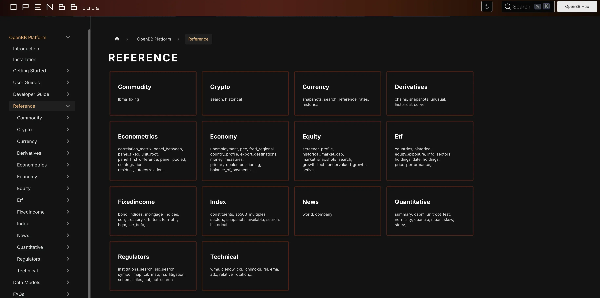

In recent years, algorithmic trading has gained significant ground in the financial markets. This sophisticated form of trading employs computer algorithms to automate and optimize trading decisions, allowing for rapid execution of orders based on pre-established criteria. As technology continues to evolve, traders and investors are in constant pursuit of efficient tools to enhance their trading strategies, aiming to achieve better outcomes and minimize human error.

Among the platforms that have emerged to cater to this need, OpenBB has become a notable player in algorithmic trading. OpenBB stands out as an innovative, open-source investment research platform designed for both individual traders and institutional investors. Its focus on transparency and community-driven development ensures that it meets the diverse needs of its users, supporting a wide range of financial instruments and markets.



This article explores the role of OpenBB in algorithmic trading, delving into the platform's features, benefits, and use cases. By utilizing OpenBB, traders can access a comprehensive suite of analytical tools, data integration capabilities, and machine learning algorithms, all of which contribute to refined trading strategies and methodologies. We will cover how OpenBB's real-time data processing and backtesting functionalities empower traders to make more informed and effective trading decisions.

As algorithmic trading continues to reshape the financial landscape, OpenBB offers a cost-effective and flexible solution that encourages collaboration and knowledge sharing within the trading community. With regular updates and improvements driven by its dynamic user base, traders are encouraged to explore OpenBB's potential to enhance their trading strategies further.

## Table of Contents

## What is Algorithmic Trading?

Algorithmic trading refers to the use of computer algorithms to automate the process of trading financial instruments. These algorithms execute trades at high speeds and frequencies based on predefined criteria. This automation allows traders to make swift decisions, enhancing the ability to capitalize on market opportunities that may be missed with manual trading methods. By minimizing human error, algorithmic trading optimizes performance, reducing the influence of emotions and hasty judgment calls. 

The surge in technological advancements has significantly increased the popularity of algorithmic trading across financial markets. Algorithms can process vast quantities of data rapidly and execute trades within milliseconds, offering traders a competitive edge over traditional methods. This ability to handle large volumes of data allows algorithms to detect trends and execute trades more efficiently. 

Traders can customize these algorithms to align with their specific trading strategies, whether they are based on technical analysis, quantitative models, or statistical [arbitrage](/wiki/arbitrage). For instance, a simple moving average crossover strategy can be coded with the following Python snippet:

```python
# Example of moving average crossover strategy in Python
import numpy as np
import pandas as pd

# Simulated data
data = {'Price': [110, 115, 118, 125, 130, 128, 140]}
df = pd.DataFrame(data)

# Define short and long moving averages
short_window = 3
long_window = 5

# Calculate moving averages
df['Short_MA'] = df['Price'].rolling(window=short_window, min_periods=1).mean()
df['Long_MA'] = df['Price'].rolling(window=long_window, min_periods=1).mean()

# Generate signals where short MA crosses long MA
df['Signal'] = 0
df['Signal'][short_window:] = np.where(df['Short_MA'][short_window:] > df['Long_MA'][short_window:], 1.0, -1.0)

# Trade signals
df['Position'] = df['Signal'].diff()

print(df)
```

This flexibility allows traders to refine and test their strategies rigorously, often through [backtesting](/wiki/backtesting) against historical data to assess their viability. In summary, [algorithmic trading](/wiki/algorithmic-trading) provides traders with the tools required to effectively navigate the fast-paced and complex financial markets, making it an indispensable component of modern trading strategies.

 to OpenBB

OpenBB is an innovative open-source platform designed to revolutionize investment research and analysis. It offers a suite of robust tools that facilitate data analysis and trading, making it an attractive option for both individual traders and institutional investors. Central to its design is an emphasis on accessibility, ensuring both novice and experienced users can effectively interact with its functionalities. By focusing on transparency and community-driven development, OpenBB presents itself as a flexible and adaptable resource for users looking to refine their trading strategies.

One key aspect of OpenBB is its ability to support a broad array of financial instruments and markets. This versatility allows users to conduct comprehensive analyses across various asset classes, enhancing the decision-making process. The open-source nature of the platform encourages a collaborative environment where users contribute to the platform's development, improving features and expanding its capabilities. As a result, OpenBB continuously evolves, incorporating the latest technological advancements to stay relevant in the fast-paced world of financial markets.

## Key Features of OpenBB in Algo Trading

OpenBB provides a comprehensive suite of analytical tools designed to enhance algorithmic trading strategies. One of the platform's prominent features is its robust data integration capabilities, which support various data sources, including real-time market data, historical prices, and fundamental financial metrics. This versatility allows traders to compile a rich dataset crucial for developing and refining trading algorithms.

Leveraging [machine learning](/wiki/machine-learning) algorithms is an integral part of OpenBB's offering. Users can implement models to identify patterns and predict market movements, thereby enhancing their trading models. For instance, using Python, a popular programming language for data science, users can integrate machine learning libraries like TensorFlow or scikit-learn to develop predictive models. Below is a sample code snippet demonstrating the use of a simple linear regression model in Python to predict stock prices:

```python
import numpy as np
from sklearn.model_selection import train_test_split
from sklearn.linear_model import LinearRegression

# Sample data
X = np.array([[1], [2], [3], [4], [5]])
y = np.array([2, 4, 6, 8, 10])

# Splitting the data into training and testing
X_train, X_test, y_train, y_test = train_test_split(X, y, test_size=0.2, random_state=42)

# Creating a linear regression model
model = LinearRegression()
model.fit(X_train, y_train)

# Predicting on test data
predictions = model.predict(X_test)
print(predictions)
```

Backtesting is another crucial feature of OpenBB, allowing traders to validate their strategies against historical data. This functionality helps in assessing the viability and performance of trading algorithms before deploying them in live markets. The platform's backtesting tools enable users to refine their algorithms by running simulations, analyzing results, and adjusting parameters to optimize returns.

Moreover, OpenBB supports real-time data processing, which is essential for making accurate and timely trading decisions. The ability to process data as it becomes available ensures that traders can react promptly to market changes, maximizing their trading opportunities. Real-time data processing, combined with advanced machine learning models, positions OpenBB as a powerful tool for traders looking to optimize their algorithmic trading strategies.

## Benefits of Using OpenBB for Algo Trading

OpenBB, as an open-source platform, provides significant benefits for algorithmic trading, primarily due to its transparency and flexibility. Being open-source allows users to review and modify the code, adapting the platform to meet their specific needs and ensuring there are no hidden processes affecting their trading decisions. This openness fosters trust and enables users to customize and optimize trading strategies without the constraints often imposed by proprietary systems.

One of the key advantages of OpenBB is its cost-effectiveness. Unlike many proprietary trading platforms that require extensive licensing fees, OpenBB is freely available, making it accessible to a broader range of traders, from individual hobbyists to small firms. This affordability allows users to allocate resources towards developing strategies and research rather than paying for costly software licenses.

OpenBB also encourages collaboration and knowledge sharing within the trading community. Being community-driven, the platform promotes an environment where traders and developers share insights, tools, and strategies. This collaborative atmosphere accelerates innovation and solves common algorithmic trading challenges more efficiently, benefiting all users who participate in the community.

The dynamic community surrounding OpenBB ensures regular updates and improvements. Unlike static proprietary platforms, OpenBB is continuously evolving with contributions from developers worldwide. This ongoing development means that OpenBB can rapidly adapt to new market conditions and technological advancements, providing users with state-of-the-art tools and features.

Moreover, OpenBB's design ensures accessibility even for those without extensive coding experience. Users can leverage advanced analytical and trading tools without needing to write complex code. However, for those with programming skills, OpenBB's framework offers the flexibility to delve deeper into customization. The platform supports various programming languages, including Python, enabling users to integrate machine learning models, perform extensive data analysis, and run sophisticated backtests with ease.

Overall, OpenBB's open-source nature, community-driven development, and flexibility make it an attractive choice for traders looking to enhance their algorithmic trading strategies. By lowering entry barriers and fostering a collaborative environment, it empowers users to achieve better trading outcomes while minimizing costs and complexity.

## Real-World Applications and Case Studies

OpenBB has gained traction among traders seeking to enhance the efficiency and precision of their trading operations. Its adoption worldwide is a testament to its functionality and flexibility, contributing to notable improvements in algorithmic trading.

Multiple case studies highlight how users have leveraged OpenBB to optimize trading strategies. For instance, traders have reported significant time savings and accuracy improvements by automating repetitive tasks that were previously performed manually. The ability to run complex simulations using historical data for backtesting has allowed traders to refine algorithms and reduce risk exposure in live markets.

OpenBB's platform supports tailoring strategies to individual trading needs. Algorithms can be adapted to different asset classes, risk profiles, and market conditions, providing personalized improvements for users. One practical application involved a trader developing a [momentum](/wiki/momentum)-based trading strategy to identify and act on short-term price movements. By continuously refining the algorithm using OpenBB's tools, the trader saw enhanced execution speed and consistency in capturing profitable trades.

Successful deployments of algorithmic trades underscore OpenBB's capabilities. A notable example involves a trading firm that integrated machine learning models into OpenBB to predict stock price movements with increased accuracy. By incorporating sentiment analysis and real-time data feeds, the firm's algorithms executed timely trades that yielded significant returns, demonstrating OpenBB's ability to facilitate advanced trading strategies.

Community contributions are a key aspect of OpenBB's platform, fostering an environment of collaboration and innovation. Users frequently contribute custom modules and enhancements that extend the platform's functionality. This collective effort has led to the development of specialized features, such as advanced charting tools and data visualization services, which benefit the entire user community. These contributions not only improve OpenBB but also provide valuable resources and inspiration for other traders seeking to advance their trading methodologies.

In summary, OpenBB's adoption across diverse trading environments and the documented case studies illustrate its effectiveness in augmenting trading operations. From personalized strategy development to successful algorithmic executions, OpenBB continues to play a pivotal role in the evolution of algorithmic trading. The platform's community-driven enhancements further solidify its position as a valuable resource in the trading ecosystem.

## How to Get Started with OpenBB in Algo Trading

To get started with OpenBB in algorithmic trading, the initial step is downloading and installing the software. OpenBB can be found on its official repository, typically hosted on platforms like GitHub. Users should follow these simple steps:

1. **Download and Installation**:  
   Navigate to the OpenBB repository and download the latest version of the software. OpenBB is generally available as a package compatible with various operating systems, ensuring cross-platform functionality. For those using Python, installing OpenBB can be done via pip, a package manager for Python. Use the following command in your terminal or command prompt:  
   ```bash
   pip install openbb
   ```
   Ensure that all dependencies are installed to prevent errors during operation.

2. **Navigating the Platform’s Interface**:  
   After installation, launch OpenBB to explore its interface. OpenBB usually comes with a graphical user interface (GUI) that is user-friendly and intuitive. Familiarize yourself with the layout, including various tabs for data import, analysis tools, and visualization options.

3. **Setting Up and Customizing Trading Algorithms**:  
   OpenBB offers a framework where users can create and modify trading algorithms. Start by accessing pre-built algorithms and templates, which offer a foundation to build upon. Users can write custom scripts in Python to define specific trading criteria and actions. The use of libraries such as `pandas` for data manipulation or `numpy` for numerical calculations is common. A simple trading strategy might look like this:  
   ```python
   import pandas as pd
   import numpy as np

   # Sample data
   prices = pd.Series([...])  # fill in with actual price data

   # Simple Moving Average Strategy
   short_window = 40
   long_window = 100

   signals = pd.DataFrame(index=prices.index)
   signals['signal'] = 0.0

   # Generate signals when the short moving average crosses the long moving average
   signals['short_mavg'] = prices.rolling(window=short_window, min_periods=1).mean()
   signals['long_mavg'] = prices.rolling(window=long_window, min_periods=1).mean()

   signals['signal'][short_window:] = np.where(
       signals['short_mavg'][short_window:] > signals['long_mavg'][short_window:], 1.0, 0.0)

   signals['positions'] = signals['signal'].diff()

   # signals['positions'] shows where buy/sell actions should happen
   ```
   This script introduces a simple moving average strategy, indicating buy/sell signals based on the crossover of two moving averages.

4. **Resources for Mastery**:  
   OpenBB provides a range of resources for users at different expertise levels. Beginners can access tutorials and documentation that cover fundamental aspects of the platform. As users become more comfortable, advanced guides detailing algorithm optimization and data integration techniques are available. Having a grounding in Python and finance can significantly enhance a user's ability to exploit OpenBB’s full capabilities.

5. **Community Forums and Support**:  
   An active community supports OpenBB, providing forums that are instrumental for troubleshooting, sharing insights, and collaborative development. Platforms like Discord, Reddit, or dedicated OpenBB forums are valuable. Engaging with the community can provide solutions to specific challenges and the opportunity to contribute to the ongoing development of OpenBB.

Embarking on algorithmic trading with OpenBB involves an initial investment in learning the software's core functionalities, after which users can realize its various benefits, such as customizability and real-time data analysis. As traders progress, the supportive community and abundant resources are critical assets for refining and enhancing trading strategies.

## Conclusion

OpenBB stands out as a valuable tool in algorithmic trading. Its open-source nature and community support enhance its accessibility, making it an attractive choice for beginner and experienced traders. This open-source model fosters transparency and continuous development, as users can contribute to and customize the platform to suit their specific needs.

As financial markets evolve, the adaptive nature of OpenBB ensures it remains relevant and responsive to new trading needs and strategies. The platform's ability to integrate with various data sources and support real-time data processing is crucial in today’s fast-paced trading environment, enabling users to make quicker and more informed decisions.

The future of algorithmic trading looks promising, with platforms like OpenBB leading the way. These platforms offer advanced analytical tools and machine learning capabilities that can significantly enhance trading strategies. The emphasis on community-driven development means OpenBB benefits from collective expertise and ongoing updates, ensuring it stays at the forefront of technology.

Traders are encouraged to explore OpenBB's potential to enhance their trading strategies. With its robust features, cost-efficiency, and flexible customization options, OpenBB presents an opportunity to optimize trading performance effectively. As trading continues to embrace technological advancements, tools like OpenBB are set to play a pivotal role in shaping the future of algorithmic trading.

## References & Further Reading

[1]: Bergstra, J., Bardenet, R., Bengio, Y., & Kégl, B. (2011). ["Algorithms for Hyper-Parameter Optimization."](https://papers.nips.cc/paper/4443-algorithms-for-hyper-parameter-optimization) Advances in Neural Information Processing Systems 24.

[2]: ["Advances in Financial Machine Learning"](https://www.amazon.com/Advances-Financial-Machine-Learning-Marcos/dp/1119482089) by Marcos Lopez de Prado

[3]: ["Evidence-Based Technical Analysis: Applying the Scientific Method and Statistical Inference to Trading Signals"](https://www.amazon.com/Evidence-Based-Technical-Analysis-Scientific-Statistical/dp/0470008741) by David Aronson

[4]: ["Machine Learning for Algorithmic Trading"](https://github.com/PacktPublishing/Machine-Learning-for-Algorithmic-Trading-Second-Edition) by Stefan Jansen

[5]: ["Quantitative Trading: How to Build Your Own Algorithmic Trading Business"](https://books.google.com/books/about/Quantitative_Trading.html?id=j70yEAAAQBAJ) by Ernest P. Chan