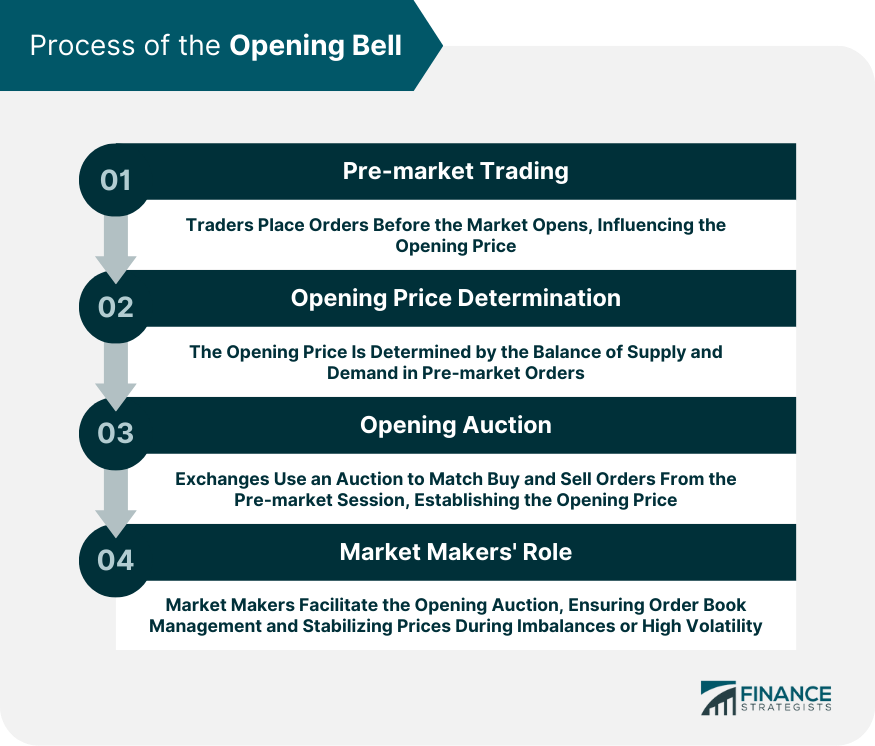

## Table of Contents

## What is the opening bell in the context of stock exchanges?

The opening bell is a ceremony that marks the start of the trading day on a stock exchange. It happens at a specific time each day, like 9:30 AM for the New York Stock Exchange. When the bell rings, it signals to everyone that they can start buying and selling stocks. This tradition helps to create a sense of order and excitement at the beginning of the trading day.

Sometimes, special guests or celebrities are invited to ring the opening bell. This can be to celebrate a company's milestone, like an anniversary or a new product launch, or to raise awareness for a cause. Even though the actual trading is now done electronically, the opening bell ceremony remains an important symbol of the stock market's daily activities.

## Why is the opening bell significant for traders and investors?

The opening bell is important for traders and investors because it tells them when they can start trading. It's like a starting whistle for a game. When the bell rings, everyone knows it's time to buy or sell stocks. This helps keep the market organized and fair, so everyone has the same chance to make trades at the start of the day.

Also, the opening bell can set the mood for the day. If the market opens strong, it might make people feel confident and more likely to invest. On the other hand, if it opens weak, people might be more cautious. Watching the opening bell can give traders and investors clues about how the market might behave throughout the day.

## How does the opening bell affect stock prices and market activity?

The opening bell can have a big impact on stock prices and how busy the market is. When the bell rings, it's like the start of a race. Everyone starts trading at the same time, which can cause a lot of activity. If there are a lot of people wanting to buy a stock, its price might go up quickly. On the other hand, if many people want to sell, the price might go down. This rush of activity at the opening can set the tone for the rest of the day.

Sometimes, news or events that happen before the market opens can affect how the market reacts when the bell rings. For example, if a company announces good news before the market opens, its stock might jump in price right when trading starts. This can lead to more trading and higher prices. The opening bell is important because it's the first chance for everyone to react to any new information, and this can make the market very active and exciting right from the start.

## What is the typical timing of the opening bell in major stock exchanges?

The opening bell times can be different for each stock exchange, but they usually happen at the same time every day. For the New York Stock Exchange (NYSE) and the NASDAQ, which are big stock exchanges in the United States, the opening bell rings at 9:30 AM Eastern Time. This means that people in New York and other places in the same time zone start trading at that time.

In other parts of the world, the opening bell times are different because of time zones. For example, the London Stock Exchange opens at 8:00 AM local time, which is 3:00 AM Eastern Time in the U.S. The Tokyo Stock Exchange starts trading at 9:00 AM local time, which is 8:00 PM Eastern Time the day before in the U.S. So, the opening bell helps everyone know when to start trading, no matter where they are.

## What ceremonies or events are often associated with the opening bell?

The opening bell at stock exchanges often comes with special ceremonies or events. Sometimes, famous people or important guests are invited to ring the bell. This can be to celebrate something special, like a company's birthday or a new product. It can also be to help people learn about important causes, like helping the environment or supporting a charity. These events make the opening bell more exciting and can bring more attention to the stock exchange.

Another common event is when a company goes public for the first time. This is called an Initial Public Offering (IPO). When a company has an IPO, they might have a big ceremony at the stock exchange. The company's leaders and sometimes their employees come to ring the opening bell. This is a big moment for the company because it means their stock is now available for anyone to buy and sell. These ceremonies help make the opening bell a special and memorable event.

## How does the process of the opening bell work technically on the trading floor?

When the opening bell rings, it's not just a sound; it's a signal that tells everyone on the trading floor that it's time to start trading. Before the bell, there's a lot of preparation. Traders and their teams get ready by looking at the latest news, checking their orders, and making sure everything is set up. When the clock hits the right time, like 9:30 AM for the NYSE, someone pushes a button or pulls a lever to make the bell ring. This can be done by a special guest or a member of the exchange. The sound of the bell goes through speakers all over the trading floor, so everyone can hear it clearly.

Once the bell rings, the trading starts right away. Computers and electronic systems take over, matching buy and sell orders very quickly. Even though the bell is a tradition, the actual trading happens electronically. Traders watch their screens closely to see how prices are moving and to make their trades. The opening bell helps everyone start at the same time, which keeps things fair and organized. It's like the starting gun at a race, making sure everyone knows when to go.

## What are the differences in the opening bell process between electronic and traditional trading platforms?

On traditional trading platforms, like the New York Stock Exchange, the opening bell is a big event. Someone, often a special guest, rings the bell at a set time, like 9:30 AM. This bell is a signal for everyone on the trading floor to start trading. Traders and their teams get ready before the bell, checking news and orders. When the bell rings, it's loud and clear through speakers, and everyone knows it's time to start. Even though the bell is a tradition, the actual trading happens electronically, with computers matching buy and sell orders quickly.

On electronic trading platforms, the opening bell is more of a digital event. There's no physical bell to ring, but there's still a set time when trading starts. For example, on the NASDAQ, which is fully electronic, the opening bell might be shown on a screen or announced online. Traders get ready the same way, but instead of a trading floor, they're often working from computers at home or in an office. When the time comes, the system automatically starts matching orders, and trading begins without any physical bell. Both types of platforms use technology to handle trades, but the traditional ones keep the bell as a symbol of the start of the trading day.

## How do market makers and specialists prepare for the opening bell?

Market makers and specialists get ready for the opening bell by doing a lot of work before the market opens. They look at all the orders that came in overnight and during the pre-market session. They check if there are more people wanting to buy or sell a stock. This helps them figure out what the opening price should be. They also watch the news to see if anything big happened that might affect the stock prices. All this preparation helps them be ready to match buyers and sellers as soon as the bell rings.

When the opening bell rings, market makers and specialists start their job right away. They use computers to quickly match buy and sell orders. Their goal is to keep the market fair and smooth. If there are more buyers than sellers, they might have to sell some of their own stock to keep the price from going too high. If there are more sellers, they might buy some stock to keep the price from dropping too low. This helps make sure the market opens in a balanced way and everyone can start trading fairly.

## What strategies do traders use in anticipation of the opening bell?

Traders get ready for the opening bell by looking at what happened in the market the night before and any news that might affect stock prices. They check if there are more people wanting to buy or sell a stock. This helps them decide if they want to buy or sell right when the market opens. Some traders might set up orders to buy or sell at the opening price, hoping to get a good deal before the price changes too much. They also watch the pre-market session to see how stocks are moving before the official start of trading.

Once the bell rings, traders act fast. They might use strategies like trying to buy a stock at a low price and sell it quickly if the price goes up. Or they might sell a stock right away if they think the price will drop. Some traders use what's called "[momentum](/wiki/momentum) trading," where they follow the trend of the stock right after the opening bell. They hope to make money by riding the wave of the stock's price movement at the start of the day. All these strategies help traders take advantage of the rush and excitement that happens when the market opens.

## How can the opening bell impact the volatility of the market?

The opening bell can make the market more exciting and unpredictable. When the bell rings, it's like the start of a race. Everyone wants to buy and sell stocks at the same time, which can make prices move a lot. If there are more people wanting to buy than sell, the price can go up quickly. If more people want to sell, the price can drop fast. This rush of activity right at the start can make the market feel wild and hard to predict.

Also, news or events that happen before the market opens can make the market even more unpredictable when the bell rings. For example, if a company announces good news before the market opens, its stock might jump in price right away. This can make a lot of traders want to buy or sell, making the market move a lot. So, the opening bell can make the market feel like a roller coaster, especially if there's big news to react to.

## What historical events have notably influenced the timing or significance of the opening bell?

The opening bell has been around for a long time, and some big events have changed how important it is. One big event was the stock market crash of 1929. This crash made people think about how the market works and how to make it safer. After that, the opening bell became a symbol of a new start each day, helping to keep things calm and organized. It showed that even after bad times, the market could start fresh every morning.

Another event that changed the opening bell was the switch to electronic trading. In the past, people used to trade stocks by shouting and using hand signals on the trading floor. But with computers, trading became faster and more efficient. Even though the bell is still a tradition, the actual trading happens electronically. This change made the opening bell more of a symbol than a practical signal, but it still helps set the mood for the day and keeps the tradition alive.

## How do global time differences affect the opening bell across different stock exchanges?

The opening bell happens at different times around the world because of time zones. For example, the New York Stock Exchange opens at 9:30 AM Eastern Time. But in London, the stock exchange opens at 8:00 AM local time, which is 3:00 AM Eastern Time in the U.S. And in Tokyo, the stock market starts at 9:00 AM local time, which is 8:00 PM Eastern Time the day before in the U.S. This means that when it's time for the opening bell in one place, it might be the middle of the night or the evening somewhere else.

These different times can affect how traders and investors work. Some traders stay up late or wake up early to trade in markets that open at different times. They do this to take advantage of news or events that happen in one part of the world before the market opens in another. For example, if something big happens in Asia, it can affect how the market opens in Europe and then in the U.S. This way, the opening bell in one place can set the stage for what happens when the bell rings in another part of the world.

## References & Further Reading

[1]: Bergstra, J., Bardenet, R., Bengio, Y., & Kégl, B. (2011). ["Algorithms for Hyper-Parameter Optimization."](https://dl.acm.org/doi/10.5555/2986459.2986743) Advances in Neural Information Processing Systems 24.

[2]: ["Advances in Financial Machine Learning"](https://www.amazon.com/Advances-Financial-Machine-Learning-Marcos/dp/1119482089) by Marcos Lopez de Prado

[3]: ["Evidence-Based Technical Analysis: Applying the Scientific Method and Statistical Inference to Trading Signals"](https://www.amazon.com/Evidence-Based-Technical-Analysis-Scientific-Statistical/dp/0470008741) by David Aronson

[4]: ["Machine Learning for Algorithmic Trading"](https://github.com/stefan-jansen/machine-learning-for-trading) by Stefan Jansen

[5]: ["Quantitative Trading: How to Build Your Own Algorithmic Trading Business"](https://www.amazon.com/Quantitative-Trading-Build-Algorithmic-Business/dp/1119800064) by Ernest P. Chan