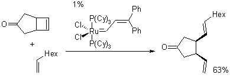

## Table of Contents

## What is an opening cross in the stock market?

An opening cross in the stock market is a process that happens at the start of each trading day. It's when the stock exchange figures out the opening price for a stock. This price is based on all the buy and sell orders that were placed before the market opened. The goal is to find a price that will satisfy as many of these orders as possible.

The opening cross helps make sure that the market opens smoothly. It prevents big jumps or drops in stock prices right at the start of the day. By matching up all the orders and finding a good opening price, it helps keep the market stable and fair for everyone. This process is important because it sets the tone for the rest of the trading day.

## How does the opening cross mechanism work?

The opening cross mechanism starts before the market opens. During this time, people can place orders to buy or sell stocks. These orders are collected and stored by the stock exchange. The exchange looks at all these orders to find a price that will make the most people happy. This price is called the opening price. The exchange tries to match as many buy orders with sell orders as possible at this price.

Once the opening price is set, the market opens, and the trades happen at that price. This helps the market start the day smoothly without big jumps or drops in stock prices. It's important because it makes sure that everyone has a fair chance to trade at the start of the day. By doing this, the opening cross helps keep the market stable and fair for all traders.

## Why is the opening cross important for traders?

The opening cross is important for traders because it sets the first price of the day for stocks. This price is based on all the orders that were placed before the market opened. Traders watch the opening cross closely because it can give them clues about how the stock might move during the day. If the opening price is higher than the last price of the previous day, it might mean that more people want to buy the stock. If it's lower, it might mean more people want to sell.

Knowing the opening price helps traders make better decisions. They can decide if they want to buy or sell a stock right away, or if they should wait and see how the market moves. The opening cross also helps keep the market fair. It makes sure that everyone's orders are considered, so no one gets an unfair advantage at the start of the day. This fairness is important for traders because it helps them trust the market and make their trading plans.

## What are the key components involved in the opening cross?

The opening cross involves several key parts that work together to set the first price of the day for stocks. First, there are the orders that traders place before the market opens. These can be orders to buy or sell stocks, and they are collected by the stock exchange. The exchange looks at all these orders to find a price that will satisfy as many of them as possible. This price is called the opening price.

Once the opening price is decided, the stock exchange matches the buy orders with the sell orders at that price. This matching process is important because it makes sure that the market opens smoothly. It helps prevent big jumps or drops in stock prices right at the start of the day. By doing this, the opening cross helps keep the market fair and stable for everyone, which is important for traders who rely on a predictable start to the trading day.

## Can you explain the process of order matching during an opening cross?

During an opening cross, the stock exchange collects all the orders to buy and sell stocks that traders placed before the market opened. These orders are like requests from traders saying what price they are willing to buy or sell at. The exchange looks at all these orders and tries to find a price where the most orders can be matched. This price is called the opening price. It's like finding a middle ground where a lot of people can agree to trade.

Once the opening price is set, the exchange starts matching the buy orders with the sell orders at that price. If someone wants to buy at the opening price and someone else wants to sell at that price, their orders get matched, and a trade happens. The goal is to match as many orders as possible so that the market can open smoothly. This helps keep the stock prices stable and fair for everyone at the start of the trading day.

## How does the opening cross affect stock prices at the start of trading?

The opening cross helps set the first price of the day for stocks. It looks at all the orders people placed before the market opened and finds a price that works for the most people. This price is called the opening price. If a lot of people want to buy a stock, the opening price might be higher than the last price of the previous day. If more people want to sell, the opening price might be lower. This process helps make sure that the market starts the day smoothly without big jumps or drops in stock prices.

By setting a fair opening price, the opening cross helps keep the market stable. Traders watch this price closely because it can give them hints about how the stock might move during the day. If the opening price is different from the last price of the previous day, it can tell traders if more people want to buy or sell the stock. This information helps traders decide if they should buy or sell right away or wait and see what happens next.

## What are the differences between an opening cross and a closing cross?

The opening cross happens at the start of the trading day. It looks at all the orders people placed before the market opened and finds a price that works for the most people. This price is called the opening price. The goal is to make sure the market starts smoothly without big jumps or drops in stock prices. Traders watch the opening cross because it can give them clues about how the stock might move during the day.

The closing cross happens at the end of the trading day. It's similar to the opening cross, but it looks at all the orders placed during the last part of the trading day. The closing cross finds a price that works for the most people, and this price is called the closing price. This helps make sure the market ends the day smoothly. The closing price is important because it's used to figure out things like daily gains or losses and can affect how people feel about the market the next day.

Both the opening and closing crosses help keep the market fair and stable. They make sure that everyone's orders are considered, so no one gets an unfair advantage at the start or end of the day. This fairness is important for traders because it helps them trust the market and make their trading plans.

## How do exchanges manage volatility during the opening cross?

Exchanges manage volatility during the opening cross by carefully looking at all the orders people placed before the market opened. They try to find a price that works for the most people. This helps keep the market from having big jumps or drops right at the start of the day. By setting a fair opening price, the exchange makes sure that the market starts smoothly and everyone has a chance to trade without sudden changes in stock prices.

Sometimes, if there are a lot of orders and the market might be very volatile, exchanges can use special rules. They might slow down the opening process or use a special auction to find the opening price. This helps them control the market and make sure that the opening price is as fair as possible. By doing this, exchanges can keep the market stable and help traders feel confident about trading at the start of the day.

## What role do market makers play in the opening cross?

Market makers play an important role in the opening cross. They help make sure there are enough buyers and sellers in the market. When the market opens, market makers put in their own orders to buy and sell stocks. This helps the exchange find a good opening price because there are more orders to look at. Market makers also help keep the market stable by being ready to buy or sell stocks at the opening price.

By doing this, market makers help the opening cross go smoothly. They make sure that there are always people willing to trade, even if there aren't a lot of other orders. This is important because it helps keep the stock prices from jumping around too much at the start of the day. Market makers help make the market fair and stable for everyone who wants to trade.

## How can investors use the opening cross to their advantage?

Investors can use the opening cross to their advantage by watching the opening price closely. This price can give them clues about how the stock might move during the day. If the opening price is higher than the last price of the previous day, it might mean more people want to buy the stock. This could be a good time for investors to buy if they think the price will keep going up. On the other hand, if the opening price is lower, it might mean more people want to sell. Investors might see this as a chance to buy the stock at a lower price before it goes up again.

Another way investors can use the opening cross is by placing their orders before the market opens. By doing this, they can help set the opening price and make sure their orders are considered. If they think the stock will go up, they can place a buy order at a price they think is fair. If they think the stock will go down, they can place a sell order. This way, they can start trading right away at the opening price and take advantage of any early movements in the stock price.

## What are some common strategies traders employ during the opening cross?

Traders often use the opening cross to get a head start on the day's trading. One common strategy is to place orders before the market opens. They might decide to buy a stock if they think the opening price will be lower than the last price of the previous day. This way, they can buy the stock at a good price and then sell it later if the price goes up. Another strategy is to watch the opening price closely. If the opening price is higher than expected, traders might see it as a sign that the stock is in demand and decide to buy right away.

Another strategy traders use is to take advantage of any early movements in the stock price. If the stock price jumps up or down right after the market opens, traders might quickly buy or sell to make a profit from these changes. They might also use the opening cross to set up stop-loss orders. These are orders that automatically sell a stock if its price drops to a certain level. This helps traders limit their losses if the stock price goes down after the opening cross.

## How does the technology behind the opening cross ensure fairness and efficiency?

The technology behind the opening cross helps make sure the market is fair and works well by using special computer systems. These systems collect all the orders people place before the market opens. They look at every order to find a price that works for the most people. This way, everyone gets a chance to trade at a fair price. The computers match buy orders with sell orders quickly and correctly, so the market can start the day smoothly without big jumps or drops in stock prices.

These computer systems also help control the market if it might be very busy or if prices might change a lot. They can slow down the opening process or use a special way to find the opening price. This helps keep the market stable and makes sure that the opening price is fair. By doing this, the technology makes sure that everyone can trust the market and trade without worrying about sudden changes at the start of the day.

## References & Further Reading

[1]: ["Advances in Financial Machine Learning"](https://www.amazon.com/Advances-Financial-Machine-Learning-Marcos/dp/1119482089) by Marcos Lopez de Prado

[2]: Bergstra, J., Bardenet, R., Bengio, Y., & Kégl, B. (2011). ["Algorithms for Hyper-Parameter Optimization."](https://dl.acm.org/doi/10.5555/2986459.2986743) Advances in Neural Information Processing Systems 24.

[3]: ["Evidence-Based Technical Analysis: Applying the Scientific Method and Statistical Inference to Trading Signals"](https://www.amazon.com/Evidence-Based-Technical-Analysis-Scientific-Statistical/dp/0470008741) by David Aronson

[4]: ["Machine Learning for Algorithmic Trading"](https://github.com/stefan-jansen/machine-learning-for-trading) by Stefan Jansen

[5]: ["Quantitative Trading: How to Build Your Own Algorithmic Trading Business"](https://www.amazon.com/Quantitative-Trading-Build-Algorithmic-Business/dp/1119800064) by Ernest P. Chan