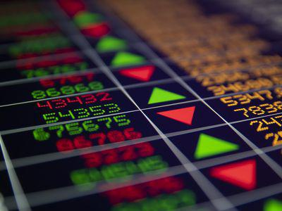

In the ever-evolving world of stock markets, trading strategies play a crucial role in determining success. One critical component of these strategies is the opening cross, a key point in the trading day that often sets the tone for market movements. The opening cross is essentially the process that establishes the opening price of a stock and is characterized by an auction-like phase where buy and sell orders gather and execute at a single price. This initial transaction is pivotal, as it reflects the balance of supply and demand at the market's outset.

With the rise of algorithmic trading, understanding the opening cross trading process has become increasingly essential for market participants. Algorithmic trading, or algo trading, utilizes computer algorithms to execute trades based on pre-defined criteria. This technology-driven approach allows for rapid data analysis and trading decisions, providing an edge in the fast-paced market environment. The integration of algorithmic trading into the opening cross process has transformed how market participants interact with the stock market, optimizing order placements and enhancing trading efficiency.



This article aims to equip traders and investors with the knowledge to optimize their trading strategies by understanding the intricacies of the opening cross and the influence of algorithmic trading. By exploring how technology and trading principles converge in the opening cross trading process, we provide insights that can help traders improve their strategic positions. As the financial markets continue to embrace technological advancements, the fusion of traditional trading methods with modern technology opens new pathways for market participation and success.

## Table of Contents

## Understanding the Opening Cross

The opening cross is a critical component of stock market operations, playing a pivotal role in establishing a stock's opening price before the commencement of regular trading hours. During this auction-like phase, both buy and sell orders accumulate and execute at a determined single price, setting the stage for subsequent market activities. This mechanism is essential for traders aiming to harness potential opportunities presented by early market movements.

The opening cross is fundamentally a balancing act of supply and demand, which together determine the initial opening price. As traders place their orders, the stock exchange's systems collate these to find an equilibrium price that matches the highest number of shares from both buy and sell orders. The price at which this balance occurs becomes the official opening price, significantly influencing market dynamics through the day's trading sessions.

Several factors impact the opening cross, making it a dynamic process. These include pre-market news such as earnings reports or geopolitical developments, overnight events like economic data releases from other time zones, and broader market sentiment reflecting investors' collective outlook. These factors can cause fluctuations in demand and supply, thereby affecting the equilibrium achieved at the opening cross.

Different exchanges may adopt varying methodologies to calculate the opening price. For instance, on the NASDAQ, an electronic trading platform, the opening cross is executed through an electronic auction where pre-market interest is aggregated along with traditional market open orders. Meanwhile, on traditional exchanges like the New York Stock Exchange (NYSE), a designated market maker might play a role in determining the balance price based on accumulated orders.

Understanding the nuances of the opening cross is vital for traders. It allows them to anticipate how early movements in the market might unfold, providing a strategic advantage in timing their trades and optimizing their entry and [exit](/wiki/exit-strategy) points. Consequently, mastering the opening cross can be a valuable asset in any trader's strategy toolkit, guiding their decisions in the fast-paced stock trading landscape.

## Role of Algorithmic Trading in the Opening Cross

Algorithmic trading, or algo trading, has significantly reshaped the interaction between traders and the opening cross by utilizing advanced computational methods to navigate market complexities swiftly and effectively. The essence of algo trading lies in its ability to leverage data-driven strategies, enabling rapid predictions and responses to evolving market conditions. This capability is particularly critical during the opening cross, a key phase in the trading cycle where the opening price of a stock is determined based on accumulated buy and sell orders.

Algorithms fundamentally enhance the trading process by analyzing extensive datasets, which subsequently allows them to execute trades more efficiently than human traders. This efficiency stems from the ability to process information and make decisions at speeds unattainable by humans, ensuring that trades are executed at optimal times to capture the best prices during the opening cross. The capacity to quickly assimilate and interpret a multitude of pre-market indicators—such as overnight news events, global market performances, and economic data—enables algorithms to refine order placements. These adjustments ensure that orders are aligned with the anticipated demand and supply dynamics, thereby enhancing the prospects of executing trades at favorable prices.

In practical terms, algorithms operate by executing complex mathematical models that assess market trends and project future price movements. A Python-based example of a simple algorithm used in this context might include leveraging libraries capable of handling large datasets, such as Pandas for data manipulation and NumPy for numerical calculations. These tools aid in analyzing historical market data to predict potential opening prices and adjusting order strategies accordingly.

```python
import pandas as pd
import numpy as np

# Sample historical market data for prediction
data = pd.read_csv('market_data.csv')

# Calculate historical volatility as an indicator
volatility = np.std(data['close_price'])

# Simple moving average to predict next opening price
data['SMA'] = data['close_price'].rolling(window=5).mean()

# Predictive model to suggest order placement for opening cross
def predict_opening_order(data):
    future_open = data['SMA'].iloc[-1] * (1 + volatility)
    return future_open

predicted_opening_price = predict_opening_order(data)
```

Moreover, the integration of algo trading in the process allows traders to continuously refine their strategies through [backtesting](/wiki/backtesting). This involves running algorithmic strategies against historical data to assess potential outcomes and refine decision-making parameters without financial risk.

The synergy between [algorithmic trading](/wiki/algorithmic-trading) and the opening cross underscores an enhanced method for traders to optimize their strategic positioning. By leveraging algorithmic insights, traders can adapt to and capitalize on pre-market signals, fostering more informed and efficient participation in the opening cross. This interplay not only enhances the accuracy of order executions but also positions traders to take advantage of transient market opportunities that occur at the start of the trading day.

## Benefits of Implementing Algo Trading in the Opening Cross

Implementing algorithmic trading during the opening cross presents several distinct advantages that can significantly enhance trading efficiency and effectiveness. One of the primary benefits is the reduction of human error and emotional decision-making, which often plague manual trading. Algorithms operate based on predefined rules and data-driven methods, ensuring that trading decisions are consistent and objective. This consistency helps in achieving more predictable outcomes, as the trades are executed without the influence of psychological biases that can affect human traders.

Another significant benefit of algorithmic trading is its capability to rapidly adjust to market changes. Unlike human traders who may require time to analyze and respond to evolving market conditions, algorithms can process large volumes of data virtually instantaneously. This quick adaptability allows them to apply complex strategies at scale, maintaining an edge in fast-moving markets where timing is crucial.

Algo trading also enables traders to identify and exploit price discrepancies that could arise during the opening cross. Markets often experience inefficiencies and temporary mispricings during this volatile period, and algorithms can detect these opportunities with precision and react within milliseconds, capturing value that would otherwise be missed.

The increased speed of execution provided by algorithms is another critical advantage in the opening cross. Traders can execute a multitude of trades simultaneously with minimal latency, allowing them to seize fleeting market opportunities that manual trading simply cannot keep up with. This speed not only enhances profitability but also provides a competitive advantage in the financial markets.

Furthermore, algorithmic trading enhances strategy development through backtesting. Traders can test their strategies against historical data to evaluate their performance before deploying them in live markets. This practice allows for optimization and refinement, refining algorithms to adapt to different market conditions and improving decision-making processes over time. By systematically evaluating the effectiveness of various strategies, traders can ensure that their algorithmic approaches remain robust and adaptable.

Overall, the implementation of algorithmic trading during the opening cross offers extensive benefits, driving efficiency, consistency, and strategic sophistication in market interactions.

## Challenges and Considerations

Despite its numerous benefits, the application of algorithmic trading during the opening cross faces several challenges and considerations that traders and investors need to address to optimize their trading activities.

Firstly, the [high frequency](/wiki/high-frequency-trading) of trades executed by algorithms can lead to increased transaction costs, which may adversely impact overall profitability. Frequent buying and selling can incur commissions, fees, and slippage costs, which might significantly reduce the profits, especially in a highly competitive and fast-paced market environment.

Market [volatility](/wiki/volatility-trading-strategies) during the opening cross further complicates the execution of algorithmic strategies. The opening cross often experiences significant price fluctuations due to overnight news or announcements, which can affect the predictability and reliability of algorithmic executions. Algorithms need to be robust and flexible enough to adapt to these rapidly changing conditions, ensuring they do not operate on outdated or imprecise data.

Robust risk management systems are crucial for mitigating potential losses that may arise from unforeseen market movements. Algorithms can be designed to include stop-loss orders, risk limits, and other protective measures to safeguard against substantial financial loss. However, developing these systems can be complex and often requires an in-depth understanding of both financial markets and trading algorithms.

Technical issues such as latency and glitches present additional challenges. Latency refers to the delay between the decision-making process within an algorithm and the execution of that decision in the market. High latency can result in missed opportunities or orders being executed at less favorable prices. Technical glitches in trading algorithms can cause incorrect executions or system outages, potentially leading to significant financial repercussions.

Understanding the regulatory environment is imperative for traders employing algorithmic strategies during the opening cross. Algorithms must comply with trading rules and market regulations to avoid legal penalties. Regulatory requirements might include demonstrating the algorithm's intent, ensuring fairness, and avoiding market manipulation. Regulatory bodies like the U.S. Securities and Exchange Commission (SEC) and the Financial Industry Regulatory Authority (FINRA) have established frameworks to monitor and guide algorithmic trading practices. Thus, being informed and compliant is essential to harnessing the full potential of algorithmic trading while minimizing associated risks. 

In summary, while algorithmic trading offers considerable advantages, these challenges necessitate careful consideration and strategic planning to ensure its effective and profitable implementation in the opening cross.

## Conclusion

As technology continues to evolve, its impact on stock trading processes like the opening cross grows, fundamentally altering the landscape of market interaction. Algorithmic trading, commonly known as algo trading, enhances efficiency and precision in navigating the opening cross, allowing traders to execute strategies with speed and accuracy that surpass traditional methods.

The integration of technology with conventional trading strategies opens new pathways for market participation. This fusion empowers traders to devise innovative strategies that capitalize on minor market discrepancies, redefining approaches to stock trading. By effectively understanding and leveraging algo trading, traders are well-positioned to improve their strategic posture, gaining an edge in a competitive market environment.

However, success in algorithmic trading requires more than understanding current techniques; it necessitates a commitment to continuous learning and adaptation. Given the rapid pace of technological advancements and evolving market dynamics, traders must remain agile, ready to refine their strategies in response to new developments and challenges that arise.

The future of the opening cross landscape is poised to be shaped by both technological advancements and market dynamics. As algotrading becomes more sophisticated, the potential for innovative applications in the stock market grows exponentially. Traders who can successfully blend the precision of algorithms with the insights of traditional trading will likely lead in this new era, adapting to and thriving in the ever-changing world of financial markets.

## References & Further Reading

[1]: ["Advances in Financial Machine Learning"](https://www.amazon.com/Advances-Financial-Machine-Learning-Marcos/dp/1119482089) by Marcos Lopez de Prado

[2]: Bergstra, J., Bardenet, R., Bengio, Y., & Kégl, B. (2011). ["Algorithms for Hyper-Parameter Optimization."](https://dl.acm.org/doi/10.5555/2986459.2986743) Advances in Neural Information Processing Systems 24.

[3]: ["Evidence-Based Technical Analysis: Applying the Scientific Method and Statistical Inference to Trading Signals"](https://www.amazon.com/Evidence-Based-Technical-Analysis-Scientific-Statistical/dp/0470008741) by David Aronson

[4]: ["Machine Learning for Algorithmic Trading"](https://github.com/stefan-jansen/machine-learning-for-trading) by Stefan Jansen

[5]: ["Quantitative Trading: How to Build Your Own Algorithmic Trading Business"](https://www.amazon.com/Quantitative-Trading-Build-Algorithmic-Business/dp/1119800064) by Ernest P. Chan