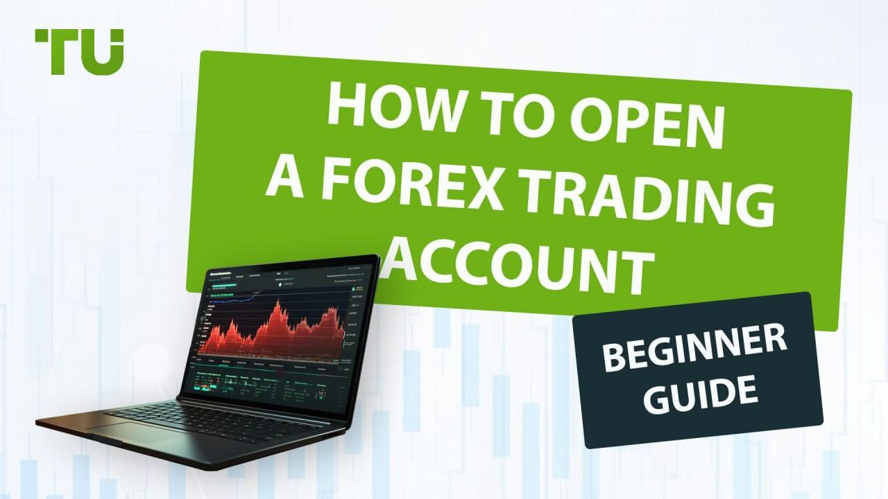

Forex trading represents one of the largest and most liquid financial markets globally, engaging currency traders from novices to seasoned experts. This expansive domain offers a plethora of opportunities due to its inherently volatile nature and the 24/5 trading schedule that accommodates participants from different time zones. Successfully engaging in this market begins with setting up a forex trading account, a fundamental step that provides access to buying and selling various world currencies.

In recent years, the landscape of forex trading has evolved, with technology playing a pivotal role in how trades are executed and managed. Algorithmic trading, also known as algo trading, utilizes computer algorithms to execute trade orders automatically based on pre-defined criteria. This approach offers unique advantages, including speed, efficiency, and the reduction of emotional biases that can impact human decision-making.



The primary aim of this article is to guide individuals through the initial process of establishing a forex trading account, laying the foundation for those wishing to enter this financial sphere. Additionally, the article will elucidate the essential components of algorithmic trading, equipping traders with the knowledge to harness technology for enhanced trading outcomes effectively. Understanding these basics is crucial for maximizing the potential benefits offered by both traditional and algorithmic trading methods.

## Table of Contents

## Understanding the Basics of Forex Trading

Forex trading involves the exchange of global currencies in a market characterized by its unparalleled liquidity and size. With daily trading volumes exceeding $6 trillion, the forex market offers a vast array of opportunities for individual traders seeking to profit from fluctuations in currency values.[^1^]

### Currency Pairs

At the core of forex trading is the concept of currency pairs. Currencies are always quoted in pairs, such as EUR/USD or USD/JPY, representing the exchange rate between the two. The first currency in the pair is the base currency, and the second is the quote currency. In the EUR/USD pair, for example, the EUR is the base currency, and the USD is the quote currency. The exchange rate tells traders how much of the quote currency is needed to purchase one unit of the base currency.

### Pips and Calculating Value

The term "pip" stands for "percentage in point" and represents the smallest change a currency pair can make. Most currency pairs are quoted to four decimal places, making the pip value equivalent to 0.0001.[^2^] Understanding pip values is crucial, as they are used to calculate profit or loss. For a trade with 100,000 base units (a standard lot), if the EUR/USD moves from 1.1000 to 1.1001, a trader would gain or lose $10 per pip, depending on the direction of the trade.

### Leverage and its Implications

Leverage allows traders to control larger positions than their initial capital would permit. For instance, a leverage ratio of 100:1 means that for every $1 of capital, a trader can control $100 in the market. While leverage magnifies potential profits, it also increases the risk of significant losses. Proper risk management is essential to mitigate the potential downsides of levered positions.[^3^]

### Order Types

Currency trading employs various order types, each catering to different trading strategies and risk profiles. The most common order types include:

- **Market Orders**: Execute trades immediately at the current price.
- **Limit Orders**: Specify a price at which the trader wishes to buy or sell, only executing at that target price or better.
- **Stop Orders**: Trigger a trade once a set price is reached, typically used to minimize losses in adverse moves.
- **Stop-Limit Orders**: Combine the features of stop and limit orders, enabling trades at specified price levels while offering precise control over execution.

Understanding these fundamental concepts provides the essential foundation for engaging in [forex](/wiki/forex-system) trading. A trader equipped with knowledge of currency pairs, pip values, leverage, and order types is better prepared to capitalize on the myriad opportunities the forex market offers while minimizing potential risks.

[^1^]: Bank for International Settlements. "BIS Quarterly Review, December 2019: Triennial Central Bank Survey of Foreign Exchange and OTC Derivatives Markets in 2019."
[^2^]: Alton, Larry E. "The Basics of Currency Trading." Investopedia, 2020.
[^3^]: Hull, John C. "Options, Futures, and Other Derivatives." Prentice Hall, 2015.

## Setting Up a Forex Trading Account

When embarking on forex trading, selecting the appropriate type of account is a foundational step that can significantly impact your trading experience and outcomes. There are generally three primary types of forex accounts available: standard, mini, and managed accounts. Each of these accounts caters to different trader profiles based on factors such as risk tolerance, initial investment, and trading frequency.

1. **Standard Accounts**: This is the most common type of account and typically requires a higher initial deposit compared to mini accounts. Standard accounts grant the trader access to standard lot sizes, which are usually 100,000 units of the base currency. The benefits of trading with a standard account include the potential for greater profits; however, they equally come with higher risk exposure due to the larger position sizes. This type of account is generally more suitable for experienced traders who can handle more volatility and larger fluctuations in the market.

2. **Mini Accounts**: These accounts are designed for traders with a lower risk tolerance or those who wish to start with a smaller initial investment. Mini accounts allow trading in mini-lots (10,000 units of the base currency), thus reducing the financial risk per trade. They are ideal for beginners who are still learning about forex trading or for traders who prefer a more conservative approach. While the potential profits are smaller compared to standard accounts, the potential losses are also minimized.

3. **Managed Accounts**: These accounts are suitable for investors who want professional management of their funds without having to trade themselves. With a managed account, a professional trader or money manager makes trading decisions on behalf of the account holder. This option is beneficial for those who lack the time or expertise to trade but still wish to gain exposure to the forex market. However, it is important to note that managed accounts typically charge management fees or take a percentage of the profits as compensation for the services provided.

Selecting the right account type involves carefully considering your risk tolerance, the amount of capital you are willing to invest initially, and how frequently you plan to trade. It is also advisable to utilize demo accounts, which most brokers offer, before committing to any real investments. Demo accounts allow traders to practice and familiarize themselves with trading platforms, execute trades, and test strategies in a risk-free environment, thereby building confidence and understanding of the market dynamics without financial exposure. This preparatory step can pave the way for more informed and strategic trading decisions in the actual market.

 to Algorithmic Trading

Algorithmic trading, often referred to as algo trading, involves the use of computer programs and algorithms to execute trades more efficiently than manual methods. Algorithms are essentially a set of rules or instructions that dictate trading actions under specific conditions. This form of trading capitalizes on speed and precision, enabling traders to process substantial volumes of transactions at a fraction of the time it would take a human.

One of the primary advantages of [algorithmic trading](/wiki/algorithmic-trading) is the significant reduction of emotional bias. Human traders are susceptible to emotional responses to market fluctuations, which can lead to inconsistent decision-making. Algorithms, however, operate on strict guidelines and data-driven logic, ensuring that trades are executed without emotional interferences. This objective approach minimizes common trading errors caused by fear and greed.

Efficiency is another key benefit of algorithmic trading. The ability to execute trades in milliseconds or even microseconds can take advantage of short-lived market opportunities, which would be impossible manually. Moreover, algorithms can operate continuously across multiple markets and instruments, providing a comprehensive trading strategy. The scalability of these programs means that they can manage a diverse portfolio with minimal oversight.

Algorithmic trading is not solely about speed; it also involves strategic decision-making. Traders can design algorithms to incorporate various trading strategies, such as market-making, [arbitrage](/wiki/arbitrage), or trend-following, tailored to specific goals. These strategies are often backtested using historical data to assess their viability and effectiveness, a critical step to ensure potential success in live markets.

For individuals interested in leveraging algorithmic trading, understanding the fundamental principles and advantages it offers is essential. By integrating this tool into forex trading, participants can enhance their ability to respond to fast-paced market changes, improve trade execution, and potentially achieve higher returns. As the sophistication of trading technology continues to advance, the role of algorithmic trading in forex markets becomes increasingly indispensable.

## Getting Started with Algo Trading in Forex

Choosing a reliable algorithmic trading platform is an essential first step when venturing into algo trading in the forex market. Traders should consider platforms that support their trading strategies and align with their technical skills and goals. Popular platforms such as MetaTrader 4 (MT4), MetaTrader 5 (MT5), and NinjaTrader are frequently preferred due to their advanced charting capabilities, extensive historical data, and support for algorithmic trading through languages like MQL4/MQL5 and C#. 

Learning a programming language is crucial for developing custom trading algorithms. Python and MQL4/MQL5 are widely used for this purpose. Python's versatility and extensive libraries make it particularly suitable for data analysis, [machine learning](/wiki/machine-learning), and executing simple to complex trading algorithms. MQL4/MQL5, on the other hand, are specific to the MetaTrader platforms and enable traders to script custom indicators, trading robots, and scripts for automating trading strategies within these environments.

A basic understanding of Python can be gained through the development of a simple trading algorithm. For instance, using the popular library `pandas` for data manipulation and `[backtrader](/wiki/backtrader)` for [backtesting](/wiki/backtesting), one can start by fetching forex data:

```python
import pandas as pd
from backtrader.feeds import PandasData
import backtrader as bt

# Example of loading forex data
data = pd.read_csv('forex_data.csv', parse_dates=True, index_col='Date')

# Creating a data feed
data_feed = bt.feeds.PandasData(dataname=data)
```

Developing and backtesting trading strategies with historical data is fundamental to ensure their effectiveness and resilience. Backtesting involves running a trading strategy over historical data to evaluate its potential success without financial risk. Performance metrics such as Sharpe ratio, maximum drawdown, and profitability can be used to assess a strategy's viability. For example:

```python
class SimpleMovingAverage(bt.SignalStrategy):
    def __init__(self):
        # Define a simple moving average strategy
        self.sma = bt.indicators.SimpleMovingAverage(self.data.close, period=15)

    def next(self):
        # Generate buy/sell signals
        if self.data.close[-1] < self.sma:
            self.sell()
        elif self.data.close[-1] > self.sma:
            self.buy()

# Initialize the backtesting engine
cerebro = bt.Cerebro()
cerebro.addstrategy(SimpleMovingAverage)
cerebro.adddata(data_feed)
cerebro.run()
```

The robustness of trading algorithms also depends on continuous optimization and adaptation to changing market conditions. This iterative process involves tweaking the parameters of the trading strategies and recalibrating them based on new data and performance outcomes. Leveraging advanced techniques such as machine learning can further enhance these strategies by adapting to complex market behaviors and improving decision-making processes.

In conclusion, getting started with algo trading in forex requires the right platform and programming skills and the ability to create and rigorously test trading strategies. The journey involves ongoing learning and modification to ensure continued success in a dynamic market environment.

## Implementing and Monitoring Your Trading System

Implementing algorithmic trading strategies in a real-time trading environment requires careful execution and systematic monitoring to ensure optimal performance. Once an algorithmic trading system is developed, it must be integrated with a live trading platform that supports algorithmic execution. Popular platforms, such as MetaTrader 4, MetaTrader 5, or more customizable solutions like [Interactive Brokers](/wiki/interactive-brokers-api)’ API, offer various features to facilitate this integration. 

### System Implementation

To begin, deploy your trading algorithm on a platform where it can execute trades automatically. This involves connecting your trading algorithm to the broker's environment through an API or built-in scripting capabilities. A simple Python library such as MetaTrader5 can be used to automate trading:

```python
import MetaTrader5 as mt5

# initialize and connect to the platform
mt5.initialize()

# Example: place a buy order for EUR/USD
symbol = "EURUSD"
lot = 0.1
price = mt5.symbol_info_tick(symbol).ask
point = mt5.symbol_info(symbol).point
request = {
    "action": mt5.TRADE_ACTION_DEAL,
    "symbol": symbol,
    "volume": lot,
    "type": mt5.ORDER_TYPE_BUY,
    "price": price,
    "deviation": 20,
    "magic": 234000,
    "comment": "python script open",
    "type_time": mt5.ORDER_TIME_GTC,
    "type_filling": mt5.ORDER_FILLING_IOC,
}
mt5.order_send(request)
```

This code snippet demonstrates placing a buy order for EUR/USD, showcasing the simplicity and power of using well-developed libraries for implementing trading actions.

### System Monitoring

Monitoring performance is crucial to ensure that the trading system functions as intended and is responsive to market changes. Traders should employ robust data monitoring tools to track system performance metrics like win/loss ratios, drawdowns, and ROI. Tools and platforms that provide real-time data analytics, such as QuantConnect or NinjaTrader, can offer valuable insights.

Moreover, set up alerts and notifications for key events to help detect anomalies or potential failures promptly. Implement logging mechanisms within your trading algorithms to capture important data points at each step of the execution process. Here’s a basic example of how logging can be set up in Python:

```python
import logging

# configure logging
logging.basicConfig(filename='trading_log.txt', level=logging.INFO, 
                    format='%(asctime)s - %(message)s')

def log_trade(order):
    logging.info(f"Trade executed: {order['symbol']}, Type: {order['type']}, Volume: {order['volume']}")

log_trade(request)
```

### Continuous Evaluation

The effectiveness of a trading system largely depends on its adaptability to current market conditions. Regularly revisiting and refining the trading algorithms based on performance data is essential. Market conditions are dynamic; therefore, strategies that once performed well may become obsolete. Employ techniques like walk-forward analysis to continuously test and adjust strategy parameters against fresh data.

It is also beneficial to conduct periodic reviews of the trading algorithm's assumptions and logic. For instance, testing the strategy using unseen data (in-sample and out-of-sample testing) can help evaluate its predictive power and robustness. Considerations should include transaction costs, slippage, and changes in [volatility](/wiki/volatility-trading-strategies).

By combining implementation with rigorous monitoring and continuous evaluation, traders can enhance the success of their algorithmic trading systems and better align them with the ever-changing forex market.

## Conclusion

Forex trading presents a dynamic and potentially lucrative opportunity for traders, offering the ability to engage with the world's most liquid market. Algorithmic trading enhances these opportunities significantly by integrating advanced technology and sophisticated data analysis methods. This blend of technology allows traders to execute strategies at speeds and efficiencies unattainable by manual trading, thereby potentially increasing profitability and minimizing emotional bias.

Understanding the foundational elements of forex trading, such as account setups and basic trading concepts, plays a crucial role in maximizing the benefits of algorithmic strategies. Setting up the right forex account—be it a standard, mini, or managed account—ensures that traders have a platform suited to their risk tolerance, initial investment, and trading frequency. These decisions provide a stable groundwork upon which algorithmic systems can operate effectively.

Algorithmic trading systems rely on robust programming skills, potentially leveraging languages such as Python or MQL4/MQL5. These systems are designed to process vast amounts of historical and real-time data to identify profitable trading opportunities. By continually backtesting and refining these algorithms with realistic data sets, traders can optimize their strategies to align closely with current market conditions. The output of such an approach is a trading strategy that is both resilient and adaptable, capable of responding swiftly to market shifts.

In conclusion, merging a deep understanding of forex trading essentials with the technical prowess of algorithmic trading can yield significant trading advantages. By harnessing technology's analytical power, traders can elevate their forex trading ventures, unlocking new levels of market interaction and potential profit.

## References & Further Reading

[1]: Bank for International Settlements. (2019). ["BIS Quarterly Review: Triennial Central Bank Survey of Foreign Exchange and OTC Derivatives Markets in 2019."](https://en.wikipedia.org/wiki/Foreign_exchange_market)

[2]: Alton, Larry E. (2020). ["The Basics of Currency Trading."](https://cullenscholefield.com/wp-content/uploads/2020/07/Briner%202019%20The-Basics-of-Evidence-Based-Practice.pdf) Investopedia.

[3]: Hull, John C. (2015). ["Options, Futures, and Other Derivatives."](https://www.semanticscholar.org/paper/Options%2C-Futures%2C-and-Other-Derivatives-Hull/89bdee500c8623864fc9eb7a471546aa713acc44) Prentice Hall.

[4]: Chan, Ernest P. ["Quantitative Trading: How to Build Your Own Algorithmic Trading Business."](https://github.com/ftvision/quant_trading_echan_book) John Wiley & Sons.

[5]: Lopez de Prado, Marcos. ["Advances in Financial Machine Learning."](https://www.amazon.com/Advances-Financial-Machine-Learning-Marcos/dp/1119482089) John Wiley & Sons.

[6]: Jansen, Stefan. ["Machine Learning for Algorithmic Trading."](https://github.com/stefan-jansen/machine-learning-for-trading) Packt Publishing.