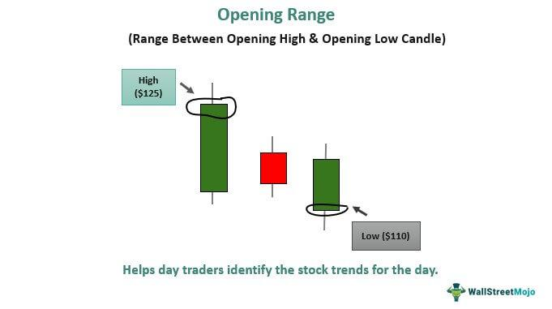

## Table of Contents

## What is an opening function in the context of events or ceremonies?

An opening function is a special event that starts a bigger event or ceremony. It is like the first part of a show that welcomes everyone and gets things started. People often have speeches, music, or other performances to make the opening exciting and to set the mood for the rest of the event.

For example, at a sports event, the opening function might have athletes marching in, the national anthem being sung, and someone important giving a speech. This helps to make everyone feel excited and ready for the games. At a conference, the opening function could include a keynote speech to introduce the main topics and get people interested in what will happen next.

## Why are opening functions important for events?

Opening functions are important for events because they help to set the tone and create excitement. When people come to an event, the opening function is like a big welcome. It makes everyone feel excited and ready for what's coming next. For example, at a school event, if there's a fun performance or a speech that gets everyone cheering, it makes the whole event feel more special and important.

Also, opening functions help to give important information and set the mood for the rest of the event. They can tell people what the event is about and what to expect. For instance, at a conference, the opening function might have a speaker who explains the main topics and goals. This helps everyone understand the purpose of the event and gets them interested in the different sessions and activities that will happen later.

## What are the typical elements included in an opening function?

An opening function usually starts with a welcome speech. This is when someone important talks to everyone and says hello. They might thank people for coming and tell them a bit about the event. After the welcome, there might be a special performance like music or dancing. This makes the event feel exciting and fun. Sometimes, there is also a ribbon-cutting or a special ceremony to officially start the event.

Another common part of an opening function is introducing important people. This could be the event organizers, special guests, or speakers. They might come up on stage and say a few words. There could also be a keynote speech, which is a longer talk about the main topic of the event. This helps everyone understand what the event is about and what they will learn or see. 

Lastly, an opening function might include some kind of symbolic act, like lighting a torch or raising a flag. This can make the event feel more important and memorable. All these elements together help to make the start of the event special and get everyone ready for what's coming next.

## How does an opening function set the tone for an event?

An opening function sets the tone for an event by creating a special atmosphere right from the start. It's like the first song at a party that gets everyone excited and in the mood to have fun. When people arrive at an event, the opening function welcomes them and makes them feel important. It might have music, speeches, or performances that make everyone feel happy and ready for what's coming next. This helps everyone get into the right mood and enjoy the event more.

For example, at a sports event, the opening function might have athletes marching in and the national anthem playing. This makes the event feel big and important, and it gets everyone cheering and excited. At a conference, the opening function might have a keynote speaker talking about the main topics. This helps everyone understand what the event is about and gets them interested in learning more. By setting the right tone at the beginning, the opening function makes the whole event more enjoyable and memorable for everyone.

## What are the key roles and responsibilities of individuals involved in an opening function?

In an opening function, different people have important jobs to make everything go smoothly. The host or emcee is in charge of welcoming everyone and keeping the event moving. They talk to the crowd and introduce the speakers or performers. The event organizer plans everything and makes sure everyone knows what to do and when. They also make sure that the sound, lights, and stage are all ready. Speakers or performers have a big job too. They need to get everyone excited and set the mood for the event. They might give a speech, sing a song, or do a special performance.

Another important role is the technical crew. They work behind the scenes to make sure the microphones, music, and lights all work properly. Without them, the opening function could have problems. Special guests or dignitaries also play a part. They might give a short speech or take part in a special ceremony, like cutting a ribbon or lighting a torch. Their presence can make the event feel more important and special. Everyone involved needs to work together to make the opening function a success and set the right tone for the rest of the event.

## How can an opening function be tailored to different types of events?

An opening function can be changed to fit different kinds of events by thinking about what the event is about and who is coming. For a sports event, the opening function might have athletes walking in, the national anthem, and exciting music to get everyone cheering. This makes the event feel big and important. At a school event, the opening could have students performing a play or a dance to make it fun and exciting for everyone there. The key is to make the opening match the event's theme and the audience's interests.

For a business conference, the opening function might start with a keynote speech about the main topics of the conference. This helps everyone understand what they will learn and gets them interested in the different sessions. There might also be a short video or presentation to show the goals of the event. At a wedding, the opening function could include a special entrance for the bride and groom, and maybe a welcome speech from the parents or the couple themselves. This makes the event feel personal and special. By changing the opening function to fit the event, it can set the right mood and make the whole event more enjoyable for everyone.

## What are some common challenges faced when organizing an opening function and how can they be overcome?

Organizing an opening function can be hard because there are many things to think about. One big challenge is making sure everything runs on time. If speeches or performances go too long, the whole event can be delayed. Another challenge is making sure the sound and lights work properly. If the microphone doesn't work, people can't hear the speeches, and if the lights are too bright or too dark, it can make the event less enjoyable. Also, getting everyone to show up on time can be tricky, especially if people are coming from different places.

To overcome these challenges, good planning is important. Start by making a detailed schedule and sharing it with everyone involved. Practice the speeches and performances ahead of time to make sure they fit in the time you have. For the technical stuff, have a team check the sound and lights before the event starts. If something goes wrong, they can fix it quickly. To make sure people arrive on time, send reminders and maybe have a fun activity or snack at the beginning to encourage early arrivals. By thinking ahead and planning well, you can make the opening function go smoothly and set a great tone for the event.

## How do cultural differences impact the structure and content of opening functions?

Cultural differences can change how an opening function is planned and what happens during it. In some cultures, it's important to start with a prayer or a special ceremony to show respect and bring good luck. For example, in many Asian cultures, there might be a traditional dance or a tea ceremony to welcome everyone. In other places, like some African countries, drumming and singing might be a big part of the opening to celebrate and get everyone excited. These cultural practices help make the event special and meaningful for the people attending.

Also, the way people speak and interact can be different because of culture. In some cultures, like in Japan, people might be very formal and polite, with long speeches and lots of bowing. In contrast, at an event in Brazil, the opening might be more relaxed, with lots of music and dancing to get everyone in a happy mood. Knowing these differences helps organizers plan an opening function that respects the culture and makes everyone feel welcome and included.

## What advanced techniques can be used to enhance the impact of an opening function?

Using advanced technology can make an opening function more exciting and memorable. For example, using big screens and high-quality sound systems can help everyone see and hear the speeches and performances better. You can also use special effects like lights and lasers to create a cool atmosphere. Another idea is to use live streaming so people who can't come to the event can still watch it online. This makes the event feel bigger and more important. Using technology in these ways can make the opening function stand out and leave a strong impression on everyone.

Another way to enhance an opening function is by telling a story. Instead of just having speeches, you can create a short video or a live performance that tells a story related to the event's theme. This can be more interesting and help people connect with the event's purpose. For example, at a charity event, you could show a video about the people the charity helps. This can make people feel more emotional and motivated to get involved. By using storytelling, the opening function can have a deeper impact and make the event more meaningful for everyone.

## How can technology be integrated into opening functions to improve engagement?

Technology can make opening functions more fun and engaging by using things like big screens and good sound systems. These help everyone see and hear the speeches and performances better. You can also use special effects like lights and lasers to make the event look cool and exciting. Another way is to use live streaming so people who can't come to the event can still watch it online. This makes the event feel bigger and more important to everyone, even if they are not there in person. Using technology in these ways can make the opening function stand out and keep everyone interested.

Another way to use technology is by telling a story. Instead of just having speeches, you can show a short video or have a live performance that tells a story about the event's theme. This can be more interesting and help people feel more connected to what the event is about. For example, at a charity event, you could show a video about the people the charity helps. This can make people feel more emotional and want to get involved. By using technology to tell a story, the opening function can have a bigger impact and make the event more meaningful for everyone.

## What metrics can be used to evaluate the success of an opening function?

To know if an opening function was successful, you can look at how many people came to the event. If a lot of people showed up, it means the opening was interesting and people wanted to be there. You can also see if people stayed for the whole opening function or if they left early. If most people stayed until the end, it means they liked what they saw and heard.

Another way to measure success is by asking people what they thought. You can use surveys or feedback forms to find out if people enjoyed the opening function and if it made them excited for the rest of the event. Also, you can check social media to see if people are talking about the opening function and sharing pictures or videos. If there is a lot of positive talk online, it shows that the opening function made a good impression and got people excited.

## How can the insights gained from previous opening functions be used to improve future events?

Insights from previous opening functions can help make future events better. If you know what people liked or didn't like before, you can change things to make the next opening function even more fun and exciting. For example, if people enjoyed a special performance last time, you might want to have something similar again. Or, if the speeches were too long and people got bored, you could make them shorter next time. By listening to feedback and watching what people did at past events, you can plan a better opening function that everyone will enjoy.

Another way to use insights is by looking at what worked well and what didn't. If the sound and lights were perfect last time, you can make sure to do the same thing again. But if there were problems, like the microphone not working, you can fix those issues for the next event. Also, if you see that people loved the energy and excitement of the opening, you can try to keep that same feeling in the future. By learning from past opening functions, you can make each new event better and more memorable for everyone.

## What is the purpose of functions in trading algorithms?

Functions in trading algorithms serve several critical purposes, including optimizing execution, managing risk, and improving decision-making processes. These functions form the core components of algorithmic trading strategies, enabling traders to maximize profits while minimizing risks, ultimately crafting more robust trading approaches.

Optimization of execution is a fundamental purpose of functions in trading algorithms. These functions are designed to execute trades at the most favorable prices while minimizing market impact. By utilizing advanced mathematical models and statistical methods, such functions can break down large orders into smaller trades to avoid disrupting market prices. The use of limit orders or market-making strategies are examples where execution functions are vital, as they require rapid decision-making processes to achieve the best execution conditions.

Risk management functions are essential in safeguarding trading operations from unexpected market shifts. These functions constantly monitor positions and market conditions, employing a variety of risk assessment tools such as Value at Risk (VaR), stress testing, and scenario analysis. By integrating these functions within an algorithm, traders can set predefined risk parameters, automatically adjusting positions and even halting trading activities if risk levels exceed acceptable thresholds.

Functions also significantly enhance decision-making processes by analyzing vast datasets to identify profitable trading opportunities. Objective functions, in particular, guide algorithms in choosing the best possible trades by quantifying performance and balancing multiple goals. These functions often involve complex mathematical models that evaluate potential trades against factors such as historic performance, volatility, and liquidity. For instance, an objective function might be represented mathematically as:

$$
\text{Maximize} \quad \sum_{i=1}^{n} \left( \text{Expected Return}_i - \lambda \times \text{Risk}_i \right)
$$

where $\lambda$ represents the risk aversion coefficient, balancing the trade-off between expected return and risk.

The design and optimization of these functions are integral to the success of an algorithmic trading system. Developing effective functions requires a deep understanding of financial markets, statistical analysis, and programming skills. Optimization techniques, such as gradient descent or genetic algorithms, are often employed to refine these functions, ensuring they adapt to the dynamic nature of financial markets. Moreover, regular [backtesting](/wiki/backtesting) against historical data and out-of-sample testing are crucial steps in evaluating the robustness and effectiveness of the functions under different market scenarios.

In summary, the multi-faceted roles of functions in trading algorithms—from execution and risk management to decision-making—highlight their importance in developing efficient and profitable trading strategies. By continually refining these functions, traders can enhance algorithmic performance, maintaining a competitive edge in rapidly evolving financial markets.

## References & Further Reading

[1]: Bergstra, J., Bardenet, R., Bengio, Y., & Kégl, B. (2011). ["Algorithms for Hyper-Parameter Optimization."](https://dl.acm.org/doi/10.5555/2986459.2986743) Advances in Neural Information Processing Systems 24.

[2]: ["Advances in Financial Machine Learning"](https://www.amazon.com/Advances-Financial-Machine-Learning-Marcos/dp/1119482089) by Marcos Lopez de Prado

[3]: ["Evidence-Based Technical Analysis: Applying the Scientific Method and Statistical Inference to Trading Signals"](https://www.amazon.com/Evidence-Based-Technical-Analysis-Scientific-Statistical/dp/0470008741) by David Aronson

[4]: ["Machine Learning for Algorithmic Trading"](https://github.com/stefan-jansen/machine-learning-for-trading) by Stefan Jansen

[5]: ["Quantitative Trading: How to Build Your Own Algorithmic Trading Business"](https://www.amazon.com/Quantitative-Trading-Build-Algorithmic-Business/dp/1119800064) by Ernest P. Chan