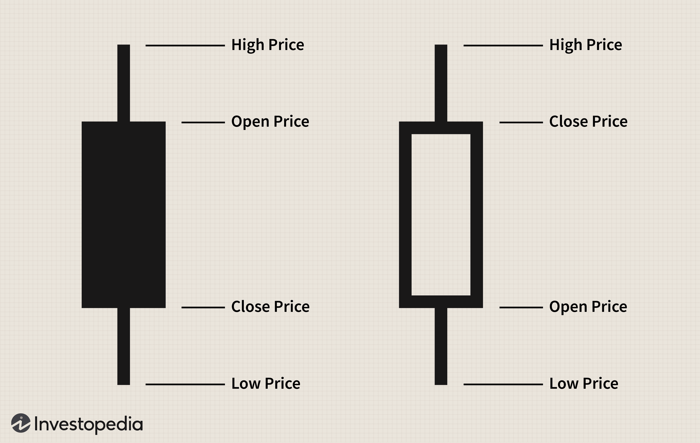

Understanding the dynamics of financial markets during opening sessions is crucial for traders, as these periods often set the tone for the trading day. During these sessions, the concept of Opening Imbalance Only Orders (OIO) becomes significant in market operations, particularly in the context of the opening cross—an essential mechanism that determines the opening price of a security. OIO orders are designed to provide liquidity exclusively during these opening moments, offering a strategic approach for traders to engage with the market without being prematurely executed like continuous market orders.

Opening imbalances arise when there is a mismatch between buy and sell orders, which can significantly impact market liquidity and price movements. These imbalances reveal underlying supply and demand dynamics and can serve as potential indicators of how prices will adjust during the trading day. In algorithmic trading, recognizing and interpreting these imbalances holds particular importance, as automated systems rely heavily on such data to align trading strategies with prevailing market trends.



This article aims to explore the nuances of opening imbalances and their implications on trading strategies, with a focus on algorithmic trading. It will analyze how OIO impacts liquidity and price movements, providing traders and investors with a comprehensive overview. By understanding and adapting to opening imbalances, market participants can better anticipate market volatility, enhancing their strategic decisions and overall trading performance.

## Table of Contents

## What are Opening Imbalance Only Orders (OIO)?

Opening Imbalance Only Orders (OIO) are a specific type of limit order used predominantly on exchanges like Nasdaq. These orders are structured to address the unique trading environment that occurs during the market opening, known as the "opening cross." The primary function of OIO is to inject liquidity at the market's start, ensuring that the initial trades are executed at fair prices that reflect the true supply and demand.

Distinct from continuous market orders, OIOs are specifically designed to be executed solely during the opening session. This ensures that they are not prematurely filled or influenced by the continuous fluctuations of the broader market that occur outside of the designated opening period. 

The unique behavior of OIOs lies in their execution mechanism. By remaining inactive until the opening cross, these orders contribute to a smoother transition from pre-market to regular trading. They help mitigate extreme price volatility that may otherwise occur due to sudden supply-demand imbalances at the market open. As such, market participants can achieve better price discovery and a more controlled exposure to market dynamics.

For traders, particularly those employing algorithmic strategies, understanding how to use OIOs effectively is crucial for optimizing their approach during opening sessions. By integrating OIOs into their trading strategies, traders can position themselves more strategically to take advantage of [liquidity](/wiki/liquidity-risk-premium) and minimize adverse price impacts. The strategic deployment of OIOs can thus enhance market entry accuracy and improve the potential for favorable trade executions in the highly dynamic environment of market openings.

## The Role of Order Imbalances in Market Dynamics

Order imbalances in financial markets are critical indicators of supply and demand dynamics that can significantly influence asset prices. An order imbalance occurs when the quantity of buy orders does not match the quantity of sell orders for a particular asset. This discrepancy can generate a [momentum](/wiki/momentum) that drives prices either upwards or downwards, depending on whether buy or sell orders dominate.

When there are more buy orders than sell orders, a buy-side imbalance is created, potentially driving prices up as the demand exceeds supply. Conversely, when sell orders outnumber buy orders, a sell-side imbalance can push prices down due to an oversupply relative to demand. Understanding these fluctuations is essential for market participants, especially traders who employ algorithmic strategies to trade.

Algorithmic trading systems make use of order imbalance data to predict price movements and adapt trading strategies accordingly. By analyzing the order flow and identifying imbalances, these systems can make informed decisions on when to execute trades, aligning their strategies to the prevailing market trends. The momentum created by order imbalances can often lead to heightened [volatility](/wiki/volatility-trading-strategies), which algorithmic traders can exploit to their advantage.

The impact of order imbalances is further compounded in markets where high-frequency trading ([HFT](/wiki/high-frequency-trading-strategies)) firms operate. These firms leverage advanced algorithms and powerful computing resources to respond to imbalances almost instantaneously, influencing market liquidity and depth. As a result, even minor imbalances can lead to significant price shifts, emphasizing the importance for all traders to monitor and understand these market signals.

In summary, order imbalances serve as a vital component in the determination of market dynamics, as they encapsulate the essence of supply and demand discrepancies. For traders utilizing algorithmic strategies, understanding and acting upon these imbalances is not just beneficial but necessary for maintaining a competitive edge and effectively navigating the volatile nature of financial markets.

## Algorithmic Trading and Its Impact on Opening Imbalances

Algorithmic trading, often referred to as algo trading, utilizes computer systems to execute a large number of orders at speeds and frequencies unattainable by manual trading. This automated form of trading can significantly influence opening imbalances in financial markets. An opening imbalance occurs when there is a large discrepancy between buy and sell orders during the market's opening, which can lead to substantial price shifts.

Algorithmic systems are designed to capitalize on existing market data and signals, enabling traders to respond swiftly to market conditions. By analyzing patterns, volumes, and other market indicators, these systems are able to execute trades within milliseconds, a speed that can intensify the effects of opening imbalances. For instance, if an algorithm detects a significant buy-side imbalance at market open, it might prompt a series of quick buy orders to capitalize on the expected upward price movement. This, in turn, can further increase the imbalance, leading to more pronounced price shifts.

The efficiency and speed offered by [algorithmic trading](/wiki/algorithmic-trading) necessitate a strategic adjustment for traders, particularly during the volatile opening phases. Strategies must account for the possibility that algorithms might exploit these imbalances more rapidly than traditional trading methods. This rapid execution creates an environment of increased market volatility, especially at the open when liquidity is still forming, and initial price discovery is underway.

For traders, adapting to this landscape involves fine-tuning their algorithms to better predict and respond to these dynamics. This could involve incorporating complex mathematical models and [machine learning](/wiki/machine-learning) techniques that can better interpret the market mood based on historical imbalance data.

Here's a Python example of a simple algorithm that can be part of a larger trading strategy, with a focus on detecting imbalances:

```python
import numpy as np
import pandas as pd

# Simulate market data
# prices: simulated opening prices
# volumes: simulated opening volumes
data = {
    'prices': np.random.normal(100, 5, 1000),
    'volumes': np.random.normal(1000, 250, 1000)
}

df = pd.DataFrame(data)

# Calculate average price
average_price = df['prices'].mean()

# Calculate order imbalance as buy - sell volume
df['buy_volume'] = np.where(df['prices'] > average_price, df['volumes'], 0)
df['sell_volume'] = np.where(df['prices'] <= average_price, df['volumes'], 0)
df['imbalance'] = df['buy_volume'] - df['sell_volume']

# Detect significant opening imbalance
significant_imbalance = np.abs(df['imbalance']) > 500  # Example threshold
df['signal'] = np.where(significant_imbalance, 'Trade', 'Hold')

print(df.head())
```

This code is an illustration of how data analysis might identify significant imbalances, which algorithmic systems could then use to generate trading signals. As technology evolves, the ability to rapidly process and respond to imbalance data becomes ever more critical, allowing algorithmic traders to gain a competitive edge during the highly volatile opening sessions of the market.

## Strategies to Exploit Opening Imbalances

Traders often look to exploit opening imbalances through various strategies, each aimed at capitalizing on early market trends to maximize profits. One popular approach is "fading the gap," which involves taking positions against the direction of the initial price move caused by an imbalance. This strategy is predicated on the assumption that the gap, or the price difference between the previous day's close and the opening price, will close as the market stabilizes. Fading requires a contrarian mindset, as traders bet on the price reverting to its longer-term mean, necessitating a keen understanding of market sentiment and psychological thresholds.

Technical analysis tools play a critical role in anticipating and executing trades based on opening imbalances. Volume patterns are particularly informative, as sudden spikes can indicate heightened interest and potential reversals, providing traders with a window into market sentiment. Similarly, moving averages can be employed to smooth out price data and identify underlying trends. For instance, a short-term moving average crossing above a long-term one may signal a continuation of the current trend. The mathematical representation for a simple moving average, $SMA_t$, over the last $n$ periods is expressed as:

$$

SMA_t = \frac{1}{n} \sum_{i=t-n+1}^{t} P_i 
$$

where $P_i$ represents the price at each period.

Order imbalance data further enriches trading strategies by providing insights into market depth and liquidity. Traders can analyze this data to gauge the magnitude and direction of imbalances, thus adjusting their positions accordingly. Incorporating these insights into algorithmic models can enhance predictive accuracy, allowing for more informed decision-making.

Integrating quantitative models with real-time imbalance data allows traders to refine their strategies dynamically. For instance, using Python libraries such as Pandas and NumPy, traders can build predictive models to simulate various scenarios and identify optimal entry and [exit](/wiki/exit-strategy) points. Here's a simple Python script that demonstrates how to identify a potential trading signal using moving averages:

```python
import pandas as pd

# Load market data
data = pd.read_csv('market_data.csv')

# Calculate moving averages
data['short_ma'] = data['close'].rolling(window=20).mean()
data['long_ma'] = data['close'].rolling(window=50).mean()

# Generate signals
data['signal'] = 0
data.loc[data['short_ma'] > data['long_ma'], 'signal'] = 1
data.loc[data['short_ma'] < data['long_ma'], 'signal'] = -1

# Identify points of imbalance and trade
entry_points = data[(data['signal'] == 1) & (data['short_ma'] > data['long_ma'])]
exit_points = data[(data['signal'] == -1) & (data['short_ma'] < data['long_ma'])]

print("Entry Points:\n", entry_points)
print("Exit Points:\n", exit_points)
```

With these strategies and tools, traders not only mitigate risks but also position themselves to tactically exploit opening imbalances, increasing their chances of emerging successful in volatile markets.

## Real-World Examples of Opening Imbalance Impacts

Examining real-world examples of opening imbalances in financial markets highlights their potential effects on market stability and asset pricing. Two notable instances where opening imbalances had far-reaching impacts are the Facebook IPO in 2012 and the 2010 Flash Crash.

**Facebook IPO**

The initial public offering (IPO) of Facebook on May 18, 2012, is a prominent example of opening imbalance effects disrupting market order. On the Nasdaq exchange, the anticipated demand for Facebook shares led to a significant order imbalance. Rather than a seamless opening, the IPO was plagued by technical glitches and a mismatch between buy and sell orders. Demand exceeded supply, creating an order imbalance that delayed the stock's opening for over 30 minutes.

The technical issues stemmed from Nasdaq's system's inability to handle the [volume](/wiki/volume-trading-strategy) and discrepancy in bid and ask orders, resulting in a series of execution problems. The imbalance impacted the pricing mechanisms, with Facebook's stock opening at $42, exceeding the initial offering price of $38. Despite closing the day barely above the offer price, the trading disruptions and volatility impacted investor sentiment and confidence. This event underscored the importance of robust systems capable of managing significant imbalances during market openings.

**2010 Flash Crash**

The 2010 Flash Crash is another striking example, occurring on May 6, 2010, when major U.S. stock indices, such as the Dow Jones Industrial Average, plummeted dramatically and recovered within minutes. One [factor](/wiki/factor-investing) contributing to this event was an extreme opening imbalance exacerbated by high-frequency trading (HFT) algorithms. A large sell order initiated by a mutual fund company without regard for market conditions led to an enormous imbalance between demand and supply. HFT algorithms responded automatically, intensifying the price movements.

Due to the speed and volume of trades executed by these algorithms, liquidity was temporarily exhausted, causing prices to drop sharply. While the market rebounded quickly, the event revealed vulnerabilities in market structures and emphasized how opening imbalances, combined with algorithmic trading, can trigger significant volatility.

These examples exhibit how unexpected market behaviors and participant actions in response to opening imbalances can propagate extreme volatility. They underscore the necessity for exchanges and traders to understand and accommodate these dynamics to mitigate potential adverse effects in stock trading environments.

## Leveraging Technology in Tracking Opening Imbalances

The integration of advanced technology in trading has transformed the way traders interpret and utilize opening imbalance data. With the rapid evolution of algorithmic trading platforms, traders now have access to sophisticated tools that enable the swift analysis and execution of strategies during market openings. These technologies not only facilitate the rapid processing of vast amounts of data but also enhance the accuracy and efficiency of trading decisions.

Modern trading platforms often incorporate real-time data feeds, advanced analytics, and machine learning models to provide traders with insights into opening imbalances. Through these platforms, traders can monitor order flow, detect imbalances in real-time, and execute trades based on predictive analytics. This capability is particularly advantageous during the volatile opening phases of market sessions when imbalances tend to be most pronounced.

Algorithmic trading tools utilize quantitative models to discern patterns and generate trading signals. For instance, a trader might employ a Python-based algorithm to identify significant price discrepancies caused by order imbalances. By inputting imbalance data into the model, the algorithm can detect [arbitrage](/wiki/arbitrage) opportunities or anticipate price movements with heightened precision. A simple example code might look like this:

```python
import pandas as pd

# Example function to detect opening imbalance
def detect_imbalance(order_book):
    buy_orders = order_book['buy'].sum()
    sell_orders = order_book['sell'].sum()
    imbalance = buy_orders - sell_orders
    return imbalance

# Example order book data
order_book = pd.DataFrame({
    'buy': [100, 150, 200],
    'sell': [90, 130, 180]
})

imbalance = detect_imbalance(order_book)
if imbalance > 0:
    print("Positive Imbalance: Higher buying pressure")
elif imbalance < 0:
    print("Negative Imbalance: Higher selling pressure")
else:
    print("No significant imbalance")
```

This script quickly evaluates the buy and sell orders to determine the presence and nature of an imbalance, allowing traders to act accordingly.

Moreover, connectivity to global markets and access to diverse datasets enable traders to contextualize imbalances beyond immediate transaction data. They can integrate [alternative data](/wiki/best-alternative-data) sources such as social media sentiment and macroeconomic indicators to refine predictions about market directions. Machine learning algorithms can be trained on historical imbalance data to recognize patterns and improve the accuracy of forecasts over time.

Ultimately, by leveraging technology, traders gain a competitive advantage in navigating the complexities of market openings. A profound understanding of technological tools, coupled with strategic insight into market dynamics, empowers traders to interpret opening imbalance signals effectively and make informed decisions that capitalize on market volatility.

## Conclusion

Mastering the analysis of opening imbalances can provide traders a strategic edge in financial markets. These imbalances, when effectively interpreted, reveal crucial insights into the supply and demand dynamics that underpin price movements during market openings. Such understanding allows traders to anticipate asset price directions and volatility, essential for optimizing trading strategies.

Leveraging technology is instrumental in adapting to opening imbalances. Modern trading platforms equipped with advanced algorithmic tools enable traders to swiftly interpret market data and respond to imbalance signals. This adaptability is crucial, considering that opening sessions often involve heightened volatility and rapid price changes.

One key approach to gaining a competitive advantage is through the implementation of algorithmic trading systems. These systems use computational algorithms to analyze vast amounts of market data, identify patterns, and execute trades at speeds and accuracy levels unattainable by manual trading. By programming algorithms that specifically detect and exploit opening imbalances, traders can position themselves to benefit from early market moves.

Moreover, the application of machine learning in trading strategies has grown, offering predictive models that improve decision-making. For example, traders can develop machine learning models that analyze historical imbalance data to predict future imbalance patterns and asset price responses. This predictive power enhances the traders' ability to make informed decisions before and during the opening sessions.

Python, a popular programming language in finance, can be used effectively to build these models. For instance, utilizing libraries such as `pandas` for data manipulation, `scikit-learn` for machine learning model development, and `NumPy` for numerical calculations can empower traders to handle imbalance data efficiently. Below is a simple example of Python code that uses these libraries for data preparation and modeling:

```python
import pandas as pd
from sklearn.linear_model import LinearRegression
import numpy as np

# Load historical imbalance data
data = pd.read_csv('imbalance_data.csv')

# Prepare the data for modeling
X = data[['Open_Imbalance', 'Previous_Close', 'Volume']]
y = data['Price_Change']

# Train a linear regression model
model = LinearRegression()
model.fit(X, y)

# Predict future price changes based on current imbalance data
current_data = np.array([[open_imbalance, prev_close, volume]])
predicted_change = model.predict(current_data)

print(f"Predicted price change: {predicted_change}")
```

By understanding and adapting to these imbalances with the aid of technology, traders can enhance their trading performance and capitalize on market volatility. Emphasizing the integration of technology not only streamlines the analysis of imbalances but also embodies the essential agility required in the ever-evolving landscape of financial markets.

## References & Further Reading

[1]: Harris, L. (2003). ["Trading and Exchanges: Market Microstructure for Practitioners."](https://www.amazon.com/Trading-Exchanges-Market-Microstructure-Practitioners/dp/0195144708) Oxford University Press.

[2]: Zhang, F., Russell, M., & Neely, J. (2018). ["High-Frequency Trading and Price Discovery."](https://papers.ssrn.com/sol3/papers.cfm?abstract_id=1691679) Review of Financial Studies.

[3]: Aldridge, I. (2013). ["High-Frequency Trading: A Practical Guide to Algorithmic Strategies and Trading Systems."](https://onlinelibrary.wiley.com/doi/pdf/10.1002/9781119203803.fmatter) Wiley.

[4]: Bouchaud, J.-P., Gefen, Y., Potters, M., & Wyart, M. (2004). ["Fluctuations and response in financial markets: The subtle nature of 'random' price changes."](https://arxiv.org/abs/cond-mat/0307332) Quantitative Finance.

[5]: O'Hara, M. (2015). ["High-Frequency Market Microstructure."](https://www.sciencedirect.com/science/article/pii/S0304405X15000045) Journal of Financial Economics.