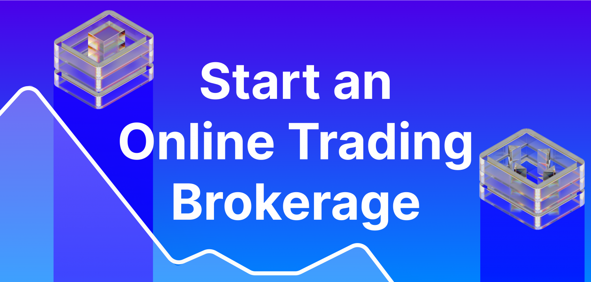

## Table of Contents

## What is an online brokerage account and why might someone need one in 2024?

An online brokerage account is a type of investment account that lets you buy and sell stocks, bonds, mutual funds, and other financial products through the internet. You can open this account with a brokerage firm that offers online services. These firms make it easy for you to manage your investments from your computer or smartphone. They usually have lower fees than traditional brokerages because they don't have physical branches.

In 2024, someone might need an online brokerage account for several reasons. First, it's a convenient way to invest money without leaving your home. This is especially useful if you want to start investing but don't have time to visit a financial advisor. Second, online brokerages often have educational resources that can help you learn about investing. This can be helpful if you're new to investing and want to make smart choices. Finally, with the economy always changing, having an online brokerage account can help you quickly adjust your investments to take advantage of new opportunities or protect your money from risks.

## What are the steps to open an online brokerage account in 2024?

To open an online brokerage account in 2024, you first need to choose a brokerage firm. Look for one that fits your needs, like low fees, good customer service, or a user-friendly app. Once you've picked a firm, go to their website and find the option to open an account. You'll need to fill out an application form with your personal information, like your name, address, and Social Security number. Make sure you have this information ready before you start.

After you submit your application, the brokerage firm will check your information to make sure everything is correct. This process is called verification, and it might take a few days. Once your account is verified, you'll need to fund your account. You can usually do this by transferring money from your bank account. Once the money is in your brokerage account, you're ready to start investing. Remember to read any instructions or guides the brokerage provides to help you get started with buying and selling investments.

## What documents are required to open an online brokerage account?

To open an online brokerage account, you will need a few important documents. You will need to provide your Social Security number or another form of government-issued ID, like a passport. This helps the brokerage firm verify who you are. You will also need to give them your address and date of birth. Sometimes, they might ask for a copy of your driver's license or another ID to confirm your identity.

After you submit these documents, the brokerage firm will check them to make sure everything is correct. This process is called verification and can take a few days. Once your identity is verified, you might need to provide bank account information to fund your brokerage account. This usually involves giving your bank account number and routing number so you can transfer money into your new brokerage account. Once everything is set up, you can start investing.

## How do you choose the right online brokerage platform for your needs in 2024?

Choosing the right online brokerage platform in 2024 depends on what you need. First, think about the fees. Some platforms charge a lot for trading or account maintenance, while others might be cheaper. Look for a platform with low fees if you want to save money. Next, consider how easy the platform is to use. If you're new to investing, you might want a platform with a simple app and good customer support. If you're more experienced, you might want more advanced tools and features.

Also, think about what you want to invest in. Some platforms offer a wide range of investments like stocks, bonds, and mutual funds, while others might focus on specific types. Make sure the platform has the investments you're interested in. Lastly, check if the platform offers educational resources. Learning about investing can help you make better choices, so a platform with good guides and tutorials can be really helpful. By considering these things, you can find the best online brokerage platform for your needs in 2024.

## What are the fees associated with online brokerage accounts, and how have they changed in recent years?

The fees for online brokerage accounts can include trading fees, account maintenance fees, and inactivity fees. Trading fees are what you pay every time you buy or sell an investment. Some brokerages charge a few dollars per trade, while others offer commission-free trading. Account maintenance fees are charged just for having an account, but many online brokerages don't charge these anymore. Inactivity fees might be charged if you don't use your account for a while, but these are less common with online platforms.

In recent years, the fees for online brokerage accounts have gone down a lot. Many big brokerages now offer commission-free trading, which means you don't pay anything when you buy or sell stocks or ETFs. This change has made it easier and cheaper for people to start investing. Also, more brokerages have stopped charging account maintenance fees, making it even more affordable to keep an account open. Overall, the costs of using an online brokerage have become much lower, which is good news for investors.

## How can one ensure the security of their online brokerage account?

To keep your online brokerage account safe, start by choosing a strong password. Make it long and use a mix of letters, numbers, and symbols. Don't use easy-to-guess information like your birthday or pet's name. Also, turn on two-[factor](/wiki/factor-investing) authentication if the brokerage offers it. This adds an extra step when you log in, like a code sent to your phone, making it harder for someone else to get into your account.

Next, be careful with your personal information. Never share your account details or password with anyone. Watch out for phishing scams, where someone might pretend to be from the brokerage and ask for your information. Always check the website's URL to make sure it's the real one before entering any information. Keep your computer and phone secure with up-to-date antivirus software, and log out of your account when you're not using it. By following these steps, you can help keep your online brokerage account safe.

## What are the tax implications of trading through an online brokerage account in 2024?

When you trade through an online brokerage account in 2024, you need to think about taxes. If you make money from selling investments, you might have to pay capital gains tax. This tax depends on how long you held the investment before selling it. If you held it for less than a year, it's a short-term capital gain, and you'll pay your regular income tax rate on it. If you held it for more than a year, it's a long-term capital gain, and the tax rate is usually lower. Remember, you also need to report any dividends you get from stocks or funds, as these are usually taxable income.

Another thing to keep in mind is that you might be able to use losses to lower your taxes. If you sell an investment for less than you paid for it, you have a capital loss. You can use these losses to offset any capital gains you made during the year. If your losses are more than your gains, you can use up to $3,000 of the extra loss to reduce your other income. Any remaining loss can be carried over to future years. It's a good idea to keep good records of all your trades and talk to a tax professional to make sure you're handling everything correctly.

## How does one fund an online brokerage account and what are the best practices for managing funds?

To fund an online brokerage account, you usually start by linking your bank account to your brokerage account. This involves entering your bank account number and routing number into the brokerage's website. Once linked, you can transfer money from your bank to your brokerage account. This can be done through a direct bank transfer, which might take a few days, or through a quicker method like a wire transfer, though this might cost a fee. Some brokerages also let you fund your account with a debit card or a check, but these options might have limits or extra charges.

For managing funds in your online brokerage account, it's important to keep track of your money and investments. Regularly check your account balance and review your investments to see how they're doing. It's a good idea to set a budget for how much you want to invest and stick to it. Also, think about diversifying your investments, which means spreading your money across different types of investments to reduce risk. Lastly, be careful not to withdraw money from your brokerage account too often, as this can lead to fees and might impact your long-term investment goals.

## What advanced features should expert traders look for in an online brokerage account in 2024?

Expert traders in 2024 should look for online brokerage accounts that offer advanced trading tools and features. These might include customizable charting options, which let traders analyze stock prices and trends in detail. Another important feature is the ability to use different order types, like limit orders, stop orders, and trailing stops, which help traders manage their trades more precisely. Real-time market data and news feeds are also crucial, as they provide the latest information needed to make quick trading decisions. Lastly, expert traders might benefit from access to margin trading, which allows them to borrow money to invest more than they have in their account, though this comes with higher risk.

In addition to these tools, expert traders should look for brokerages that offer advanced research and analysis tools. This could include access to professional research reports, analyst ratings, and detailed financial statements of companies. Some platforms also provide [backtesting](/wiki/backtesting) capabilities, where traders can test their trading strategies using historical data to see how they would have performed. Integration with third-party trading software and APIs can also be valuable, as they allow for more automated and sophisticated trading strategies. By choosing a brokerage with these advanced features, expert traders can better manage their investments and potentially improve their trading performance.

## How can one use an online brokerage account for diversification and portfolio management?

Using an online brokerage account for diversification and portfolio management means spreading your investments across different types of assets to reduce risk. This can include stocks, bonds, mutual funds, and ETFs. By investing in a mix of these, you're less likely to lose a lot of money if one type of investment does poorly. For example, if the stock market goes down, your bonds might still do well, balancing out your losses. You can use the tools in your online brokerage account to buy and sell these different investments easily. Many platforms also offer pre-made portfolios or model portfolios that are already diversified, which can be a good starting point if you're not sure how to do it yourself.

Managing your portfolio through an online brokerage account also involves keeping an eye on how your investments are doing and making changes when needed. You can use the account's dashboard to see your overall performance and check on individual investments. If one part of your portfolio is doing much better or worse than others, you might want to rebalance it. This means selling some of what's doing well and buying more of what's not, to keep your investments spread out evenly. Many online brokerages have tools that can help you rebalance automatically or suggest when it's time to do it. By regularly checking and adjusting your portfolio, you can work towards your financial goals while managing risk.

## What are the latest regulatory changes affecting online brokerage accounts in 2024?

In 2024, there have been some new rules for online brokerage accounts to make them safer and more transparent. One big change is that brokerages now have to tell you more about the fees they charge. This means you'll see exactly what you're paying for every trade or service, so you can make better choices about where to invest your money. Another change is about how brokerages handle your personal information. They have to be more careful with it and tell you how they're using it, which helps protect your privacy.

Also, there are new rules to stop fraud and make sure the markets are fair. Brokerages have to watch for suspicious activities more closely and report them to the authorities. This is to stop people from cheating or doing illegal things with their accounts. These changes might mean a bit more work for you, like filling out extra forms or agreeing to new terms, but they're all about making sure your investments are safe and the markets are honest.

## How can one optimize their trading strategy using tools available in online brokerage platforms?

To optimize your trading strategy using tools in online brokerage platforms, start by using the charting tools. These let you look at stock prices over time and see patterns. You can add different lines and indicators to the charts to help you decide when to buy or sell. Many platforms also let you set up alerts, so you get a message when a stock reaches a certain price. This way, you can make trades quickly without having to watch the market all the time. Another useful tool is the ability to use different order types, like limit orders and stop orders. These help you control when and at what price your trades happen, which can make your strategy more effective.

Another way to improve your trading is by using the research and analysis tools that come with many online brokerage accounts. These tools can give you reports and ratings from experts, which can help you pick the right stocks. You can also use backtesting, where you test your trading ideas on past data to see how they would have worked. This can help you fine-tune your strategy before you use real money. Some platforms also let you automate parts of your trading with algorithms or connect to other software, making your strategy more efficient and less prone to mistakes. By using these tools, you can make smarter trades and hopefully do better in the market.

## How can you fund and practice in your account?

Once your online brokerage account is approved, the first essential step is funding the account. Generally, this is achieved through a bank transfer. It is critical to ensure that the transfer process is secure to protect your banking details. This can be done by using encrypted connections and verifying the brokerage's security protocols. Some brokerages might offer additional funding options such as wire transfers, checks, or linking other financial accounts; always verify these methods' safety and fees.

After funding your account, especially if you're new to trading, it is beneficial to practice using a trading simulator, also known as a paper trading account. A simulator mimics real market conditions without the risk of losing actual capital, providing a platform to practice trades and get familiar with the trading interface. 

Using a simulator, traders can execute trades, experiment with different strategies, and understand how various market dynamics work. For beginners in [algorithmic trading](/wiki/algorithmic-trading), this practice is invaluable. Algorithmic trading involves executing pre-programmed trading instructions, which can encompass variables such as price, timing, and [volume](/wiki/volume-trading-strategy). Familiarizing oneself with how these algorithms behave in simulated environments aids in strategy refinement before engaging in live trading.

Simulators allow users to backtest algorithms—testing strategies against historical data to assess their viability under different market conditions. This process necessitates an understanding of statistical measures like the Sharpe Ratio, which evaluates the risk-adjusted return:
$$
\text{Sharpe Ratio} = \frac{E[R_p - R_f]}{\sigma_p}
$$
where $E[R_p - R_f]$ is the expected return of the portfolio minus the risk-free rate, and $\sigma_p$ is the standard deviation of the portfolio's excess return. This metric, among others, helps in assessing and refining trading strategies.

Ultimately, funding your account securely and making full use of simulators can significantly contribute to building trading confidence and honing skills, laying a robust foundation for successful investment activities, especially in algorithmic contexts.

 to Algorithmic Trading

Algorithmic trading, commonly referred to as algo trading, utilizes computer algorithms to execute trades based on predefined criteria. This practice allows for trades to be executed at speeds and frequencies that exceed human capabilities. Algorithms analyze price trends, market conditions, and other variables to determine the best times for buying or selling securities. These pre-set rules can encompass various trading strategies including, but not limited to, [arbitrage](/wiki/arbitrage), [trend following](/wiki/trend-following), and [market making](/wiki/market-making).

Several algorithms are deployed in automated trading to optimize performance based on distinct factors:

1. **Price-Based Algorithms**: These algorithms focus on executing trades when certain price levels are reached, employing techniques such as moving averages. For example, a simple moving average (SMA) crossover strategy might initiate a trade when the short-term SMA crosses above the long-term SMA, signaling a potential uptrend.

2. **Time-Based Algorithms**: Trades are executed at specific times, often used to distribute large trade orders to minimize market impact, known as time-weighted average price (TWAP). This method aims to execute trades evenly distributed throughout a defined period.

3. **Volume-Based Algorithms**: These algorithms adjust their trading volume based on market conditions, utilizing strategies like volume-weighted average price (VWAP) to achieve a trade execution close to the average market price during the order period. VWAP is calculated using the formula:
$$
   VWAP = \frac{\sum (Price_i \times Volume_i)}{\sum Volume_i}

$$

4. **Event-Based Algorithms**: Focus on trading around specific market events or news. These algorithms require real-time data feeds and can be used to capitalize on sudden price movements triggered by an event.

When considering a brokerage for algorithmic trading, it is pivotal to select one that not only supports advanced algo trading tools but also offers a robust IT infrastructure. Key considerations include:

- **Backtesting Capabilities**: The ability to test algorithms against historical data to evaluate their effectiveness before deployment.

- **Customization and Flexibility**: Support for customizing algorithms to suit specific trading strategies and preferences.

- **Execution Speed and Reliability**: Fast execution times and reliable systems are crucial to avoid slippage and potential trading losses.

Python is a popular choice for coding trading algorithms due to its rich ecosystem of libraries like NumPy for numerical computation, Pandas for data manipulation, and specialized packages such as TA-Lib for technical analysis. A simple example of a moving average crossover strategy in Python might look like this:

```python
import numpy as np
import pandas as pd

# Sample data: Closing prices of a stock
data = pd.Series(...)

# Compute short and long-term moving averages
short_window = 40
long_window = 100
signals = pd.DataFrame(index=data.index)
signals['short_mavg'] = data.rolling(window=short_window, min_periods=1).mean()
signals['long_mavg'] = data.rolling(window=long_window, min_periods=1).mean()

# Generate signals
signals['signal'] = 0.0
signals['signal'][short_window:] = np.where(signals['short_mavg'][short_window:] > signals['long_mavg'][short_window:], 1.0, 0.0)

# Generate trading orders
signals['position'] = signals['signal'].diff()
```

Selecting the right tools and a reliable brokerage can significantly enhance the success rate of algorithmic trading, providing an edge in the competitive financial markets.

## References & Further Reading

[1]: Bergstra, J., Bardenet, R., Bengio, Y., & Kégl, B. (2011). ["Algorithms for Hyper-Parameter Optimization."](https://dl.acm.org/doi/10.5555/2986459.2986743) Advances in Neural Information Processing Systems 24.

[2]: ["Advances in Financial Machine Learning"](https://www.amazon.com/Advances-Financial-Machine-Learning-Marcos/dp/1119482089) by Marcos Lopez de Prado

[3]: ["Evidence-Based Technical Analysis: Applying the Scientific Method and Statistical Inference to Trading Signals"](https://www.amazon.com/Evidence-Based-Technical-Analysis-Scientific-Statistical/dp/0470008741) by David Aronson

[4]: ["Machine Learning for Algorithmic Trading"](https://github.com/PacktPublishing/Machine-Learning-for-Algorithmic-Trading-Second-Edition) by Stefan Jansen

[5]: ["Quantitative Trading: How to Build Your Own Algorithmic Trading Business"](https://books.google.com/books/about/Quantitative_Trading.html?id=j70yEAAAQBAJ) by Ernest P. Chan