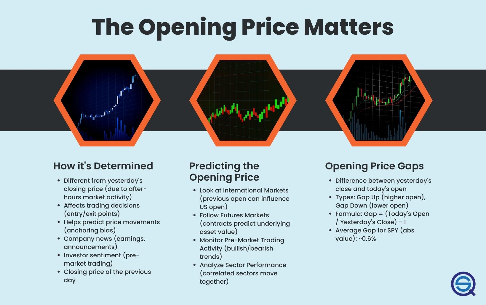

## Table of Contents

## What is the opening price of a stock?

The opening price of a stock is the price at which it starts trading at the beginning of a trading day. When the stock market opens, usually at 9:30 AM Eastern Time in the United States, the first trade of a stock sets its opening price. This price can be different from the closing price of the previous day because many things can happen overnight that might change how people feel about the stock.

The opening price is important because it gives traders and investors a starting point for the day. It can show if the stock is going up or down right away. If many people want to buy the stock, the opening price might be higher. If more people want to sell, it might be lower. Watching the opening price helps people decide if they should buy or sell the stock during the day.

## Why is the opening price important for investors?

The opening price is important for investors because it shows them how the stock is doing at the start of the trading day. It's like a first impression that can tell investors if the stock is going up or down right away. If the opening price is higher than the closing price from the day before, it might mean that more people want to buy the stock. If it's lower, it could mean that more people want to sell. This information helps investors decide if they should buy or sell the stock during the day.

Also, the opening price can be affected by news or events that happened overnight. For example, if a company announces good news after the market closes, the stock might open at a higher price the next day because more people want to buy it. On the other hand, bad news might make the stock open at a lower price. By looking at the opening price, investors can get a quick idea of how the market feels about the stock and make better decisions about their investments.

## How does the previous day's closing price affect the opening price?

The previous day's closing price can affect the opening price because it sets a starting point for the next day. If nothing big happens overnight, the opening price might be close to the closing price from the day before. But, if something important happens, like a company announcing good or bad news, the opening price can be very different. People look at the closing price to guess what the opening price might be, but they also pay attention to any new information that comes out after the market closes.

For example, if a company's stock closed at $50 and then they announce a new product that everyone likes, the stock might open higher than $50 because more people want to buy it. On the other hand, if the company had to recall a product because it was unsafe, the stock might open lower than $50 because people might want to sell it. So, the closing price gives a starting point, but what happens after the market closes can change the opening price a lot.

## What role do pre-market trading sessions play in determining the opening price?

Pre-market trading sessions happen before the regular stock market opens. They let people buy and sell stocks early in the morning, usually from around 4:00 AM to 9:30 AM Eastern Time. What happens during these sessions can affect the opening price because it shows how people feel about the stock before the market officially opens. If a lot of people are buying a stock in the pre-market, it might push the opening price up. If more people are selling, it might push the opening price down.

The pre-market trading gives a sneak peek into what might happen when the market opens. It's like a rehearsal for the main event. If there's a big change in the stock's price during the pre-market, it can set expectations for the opening price. For example, if a company announces good news after the market closes and the stock goes up a lot in the pre-market, people might expect the opening price to be higher too. This helps investors and traders get ready for the day's trading.

## How do market orders and limit orders influence the opening price?

Market orders and limit orders both play a big role in setting the opening price of a stock. A market order is when someone wants to buy or sell a stock right away at the best available price. When the market opens, all the market orders that were placed before the opening can push the price up or down. If there are more people wanting to buy with market orders than sell, the opening price might be higher because buyers are willing to pay more to get the stock. On the other hand, if more people want to sell with market orders, the opening price might be lower because sellers are trying to get rid of their stock.

Limit orders are a bit different. They let people set a specific price at which they want to buy or sell a stock. If the stock reaches that price, the order will go through. When the market opens, all the limit orders that were placed before the opening can also affect the opening price. If there are a lot of limit orders to buy at a certain price, and that price is higher than the last closing price, it might push the opening price up. If there are many limit orders to sell at a certain price, and that price is lower than the last closing price, it might push the opening price down. So, both market and limit orders help decide where the stock will start trading at the beginning of the day.

## What is the impact of overnight news and events on the opening price?

Overnight news and events can really change the opening price of a stock. If something good happens, like a company announcing a new product that everyone likes, the stock might open at a higher price. This is because more people want to buy the stock after hearing the good news. On the other hand, if there's bad news, like a company having to recall a product because it's unsafe, the stock might open at a lower price. People might want to sell the stock because of the bad news, which makes the price go down.

The stock market is open during the day, but things happen all the time. News and events that happen after the market closes can make people feel differently about a stock. When the market opens the next day, all these feelings show up in the opening price. If the news is big enough, it can cause a lot of buying or selling in the pre-market, which sets the stage for the opening price. So, what happens overnight can have a big impact on where the stock starts trading the next day.

## How does the order imbalance affect the opening price?

Order imbalance is when there are more people wanting to buy a stock than sell it, or more people wanting to sell than buy. This imbalance can really affect the opening price. If there are a lot more people wanting to buy a stock than sell it, the opening price might go up. That's because buyers are willing to pay more to get the stock. On the other hand, if there are a lot more people wanting to sell than buy, the opening price might go down. Sellers are trying to get rid of their stock, so they might accept a lower price.

The order imbalance is important because it shows what people are thinking about the stock before the market opens. If there's a big difference between the number of buy and sell orders, it can push the opening price in one direction. For example, if a company announces good news after the market closes, more people might want to buy the stock in the pre-market, creating a buy imbalance. This would likely make the opening price higher. If the news is bad, more people might want to sell, creating a sell imbalance, and the opening price would likely be lower.

## What is the role of the opening auction in setting the opening price?

The opening auction is a process that happens at the start of the trading day to help set the opening price of a stock. It's like a big meeting where all the buy and sell orders that were placed before the market opened come together. The goal is to find a price that makes as many people happy as possible. If there are a lot of people wanting to buy and not as many wanting to sell, the opening price might be higher. If more people want to sell than buy, the opening price might be lower.

During the opening auction, the stock exchange looks at all the orders and tries to find a price where the most trades can happen. This is called the "equilibrium price." It's the price where the number of shares people want to buy matches the number of shares people want to sell. Once this price is found, the stock starts trading at that price for the day. The opening auction helps make sure the opening price is fair and reflects what people really think about the stock at the start of the day.

## How do electronic trading systems contribute to the determination of the opening price?

Electronic trading systems help set the opening price by making it easier for people to buy and sell stocks before the market opens. These systems let people place orders at any time, even when the market is closed. When the market is about to open, the electronic system collects all these orders and uses them to figure out the opening price. It looks at how many people want to buy the stock and how many want to sell it. If more people want to buy than sell, the opening price might go up. If more people want to sell than buy, the opening price might go down.

The electronic trading system also helps with the opening auction, which is like a big meeting where all the orders come together. The system tries to find a price that makes the most people happy. It does this by matching up the buy and sell orders to find a price where the number of shares people want to buy is the same as the number of shares people want to sell. This price becomes the opening price for the day. So, electronic trading systems play a big role in making sure the opening price is fair and reflects what people really think about the stock.

## What are the differences in opening price determination between major stock exchanges?

Different major stock exchanges have their own ways to figure out the opening price of a stock. For example, the New York Stock Exchange (NYSE) uses an opening auction to set the opening price. During this auction, all the buy and sell orders that were placed before the market opens are looked at. The NYSE tries to find a price where the most trades can happen, which is called the equilibrium price. This price is where the number of shares people want to buy matches the number of shares people want to sell. Once this price is found, it becomes the opening price for the day.

The Nasdaq, another big stock exchange, also uses an opening auction but does it a bit differently. Nasdaq's system is fully electronic, so it collects all the orders placed before the market opens and uses a computer to find the best opening price. Like the NYSE, it looks for an equilibrium price where the number of shares people want to buy equals the number of shares people want to sell. But because Nasdaq is all electronic, it can handle a lot of orders very quickly. Both exchanges want to make sure the opening price is fair and reflects what people think about the stock at the start of the day, but they use different methods to get there.

## How can algorithmic trading strategies affect the opening price?

Algorithmic trading strategies can change the opening price of a stock by placing lots of orders before the market opens. These strategies use computer programs to buy or sell stocks based on certain rules. If many algorithmic traders decide to buy a stock, it can create a big demand for that stock. This might make the opening price go up because there are more people wanting to buy than sell. On the other hand, if lots of algorithmic traders want to sell a stock, it can create a big supply, which might make the opening price go down.

These strategies can also affect the opening price by trying to find the best price during the opening auction. The opening auction is when all the orders come together to find a fair price for the stock to start trading. Algorithmic traders can place orders that are smart enough to change based on what's happening in the market. If they see that the stock price is going up, they might place orders to buy at higher prices. If they see the price going down, they might place orders to sell at lower prices. This can push the opening price one way or the other, depending on what the algorithms are doing.

## What advanced statistical models are used to predict the opening price of a stock?

Advanced statistical models used to predict the opening price of a stock often include time series analysis and [machine learning](/wiki/machine-learning) techniques. Time series analysis looks at past prices and other data to find patterns that can help guess what the opening price might be. For example, it might use data like the closing price from the day before, how the stock has moved in the past, and even things like how the overall market did. By understanding these patterns, the model can make a prediction about where the stock might open.

Machine learning models, like neural networks and regression models, are also used to predict the opening price. These models can look at a lot of different information at once, such as news articles, social media posts, and economic reports, to find clues about how people feel about the stock. They learn from this data over time to get better at predicting the opening price. Both time series analysis and machine learning try to use all the information available to make the best guess about what the opening price will be.

## How can we optimize strategy performance?

Optimizing strategy performance in [algorithmic trading](/wiki/algorithmic-trading) involves both risk management and diversification, as well as the integration of various types of market data. Effective risk management ensures that potential losses are minimized, allowing traders to maintain financial stability. Diversification, on the other hand, spreads exposure across different assets or instruments, reducing the impact of adverse price movements in any single position.

**Risk Management**

Risk management is crucial for controlling drawdowns and enhancing the resilience of trading strategies. Key elements include position sizing, stop-loss orders, and risk-reward ratios. 

- **Position Sizing:** Correct position sizing is essential to ensure that trades don't exceed a certain percentage of the account balance, protecting it from significant losses. Traders often use the formula:
$$
  \text{Position Size} = \frac{\text{Account Risk}}{\text{Trade Risk}}

$$

  where account risk is a predefined percentage of capital at risk, and trade risk is the difference between the entry price and the stop-loss price.

- **Stop-Loss Orders:** Placing stop-loss orders automatically limits losses by closing positions if the market moves unfavorably. This control mechanism can prevent small losses from escalating.

- **Risk-Reward Ratios:** These ratios help evaluate the potential return of a trade relative to risk. A typical strategy may aim for a 1:2 risk-reward ratio, meaning that for every dollar risked, the potential gain should be two dollars.

**Diversification**

Diversification involves spreading investments across various financial instruments to mitigate unsystematic risk. By holding a diverse portfolio, traders can reduce the [volatility](/wiki/volatility-trading-strategies) of returns as poor performance in one investment is offset by better performance in another. Techniques for diversification include:

- **Asset Allocation:** Diversifying across asset classes like equities, bonds, commodities, and currencies can safeguard against market-specific risks.

- **Sector Diversification:** Within an asset class, exposure to multiple sectors further protects against sector-specific downturns.

- **Geographic Diversification:** Investing across different geographic regions helps shield against country-specific economic or political instability.

**Incorporating Other Market Data**

Enhancing the reliability and profitability of trading strategies can be achieved by integrating various types of market data. These include fundamental data, technical indicators, and sentiment analysis:

- **Fundamental Data:** Incorporating economic indicators, company earnings, and other fundamental data helps predict long-term trends and identify intrinsically undervalued or overvalued assets.

- **Technical Indicators:** Common technical indicators such as moving averages, relative strength index (RSI), and MACD (Moving Average Convergence Divergence) offer insights into market trends and momentum, aiding in entry and exit point decisions.

- **Sentiment Analysis:** Analyzing the sentiment from news articles, social media, and trading forums can provide additional context to market movements and trader behavior. Natural language processing (NLP) is frequently used to automate sentiment analysis.

By meticulously applying risk management principles, diversifying their portfolios, and systematically incorporating varied market data, traders can optimize their strategy performance. Adopting these practices increases the likelihood of steady, reliable returns while mitigating potential losses.

## References & Further Reading

[1]: Bergstra, J., Bardenet, R., Bengio, Y., & Kégl, B. (2011). ["Algorithms for Hyper-Parameter Optimization."](https://proceedings.neurips.cc/paper/2011/file/86e8f7ab32cfd12577bc2619bc635690-Paper.pdf) Advances in Neural Information Processing Systems 24.

[2]: ["Advances in Financial Machine Learning"](https://www.amazon.com/Advances-Financial-Machine-Learning-Marcos/dp/1119482089) by Marcos Lopez de Prado

[3]: ["Evidence-Based Technical Analysis: Applying the Scientific Method and Statistical Inference to Trading Signals"](https://www.amazon.com/Evidence-Based-Technical-Analysis-Scientific-Statistical/dp/0470008741) by David Aronson

[4]: ["Machine Learning for Algorithmic Trading"](https://github.com/stefan-jansen/machine-learning-for-trading) by Stefan Jansen

[5]: ["Quantitative Trading: How to Build Your Own Algorithmic Trading Business"](https://books.google.com/books/about/Quantitative_Trading.html?id=j70yEAAAQBAJ) by Ernest P. Chan