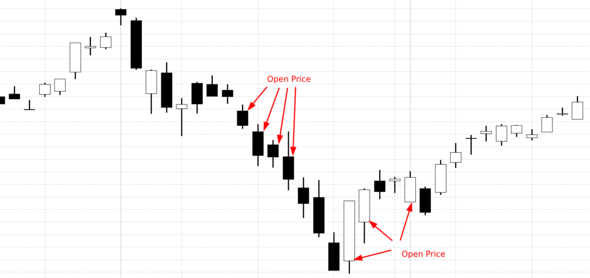

Understanding market open and close prices is a fundamental aspect for traders, particularly those engaged in algorithmic trading. These price points are derived from the start and end of daily trading sessions and are pivotal in determining market trends. By analyzing the gap between the previous day's close and the current day's open, traders can formulate strategies that leverage the resulting price movements.

The previous close is the final price at which a stock or market index ended on the preceding trading day. It serves as a reference point for assessing market sentiment and potential price trajectory. The opening price, on the other hand, is the price at which a stock or index begins trading at the start of the market day. This price is influenced by orders placed during the pre-market session, reflecting overnight news and macroeconomic developments.



Both price points are widely regarded as indicators of investor sentiment and can signal potential continuation or reversal of trends. For example, a higher opening price compared to the previous close might indicate bullish sentiment. Conversely, a lower opening price could suggest bearish conditions. These insights are valuable for traders employing algorithmic strategies that rely on quantitative data to execute trades autonomously.

Algorithmic trading strategies often incorporate the analysis of opening and closing prices to make informed predictions about future movement. By systematically backtesting previous data, traders can refine their strategies to optimize performance. This approach can help identify recurring patterns or anomalies, enabling traders to exploit potential price inefficiencies.

In algo trading, minimizing human emotions and leveraging computational power to process vast datasets lead to a more efficient and objective decision-making process. As such, the effective utilization of previous close and today's open prices forms a cornerstone of various trading algorithms. This article will examine the methodological significance of these price points, their influence on trading strategies, and the ways traders can harness this information to develop robust algo trading strategies.

## Table of Contents

## Understanding the Opening and Closing Prices

Understanding the opening and closing prices of a stock is fundamental to trading, providing critical insights into market dynamics and investor sentiment. 

The opening price of a stock is the price at which it first trades upon the opening of the regular trading session. It is determined by the supply and demand dynamics in the pre-market trading sessions and any overnight news or events that might have influenced investor sentiment. Prior to the official market opening, orders are accumulated, and the opening price is set such that it maximizes [volume](/wiki/volume-trading-strategy) and resolves the greatest number of buy and sell orders. This process is typically managed by an auction or opening cross, depending on the exchange.

The closing price, on the other hand, is the final price at which a stock trades during the regular trading hours on a given day. It represents the last agreed-upon price between buyers and sellers before the market closes and serves as a point of reference for the following day's trading activities. The closing price is crucial for chart analysis and technical indicators, as well as for settling contracts and assessing daily portfolio valuations.

The difference between the opening price and the previous day's closing price can be attributed to after-hours trading activities or information released post-market that impacts investor perception. These price differences can lead to gaps, which are significant in trading strategies as they may indicate shifts in market sentiment or the potential continuation or reversal of a trend. Understanding these price points helps traders anticipate market movements and make informed decisions based on systematic analysis.

## Factors Influencing Opening and Closing Prices

Opening and closing prices of stocks are determined by multiple factors, reflecting the dynamic nature of financial markets. These prices are not merely random but are rather influenced by an interplay of several elements, each with its specific impact and timing.

**Earnings Reports and Corporate Announcements**

Earnings reports are among the primary drivers of stock prices. These are quarterly summaries released by publicly traded companies, detailing their financial performance. If a company reports higher-than-expected earnings, its stock price might open significantly higher the next day. Conversely, poor earnings results can cause the opening price to fall. Additionally, corporate announcements such as mergers and acquisitions, changes in executive leadership, or product launches can heavily impact stock prices by altering investor expectations about the company’s future profitability.

**Market News and Economic Indicators**

Market news, including information about industry trends and regulatory changes, can swiftly alter investor sentiment. Economic indicators such as unemployment rates, inflation data, and GDP growth reports also play a critical role. For instance, a positive economic report might lead to an increase in stock prices due to investor optimism about economic growth, driving up both opening and closing prices. Conversely, negative news can induce market pessimism, leading to decreased stock prices.

**Global Events and Geopolitical Tensions**

Global events, including geopolitical tensions, natural disasters, and pandemics, can exert substantial pressure on stock prices. Such events often cause market participants to reassess risk and asset allocation strategies, resulting in market [volatility](/wiki/volatility-trading-strategies). For example, geopolitical unrest might lead to increased risk aversion, negatively affecting the opening prices as investors sell off stocks perceived as risky.

**Psychological and Economic Motivations**

Traders pay close attention to opening and closing prices for psychological and economic reasons. Economically, these prices offer snapshots of market sentiment and [liquidity](/wiki/liquidity-risk-premium) at crucial times. The opening price reflects market sentiment after hours of overnight news, while the closing price reflects the consensus reached after a full day of trading. Psychologically, these prices can become self-fulfilling prophecies; traders may adjust their behavior based on perceived support and resistance levels created by prior opening and closing prices. Cognitive biases, such as anchoring to these prices, can also influence trading decisions.

Understanding these factors is essential for developing trading strategies, especially those based on price movements. By analyzing how and why these prices change, traders can better forecast future price trends and adjust their strategies to maximize profitability.

## The Role of Price Gaps in Trading

Price gaps in trading are the differences between the closing price of a security on one trading day and its opening price on the subsequent trading day. These gaps occur because of significant after-hours news, economic data releases, or substantial changes in market sentiment that lead to an imbalance between supply and demand when the market opens. Traders are often unable to transact at the previous close price, resulting in a discrepancy when trading resumes.

### Types of Price Gaps

1. **Common Gaps**: These gaps are typically unremarkable and occur in quiet trading conditions. They are not usually associated with a big news event and often fill quickly, meaning the price returns to the level before the gap.

2. **Breakaway Gaps**: These happen when a price gap forms upon the breakout from a consolidation area or a pattern such as a head and shoulders or triangle. They indicate the start of a trend and usually occur with higher volume, making them significant in identifying new market sentiment directions.

3. **Runaway (Continuation) Gaps**: These gaps occur within an existing trend and suggest that the trend will continue. They are typically driven by increasing momentum and may happen after a news release that supplements the ongoing trend's narrative.

4. **Exhaustion Gaps**: Occurring near the end of a significant price trend, exhaustion gaps can indicate that the prevailing move is losing steam. This type of gap is often filled quickly as buyers or sellers take profits, and it might signal an imminent reversal.

### Significance in Trading Strategies

The different types of price gaps have distinct implications for trading strategies. Breakaway gaps, for instance, can be valuable when initiating a position in the direction of the gap, as they often lead to significant price moves. Traders might look for increased volume to confirm the gap's authenticity. Runaway gaps provide opportunities to add to a position in a trending market, capitalizing on continued [momentum](/wiki/momentum).

On the other hand, exhaustion gaps can offer contrarian trading opportunities. If identified correctly, they allow traders to position for a reversal, assuming the initial price move has run its [course](/wiki/best-algorithmic-trading-courses).

### When Price Gaps Present Good Trading Opportunities

Price gaps present good trading opportunities when they are supported by additional indicators that confirm market sentiment. For example, if a breakaway gap is confirmed by higher than average volume, it may provide a robust signal for entering a new position. Similarly, runaway gaps supported by increasing trading volumes can be opportunities to strengthen a position within the prevailing trend.

Traders also consider market context when evaluating gaps. For instance, gaps occurring at the beginning of major trading sessions, such as after a weekend or a public holiday, might [carry](/wiki/carry-trading) more weight owing to accumulated sentiment shifts that occur during market closures.

In summary, understanding the role of price gaps and their characteristics helps traders make informed decisions. Successfully leveraging these gaps requires a keen awareness of accompanying market forces and technical signals that validate the gap's significance.

## Developing an Algorithmic Trading Strategy using Opening and Closing Prices

Creating an [algorithmic trading](/wiki/algorithmic-trading) strategy using opening and closing prices involves a systematic process of analyzing historical data, formulating trading rules, and continually refining the strategy based on performance. This process begins with understanding the significance of these price points: the opening price reflects market sentiment and overnight news incorporation, while the closing price captures investor sentiment by the end of the trading session.

### Outline of an Algorithmic Trading Strategy

1. **Data Collection and Preparation**: Gather historical data on opening and closing prices for your assets of interest, such as stocks or ETFs. Data can often be sourced from financial data providers or APIs like Yahoo Finance or Alpha Vantage.

2. **Rule Formation**: Establish the criteria that will trigger buy or sell actions. For example, a simple strategy could involve buying if today's opening price is higher than the previous day's closing price, suggesting bullish momentum, and selling if the inverse is true.

3. **Backtesting**: Backtesting involves applying your trading strategy to historical data to evaluate its performance. This step is crucial to validate the effectiveness of the strategy before live trading. Metrics such as return on investment (ROI), Sharpe ratio, and maximum drawdown are typically used to assess performance.

   For example, using Python's `pandas` and `numpy` libraries, one might write:

   ```python
   import pandas as pd
   import numpy as np

   data = pd.read_csv('historical_data.csv')  # Load your historical data
   data['Signal'] = np.where(data['Open'] > data['Close'].shift(1), 1, -1)  # Buy if today's open > yesterday's close

   data['Returns'] = data['Close'].pct_change() * data['Signal'].shift(1)
   strategy_returns = data['Returns'].cumsum()
   ```

4. **Performance Analysis**: Analyze the results of backtesting to determine profitability and identify risks. Successful strategies show consistent returns with acceptable risk levels as indicated by performance metrics.

5. **Optimization and Refinement**: Revise the strategy based on backtesting outcomes. Optimization may involve adjusting parameters or incorporating additional indicators, such as moving averages or RSI, to refine buy and sell signals.

### Analyzing Past Performance and Common Pitfalls

Analyzing past performance involves measuring how well the strategy would have performed using historical data. This can include statistical measures such as mean returns or volatility, and graphical analysis such as plotting equity curves.

**Common Pitfalls**:

- **Overfitting**: This occurs when a strategy is too tailored to historical data, capturing noise instead of signal. It often leads to poor performance in real market conditions. To mitigate overfitting, one should use out-of-sample testing and walk-forward analysis.

- **Ignoring Transaction Costs**: Real-world trading involves costs such as commissions and slippage, which can significantly affect strategy profitability. Always incorporate these into backtesting.

- **Inadequate Data**: Limited historical data can lead to unreliable results. Ensure the dataset is comprehensive, covering various market conditions.

- **Market Regime Changes**: Historical performance doesn't guarantee future success due to potential shifts in market dynamics, such as changes in volatility or macroeconomic factors.

By carefully constructing and testing a strategy with these considerations in mind, traders can develop robust trading algorithms that effectively leverage opening and closing prices. These strategies must be continually monitored and adjusted to adapt to evolving market conditions.

## Case Study: Backtesting an Opening Price Strategy

Backtesting an opening price strategy involves using historical data to evaluate the effectiveness of trading strategies that rely on the opening prices of assets. Here, we explore a simplified case study using the SPDR S&P 500 [ETF](/wiki/etf-trading-strategies) Trust (SPY), a popular exchange-traded fund that tracks the S&P 500 index.

### Selection of Trading Strategy

The strategy in question involves comparing the opening price of SPY with its previous day's closing price to generate trading signals. The basic rules can be outlined as follows:

- If today's opening price is higher than yesterday's closing price, initiate a buy order at the opening.
- If today's opening price is lower than yesterday's closing price, initiate a sell order at the opening.

### Backtesting Methodology

The [backtesting](/wiki/backtesting) process can be implemented using Python with the following steps:

1. **Data Collection:**
   Obtain historical price data for SPY using data libraries like `pandas_datareader` or APIs from financial market data providers. This data should include Open, High, Low, Close (OHLC) prices and dates.

   ```python
   import pandas as pd
   import pandas_datareader.data as web
   from datetime import datetime

   start_date = datetime(2020, 1, 1)
   end_date = datetime(2023, 1, 1)
   data = web.DataReader('SPY', 'yahoo', start_date, end_date)
   ```

2. **Signal Generation:**
   Generate buy or sell signals based on the strategy rules by comparing today's opening price with the prior day's closing price.

   ```python
   data['Signal'] = 0
   data.loc[data['Open'] > data['Close'].shift(1), 'Signal'] = 1  # Buy Signal
   data.loc[data['Open'] < data['Close'].shift(1), 'Signal'] = -1 # Sell Signal
   ```

3. **Performance Evaluation:**
   Evaluate the strategy by examining the returns generated by each trade. Calculate the cumulative returns over the backtesting period to assess the strategy's performance.

   ```python
   data['Returns'] = data['Signal'].shift(1) * (data['Close'] - data['Open']) / data['Open']
   data['Cumulative Returns'] = (1 + data['Returns']).cumprod()
   ```

4. **Analysis of Results:**
   Analyze key performance metrics such as total return, average return per trade, and volatility.

### Discussion on Adjusting Strategies

Backtesting results can reveal insights into the strategy's strengths and weaknesses. It is essential to adjust the strategy based on these findings to enhance performance. Potential adjustments could include:

- **Parameter Tuning:** Optimize the entry and exit conditions by experimenting with different thresholds or times of day to place trades, potentially improving profitability.
- **Risk Management:** Implement risk controls such as stop-loss orders or position sizing to manage drawdowns and reduce volatility.
- **Incorporating Additional Indicators:** Combine the opening price strategy with other technical indicators, like moving averages or relative strength index, to refine trade signals and filter out noise.

### Conclusion

Backtesting an opening price strategy offers a systematic approach to evaluate its viability before live trading. Adjustments based on historical performance can increase its robustness and adaptability to changing market conditions. Nonetheless, traders must be cautious about overfitting to historical data, ensuring that the strategy remains relevant in current market environments.

## Optimizing Strategy Performance

Optimizing strategy performance in algorithmic trading involves both risk management and diversification, as well as the integration of various types of market data. Effective risk management ensures that potential losses are minimized, allowing traders to maintain financial stability. Diversification, on the other hand, spreads exposure across different assets or instruments, reducing the impact of adverse price movements in any single position.

**Risk Management**

Risk management is crucial for controlling drawdowns and enhancing the resilience of trading strategies. Key elements include position sizing, stop-loss orders, and risk-reward ratios. 

- **Position Sizing:** Correct position sizing is essential to ensure that trades don't exceed a certain percentage of the account balance, protecting it from significant losses. Traders often use the formula:
$$
  \text{Position Size} = \frac{\text{Account Risk}}{\text{Trade Risk}}

$$

  where account risk is a predefined percentage of capital at risk, and trade risk is the difference between the entry price and the stop-loss price.

- **Stop-Loss Orders:** Placing stop-loss orders automatically limits losses by closing positions if the market moves unfavorably. This control mechanism can prevent small losses from escalating.

- **Risk-Reward Ratios:** These ratios help evaluate the potential return of a trade relative to risk. A typical strategy may aim for a 1:2 risk-reward ratio, meaning that for every dollar risked, the potential gain should be two dollars.

**Diversification**

Diversification involves spreading investments across various financial instruments to mitigate unsystematic risk. By holding a diverse portfolio, traders can reduce the volatility of returns as poor performance in one investment is offset by better performance in another. Techniques for diversification include:

- **Asset Allocation:** Diversifying across asset classes like equities, bonds, commodities, and currencies can safeguard against market-specific risks.

- **Sector Diversification:** Within an asset class, exposure to multiple sectors further protects against sector-specific downturns.

- **Geographic Diversification:** Investing across different geographic regions helps shield against country-specific economic or political instability.

**Incorporating Other Market Data**

Enhancing the reliability and profitability of trading strategies can be achieved by integrating various types of market data. These include fundamental data, technical indicators, and sentiment analysis:

- **Fundamental Data:** Incorporating economic indicators, company earnings, and other fundamental data helps predict long-term trends and identify intrinsically undervalued or overvalued assets.

- **Technical Indicators:** Common technical indicators such as moving averages, relative strength index (RSI), and MACD (Moving Average Convergence Divergence) offer insights into market trends and momentum, aiding in entry and exit point decisions.

- **Sentiment Analysis:** Analyzing the sentiment from news articles, social media, and trading forums can provide additional context to market movements and trader behavior. Natural language processing (NLP) is frequently used to automate sentiment analysis.

By meticulously applying risk management principles, diversifying their portfolios, and systematically incorporating varied market data, traders can optimize their strategy performance. Adopting these practices increases the likelihood of steady, reliable returns while mitigating potential losses.

## Advantages and Challenges of Using Price-based Strategies in Algo Trading

Price-based strategies in algorithmic trading offer numerous benefits, making them an appealing choice for traders seeking efficiency and objectivity. First and foremost, such strategies capitalize on the speed and computational power of algorithms. They can analyze vast datasets, identify patterns, and execute trades faster than any human trader, enabling them to capitalize on fleeting market opportunities. This speed is particularly critical in markets where changes can occur within fractions of a second, providing a significant edge over traditional trading methods.

Another advantage of price-based strategies is enhanced efficiency. By automating trading decisions based on predefined criteria, algorithms reduce the need for manual intervention, helping traders manage large portfolios with relative ease. This automation streamlines operations and minimizes the likelihood of human errors, such as miscalculations or delayed reactions to market shifts. Furthermore, algorithms eliminate emotional biases that can cloud judgment and lead to suboptimal trading decisions. Strategies based purely on data-driven indicators remain objective and consistent, regardless of market euphoria or panic.

Despite these advantages, price-based strategies in algo trading are not without challenges. A primary concern is their reliance on accurate and timely data. The effectiveness of algorithms depends largely on the quality of input data. Any inaccuracies or delays in data sourcing can lead to erroneous trading decisions and significant financial losses. This necessitates robust systems for data collection, validation, and processing.

Additionally, there is a considerable risk of overfitting when developing these strategies. Overfitting occurs when a model is tailored too closely to historical data, capturing noise instead of useful signals. This can result in strategies that perform exceptionally well on past data but poorly in real-world scenarios. To mitigate this, traders must ensure adequate validation and testing, incorporating techniques such as cross-validation to assess a model's robustness. Regular updates and adjustments based on new data and market conditions are also crucial to maintaining the effectiveness of price-based strategies.

In summary, while price-based strategies in algorithmic trading offer significant advantages in speed, efficiency, and objectivity, they also present challenges, notably in data integrity and the risk of overfitting. By addressing these challenges, traders can harness the full potential of these strategies to achieve more reliable and profitable trading outcomes.

## Conclusion

In this article, we have examined the critical role that opening and closing prices play in algorithmic trading strategies. These price points provide vital information that can influence trading decisions, offering insights into market sentiment and potential price movements. By understanding how these prices are determined and influenced by factors such as economic reports and global events, traders can craft strategies that capitalize on price fluctuations.

The significance of price gaps was also highlighted, illustrating how they present unique trading opportunities. These gaps can signal shifts in trader sentiment or market conditions, serving as crucial indicators for potential trades. Traders leveraging these gaps can enhance their strategies to optimize profitability.

Algorithmic trading strategies that utilize historical opening and closing prices allow for backtesting, a process which assesses past performance to forecast future price actions. This method, when combined with risk management and diversification techniques, can enhance strategy reliability and efficiency.

However, traders must be cautious of over-reliance on historical data and the risk of overfitting strategies to that data. It's imperative to maintain a balance between automation and human oversight, ensuring that algorithmic strategies are adaptable to current market dynamics.

In conclusion, the potential of using opening and closing prices in algorithmic trading strategies is substantial. These prices offer a foundation for developing strategies that can lead to speed, efficiency, and emotional neutrality in trading. Nonetheless, traders should remain aware of the inherent risks and ever-evolving market conditions, anchoring their strategies on robust, data-driven insights.

## FAQs

### FAQs

**1. What is the difference between the previous close price and today's open price?**

The previous close price is the last price at which a stock trades during a regular trading session on a given day. Today's open price, however, is the first price at which a stock trades at the start of the next trading session. These prices often differ because of after-hours trading, news releases, or other market activities occurring overnight.

**2. How do traders use opening and closing prices in trading strategies?**

Traders use opening and closing prices as indicators of market sentiment and potential future price movements. For instance, a strategy might involve buying a stock if today's open price is significantly lower than the previous close, anticipating a rebound. Conversely, if the open price is much higher, traders might sell, expecting a decline.

**3. What are price gaps, and how do they impact trading strategies?**

Price gaps occur when there is a significant difference between the previous day's closing price and the current day's opening price, with no trading happening in between. There are several types of gaps:
- **Common Gaps**: Often insignificant and quickly filled.
- **Breakaway Gaps**: Indicate the start of a new trend and are not typically filled.
- **Continuation (Runaway) Gaps**: Occur during strong market trends, suggesting further movement in the same direction.
- **Exhaustion Gaps**: Signal the end of a market trend and are typically followed by a reversal.

Gaps can offer strategic trading opportunities, such as leveraging breakaway gaps for [breakout](/wiki/breakout-trading) trades or exploiting exhaustion gaps for reversals.

**4. What is backtesting, and why is it important in algorithmic trading?**

Backtesting involves applying a trading strategy to historical market data to evaluate its potential effectiveness. It helps traders understand how a strategy might perform in real market conditions by analyzing past price movements. Reliable backtesting can highlight potential weaknesses in a strategy and improve its profitability by refining its rules.

**5. How can one avoid common pitfalls in algorithmic trading strategies based on opening and closing prices?**

Common pitfalls include overfitting, where a strategy is too complex and tailored to historical data, making it ineffective on new data. To avoid this, keep strategies simple and robust, ensure ample data diversity, and regularly update and test the strategy under varying conditions. It's also crucial to consider transaction costs and slippage, which can undermine profitability in real trading.

**6. Can opening and closing price-based strategies work with all stocks?**

Not all stocks are suitable for opening and closing price-based strategies. Stocks with high liquidity and volatility are generally more responsive to these strategies, offering better trading opportunities. It's essential to analyze specific stock characteristics before implementing such strategies.

**7. What role does technology play in optimizing price-based algorithmic trading?**

Technology is pivotal in algorithmic trading, enabling real-time data analysis and strategy execution at high speed and volume. Modern platforms facilitate backtesting, risk management, and strategy optimization through advanced computational tools, enhancing strategy reliability and performance. Access to robust technology can significantly increase the effectiveness of price-based strategies.

## References & Further Reading

[1]: Bergstra, J., Bardenet, R., Bengio, Y., & Kégl, B. (2011). ["Algorithms for Hyper-Parameter Optimization."](https://proceedings.neurips.cc/paper/2011/file/86e8f7ab32cfd12577bc2619bc635690-Paper.pdf) Advances in Neural Information Processing Systems 24.

[2]: ["Advances in Financial Machine Learning"](https://www.amazon.com/Advances-Financial-Machine-Learning-Marcos/dp/1119482089) by Marcos Lopez de Prado

[3]: ["Evidence-Based Technical Analysis: Applying the Scientific Method and Statistical Inference to Trading Signals"](https://www.amazon.com/Evidence-Based-Technical-Analysis-Scientific-Statistical/dp/0470008741) by David Aronson

[4]: ["Machine Learning for Algorithmic Trading"](https://github.com/stefan-jansen/machine-learning-for-trading) by Stefan Jansen

[5]: ["Quantitative Trading: How to Build Your Own Algorithmic Trading Business"](https://books.google.com/books/about/Quantitative_Trading.html?id=j70yEAAAQBAJ) by Ernest P. Chan