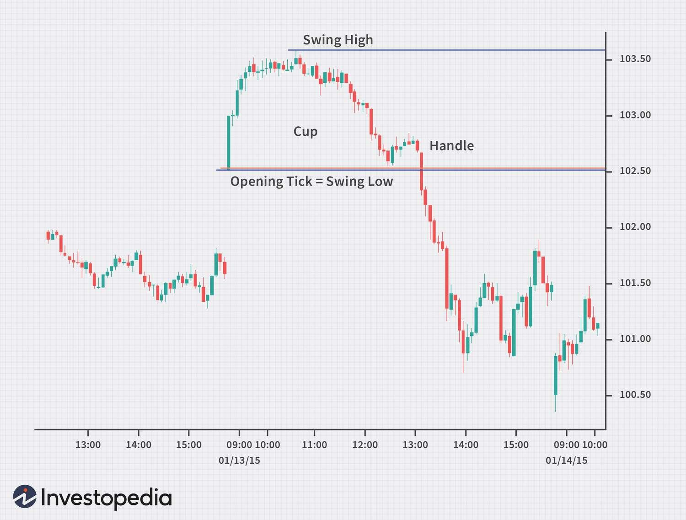

Investment trading has undergone a profound transformation with the advent of algorithmic techniques, which have shifted the landscape from simple traditional methodologies to a technologically advanced and data-driven discipline. At the forefront of this evolution are the Opening Price Principle and algorithmic trading, two sophisticated strategies that hold significant relevance for contemporary investors. 

The Opening Price Principle hinges on the hypothesis that the initial trades of the trading day can serve as crucial indicators for subsequent market behavior, establishing potential support and resistance levels. Proponents of this principle, such as Larry Pesavento, have demonstrated how these early price signals can be instrumental in forecasting the trading range for the day and identifying optimal entry and exit points throughout the session.



On the other hand, algorithmic trading, commonly referred to as "algo trading," involves the use of complex algorithms to automate trade executions based on predetermined criteria. By harnessing vast amounts of real-time and historical data, these systems rapidly identify trading opportunities that might otherwise be imperceptible to human traders. The integration of algorithms in trading facilitates not only enhanced speed and efficiency but also emotion-free decision-making — executing trades based solely on quantitative data and pre-established protocols.

This article examines the intersection of these two advanced trading strategies, focusing on their respective benefits, implementation mechanisms, and overall impact on improving trading efficiency and profitability. As the financial markets continue to evolve, these strategies offer investors a competitive edge by utilizing technological advancements to optimize trading decisions and maximize investment returns.

## Table of Contents

## Understanding the Opening Price Principle

The Opening Price Principle is a key concept in trading that posits the first trade of the day often acts as a significant influence on market trends and price movements throughout the trading session. This principle suggests that the opening price serves as a psychological and technical anchor for traders, setting the tone for the day's price action.

Larry Pesavento, a well-known trader and author, highlighted the importance of opening prices in establishing potential support and resistance levels. Support is defined as a price level where a downtrend can be expected to pause due to a concentration of demand, while resistance is a price level where an uptrend can be expected to pause due to a concentration of supply. The opening price can act as an early indication of where these levels might appear during the trading day.

Traders use the Opening Price Principle to predict the day's trading range, helping to formulate strategic entry and [exit](/wiki/exit-strategy) points. By analyzing the opening price relative to previous price patterns, such as gaps or overnight movements, traders can anticipate price fluctuations and adjust their strategies accordingly.

Mathematically, this principle can be represented by assessing the relationship between the opening price (O), high (H), low (L), and closing prices (C) of a trading session. For example, traders might calculate the potential range for the day using the formula:

$$
\text{Estimated Range} = H - L
$$

Understanding these dynamics allows traders to identify potential pivot points, helping them to manage risk more effectively. For instance, if the opening price is closer to the high of the previous day, it may suggest bullish sentiment, whereas proximity to the low could imply bearish trends.

Integrating the Opening Price Principle into trading algorithms can further enhance its predictive power. By automating the tracking of opening prices and analyzing their relationship with historical data, traders can swiftly capitalize on emerging opportunities, making informed decisions with greater efficiency.

## How Algo Trading Works

Algorithmic trading, often known as 'algo trading,' refers to the practice of using computer software to execute trading strategies based on pre-defined criteria. This approach leverages mathematical models and algorithms to decide the timing, pricing, and quantity of trades, thus automating the process and removing human biases and emotions from trading decisions. The core functionality of algo trading involves three fundamental components: data input, algorithm analysis, and automated trade execution.

First, data input is a critical element as these systems rely on a vast array of both real-time and historical data to identify potential trading opportunities. Real-time data feeds, which include price quotes, [volume](/wiki/volume-trading-strategy) information, and market depth, provide traders with up-to-the-second information necessary to respond to instantaneous market changes. Historical data, on the other hand, is utilized to back-test trading strategies and refine the algorithms for optimal functionality. This data is collected using APIs or direct feeds from exchanges and financial information providers.

Next, the heart of [algorithmic trading](/wiki/algorithmic-trading), algorithm analysis involves the use of advanced mathematical models to analyze the data inputs. These algorithms are designed to recognize patterns or triggers that suggest profitable trading opportunities. For example, a moving average crossover strategy might generate a buy signal when a short-term moving average crosses above a long-term moving average. The algorithm's logic is coded into software, which allows for processing vast amounts of data with speed and precision. Python is a common programming language used due to its versatility and robust libraries like NumPy and pandas for data analysis, as well as scikit-learn for [machine learning](/wiki/machine-learning) applications.

```python
import numpy as np
import pandas as pd

# Sample moving average crossover algorithm
def moving_average_crossover(data, short_window=40, long_window=100):
    signals = pd.DataFrame(index=data.index)
    signals['price'] = data['price']
    signals['short_mavg'] = data['price'].rolling(window=short_window, min_periods=1, center=False).mean()
    signals['long_mavg'] = data['price'].rolling(window=long_window, min_periods=1, center=False).mean()
    signals['signal'] = 0.0  
    signals['signal'][short_window:] = np.where(signals['short_mavg'][short_window:] > signals['long_mavg'][short_window:], 1.0, 0.0)   
    signals['positions'] = signals['signal'].diff()
    return signals
```

Lastly, automated trade execution transforms the analysis into action. Once a trading signal is generated by the algorithm, the system automatically executes buy or sell orders. This execution is typically carried out through direct market access (DMA) for real-time order placement. Automated systems allow for rapid execution of trades, often in milliseconds, which can be essential for capturing favorable pricing in fast-moving markets.

Overall, algo trading exerts high efficiency and enhances decision-making, as it eliminates the delay and potential errors associated with manual trading. As a result of these attributes, algorithmic trading has become an indispensable tool in modern financial markets, adopted by traders who seek to enhance performance and maximize returns.

## Benefits of Algo Trading

Algorithmic trading (algo trading) provides a multitude of benefits that have revolutionized the landscape of modern investment trading. By automating trade execution using predefined rules and sophisticated algorithms, traders can achieve unparalleled speed and efficiency. Trades are executed in milliseconds, a capability that is beyond human reach and allows for the rapid exploitation of fleeting market opportunities.

Moreover, algo trading eliminates emotional biases from decision-making processes. Decisions are based solely on data-driven insights and pre-set protocols, which can significantly reduce the impact of human emotions such as fear and greed that often lead to suboptimal trading decisions. This systematic approach ensures consistent adherence to strategy regardless of market [volatility](/wiki/volatility-trading-strategies).

Backtesting and optimization are integral features of algo trading. Backtesting involves running a trading strategy against historical data to evaluate its effectiveness before implementation. This allows for the refinement of strategies by adjusting parameters and rules to optimize performance. For example, Python libraries such as pandas and NumPy can be utilized to backtest trading algorithms efficiently. Here is a simple example of how [backtesting](/wiki/backtesting) might be implemented:

```python
import pandas as pd

# Load historical data
data = pd.read_csv('historical_data.csv')

# Define the trading strategy
def simple_moving_average_strategy(data, window=20):
    data['SMA'] = data['Close'].rolling(window=window).mean()
    data['Signal'] = 0
    data['Signal'][window:] = np.where(data['Close'][window:] > data['SMA'][window:], 1, -1)
    return data

# Evaluate the strategy
strategy_data = simple_moving_average_strategy(data)
strategy_data.dropna(inplace=True)
strategy_data['Returns'] = strategy_data['Close'].pct_change()
strategy_data['Strategy Returns'] = strategy_data['Signal'].shift(1) * strategy_data['Returns']

# Calculate cumulative returns
cumulative_strategy_returns = (1 + strategy_data['Strategy Returns']).cumprod()
print(cumulative_strategy_returns)
```

This code outlines a simple moving average strategy, where trades are signaled based on crossover of closing prices with a moving average. The strategy returns can be analyzed to refine and optimize further.

These features contribute to the scalability and flexibility of trading strategies. Traders can automate complex strategies across multiple markets and asset classes, expanding their reach without increasing manual workload. The efficiency gained through algo trading ultimately leads to better resource allocation and potentially higher profitability. Consequently, algorithmic trading has become an essential tool for traders seeking to enhance their decision-making processes and optimize their trading success.

## Popular Algo Trading Strategies

Trend-following algorithms are designed to identify and capitalize on persistent price movements in financial markets. These algorithms monitor market data to detect significant price trends and then execute trades to align with the direction of these trends, whether upward or downward. The primary advantage of trend-following strategies is their ability to profit from extended market movements. These algorithms often employ technical indicators such as moving averages and trend lines to determine entry and exit points. For example, a simple moving average crossover strategy may involve buying an asset when its short-term moving average crosses above a long-term moving average, suggesting an uptrend, and selling when the opposite occurs.

Mean reversion strategies are based on the assumption that asset prices will eventually revert to their historical average levels. These strategies involve identifying deviations from an asset's normal trading range and initiating trades that anticipate a return to the mean. Typically, mean reversion algorithms use statistical measures, such as Bollinger Bands or the Z-score, to identify price anomalies. A trade might be triggered when the price of an asset deviates significantly from its mean, with the expectation that it will return to this average over time. Traders employing these strategies must carefully manage risk, as extended deviations can result in significant losses if the asset does not revert as predicted.

High-frequency trading ([HFT](/wiki/high-frequency-trading-strategies)) and statistical [arbitrage](/wiki/arbitrage) are strategies focused on exploiting small price discrepancies across markets or instruments. High-frequency trading utilizes sophisticated technology and low-latency networks to execute a large number of trades within extremely short timeframes, often milliseconds. These algorithms rely heavily on speed and precision to capitalize on transient price inefficiencies that are typically inaccessible to slower market participants.

Statistical arbitrage, on the other hand, involves the identification of price anomalies between related instruments, such as stocks or commodities, and executing offsetting trades to capture the price difference. This strategy often necessitates complex mathematical models to predict relative price movements and quantify expected returns. A typical implementation might involve pairs trading, where a trader shorts one asset and goes long on another with the expectation that their price relationship will converge.

These popular algorithmic trading strategies are instrumental in promoting market efficiency by correcting price inefficiencies. As such, they play a pivotal role in modern financial markets, where technology enables the swift execution of complex trading strategies.

## Implementing the Opening Price Principle in Algorithms

Integrating the Opening Price Principle into algorithmic trading systems can significantly enhance their predictive capabilities. Algorithms can be designed to monitor the opening prices of securities and use this information to make informed trading decisions. The Opening Price Principle suggests that the first traded price of the day often acts as a pivot, indicating potential levels of support and resistance. This observation allows algorithms to predict market movements and strategically align entry and exit points.

In practical terms, incorporating the Opening Price Principle involves developing algorithms that track the opening price and adjust trading strategies in real time. The algorithm can use the opening price as a reference point to identify potential [breakout](/wiki/breakout-trading) or breakdown levels. For instance, if the market price exceeds the opening price after demonstrating resistance, it may signal a breakout, prompting the algorithm to initiate a long position.

To automate this process, a trading algorithm may include the following steps:

1. **Data Collection**: Gather opening prices and real-time market data using an API from a financial data provider.

2. **Signal Generation**: Compare the current market price with the opening price. Define conditions for breakouts (e.g., if current_price > opening_price by a certain threshold) or breakdowns (e.g., if current_price < opening_price by a certain threshold).

3. **Decision Making**: Based on the generated signals, decide whether to enter a trade, exit a trade, or hold the current position.

A simple Python code snippet to illustrate this process:

```python
import requests

def fetch_opening_price(ticker):
    # Mock function to simulate fetching the opening price
    # Replace with API call if necessary
    return 100.0

def fetch_current_price(ticker):
    # Mock function to simulate fetching the current price
    # Replace with API call if necessary
    return 105.0

def check_breakout_breakdown(opening_price, current_price, threshold=0.01):
    # Calculate the price difference ratio
    price_change_ratio = (current_price - opening_price) / opening_price
    if price_change_ratio > threshold:
        return "breakout"
    elif price_change_ratio < -threshold:
        return "breakdown"
    else:
        return "neutral"

# Example
ticker = "AAPL"
opening_price = fetch_opening_price(ticker)
current_price = fetch_current_price(ticker)
signal = check_breakout_breakdown(opening_price, current_price)

print(f"Trading signal for {ticker}: {signal}")
```

This integration is particularly advantageous in intraday trading due to the short-term nature of price movements and the rapid execution provided by algorithms. By leveraging the Opening Price Principle, traders can better anticipate price trends and optimize their trading strategies, maximizing returns while managing risks.

## Choosing the Right Platform for Algo Trading

Selecting the right platform for algorithmic trading is pivotal in leveraging the full potential of automated trading strategies. Platforms like MetaTrader and QuantConnect are highly regarded for their robust tools and comprehensive data sets tailored for algorithm development and testing.

MetaTrader, widely utilized in [forex](/wiki/forex-system) and stock markets, is favored for its user-friendly interface and extensive community support. It offers powerful scripting capabilities through the MQL4 and MQL5 languages, supporting custom indicator creation, automated trading systems, and comprehensive backtesting. Its integrated MetaEditor and Strategy Tester facilitate the development and simulation of trading strategies, allowing traders to optimize their algorithms before executing them in real markets.

QuantConnect, on the other hand, is a versatile and open-source platform designed for algorithmic trading across multiple asset classes including equities, forex, and cryptocurrencies. It provides access to extensive historical data and allows users to write algorithms in C#, F#, and Python, enabling seamless testing and deployment. QuantConnect’s cloud infrastructure offers robust backtesting capabilities, allowing traders to simulate strategies against years of data to evaluate their performance under various market conditions. 

When choosing a trading platform, traders should prioritize the following aspects:

1. **Platform Features**: Evaluate the platform's offerings, such as scripting languages, built-in indicators, and user interface. A platform with comprehensive features can accommodate diverse trading strategies and offer more flexibility.

2. **Customization Capabilities**: Select platforms that allow significant customization to tailor algorithms to specific trading styles and preferences. This ensures that the platform can handle the unique requirements of various trading strategies.

3. **Real-Time Data Access**: Ensure the platform provides reliable access to real-time market data, which is essential for executing trades based on current market conditions. The quality and latency of data streaming can significantly impact the effectiveness of algorithmic strategies.

In conclusion, the selection of a suitable trading platform is an essential step in the successful deployment of algorithmic trading strategies. By considering key platform features, customization options, and real-time data accessibility, traders can significantly enhance their algorithmic trading endeavors and optimize their investment strategies.

## Conclusion

The convergence of the Opening Price Principle and algorithmic trading strategies presents a formidable approach for traders seeking to enhance their market performance. By recognizing the significance of the first trade of the day as a potential indicator of support and resistance levels, traders can glean valuable insights into the day’s potential trading range. When coupled with the precision and speed of algorithmic trading, which executes trades in milliseconds and systematically processes data, this methodology provides a tangible advantage.

As technology continues to redefine trading strategies, embracing these methods allows traders to optimize decision-making processes, eliminating emotions from the equation and relying on data-driven insights. The ability of algorithmic systems to adapt through real-time data assessment ensures that strategies remain relevant and effective in various market conditions, fostering a culture of continuous learning and adaptation.

By integrating the Opening Price Principle with sophisticated algorithms, traders can automate adjustments and strategize with greater accuracy, particularly in volatile intraday scenarios. This integration not only helps in identifying potential market breakouts and breakdowns but also empowers traders with a strategic edge over traditional methods.

To maximize investment potential, staying informed and flexible is crucial. The evolving nature of financial markets demands a commitment to ongoing education and responsiveness to new technological advancements. Leveraging these techniques ensures traders remain competitive, enhancing both profitability and trading efficiency in a rapidly changing landscape.

## References & Further Reading

[1]: Pesavento, L. & Jouflas, L. ("Trade What You See: How To Profit from Pattern Recognition." Wiley Trading).

[2]: ["Advances in Financial Machine Learning"](https://www.amazon.com/Advances-Financial-Machine-Learning-Marcos/dp/1119482089) by Marcos Lopez de Prado

[3]: ["Evidence-Based Technical Analysis: Applying the Scientific Method and Statistical Inference to Trading Signals"](https://www.amazon.com/Evidence-Based-Technical-Analysis-Scientific-Statistical/dp/0470008741) by David Aronson

[4]: ["Machine Learning for Algorithmic Trading"](https://github.com/stefan-jansen/machine-learning-for-trading) by Stefan Jansen

[5]: ["Quantitative Trading: How to Build Your Own Algorithmic Trading Business"](https://github.com/LucindaYa/quant-resources/blob/master/Quantitative%20Trading%20How%20to%20Build%20Your%20Own%20Algorithmic%20Trading%20Business.pdf) by Ernest P. Chan

[6]: Aldridge, I. ("High-Frequency Trading: A Practical Guide to Algorithmic Strategies and Trading Systems." Wiley Trading).

[7]: ["Algo Trading: Winning Strategies and Their Rationale"](https://www.wiley.com/en-us/Algorithmic+Trading%3A+Winning+Strategies+and+Their+Rationale-p-9781118460146) by Ernie Chan