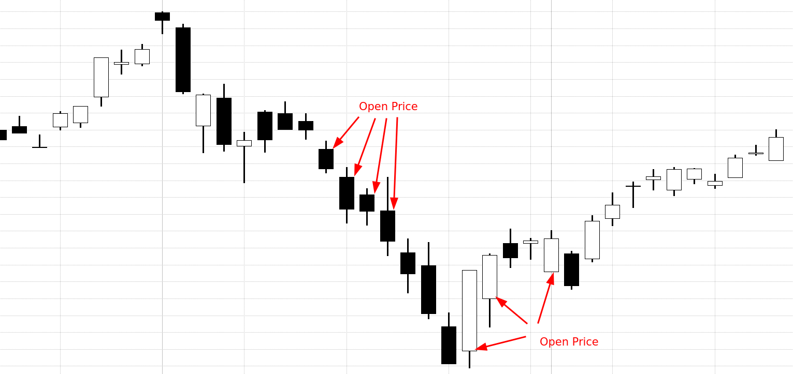

Stock trading strategies have evolved significantly over time, driven by advancements in technology and changes in market structures. From the early days of trading on physical exchange floors, where traders relied on personal intuition and experience, to today's sophisticated electronic trading systems, the evolution has been profound. The transition has been marked by the increased use of mathematical models, statistical analyses, and most recently, algorithmic trading. This evolution reflects the continuous quest for efficiency, speed, and accuracy in executing trades.

A crucial component of these modern trading strategies is the opening price of a stock. The opening price is the price at which a security first trades upon the opening of a market for the day. It provides an initial benchmark for the day's trading session and is influenced by various factors, including premarket activities and overnight news. The significance of the opening price lies in its ability to provide insights into overnight market sentiment and potential price trends for the day. Traders often look for gaps between the closing price of the previous day and the opening price to make strategic decisions about buying or selling.



Algorithmic trading, often referred to as algo trading, has become an essential aspect of the modern financial landscape. It involves using pre-programmed instructions to execute trades based on specific criteria, such as timing, price, or quantity. The advantages of algorithmic trading are manifold: it enhances the speed and efficiency of trading, allows for massive volumes of transactions to be conducted without human intervention, and removes emotional bias from the trading process. Algo trading is not just about executing trades rapidly but also about seizing opportunities for arbitrage and optimizing trading strategies based on quantitative data.

The interplay between the opening price and algorithmic trading offers a fertile ground for developing innovative trading strategies. The opening price provides a foundational data point around which various algo strategies, such as gap trades and opening range breakouts, can be constructed. By integrating data-driven insights from the opening price, traders can enhance the precision and effectiveness of their algorithms, adapting to both long-term trends and short-term market movements.

Technology has undeniably transformed trading strategies by introducing an unprecedented degree of automation and precision. Modern trading platforms equipped with high-frequency trading capabilities and artificial intelligence have redefined market dynamics, allowing for greater data processing and the creation of complex trading algorithms. The confluence of technology and trading strategies continues to push the boundaries of what is possible, offering new opportunities for innovation and analysis.

The purpose of this article is to explore the integration of opening price strategies in algorithmic trading. It seeks to provide a comprehensive understanding of the role that opening prices play in shaping trading algorithms and the myriad of possibilities that arise from leveraging this data. Through the examination of algorithmic strategies and the incorporation of opening price data, we aim to illuminate the evolving nature of trading practices in today's digital age.

## Table of Contents

## Understanding the Opening Price

The opening price of a security is the first price at which it is traded upon the opening of a stock exchange. It plays a crucial role in trading as it sets the initial benchmark for the day's trading session. As a key data point, the opening price offers insights into market sentiment and establishes a baseline for price fluctuations observed throughout the day.

The opening price is distinct from the closing price, which is the last transacted price at the end of a trading session. While the closing price reflects how the market perceived the value of a security at the end of the day, the opening price captures the market sentiment based on all the developments since the previous close. This includes economic indicators, corporate announcements, and geopolitical events that transpired overnight.

Several factors influence the opening price of a security. One of the primary factors is overnight news, which can include diverse elements such as earnings reports, economic data releases, or significant geopolitical events. Another significant component is premarket activity, where traders engage in trades before the official market opens, often reacting to news and adjusting their positions accordingly.

The methodology to determine the opening price varies by exchange. On the Nasdaq, the opening price is determined using an auction process known as the "opening cross." This process aggregates buy and sell orders placed during the premarket session to determine a price point that maximizes the number of shares traded. This price point then serves as the security's opening price. The 'opening cross' ensures an orderly start to the trading day by facilitating a fair price discovery process, balancing supply and demand through the consideration of available [liquidity](/wiki/liquidity-risk-premium).

Overall, understanding the opening price is essential for traders as it often dictates the initial direction of the market and provides a reference point for trading strategies throughout the day.

## Importance of Opening Price in Trading Strategies

Traders closely monitor the opening price due to its pivotal role in forming effective trading strategies. The opening price represents the initial consensus value of a stock when the market opens for trading. It is derived from premarket activities, including after-hours trading and news releases occurring overnight. This initial price sets the stage for the day's trading by providing insights into investor sentiment and potential market direction.

A significant aspect of the opening price is the 'gap' phenomenon—discrepancies between the closing price of the previous trading day and the opening price of the current day. 'Gap up' occurs when the opening price is higher than the closing price, often suggesting positive overnight news or increased demand. Conversely, 'gap down' indicates a lower opening price compared to the previous day's close, potentially signaling negative news or less demand. These gaps can prompt traders to make urgent buying or selling decisions based on anticipated price movements.

For instance, if a stock gaps up significantly due to favorable earnings reports released after the market closed, traders might interpret this as a bullish sign and engage in buying activities. On the other hand, if a stock gaps down following a negative news release, traders may choose to sell their holdings to mitigate potential losses.

The opening price is also integral to market sentiment analysis, offering a snapshot of investor biases and forecasts. By examining how the opening price compares to previous values and market indicators, traders gauge whether optimism or pessimism prevails, shaping their broader trading strategies. This analysis often involves using quantitative methods to correlate opening prices with subsequent price movements throughout the trading day.

Python can facilitate quantitative analysis of opening prices using libraries such as `pandas` and `numpy`. For example, analyzing historical opening price data can help identify patterns or predict market sentiment:

```python
import pandas as pd

# Sample code to load and analyze opening price data
stock_data = pd.read_csv('stock_data.csv')  # Assume this csv contains historical data
open_prices = stock_data['Open']

# Example analysis: Calculate the average opening price
average_open = open_prices.mean()

# Example analysis: Calculate the percentage change
stock_data['Open_Change'] = stock_data['Open'].pct_change()

# Display average opening price and first few rows of data
print("Average Opening Price:", average_open)
print(stock_data.head())
```

Such analysis can inform traders' decisions by providing empirical evidence on how opening prices relate to market behaviors. Understanding these dynamics is crucial for developing robust trading strategies, underscoring the importance of the opening price in stock trading.

## Basics of Algorithmic Trading

Algorithmic trading, often referred to as algo trading, involves using computer programs to execute financial transactions at high speed and [volume](/wiki/volume-trading-strategy), based on pre-defined criteria. This form of trading has become a cornerstone of the modern financial markets due to its efficiency and ability to process complex data faster than any human trader could.

Algo trading works through a series of predefined instructions or algorithms that determine the parameters for trades. These algorithms can analyze a broad array of data, including timing, price, and volume, to make trading decisions. For instance, an algorithm might be designed to buy a stock when its 50-day moving average crosses above the 200-day moving average, a strategy known as the "golden cross."

One of the fundamental advantages of [algorithmic trading](/wiki/algorithmic-trading) is efficiency. Algorithms can simultaneously check multiple market conditions across various instruments and exchanges, executing trades instantaneously when conditions are met. This speed ensures that traders can capitalize on fleeting market opportunities that might be missed otherwise.

Moreover, algorithmic trading eliminates emotions from decision-making processes. Human traders might be swayed by fear or greed, which can lead to suboptimal trading decisions. In contrast, algorithms execute trades based solely on the predefined criteria, maintaining consistency and discipline in trading strategies.

Another benefit is the potential for larger profits. By leveraging speed and data analysis capabilities, traders can exploit even small market movements, accumulating profits over numerous trades. Additionally, algorithms can operate 24/7 without fatigue, which is particularly advantageous in international markets where trading hours vary.

The technical infrastructure required for algorithmic trading includes a robust software platform that can handle live market feeds and execute trades efficiently. This software often needs to be integrated with brokerage services to ensure seamless transaction execution. High-speed internet connectivity and advanced computing hardware are crucial to minimize latency, which is the delay between the action of initiating a trade and its execution. Low latency can be vital, especially in high-frequency trading ([HFT](/wiki/high-frequency-trading-strategies)), a subset of algorithmic trading that involves executing thousands or millions of orders in fractions of a second.

In conclusion, the transformative power of algorithmic trading lies in its ability to process extensive data sets, execute trades at incredible speeds, and do so without emotional interference, making it an indispensable tool in contemporary finance.

## Integration of Opening Price in Algo-Trading

Algorithmic trading (algo trading) is a method of executing orders using automated pre-programmed trading instructions that consider variables such as time, price, and volume. Integration of the opening price into algo trading strategies is a significant aspect as it can offer valuable insights and opportunities for trades. Several strategies and analyses are employed to capitalize on the opening price's influence on the trading day.

### Ways Algo Trading Strategies Incorporate Opening Prices

Algo trading strategies often use opening prices as a critical component for initiating trades. By analyzing the gap between the closing price of the previous day and the current day's opening price, traders can develop systems that react to overnight developments and market sentiment shifts. 

#### Example Strategies: 'Gap Fade and Fill', and Momentum Trading

1. **Gap Fade and Fill**: This strategy takes advantage of price gaps between the previous day’s closing price and the new day’s opening price. For instance, if a stock opens lower than its previous close (a gap down), an algorithm might execute a buy order anticipating that the price will revert to fill the gap—returning to the closing price of the previous day. Conversely, if a gap up is detected, the strategy might anticipate a fall back to the previous close.

   In Python, a simple pseudocode for a gap fade strategy might look like this:

   ```python
   def gap_fade_strategy(open_price, prev_close, current_price):
       if open_price < prev_close:  # Gap down
           if current_price < open_price:
               # Buy with target profit at prev_close
               execute_buy_order()
           elif open_price > prev_close:  # Gap up
           if current_price > open_price:
               # Sell with target profit at prev_close
               execute_sell_order()

   ```

2. **Momentum Trading**: This strategy builds on the idea that if a stock opens significantly higher or lower than its previous close, it may continue in the direction of the gap for a period due to momentum. Algo trading harnesses this by placing trades aligned with the direction of the gap assuming continuation. 

### Role of Premarket Data in Algo Trading Decisions

Premarket data comprises all activities and price actions that occur before the stock market officially opens. Analyzing this data helps in predicting potential opening prices and their subsequent movement. Algorithms often integrate such data to calibrate their trading strategies, ensuring smart entries and exits. With advancements in [machine learning](/wiki/machine-learning) and big data analytics, the ability to scrutinize premarket activities has become more accessible and detailed, offering a competitive edge.

### Importance of Statistical and Trend Analysis

The success of integrating opening prices into algo-trading strategies heavily relies on rigorous statistical and trend analysis. By employing historical data, traders can understand past behaviors and patterns that occur with various opening price scenarios. This analysis helps in curating predictive models for future trades.

#### Statistical Measures and Analysis

1. **Mean Reversion and Statistical Arbitrage**: Evaluating the historical mean of price gaps can suggest potential opportunities for mean reversion trades. Statistical arbitrage models assess these gaps to predict and exploit disparities. Suppose $P_o$ is the opening price and $P_c$ is the closing price of the previous day, observing frequent gap reversion might inform the algorithm to devise trade actions based on:
$$
   Gap = P_o - P_c

$$

2. **Trend Analysis**: Trend detection analyzes the movement of opening gaps over time, offering insights into prevailing market sentiments or conditions. An algorithm that integrates trend-following mechanisms might continuously adjust its trading actions based on trend changes identified in the opening prices.

   Utilizing trend analysis can involve the application of linear regression or moving average indicators, allowing algorithms to align with either short-term or long-term market trends. For instance, employing metrics like the Moving Average Convergence Divergence (MACD) in assessing opening price actions could effectively enhance predictive accuracy.

In incorporating the opening price into algorithmic trading, the blend of statistical analysis, premarket insights, and adaptable strategies can significantly enhance potential returns. Continuous adaptation to evolving market conditions remains vital for the sustained success of these algorithms.

## Developing Trading Algorithms Based on Opening Price

Designing a trading algorithm that focuses on opening prices involves a systematic approach incorporating key components such as data collection, strategy formulation, [backtesting](/wiki/backtesting), and adaptation to market conditions. The opening price, a critical data point, serves as a foundation upon which traders build various strategies aimed at capitalizing on early market movements.

### Steps in Designing a Trading Algorithm

1. **Data Collection and Preparation**: The process begins with accumulating historical data of opening prices. This data, often sourced from financial databases or stock exchanges, should include comprehensive records over a significant period to capture various market conditions. Analysts utilize this data to identify patterns and trends associated with opening price movements.

2. **Strategy Formulation**: Algorithms are built using predefined rules that interpret the opening price. These rules can leverage statistical techniques and pattern recognition, such as mean-reversion strategies, which assume that prices will revert to their average over time, or momentum strategies, which aim to exploit continuation in price movement. For example:

   ```python
   def opening_price_strategy(opening_price, historical_data):
       moving_average = historical_data['price'].mean()
       if opening_price < moving_average:
           return 'Buy'
       elif opening_price > moving_average:
           return 'Sell'
       else:
           return 'Hold'
   ```
   The above Python function offers a simplistic trading signal based on the comparison of the opening price against a historical moving average.

3. **Backtesting**: The success of any trading strategy hinges on rigorous backtesting, which involves running the algorithm against historical market data to evaluate its performance. This step is crucial to validate assumptions and fine-tune trading parameters.

   Backtesting requires comprehensive historical datasets, which must be adjusted for corporate actions like splits and dividends to ensure that price accuracy reflects true market conditions. Metrics such as Sharpe ratio and maximum drawdown help assess the potential risk and reward of the strategy.

4. **Implementation and Monitoring**: Once the strategy passes backtesting, it is implemented in a live trading environment, preferably starting with a simulated account. Continuous monitoring is imperative to ensure the algorithm behaves as expected and adjusts seamlessly to varying market dynamics.  

5. **Adaptation to Market Conditions**: The financial markets are dynamic, often influenced by macroeconomic announcements, geopolitical events, or changes in market sentiment. An adaptive algorithm includes mechanisms to adjust trading parameters in response to these stimuli. For example, incorporating volatility measures such as the VIX index can help adjust the algorithm's risk parameters during periods of high market stress.

### Case Studies and Examples

One notable example of successful algorithmic trading based on opening prices is the implementation of the 'Gap and Fade' strategy. This strategy identifies stocks that have "gapped up" or down after the opening and places trades predicting a reversal towards the closing price of the previous day. Backtesting these scenarios can lead to refined trading signals and trade optimization strategies.

### Adapting to Announcements and Market Conditions

To further enhance the robustness of a trading algorithm, integrating sentiment analysis-based on news and announcements can offer added predicative insights. With the advent of machine learning and natural language processing, algorithms can process large volumes of news data to gauge market sentiment, adjusting their trades accordingly. This additional layer of intelligence aids in minimizing drawdowns during unexpected market shifts.

In conclusion, developing trading algorithms centered on opening prices requires a meticulous blend of data analytics, strategic planning, and adaptability. With proper employment of these elements, traders can potentially enhance their decision-making processes and improve financial outcomes.

## Challenges and Risks in Algo Trading With Opening Price

Algorithmic trading, particularly with a focus on opening prices, presents inherent challenges and risks that traders must navigate to ensure successful outcomes. One significant risk in this strategy is slippage, which refers to the difference between the expected price of a trade and the actual price at which the trade is executed. Slippage can be particularly pronounced in the opening moments of trading sessions, where high [volatility](/wiki/volatility-trading-strategies) and rapid price changes are common. Furthermore, market impact, the effect a trader's actions have on the price of a security, can disproportionately affect strategies that rely heavily on opening prices, as trades are concentrated in a short temporal window.

Regulatory scrutiny is another critical consideration. Algorithmic trading is subject to various legal constraints, as it can be used for manipulative practices like spoofing or quote stuffing. Regulatory bodies such as the U.S. Securities and Exchange Commission (SEC) and the Commodity Futures Trading Commission (CFTC) have established frameworks to monitor and control such activities. Traders must adhere strictly to these regulations to avoid substantial fines or legal actions.

Failures linked to technology, model inaccuracies, and unexpected market events, known as black swan events, can severely disrupt algo trading systems. Technological failures might include hardware malfunctions, software glitches, or connectivity issues, all of which can lead to incorrect or delayed trading signals. Model inaccuracies arise from incorrect assumptions or faulty logic in the algorithm, which can result in suboptimal trading decisions. Black swan events, unpredictable and rare, can cause dramatic market shifts, undermining models that have not accounted for such volatility.

To minimize these risks and enhance the success of algo trading using opening prices, traders can employ several strategies. Robust risk management protocols, such as setting appropriate stop-loss and take-profit orders, can mitigate the negative impacts of slippage and market volatility. Regular stress testing and backtesting with historical data ensure algorithms are resilient to varying market conditions. Incorporating machine learning techniques can also help adapt models to evolving market dynamics, reducing the risk of model inaccuracies. Additionally, maintaining clear and rigorous compliance procedures aligns trading operations with regulatory requirements, reducing legal risks. By proactively addressing these potential challenges, traders can leverage the benefits of algo trading strategies focused on opening prices effectively.

## Conclusion

The opening price serves as a crucial component in stock trading strategies, offering a snapshot of market sentiment and potential direction at the start of the trading day. Its significance lies in the gap it creates from the previous day's closing price, often indicating shifts due to overnight news and premarket activity. Traders leverage this information to gauge potential market moves and set the tone for intraday trading decisions.

Algorithmic trading continues to play a vital role in the financial markets, utilizing pre-defined automated instructions to execute trades with precision and speed. The efficiency and emotionless nature of algorithmic trading allows traders to exploit minute market movements, often leveraging the opening price as a key indicator in their strategies. Techniques such as 'gap fade and fill' and [momentum](/wiki/momentum) trading strategies highlight the practical application of opening prices in algorithmic trading, maximizing potential gains while minimizing human error.

Looking ahead, the integration of advanced data analytics and [artificial intelligence](/wiki/ai-artificial-intelligence) is poised to enhance the effectiveness of algorithmic strategies. The future of algorithmic trading will likely witness the incorporation of real-time sentiment analysis, machine learning models, and predictive analytics to better predict opening price movements and their impact on the markets. 

Balancing traditional and modern trading practices remains essential. While technology offers unprecedented advantages in speed and data processing, the strategic insights and intuition developed through traditional trading methodologies provide a robust foundation for market success. By combining the strengths of both approaches, traders can develop comprehensive strategies that are responsive to both current market conditions and long-term trends, ensuring a sustainable advantage in an ever-evolving financial landscape.

## References & Further Reading

[1]: ["Advances in Financial Machine Learning"](https://www.amazon.com/Advances-Financial-Machine-Learning-Marcos/dp/1119482089) by Marcos Lopez de Prado

[2]: ["Evidence-Based Technical Analysis: Applying the Scientific Method and Statistical Inference to Trading Signals"](https://www.amazon.com/Evidence-Based-Technical-Analysis-Scientific-Statistical/dp/0470008741) by David Aronson

[3]: ["Machine Learning for Algorithmic Trading"](https://github.com/PacktPublishing/Machine-Learning-for-Algorithmic-Trading-Second-Edition) by Stefan Jansen

[4]: ["Quantitative Trading: How to Build Your Own Algorithmic Trading Business"](https://books.google.com/books/about/Quantitative_Trading.html?id=j70yEAAAQBAJ) by Ernest P. Chan

[5]: Bergstra, J., Bardenet, R., Bengio, Y., & Kégl, B. (2011). ["Algorithms for Hyper-Parameter Optimization."](https://dl.acm.org/doi/10.5555/2986459.2986743) Advances in Neural Information Processing Systems 24.