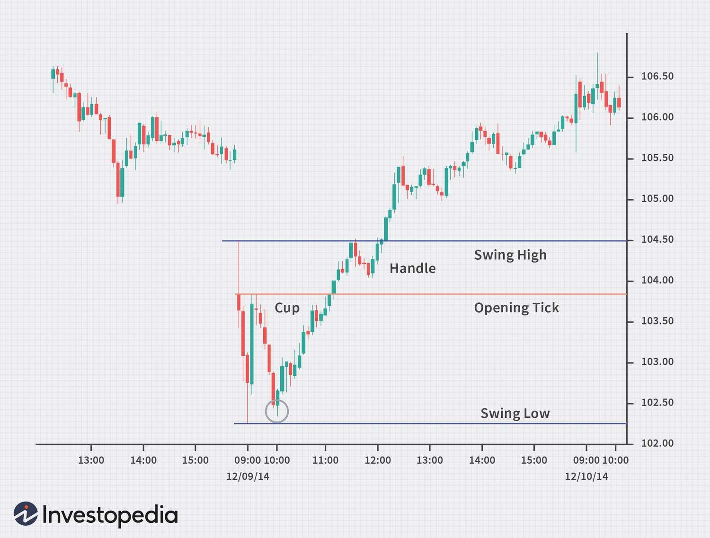

## Table of Contents

## What is the opening price in stock trading?

The opening price in stock trading is the price at which a stock first trades when the market opens for the day. This price is important because it sets the starting point for the day's trading activity. It can be influenced by many things, like news about the company or how the market feels overall.

Sometimes, the opening price is different from the closing price of the previous day. This happens because new information or events might have happened overnight or over the weekend, which can change how people feel about the stock. The opening price helps traders and investors see how the stock might perform during the day.

## How is the opening price determined?

The opening price of a stock is decided by what's called an auction process at the start of the trading day. When the market opens, all the buy and sell orders that were placed before the market opened are looked at. If someone wants to buy the stock at a certain price and someone else wants to sell it at that price, they can make a deal. The price where the most shares can be traded is chosen as the opening price.

Sometimes, the opening price can be a bit surprising because it can be different from the price at the end of the last trading day. This happens because new things might have happened overnight or over the weekend that change how people feel about the stock. For example, if a company announces good news before the market opens, more people might want to buy the stock, which can push the opening price higher.

## Why is the opening price important for traders?

The opening price is important for traders because it gives them a starting point for the day's trading. When traders see the opening price, they can start to guess how the stock might move during the day. If the opening price is higher than the last closing price, it might mean that people are feeling good about the stock. If it's lower, it might mean the opposite. This helps traders decide if they want to buy or sell the stock right away.

Also, the opening price can show traders how much the stock might change in price during the day. If there's a big difference between the opening price and the last closing price, it can mean that the stock might keep moving a lot. Traders use this information to plan their trades. They might set up special orders, like stop-losses or take-profits, based on where the stock opens. This way, they can try to make money or protect their investments as the day goes on.

## Can the opening price be different from the previous day's closing price?

Yes, the opening price can be different from the previous day's closing price. This happens because new things might have happened overnight or over the weekend that change how people feel about the stock. For example, if a company shares good news before the market opens, more people might want to buy the stock, which can push the opening price higher than the last closing price.

On the other hand, if there's bad news, like a company warning about lower profits, people might want to sell the stock, which can make the opening price lower than the last closing price. The difference between the opening price and the last closing price shows how new information can quickly change what people think about a stock. This is why traders and investors pay close attention to the opening price to make smart choices about buying or selling.

## What factors influence the opening price of a stock?

The opening price of a stock is influenced by many things that happen before the market opens. One big thing is news about the company. If the company shares good news, like better-than-expected earnings or a new product, more people might want to buy the stock. This can make the opening price higher than the last closing price. On the other hand, if there's bad news, like a company warning about lower profits or a problem with their product, people might want to sell the stock, which can make the opening price lower.

Another thing that can change the opening price is what's happening in the world or in the economy. If there's good economic news, like lower unemployment or better growth, it can make people feel more confident about buying stocks, which can push the opening price up. If there's bad news, like a big drop in the stock market in another country or a natural disaster, it can make people worried and want to sell, which can push the opening price down.

Also, the orders that people place before the market opens can affect the opening price. If there are a lot of buy orders at a higher price, the opening price might be higher. If there are a lot of sell orders at a lower price, the opening price might be lower. All these things together decide where the stock will start trading when the market opens.

## How does pre-market trading affect the opening price?

Pre-market trading can have a big effect on the opening price of a stock. When people trade stocks before the market opens, it's called pre-market trading. If a lot of people are buying the stock during this time, it can push the opening price up. On the other hand, if a lot of people are selling the stock, it can push the opening price down. This is because the orders placed during pre-market trading are used to help decide the opening price when the market officially opens.

The opening price is set by looking at all the buy and sell orders that were placed before the market opens. If there's a lot of activity in pre-market trading, it can show what people are thinking about the stock before the regular trading day starts. For example, if a company shares good news before the market opens, more people might want to buy the stock during pre-market trading, which can make the opening price higher than the last closing price. So, pre-market trading gives traders and investors an early hint about how the stock might move when the market opens.

## What is the difference between the opening price and the opening range?

The opening price is the first price at which a stock trades when the market opens for the day. It's like the starting point for the day's trading. The opening price is set by looking at all the buy and sell orders placed before the market opens. If there's a lot of buying interest, the opening price might be higher than the last closing price. If there's more selling, it might be lower.

The opening range, on the other hand, is the range of prices that a stock trades at right after the market opens. It's not just one price, but a range of prices that happen in the first few minutes or hours of trading. The opening range can give traders an idea of how the stock might move during the day. If the opening range is wide, it might mean the stock will keep moving a lot. If it's narrow, the stock might stay more stable.

## How can traders use the opening price to make trading decisions?

Traders can use the opening price to help them decide whether to buy or sell a stock. If the opening price is higher than the last closing price, it might mean that people are feeling good about the stock. This could be because of good news about the company or the economy. Traders might see this as a sign to buy the stock, hoping that the price will keep going up during the day. On the other hand, if the opening price is lower than the last closing price, it might mean that people are worried about the stock. This could be because of bad news. Traders might see this as a sign to sell the stock or wait to see if the price goes down more before buying.

Traders also use the opening price to set up special orders, like stop-losses and take-profits. A stop-loss order can help traders limit their losses if the stock price drops. For example, if a trader buys a stock at the opening price, they might set a stop-loss order a little below that price. If the stock price falls to that level, the stop-loss order will sell the stock automatically, helping to protect the trader's money. A take-profit order can help traders lock in their gains. If a trader thinks the stock will go up after the opening price, they might set a take-profit order at a higher price. If the stock reaches that price, the order will sell the stock automatically, helping the trader make money.

## What are some common strategies based on the opening price?

One common strategy based on the opening price is called the "Opening Gap Strategy." Traders look at how much the opening price is different from the last closing price. If the opening price is a lot higher, it's called a "gap up." Traders might buy the stock right away, hoping it will keep going up during the day. If the opening price is a lot lower, it's called a "gap down." Traders might sell the stock or wait to see if it goes down more before buying. This strategy tries to take advantage of the big moves that can happen right when the market opens.

Another strategy is the "Opening Range Breakout." Traders watch the stock's price for the first few minutes or hours after the market opens. They look for the highest and lowest prices in this time, which is called the opening range. If the stock price breaks above the highest price in the opening range, traders might buy the stock, thinking it will keep going up. If the stock price breaks below the lowest price in the opening range, traders might sell the stock, thinking it will keep going down. This strategy helps traders find good times to buy or sell based on how the stock moves right after the market opens.

## How does the opening price impact technical analysis?

The opening price is really important for people who use technical analysis to trade stocks. Technical analysis is when traders look at past prices and patterns to guess where the stock might go next. The opening price helps them see how the stock starts the day. If the opening price is a lot different from the last closing price, it can change how traders think about the stock. They might use this information to decide if they should buy or sell the stock right away. The opening price can also help traders see if a pattern they were watching is still working or if something new is happening.

Traders also use the opening price to set up special orders, like stop-losses and take-profits. A stop-loss order helps traders not lose too much money if the stock price goes down. For example, if a trader buys a stock at the opening price, they might set a stop-loss order a little below that price. If the stock price falls to that level, the stop-loss order will sell the stock automatically, helping to protect the trader's money. A take-profit order helps traders make money if the stock price goes up. If a trader thinks the stock will go up after the opening price, they might set a take-profit order at a higher price. If the stock reaches that price, the order will sell the stock automatically, helping the trader make money. So, the opening price is a big part of how traders use technical analysis to make smart choices.

## What role does market sentiment play in determining the opening price?

Market sentiment is how people feel about the stock market or a specific stock. It can really change the opening price of a stock. If people feel good about the stock, maybe because of good news about the company or the economy, they might want to buy it. This can make the opening price higher than the last closing price. On the other hand, if people feel worried or scared about the stock, maybe because of bad news, they might want to sell it. This can make the opening price lower than the last closing price. So, how people feel can push the opening price up or down.

Traders and investors watch market sentiment closely because it helps them guess where the stock might go next. If the opening price is a lot different from the last closing price, it can show that people's feelings have changed a lot. For example, if a company shares good news before the market opens, more people might want to buy the stock during pre-market trading. This can make the opening price higher. If there's bad news, more people might want to sell, making the opening price lower. So, market sentiment is a big part of what decides the opening price of a stock.

## How do high-frequency trading algorithms influence the opening price?

High-frequency trading (HFT) algorithms can really change the opening price of a stock. These algorithms use computers to buy and sell stocks very quickly, sometimes in just a few seconds. They look at a lot of information, like news about the company or what other traders are doing, to decide if they should buy or sell. If a lot of HFT algorithms are buying a stock right when the market opens, it can push the opening price up. If they are selling, it can push the opening price down. So, these fast computers can make the opening price different from what it might have been without them.

HFT algorithms also try to take advantage of small changes in the stock price. They might see that the opening price is a little different from the last closing price and try to make money from that. For example, if the opening price is higher, they might buy the stock and then sell it quickly for a small profit. If the opening price is lower, they might sell the stock and then buy it back for a small profit. This quick buying and selling can make the opening price move around a lot right when the market opens. So, HFT algorithms can make the opening price more unpredictable and different from what people might expect.

## How can the opening price be integrated into algo-trading?

Algorithmic trading (algo trading) is a method of executing orders using automated pre-programmed trading instructions that consider variables such as time, price, and volume. Integration of the opening price into algo trading strategies is a significant aspect as it can offer valuable insights and opportunities for trades. Several strategies and analyses are employed to capitalize on the opening price's influence on the trading day.

### Ways Algo Trading Strategies Incorporate Opening Prices

Algo trading strategies often use opening prices as a critical component for initiating trades. By analyzing the gap between the closing price of the previous day and the current day's opening price, traders can develop systems that react to overnight developments and market sentiment shifts. 

#### Example Strategies: 'Gap Fade and Fill', and Momentum Trading

1. **Gap Fade and Fill**: This strategy takes advantage of price gaps between the previous day’s closing price and the new day’s opening price. For instance, if a stock opens lower than its previous close (a gap down), an algorithm might execute a buy order anticipating that the price will revert to fill the gap—returning to the closing price of the previous day. Conversely, if a gap up is detected, the strategy might anticipate a fall back to the previous close.

   In Python, a simple pseudocode for a gap fade strategy might look like this:

   ```python
   def gap_fade_strategy(open_price, prev_close, current_price):
       if open_price < prev_close:  # Gap down
           if current_price < open_price:
               # Buy with target profit at prev_close
               execute_buy_order()
           elif open_price > prev_close:  # Gap up
           if current_price > open_price:
               # Sell with target profit at prev_close
               execute_sell_order()

   ```

2. **Momentum Trading**: This strategy builds on the idea that if a stock opens significantly higher or lower than its previous close, it may continue in the direction of the gap for a period due to momentum. Algo trading harnesses this by placing trades aligned with the direction of the gap assuming continuation. 

### Role of Premarket Data in Algo Trading Decisions

Premarket data comprises all activities and price actions that occur before the stock market officially opens. Analyzing this data helps in predicting potential opening prices and their subsequent movement. Algorithms often integrate such data to calibrate their trading strategies, ensuring smart entries and exits. With advancements in [machine learning](/wiki/machine-learning) and big data analytics, the ability to scrutinize premarket activities has become more accessible and detailed, offering a competitive edge.

### Importance of Statistical and Trend Analysis

The success of integrating opening prices into algo-trading strategies heavily relies on rigorous statistical and trend analysis. By employing historical data, traders can understand past behaviors and patterns that occur with various opening price scenarios. This analysis helps in curating predictive models for future trades.

#### Statistical Measures and Analysis

1. **Mean Reversion and Statistical Arbitrage**: Evaluating the historical mean of price gaps can suggest potential opportunities for mean reversion trades. Statistical arbitrage models assess these gaps to predict and exploit disparities. Suppose $P_o$ is the opening price and $P_c$ is the closing price of the previous day, observing frequent gap reversion might inform the algorithm to devise trade actions based on:
$$
   Gap = P_o - P_c

$$

2. **Trend Analysis**: Trend detection analyzes the movement of opening gaps over time, offering insights into prevailing market sentiments or conditions. An algorithm that integrates trend-following mechanisms might continuously adjust its trading actions based on trend changes identified in the opening prices.

   Utilizing trend analysis can involve the application of linear regression or moving average indicators, allowing algorithms to align with either short-term or long-term market trends. For instance, employing metrics like the Moving Average Convergence Divergence (MACD) in assessing opening price actions could effectively enhance predictive accuracy.

In incorporating the opening price into algorithmic trading, the blend of statistical analysis, premarket insights, and adaptable strategies can significantly enhance potential returns. Continuous adaptation to evolving market conditions remains vital for the sustained success of these algorithms.

## References & Further Reading

[1]: ["Advances in Financial Machine Learning"](https://www.amazon.com/Advances-Financial-Machine-Learning-Marcos/dp/1119482089) by Marcos Lopez de Prado

[2]: ["Evidence-Based Technical Analysis: Applying the Scientific Method and Statistical Inference to Trading Signals"](https://www.amazon.com/Evidence-Based-Technical-Analysis-Scientific-Statistical/dp/0470008741) by David Aronson

[3]: ["Machine Learning for Algorithmic Trading"](https://github.com/PacktPublishing/Machine-Learning-for-Algorithmic-Trading-Second-Edition) by Stefan Jansen

[4]: ["Quantitative Trading: How to Build Your Own Algorithmic Trading Business"](https://books.google.com/books/about/Quantitative_Trading.html?id=j70yEAAAQBAJ) by Ernest P. Chan

[5]: Bergstra, J., Bardenet, R., Bengio, Y., & Kégl, B. (2011). ["Algorithms for Hyper-Parameter Optimization."](https://dl.acm.org/doi/10.5555/2986459.2986743) Advances in Neural Information Processing Systems 24.