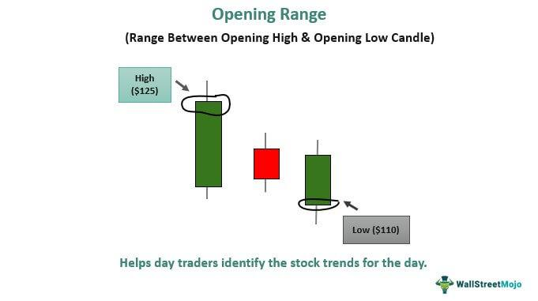

## Table of Contents

## What is an Opening Range Breakout (ORB) strategy?

An Opening Range Breakout (ORB) strategy is a simple trading method used by traders to make decisions based on how the market moves at the start of the trading day. The idea is to watch the price of a stock or other financial product during the first few minutes or hours after the market opens. Traders identify a range, which is the highest and lowest price the stock reaches in that time. If the price moves above the high of this range, it's a signal to buy. If it moves below the low, it's a signal to sell.

This strategy is popular because it's easy to understand and apply. Many traders believe that the opening range can set the tone for the rest of the day, making it a good indicator of future price movements. However, like all trading strategies, it's not foolproof. The market can be unpredictable, and sometimes the price will move back into the opening range after breaking out. Traders often use other tools and indicators along with the ORB strategy to make more informed decisions.

## How does the ORB strategy work in trading?

The ORB strategy works by watching how a stock's price moves right after the market opens. Traders look at the first few minutes or hours of trading to find the highest and lowest prices during that time. This range of prices is called the opening range. If the price goes above the highest point of the opening range, traders see this as a good time to buy the stock. They think the price might keep going up. If the price drops below the lowest point of the opening range, traders see this as a good time to sell or short the stock, thinking the price might keep going down.

While the ORB strategy is simple and easy to use, it's not perfect. Sometimes the price can move out of the opening range but then move back into it. This can lead to losses if traders don't use other tools to help them make decisions. Many traders use the ORB strategy along with other indicators and charts to get a better idea of where the price might go next. By combining different methods, traders can make more informed choices and hopefully increase their chances of making money.

## What time frame is typically used for the ORB strategy?

The ORB strategy usually looks at the first 30 minutes to an hour after the market opens. This time frame is seen as enough to get a good idea of how the stock might move for the rest of the day. Traders watch the highest and lowest prices during this period to set their opening range.

Some traders might choose a shorter time, like the first 5 or 15 minutes, if they want to act quickly. Others might go for a longer time, like the first 90 minutes, if they think it gives a better picture of the day's trend. The key is to pick a time that works well with the stock and the trader's style.

## How do you determine the opening range in the ORB strategy?

To determine the opening range in the ORB strategy, you need to watch the stock's price right after the market opens. Usually, you look at the first 30 minutes to an hour of trading. During this time, you find the highest price and the lowest price the stock reaches. The space between these two prices is what you call the opening range.

Once you have the opening range, you keep an eye on the stock's price to see if it moves outside of this range. If the price goes above the highest point of the opening range, it might be a good time to buy the stock. If the price drops below the lowest point of the opening range, it might be a good time to sell or short the stock. This helps traders make decisions based on how the stock acts at the start of the trading day.

## What are the key levels to watch for a breakout in the ORB strategy?

In the ORB strategy, the key levels to watch are the highest and lowest prices that the stock reaches during the opening range. This range is usually set in the first 30 minutes to an hour after the market opens. The highest price of the opening range is the level that traders watch for a breakout to the upside. If the stock's price moves above this level, it might be a good time to buy the stock because it could mean the price will keep going up.

The lowest price of the opening range is the level that traders watch for a breakout to the downside. If the stock's price drops below this level, it might be a good time to sell or short the stock because it could mean the price will keep going down. By keeping an eye on these two levels, traders can make decisions based on how the stock moves at the start of the trading day.

## How can you set stop-loss and take-profit levels using the ORB strategy?

When using the ORB strategy, setting a stop-loss can help protect you from losing too much money. If you decide to buy a stock because it broke above the highest price of the opening range, you can set your stop-loss just below the high of the opening range. This way, if the price drops back into the range, your stop-loss will kick in and limit your loss. If you decide to sell or short a stock because it broke below the lowest price of the opening range, you can set your stop-loss just above the low of the opening range. This will help you limit your loss if the price goes back into the range.

Setting a take-profit level is about deciding when to cash in on your gains. If you bought the stock after it broke above the opening range, you might set your take-profit at a price that's a certain percentage or amount higher than the breakout point. This could be based on how much you think the stock will go up or on past price movements. If you sold or shorted the stock after it broke below the opening range, you might set your take-profit at a price that's a certain percentage or amount lower than the breakout point. This helps you lock in profits before the price might change direction.

## What are the common entry and exit signals in the ORB strategy?

In the ORB strategy, the main entry signal happens when the stock's price moves out of the opening range. If the price goes above the highest point of the opening range, that's a signal to buy the stock. Traders think this means the price might keep going up. If the price drops below the lowest point of the opening range, that's a signal to sell or short the stock. Traders believe this means the price might keep going down. These signals help traders decide when to get into a trade based on how the stock moves at the start of the day.

The exit signals in the ORB strategy are important for knowing when to get out of a trade. If you bought the stock after it broke above the opening range, you might set a stop-loss just below the high of the opening range. This helps you limit your loss if the price goes back into the range. You might also set a take-profit at a higher price to lock in your gains. If you sold or shorted the stock after it broke below the opening range, you could set a stop-loss just above the low of the opening range to limit your loss. A take-profit could be set at a lower price to secure your profits. These exit signals help traders manage their trades and protect their money.

## How does market volatility affect the ORB strategy?

Market volatility can make the ORB strategy more risky but also more rewarding. When the market is very volatile, the price of a stock can move a lot more than usual. This means the opening range might be bigger, and the price might break out of the range more often. If you're using the ORB strategy, you might see more chances to buy or sell the stock. But, because the price is moving a lot, it's also more likely to move back into the opening range after breaking out. This can lead to more losses if you don't set your stop-losses carefully.

To handle high volatility, traders might need to adjust their ORB strategy. They could use a shorter time frame for the opening range, like the first 15 minutes instead of 30 minutes, to get a quicker sense of the day's trend. They might also set their stop-losses closer to the breakout points to protect their money better. By being more careful and flexible, traders can still use the ORB strategy even when the market is moving a lot.

## What are the advantages of using the ORB strategy in different markets?

The ORB strategy can be useful in many different markets because it's easy to understand and use. Whether you're trading stocks, forex, or futures, you can apply the ORB strategy by watching the price during the first few minutes or hours after the market opens. This helps you see how the market might move for the rest of the day. If the price breaks out of the opening range, it gives you a clear signal to buy or sell, which can be helpful in any market.

Another advantage of the ORB strategy is that it can work well in markets with different levels of volatility. In quiet markets, the opening range might be small, but the strategy can still help you spot small but important price movements. In more volatile markets, the opening range might be bigger, and the strategy can help you take advantage of bigger price swings. By adjusting the time frame for the opening range and setting your stop-losses and take-profits carefully, you can use the ORB strategy to trade effectively in various market conditions.

## What are the potential risks and limitations of the ORB strategy?

The ORB strategy can be risky because the market can be unpredictable. Sometimes, the price might break out of the opening range but then move back into it. This can lead to losses if you don't set your stop-losses carefully. Also, the ORB strategy relies a lot on what happens in the first few minutes or hours of trading. If something big happens later in the day, like a news event, it can change the price a lot and make your trade go the wrong way.

Another limitation of the ORB strategy is that it might not work well in all market conditions. If the market is very quiet, the opening range might be too small to give you a good signal. On the other hand, if the market is very volatile, the price might move a lot and make it hard to set your stop-losses and take-profits right. You might need to change the time frame for the opening range or use other tools to help you make better decisions.

## How can the ORB strategy be adapted for different trading instruments?

The ORB strategy can be adapted for different trading instruments like stocks, forex, and futures by adjusting the time frame used for the opening range. For example, in the stock market, traders often look at the first 30 minutes to an hour after the market opens to set the opening range. But in the forex market, where trading happens 24 hours a day, you might need to pick a different time, like the first hour after a major market like London or New York opens. This helps you see how the price might move for the rest of the day, no matter what you're trading.

Another way to adapt the ORB strategy for different instruments is by changing how you set your stop-losses and take-profits. In a market with a lot of ups and downs, like futures, you might want to set your stop-losses closer to the breakout points to protect your money better. In a quieter market, like some stocks, you might set your take-profits at smaller price moves to make sure you get some gains. By being flexible with the time frame and your exit points, you can use the ORB strategy effectively with different trading instruments.

## What advanced techniques can enhance the effectiveness of the ORB strategy?

To make the ORB strategy work better, you can use other tools and indicators along with it. One way is to look at the volume of trades when the price breaks out of the opening range. If a lot of people are buying or selling at the same time, it might mean the price will keep moving in that direction. You can also use moving averages to see if the price is following a bigger trend. If the price breaks out of the opening range and is also above a moving average, it might be a stronger signal to buy. By combining the ORB strategy with other tools, you can make better decisions and maybe make more money.

Another advanced technique is to use different time frames for the opening range depending on the market and the day. If the market is very busy and the price is moving a lot, you might want to use a shorter time frame, like the first 15 minutes, to get a quick idea of the day's trend. On quieter days, you might use a longer time frame, like the first hour, to get a better picture. You can also adjust your stop-losses and take-profits based on how much the price is moving. If the market is very up and down, you might set your stop-losses closer to the breakout points to protect your money better. By being flexible and using other tools, you can make the ORB strategy work better for you.

## References & Further Reading

[1]: Earl, J., & Sinay, S. (2020). ["Opening Range Breakout Strategy: Theory and Practice."](https://www.researchgate.net/publication/338765667_Strategy_Theory_and_Practice_3rd_Ed) The Oasis Group.

[2]: ["Technical Analysis of the Financial Markets: A Comprehensive Guide to Trading Methods and Applications"](https://www.amazon.com/Technical-Analysis-Financial-Markets-Comprehensive/dp/0735200661) by John J. Murphy

[3]: LeBeau, C., & Lucas, D. (1992). ["Technical Traders Guide to Computer Analysis of the Futures Markets."](https://books.google.com/books/about/Technical_traders_guide_to_computer_anal.html?id=at0PAQAAMAAJ) McGraw-Hill.

[4]: Voigt, B. (2011). ["Algorithmic Trading & DMA: An introduction to direct access trading strategies."](https://www.semanticscholar.org/paper/Algorithmic-trading-%26-DMA-%3A-an-introduction-to-Johnson/aa5de1ab883d5e23b6651faa7c1807586d688e4b) 4Myeloma Press.

[5]: Pardo, R. (2008). ["The Evaluation and Optimization of Trading Strategies."](https://onlinelibrary.wiley.com/doi/book/10.1002/9781119196969) Wiley Trading.