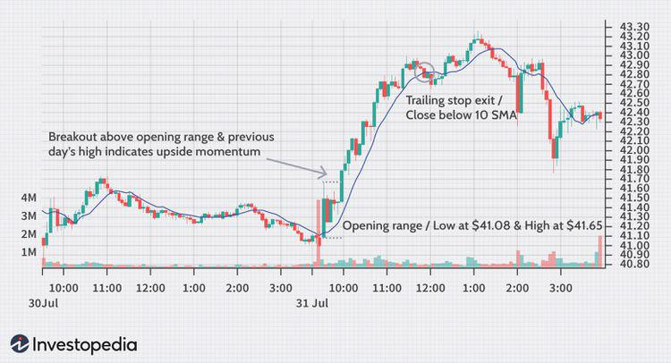

The landscape of financial markets is continuously evolving with the integration of technology and the development of advanced trading strategies. A significant aspect of this evolution is the emergence of technical analysis and algorithmic trading as essential tools for traders seeking to capitalize on market opportunities. Technical analysis focuses on the study of historical price and volume data to predict future price movements, offering insights into market trends and investor behavior. Algorithmic trading, on the other hand, harnesses the power of technology to execute trades based on predefined rules and market patterns, enhancing trading efficiency and accuracy.

This article explores the concept of technical analysis within financial markets, with a particular emphasis on the 'Opening Range'. The Opening Range represents the high and low price actions occurring shortly after a market opens. Understanding this range can provide valuable insights into market sentiment and potential price trends, serving as a critical element in developing trading strategies. The Opening Range is often leveraged in algorithmic trading, where automated systems assess and act upon these early market signals.



As financial markets become increasingly complex, traders are continuously seeking innovative approaches to gain an edge. The ability to analyze large volumes of data in real time and make informed decisions swiftly is a hallmark of modern trading practices. By combining technical analysis with algorithmic trading, traders can enhance their decision-making processes and potentially improve their trading outcomes. This synergy between human intuition and machine precision signifies an ongoing transformation in the financial markets, offering numerous opportunities for those who can harness these advanced methodologies effectively.

## Table of Contents

## What Is Technical Analysis?

Technical analysis is a method used by traders to evaluate securities and forecast future price movements by analyzing [statistics](/wiki/bayesian-statistics) generated by market activity. This approach heavily relies on historical price and volume data as its primary sources of information. Unlike fundamental analysis, which aims to determine a security's intrinsic value based on economic and financial factors, technical analysis focuses predominantly on price action and trading volume.

The foundation of technical analysis lies in the study of market psychology. It assumes that all known information about a security is reflected in its price, as market participants act on their emotions, including fear and greed, which in turn are captured by price movements. Through the examination of past market data, technical analysts aim to identify patterns and trends that may indicate future movements. These patterns often result from the recurring behavior of market participants driven by psychological factors.

One key premise of technical analysis is that history tends to repeat itself, particularly in terms of market psychology. As a result, technical analysts make use of charts and technical indicators to identify patterns such as trends, reversals, and support and resistance levels. These patterns are believed to arise from the collective behavior of market participants, which tends to be consistent over time.

Technical analysts make use of a variety of tools and techniques to conduct their analysis. Price charts are central to their work, providing a visual representation of historical prices and volumes. These charts may be overlaid with technical indicators such as moving averages, relative strength index (RSI), or moving average convergence divergence (MACD), which provide further insights into market conditions. Each indicator can serve a specific function, from identifying ongoing trends to highlighting overbought or oversold conditions.

While technical analysis offers valuable insights into market behavior, it is important to acknowledge certain limitations. Critics argue that it can sometimes be self-fulfilling, as patterns may appear to work simply because many traders believe in them and act accordingly. Additionally, technical analysis does not consider external factors such as economic indicators or company fundamentals, which can influence prices.

In conclusion, technical analysis serves as a crucial tool for traders seeking to navigate financial markets. By focusing on historical price and [volume](/wiki/volume-trading-strategy) data, it provides a unique perspective on investor psychology and market sentiment, distinguishing itself from [fundamental analysis](/wiki/fundamental-analysis). Despite its limitations, when used correctly, technical analysis offers traders a systematic approach to identifying potential market opportunities.

## Understanding the Opening Range

The Opening Range (OR) constitutes the initial price action that defines the high and low during the first 30 minutes following the market's opening. This period is crucial as it reflects how traders and investors respond to overnight news, economic reports, and other market-moving events. The price movements during this short timeframe often set the tone for the trading day and offer valuable insights into market sentiment.

Traders analyze the opening range to identify potential trends, whether bullish or bearish, that may develop throughout the day. A [breakout](/wiki/breakout-trading) beyond the established high signifies bullish [momentum](/wiki/momentum), while a break below the low indicates bearish tendencies. This early indication helps traders make informed decisions about their trading strategies and positions.

Furthermore, the opening range serves as a benchmark for gauging market [volatility](/wiki/volatility-trading-strategies). A wide range might suggest significant price movement and increased volatility, necessitating a more cautious trading approach. Conversely, a narrow range might indicate a lack of decisive market sentiment, suggesting that traders may need to wait for clearer signals before committing to trades.

The use of the opening range as an analytical tool offers an efficient way to structure trades by setting entry and [exit](/wiki/exit-strategy) points based on observed price behavior. As an integral part of technical analysis, the opening range allows traders to enhance their decision-making process by providing a framework for understanding initial market dynamics.

## The Opening Range Breakout Strategy

The Opening Range Breakout (ORB) strategy is a widely used technical approach in trading that focuses on the initial price movements observed after a market opens. In practice, the strategy involves monitoring the high and low prices within a predefined opening period, often the first 30 minutes of trading. Traders establish these boundaries as the "opening range," forming the basis for potential breakout points.

The core principle of the ORB strategy is to capitalize on early market momentum, which can indicate the development of new price trends. When the market breaks above the high of the predefined range, a bullish trend is suggested, providing an opportunity to enter a long position. Conversely, a break below the range's low suggests a bearish trend, prompting a short position.

Volume and time frame play crucial roles in evaluating the potential strength of a breakout. High trading volume accompanying a breakout can be a reliable indicator of strong market sentiment, enhancing the likelihood that the breakout will sustain. Conversely, a breakout with low volume may be indicative of a false move or lack of broader market participation, thus signaling caution to traders.

Time frames used in the ORB strategy can vary based on the trader's preference or market conditions. The traditional 30-minute opening range is popular, although some traders might opt for shorter or longer periods based on their market analysis. The choice of time frame influences both the sensitivity of the strategy to price movements and its risk-reward flexibility.

For instance, implementing an ORB strategy in Python could involve the following steps:

```python
import pandas as pd

def calculate_orb(data, period=30):
    opening_range = data.head(period)
    orb_high = opening_range['High'].max()
    orb_low = opening_range['Low'].min()
    return orb_high, orb_low

def orb_strategy(data, period=30):
    orb_high, orb_low = calculate_orb(data, period)
    data['Position'] = 0
    data['Position'][data['Close'] > orb_high] = 1
    data['Position'][data['Close'] < orb_low] = -1
    data['Strategy'] = data['Position'].shift(1) * data['Close'].pct_change()
    return data

# Example usage
# data = pd.read_csv('market_data.csv')  # Load your market data
# orb_results = orb_strategy(data)
```

This algorithm calculates the opening range and assigns trading positions based on breakout conditions. The strategy can be backtested by evaluating its performance on historical data, thus helping traders refine entry and exit points before live trading.

In conclusion, the Opening Range Breakout strategy serves as an effective tool for traders aiming to exploit initial market dynamics. Its implementation can be greatly enhanced with the integration of algorithmic approaches, enabling precise execution and efficient capital allocation.

## Role of Algo Trading in Opening Range Strategies

Algorithmic trading, often referred to as algo trading, involves the use of computer algorithms to automate the trading process based on pre-defined instructions. These instructions can be based on various rules and market patterns, facilitating the execution of trades with speed and precision that far exceeds human capabilities. In the context of the Opening Range Breakout (ORB) strategy, algo trading provides several advantages that can enhance the strategy's effectiveness.

One of the primary benefits of integrating technical analysis indicators within algorithmic frameworks is the ability to augment the effectiveness and precision of trading strategies. Technical indicators, such as Moving Averages, Bollinger Bands, and Relative Strength Index (RSI), can be programmed into algorithms to detect specific market conditions or patterns. When applied to the ORB strategy, these indicators can help in identifying the strength and potential direction of a breakout beyond the opening range. For example, a simple moving average might be used to confirm an upward breakout if the price is above the average, suggesting bullish momentum.

The algorithmic integration allows for real-time data processing, which is crucial in executing ORB strategies. The first minutes after a market opens can be particularly volatile, making timely decision-making essential. Algorithms can continuously monitor these initial price movements within the opening range and execute trades within milliseconds of detecting a breakout. This speed is vital for capturing the often-brief windows of opportunity that define ORB strategies.

In addition, [algorithmic trading](/wiki/algorithmic-trading) systems can be backtested against historical data to fine-tune the parameters and improve the accuracy of the predictions. This process involves testing the algorithm with past market data to identify any weaknesses or areas for improvement, ensuring that the strategy is robust and effective in various market conditions. For example, traders might test different levels of opening range durations or volatility thresholds to optimize entry and exit points.

Below is a basic example of how a Python algorithm could be structured to implement an Opening Range Breakout strategy, utilizing a moving average filter:

```python
import pandas as pd

def calculate_moving_average(data, window=20):
    return data['Close'].rolling(window=window).mean()

def opening_range_breakout(data, opening_period_min, volatility_multiplier):
    opening_range = data.head(opening_period_min)
    high = opening_range['High'].max()
    low = opening_range['Low'].min()

    data['Moving_Average'] = calculate_moving_average(data)

    signals = []
    for index, row in data.iterrows():
        if row['Close'] > high and row['Close'] > row['Moving_Average']:
            signals.append((index, 'Buy'))
        elif row['Close'] < low and row['Close'] < row['Moving_Average']:
            signals.append((index, 'Sell'))

    return signals

# Example usage:
# data = pd.read_csv('market_data.csv')
# signals = opening_range_breakout(data, opening_period_min=30, volatility_multiplier=1.5)
# print(signals)
```

In this example, the algorithm takes market data, computes the opening range in the first specified minutes, and uses a moving average as a filter to confirm breakout strength. This systematic approach minimizes emotional decision-making, allowing for more consistent trading outcomes.

In conclusion, algorithmic trading provides a significant edge in implementing and refining Opening Range Breakout strategies. By harnessing technical indicators, real-time data analysis, and [backtesting](/wiki/backtesting) capabilities, traders can increase efficiency and accuracy, ultimately enhancing their ability to navigate the dynamic landscape of financial markets.

## Technical Indicators in Algorithmic Trading

Technical indicators are crucial tools in algorithmic trading because they translate complex market data into actionable insights. These indicators are coded into trading algorithms to automate decision-making processes, helping traders to execute strategies based on historical data and quantitative analysis.

### Moving Averages

Moving Averages (MAs) are among the most widely used technical indicators. They smooth out price data to identify trends over specific periods. Two common types are the Simple Moving Average (SMA) and the Exponential Moving Average (EMA). The SMA calculates the average of a selected range of prices, typically closing prices, over a specified time frame. Conversely, the EMA gives more weight to recent prices, making it more responsive to new information.

The mathematical formula for an SMA is given by:

$$
\text{SMA} = \frac{P_1 + P_2 + \cdots + P_n}{n}
$$

where $P$ is the price at a given time and $n$ is the number of periods.

In Python, calculating SMA can be implemented as follows:

```python
import pandas as pd

def calculate_sma(prices, period):
    return prices.rolling(window=period).mean()
```

### Average True Range (ATR)

The Average True Range (ATR) measures market volatility. It is essential for determining potential price fluctuations and evaluating risk. ATR is not intended to indicate the direction of a price but rather the degree of price volatility in the market.

The True Range (TR) is calculated as:

$$
\text{TR} = \max(\text{High} - \text{Low}, |\text{High} - \text{Close}_{\text{previous}}|, |\text{Low} - \text{Close}_{\text{previous}}|)
$$

The ATR is then the moving average of these true ranges over a specified period.

### Bollinger Bands

Bollinger Bands are a volatility indicator comprising a middle moving average band and two outer bands. These bands expand and contract based on market volatility. The upper and lower bands are typically set two standard deviations away from a 20-period simple moving average.

The formulas for the upper and lower Bollinger Bands are:

$$
\text{Upper Band} = \text{SMA}_{20} + 2 \times \sigma
$$

$$
\text{Lower Band} = \text{SMA}_{20} - 2 \times \sigma
$$

where $\sigma$ is the standard deviation of the price over 20 periods.

In Python, Bollinger Bands can be calculated as follows:

```python
import numpy as np

def calculate_bollinger_bands(prices, window=20):
    sma = prices.rolling(window).mean()
    rolling_std = prices.rolling(window).std()
    upper_band = sma + (rolling_std * 2)
    lower_band = sma - (rolling_std * 2)
    return upper_band, lower_band
```

### Integration in Algorithms

These indicators are integral components of algorithmic trading strategies. By programming them into algorithms, traders can automate the identification of potentially profitable trading signals based on historical price patterns. This automation increases the speed and accuracy of trade execution, reduces the potential for human error, and allows for the backtesting of strategies across historical data to refine approach and improve performance.

## Risk Management in ORB Trading

Effective risk management is a pivotal component in Opening Range Breakout (ORB) trading, serving as a safeguard against potential financial losses. Implementing robust risk management strategies helps traders navigate the volatile nature of financial markets, ensuring that potential downsides are well mitigated.

One fundamental aspect of risk management is the use of stop-loss orders. A stop-loss order is placed to automatically sell a security when its price reaches a certain level, thereby limiting the trader's loss on a position. By predefining an exit point, traders can protect themselves from devastating losses that would otherwise exceed their risk tolerance.

In conjunction with stop-loss orders, setting appropriate risk-reward ratios is vital. The risk-reward ratio measures the potential reward an investor can earn for every dollar they risk on an investment. Traders can calculate this ratio as follows:

$$
\text{Risk-Reward Ratio} = \frac{\text{Potential Profit}}{\text{Potential Loss}}
$$

For instance, a ratio of 1:3 indicates that for every dollar risked, there is a potential profit of three dollars. A favorable risk-reward ratio ensures that even if a trader experiences multiple losses, the wins can still lead to profitability over time.

Determining suitable position sizes also plays a crucial role in risk management. Position sizing involves deciding how much of a security to purchase or sell in a trade. By controlling the size of each trade, traders can better manage their overall exposure to market fluctuations. A common rule of thumb is to risk only a small percentage of the total trading capital on any single trade (often around 1-2%).

Backtesting various risk management strategies is another essential practice for refining the ORB trading approach. Backtesting involves applying a trading strategy to historical data to evaluate its performance. This process allows traders to identify strengths and weaknesses in their strategies, providing insights that can enhance future trading decisions. For example, using Python, a trader might implement a simple backtest for an ORB strategy:

```python
import pandas as pd

def backtest_orb_strategy(data, opening_range_time, risk_reward_ratio):
    data['Opening Range High'] = data['High'].loc[:opening_range_time].max()
    data['Opening Range Low'] = data['Low'].loc[:opening_range_time].min()

    trades = []

    for index, row in data.iterrows():
        if row['Close'] > data['Opening Range High']:
            entry_price = row['Close']
            target_price = entry_price + (entry_price - data['Opening Range Low']) * risk_reward_ratio
            stop_loss = data['Opening Range Low']
            trades.append({'Entry': entry_price, 'Target': target_price, 'Stop Loss': stop_loss})

    return trades

# Example usage
# data = pd.read_csv('market_data.csv')  # Load your market data
# trades = backtest_orb_strategy(data, '09:30', 3)
# print(trades)
```

In summary, meticulous risk management in ORB trading ensures that trades are made with calculated risk, protecting the trader's capital and paving the way for sustained profitability. By incorporating stop-loss orders, favorable risk-reward ratios, and appropriate position sizing, along with thorough backtesting, traders can significantly enhance their ORB strategies.

## Advanced Techniques in ORB Strategy

Advanced traders employing the Opening Range Breakout (ORB) strategy often leverage multiple time frame analysis and market sentiment assessments to refine their trading decisions. By examining price movements over different time intervals, traders can gain a broader perspective on potential trends and reversals. This technique helps in identifying the dominant market direction and avoiding false breakouts that might occur in a shorter time frame. For instance, a trader might observe the opening range in a 5-minute chart while also considering broader trends from 30-minute or hourly charts to reinforce their trading decisions.

Market sentiment assessments play a crucial role as well. Traders utilize sentiment indicators, news analytics, and sometimes social media sentiment analysis to gauge the psychological state of the market participants. This understanding aids in determining whether the price movements are likely to sustain beyond the initial breakout.

Incorporating techniques such as partial exits and trailing stops can notably enhance trading outcomes. Partial exits involve closing a portion of a position at predetermined profit levels, which secures gains while allowing the remainder of the position to capitalize on continued momentum. Meanwhile, trailing stops adjust the stop-loss level as the market price moves in a favorable direction, protecting against reversals while locking in profits. A trailing stop could be implemented in Python as follows:

```python
def trailing_stop(entry_price, trailing_pct, current_price):
    """
    Calculate the trailing stop price.

    :param entry_price: The initial entry price of the trade
    :param trailing_pct: The trailing stop percentage
    :param current_price: The current market price
    :return: The adjusted trailing stop price
    """
    stop_price = entry_price * (1 - trailing_pct)
    return max(stop_price, current_price * (1 - trailing_pct))

# Example usage
entry_price = 100
trailing_pct = 0.05  # 5% trailing stop
current_price = 110
trailing_stop_price = trailing_stop(entry_price, trailing_pct, current_price)
print(f"Trailing Stop Price: {trailing_stop_price}")
```

Continuous learning and strategy adaptation are essential to thrive amid varying market conditions. As financial markets evolve with shifts in geopolitical factors, economic data, and technological advancements, traders must remain adaptable by revisiting their strategies, testing new approaches, and integrating innovative data analysis methods. Rigorous backtesting and forward-testing of strategies across different market environments enhance their robustness.

Ultimately, advanced techniques in ORB strategy require a combination of technical astuteness, disciplined risk management, and a commitment to ongoing education. Through strategic refinement and adaptive learning, traders can maximize the profitability of their ORB strategies amidst the ever-changing tides of the financial markets.

## Conclusion

The Opening Range Breakout (ORB) strategy offers traders a systematic approach to capturing early market movements. By focusing on the initial price action at the start of a trading session, traders can gauge market sentiment and establish positions based on potential trends. The ORB strategy's reliance on clear entry and exit points makes it an attractive option for those looking to capitalize on short-term market dynamics.

Integrating ORB with algorithmic trading significantly amplifies its effectiveness. Algorithms can process large volumes of data in real-time, ensuring swift execution of trades based on pre-defined criteria. By incorporating technical analysis indicators into these algorithms, traders are better equipped to identify breakouts and measure their strength. This marriage of technology and strategy also allows for greater flexibility in adapting to varying market conditions.

Effective risk management is a cornerstone of successful ORB trading. Techniques such as stop-loss orders, risk-reward ratios, and appropriate position sizing help protect against adverse movements. Furthermore, algorithmic backtesting can refine these risk management strategies, enhancing decision-making capabilities.

Discipline and adaptability are crucial for traders aiming to sustain profitability with the ORB strategy. The fast-paced nature of modern financial markets requires a comprehensive approach, combining robust strategies with technological advancements. By continuously refining techniques and employing cutting-edge tools, traders can maintain an edge and optimize outcomes in diverse trading environments.

## References & Further Reading

[1]: Prechter, R. R., & Frost, A. J. (1998). ["Elliott Wave Principle: Key to Market Behavior."](https://archive.org/details/elliottwaveprinc0000fros) New Classics Library.

[2]: Murphy, J. J. (1999). ["Technical Analysis of the Financial Markets: A Comprehensive Guide to Trading Methods and Applications."](https://archive.org/details/technicalanalysi0000murp) New York Institute of Finance.

[3]: Kaufman, P. J. (2013). ["Trading Systems and Methods."](https://onlinelibrary.wiley.com/doi/book/10.1002/9781119202561) Wiley.

[4]: Raschke, L. B., & Connors, L. R. (1995). ["Street Smarts: High Probability Short-Term Trading Strategies."](https://books.google.com/books/about/Street_Smarts.html?id=P8R2swEACAAJ) M. Gordon Publishing Group.

[5]: Dooley, D. J. (2018). ["The Science of Algorithmic Trading and Portfolio Management."](https://www.researchgate.net/publication/285936969_The_Science_of_Algorithmic_Trading_and_Portfolio_Management) Academic Press.

[6]: Narang, R. (2013). ["Inside the Black Box: A Simple Guide to Quantitative and High-Frequency Trading."](https://onlinelibrary.wiley.com/doi/book/10.1002/9781118662717) Wiley.

[7]: Aldridge, I. (2010). ["High-Frequency Trading: A Practical Guide to Algorithmic Strategies and Trading Systems."](https://www.ahmetbeyefendi.com/wp-content/uploads/2020/07/High-Frequency-Trading-Irene-Aldridge.pdf) Wiley.