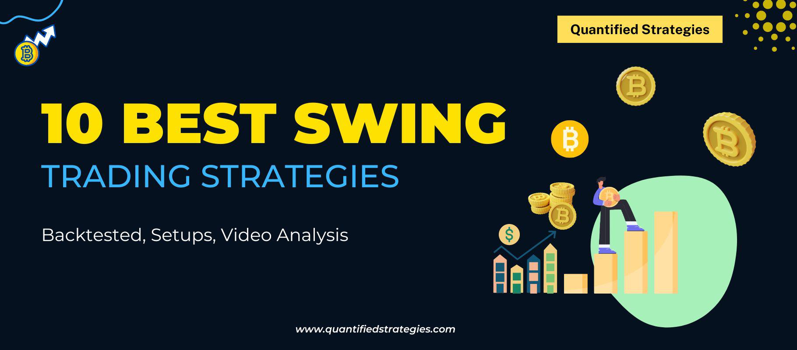

## Table of Contents

## What is a swing trade account and why might someone open one in 2024?

A swing trade account is a type of investment account where people buy and sell stocks or other assets over a short period, usually a few days to a few weeks. The goal is to make money from the small ups and downs in the price of these assets. Unlike day trading, where you might buy and sell in the same day, swing trading lets you hold onto your investments for a bit longer to catch bigger price swings.

Someone might open a swing trade account in 2024 because they want to take advantage of the quick changes in the market. With all the news and events happening around the world, stock prices can go up and down a lot. By using a swing trade account, people can try to make money from these changes without needing to watch the market every single minute of the day. It's a good option for those who want to be more active in their investing but don't have the time or interest in day trading.

## What are the basic requirements for opening a swing trade account?

To open a swing trade account, you'll need to find a brokerage that offers this type of account. Many online brokerages provide options for swing trading, so you can choose one that fits your needs. You'll need to fill out an application with your personal information, like your name, address, and Social Security number. The brokerage will also ask about your investment experience and goals to make sure swing trading is right for you.

Once your application is approved, you'll need to fund your account. This means putting money into it so you can start trading. The amount you need can vary, but many brokerages have a minimum deposit requirement. After your account is funded, you can start looking at stocks and other assets to trade. Remember, it's important to learn about the market and practice with a demo account if you're new to trading, to help you make better decisions.

## Which brokers offer the best swing trading accounts in 2024?

In 2024, some of the best brokers for swing trading accounts are TD Ameritrade, E*TRADE, and [Interactive Brokers](/wiki/interactive-brokers-api). These brokers are popular because they offer good tools and resources that help you make smart trading decisions. TD Ameritrade has a platform called thinkorswim, which is really helpful for looking at charts and doing research. E*TRADE is great because it's easy to use and has low fees, so you can keep more of your profits. Interactive Brokers is a good choice if you want to trade in many different markets around the world.

These brokers also have good customer support, which is important if you're new to swing trading and need help. They offer different educational resources like webinars, articles, and videos to help you learn more about trading. Plus, they have mobile apps, so you can keep an eye on your trades even when you're not at your computer. Choosing the right broker can make a big difference in how well you do with your swing trading, so it's worth taking the time to pick one that fits your needs.

## How do you choose the right swing trading platform for your needs?

Choosing the right swing trading platform depends on what you need and want. First, think about how easy the platform is to use. If you're new to trading, you might want a platform that's simple and has a good app for your phone. Also, look at the fees. Some platforms charge a lot for each trade, which can eat into your profits. So, find one with low fees that won't take too much of your money.

Next, consider the tools and resources the platform offers. Good swing trading platforms have tools like charts and research to help you make better decisions. They might also have educational materials like videos and articles to help you learn. It's also important to check if the platform lets you trade in the markets you're interested in, like stocks, options, or even international markets. Finally, good customer support can be a big help, especially if you're just starting out. So, pick a platform that has helpful support to answer your questions and guide you along the way.

## What are the costs associated with opening and maintaining a swing trade account?

When you open a swing trade account, there are different costs you need to think about. First, there's the cost to open the account. Some brokers might ask for a minimum amount of money to start trading, like $500 or $1,000. This is called a minimum deposit. Also, you might have to pay a fee every time you buy or sell something in your account. These are called trading fees or commissions, and they can be a few dollars per trade or even less if you use a broker with low fees.

Besides the costs to open and trade, there are also costs to keep your account running. Some brokers charge a fee every month or every year just to keep your account open. This is called a maintenance fee. It's usually small, but it can add up over time. Also, if you're not careful, you might have to pay taxes on the money you make from your trades. It's a good idea to talk to a tax expert to understand how much you might owe. Keeping an eye on all these costs can help you keep more of your profits from swing trading.

## What are the key features to look for in a swing trading account?

When [picking](/wiki/asset-class-picking) a swing trading account, you want to look for a few key things. First, the platform should be easy to use. This means it should have a clear design and be simple to navigate, especially if you're new to trading. You'll also want to check the fees. Trading fees, or commissions, can eat into your profits, so finding a broker with low fees is important. Another thing to consider is the tools the platform offers. Good swing trading accounts come with tools like charts and research options that help you make smart trading decisions.

Also, think about the educational resources the broker provides. Helpful videos, articles, and webinars can teach you more about trading and help you improve. It's also good to know if the platform lets you trade in the markets you're interested in, like stocks, options, or even international markets. Finally, good customer support can be a big help, especially if you're just starting out. A broker with responsive and helpful support can answer your questions and guide you along the way.

## How can beginners start swing trading safely and effectively?

To start swing trading safely and effectively, beginners should first learn as much as they can about the stock market and swing trading. They can do this by reading [books](/wiki/algo-trading-books), watching videos, and taking online courses. It's also a good idea to practice with a demo account before using real money. A demo account lets you trade without risking any money, so you can try out different strategies and see how the market works. Once you feel ready, start with a small amount of money that you can afford to lose. This way, you won't be too upset if you make a mistake.

Another important thing for beginners is to set clear goals and stick to a trading plan. Decide how much money you want to make and how much you're willing to lose on each trade. It's also helpful to use stop-loss orders, which automatically sell your stock if it drops to a certain price. This can help limit your losses. Lastly, don't let your emotions control your trading. It's easy to get excited or scared when prices go up and down, but sticking to your plan and making decisions based on research will help you trade more safely and effectively.

## What advanced strategies can experienced traders use in swing trading?

Experienced traders can use advanced strategies like technical analysis to improve their swing trading. They look at charts and use tools like moving averages, RSI (Relative Strength Index), and MACD (Moving Average Convergence Divergence) to find good times to buy and sell. These traders also use patterns like head and shoulders or cup and handle to predict where prices might go next. By combining these tools, experienced traders can make better guesses about when to enter and [exit](/wiki/exit-strategy) trades, which can lead to bigger profits.

Another advanced strategy is using options to hedge their trades. This means they can buy options to protect themselves from big losses if the market moves against them. For example, if they own a stock and think it might go down, they can buy a put option to sell the stock at a certain price. This can help limit their losses. Experienced traders also use more complex options strategies like spreads and straddles to make money from both rising and falling prices. These strategies need a lot of practice and understanding, but they can help experienced traders manage risk and increase their chances of making money.

## How does the regulatory environment in 2024 affect swing trading accounts?

In 2024, the rules that govern trading, known as the regulatory environment, can have a big impact on swing trading accounts. Governments and financial watchdogs make rules to keep the markets fair and safe for everyone. These rules can change how much money you need to start trading, what kind of information you have to give to open an account, and even how much you can trade at one time. For example, some countries might have stricter rules about how much money you need to keep in your account, which could affect how much you can swing trade.

These regulations can also affect the tools and services that brokers offer. If there are new rules about what brokers can and can't do, it might change the fees they charge or the kind of help they can give you. This means you might have to pay more to trade or have fewer options for trading. But these rules are there to protect you, so it's important to stay informed about them. Knowing the rules can help you make better trading decisions and keep your swing trading account safe and legal.

## What are the tax implications of swing trading in 2024?

In 2024, the money you make from swing trading is usually considered capital gains, and you have to pay taxes on it. If you hold a stock for less than a year before selling it, which is common in swing trading, your profits are taxed as short-term capital gains. These are taxed at the same rate as your regular income, which can be anywhere from 10% to 37% depending on how much money you make. If you hold a stock for more than a year, it's a long-term capital gain, which has a lower tax rate of 0%, 15%, or 20%. But since swing trading usually involves holding stocks for a shorter time, you'll mostly be dealing with short-term gains.

Besides the capital gains tax, you also have to think about the wash-sale rule. This rule says that if you sell a stock at a loss and buy the same or a very similar stock within 30 days, you can't use that loss to lower your taxes right away. You have to add the loss to the cost of the new stock, which can make your taxes more complicated. It's a good idea to keep good records of all your trades and talk to a tax expert to make sure you're doing everything right. They can help you understand all the rules and find ways to lower your tax bill.

## How can technology and tools enhance swing trading performance in 2024?

In 2024, technology and tools can really help make swing trading better. There are special programs called trading platforms that give you charts and graphs to look at. These charts can show you patterns in how stock prices move, which can help you decide when to buy and sell. You can also use tools like moving averages and the RSI to see if a stock is a good buy or if it's time to sell. These tools do the math for you, so you can make smart choices without spending hours figuring it out yourself. Plus, there are apps for your phone that let you keep an eye on your trades no matter where you are, so you never miss a chance to make a move.

Another way technology helps is through automated trading systems. These systems can watch the market all the time and make trades for you based on rules you set up. This means you can trade even when you're not looking at the screen, which can be really handy. Also, there are lots of online resources and communities where you can learn from other traders. You can join forums, watch videos, or take courses to get better at swing trading. All these tools and technologies make it easier to trade well and can help you make more money from swing trading.

## What are the common pitfalls to avoid when managing a swing trade account?

One common mistake people make with swing trading is letting their emotions control their decisions. It's easy to get excited when you see your stocks going up or scared when they start to drop. But if you let these feelings take over, you might end up buying or selling at the wrong times. That's why it's important to stick to a plan and use tools like stop-loss orders to help you make smart choices, not emotional ones. Another pitfall is not doing enough research. You need to understand the companies you're trading and keep up with news and events that could affect their stock prices. Without this knowledge, you're just guessing, and that's a risky way to trade.

Another thing to watch out for is overtrading. Some people think that trading more often will make them more money, but it can actually lead to more fees and less time to think about each trade carefully. It's better to take your time and make fewer, well-thought-out trades. Also, don't forget about the costs. Trading fees, taxes, and other expenses can eat into your profits if you're not careful. Always keep an eye on these costs and try to keep them as low as possible. By avoiding these common mistakes, you can manage your swing trade account more effectively and increase your chances of success.

## How can risk management and strategy optimization be effectively implemented?

Implementing robust risk management protocols within [algorithmic trading](/wiki/algorithmic-trading) systems is crucial to handling market [volatility](/wiki/volatility-trading-strategies) and preserving capital. One essential method includes the use of stop-loss orders. These orders allow traders to predefine a specific exit point for a trade, limiting potential losses. For example, a stop-loss order can be set for a stock at a predetermined price below the purchase price. If the market price falls to this level, the trading system triggers an automatic sell, thereby capping the loss.

Position sizing is another critical component. This strategy entails determining the number of units to trade based on the trader’s risk tolerance and the volatility of the asset. A common formula for position sizing is:

$$
\text{Position Size} = \frac{\text{Account Risk} \times \text{Account Balance}}{\text{Trade Risk}}
$$

where trade risk is defined as the difference between the entry price and the stop-loss price, and account risk is the percentage of the account balance willing to risk on a single trade.

Diversification strategies are vital in reducing systemic risk by spreading investments across various assets or markets. By not concentrating the entire capital on a single asset class, traders can buffer their portfolios against significant losses due to extreme movements in one particular market.

Given the dynamic nature of financial markets, continuously [backtesting](/wiki/backtesting) and optimizing algorithms becomes imperative. Backtesting involves running algorithms using historical data to evaluate their performance in past market conditions. This process aids in identifying inefficiencies or potential areas of improvement in the trading strategy. A typical backtesting approach might leverage Python with libraries like `pandas` and `numpy`:

```python
import pandas as pd
import numpy as np

# Sample historical market data
data = pd.DataFrame({
    'price': [100, 102, 101, 105, 107],
    'volume': [2000, 2100, 2200, 1900, 2300]
})

# Implement a simple moving average crossover strategy
data['SMA_short'] = data['price'].rolling(window=2).mean()
data['SMA_long'] = data['price'].rolling(window=3).mean()

# Signal where short SMA crosses above long SMA
data['signal'] = np.where(data['SMA_short'] > data['SMA_long'], 1, 0)

# Calculate returns based on the signals
data['returns'] = data['signal'] * data['price'].pct_change()

print(data)
```

Adaptation of algorithmic strategies is necessary to reflect changes in economic indicators, [volume](/wiki/volume-trading-strategy), and price action. This involves updating the algorithms to accommodate shifts in the trading environment, such as rising interest rates or evolving geopolitical climates, which can affect asset prices and market behavior.

Algorithmic trading systems often excel over manual trading by providing sophisticated risk assessments. They can process vast amounts of data and execute trades based on complex mathematical models that consider numerous market variables. Such capabilities enable them to return insightful analyses and make informed trading decisions that are beyond the capacity of human traders. This systematic approach not only optimizes profitability but also significantly enhances the decision-making process in volatile markets.

## References & Further Reading

[1]: Bergstra, J., Bardenet, R., Bengio, Y., & Kégl, B. (2011). ["Algorithms for Hyper-Parameter Optimization."](https://papers.nips.cc/paper/4443-algorithms-for-hyper-parameter-optimization) Advances in Neural Information Processing Systems 24.

[2]: ["Advances in Financial Machine Learning"](https://www.amazon.com/Advances-Financial-Machine-Learning-Marcos/dp/1119482089) by Marcos Lopez de Prado

[3]: ["Evidence-Based Technical Analysis: Applying the Scientific Method and Statistical Inference to Trading Signals"](https://www.amazon.com/Evidence-Based-Technical-Analysis-Scientific-Statistical/dp/0470008741) by David Aronson

[4]: ["Machine Learning for Algorithmic Trading"](https://github.com/stefan-jansen/machine-learning-for-trading) by Stefan Jansen

[5]: ["Quantitative Trading: How to Build Your Own Algorithmic Trading Business"](https://www.amazon.com/Quantitative-Trading-Build-Algorithmic-Business/dp/1119800064) by Ernest P. Chan