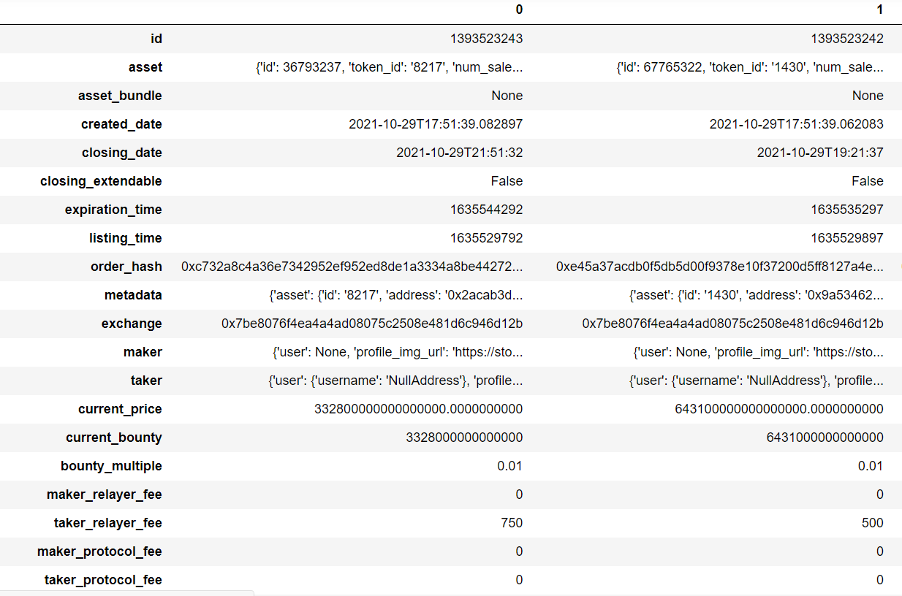

## Table of Contents

## What is the OpenSea API and what can it be used for?

The OpenSea API is a tool that lets developers connect their apps or websites to the OpenSea marketplace. OpenSea is a big online place where people can buy, sell, and trade digital items like art, games, and other collectibles. By using the OpenSea API, developers can show these digital items in their own apps, making it easier for users to see and interact with them without leaving the app.

With the OpenSea API, you can do things like look up information about different digital items, see what's being sold or bought, and even help users make their own digital items to sell. This can be really useful for people who want to create new ways for others to enjoy and trade digital collectibles. For example, a game developer could use the API to let players trade special items from their game on OpenSea, making the game more fun and interactive.

## How do I get started with the OpenSea API?

To get started with the OpenSea API, first, you need to sign up for an OpenSea account if you don't already have one. Once you're logged in, go to the OpenSea developer page where you can create an API key. This key is like a special password that lets your app talk to OpenSea's marketplace. Make sure to keep your API key safe and don't share it with anyone.

After you have your API key, you can start using the OpenSea API in your app or website. You'll need to use a programming language like JavaScript or Python to send requests to the OpenSea servers. There are guides and examples on the OpenSea developer page that can help you learn how to do this. Start with simple tasks like fetching information about a specific item or listing items for sale. As you get more comfortable, you can try more advanced things like creating and managing orders.

Remember, the OpenSea API is powerful but also complex. Take your time to read the documentation and try out different features. If you get stuck, there are online communities and forums where you can ask for help. With practice and patience, you'll be able to use the OpenSea API to make your app or website more interesting and useful for your users.

## What are the basic endpoints I should know about in the OpenSea API?

The OpenSea API has several basic endpoints that you should know about. One important endpoint is the 'Asset' endpoint, which lets you get information about a specific digital item. You can use this to see details like the item's name, description, and current price. Another key endpoint is the 'Events' endpoint, which helps you keep track of things happening on OpenSea, like when items are bought or sold. This can be useful if you want to show real-time updates in your app.

Another useful endpoint is the 'Orders' endpoint, which you can use to look at buy and sell orders for items. This can help you see what's being offered for sale and at what price. Lastly, the 'Collections' endpoint lets you get information about groups of items, like all the items from a specific artist or game. Knowing these basic endpoints will help you start building your app or website with the OpenSea API.

## How can I authenticate my requests to the OpenSea API?

To use the OpenSea API, you need to show that you're allowed to access it. This is called authentication. You do this by adding a special code, called an API key, to your requests. When you sign up for an OpenSea account, you can get this API key from the developer page. Make sure to keep your API key secret, like a password, because anyone with your key can use it to access the API.

When you send a request to the OpenSea API, you include your API key in the request. This tells OpenSea that you're allowed to use their service. You add the API key to the request by putting it in the headers or as a parameter, depending on what the OpenSea documentation says. Once you've done this, OpenSea will check your key and, if it's correct, they'll give you the information you asked for.

## What are the rate limits for the OpenSea API and how can I manage them?

The OpenSea API has rules about how often you can ask for information. These rules are called rate limits. They stop the API from getting too busy and slow down. For most users, you can make up to 5 requests every second. If you go over this limit, OpenSea might not let you ask for more information for a while. It's important to know these limits so your app or website works smoothly.

To manage these rate limits, you can add a small wait time between your requests. This helps make sure you don't ask for too much information too quickly. Another way is to keep track of how many requests you've made and slow down if you're getting close to the limit. By being careful with how often you use the API, you can make sure your app keeps working well and doesn't get blocked by OpenSea.

## How do I retrieve information about NFTs using the OpenSea API?

To retrieve information about NFTs using the OpenSea API, you first need to have an API key. You get this key from the OpenSea developer page after signing up for an account. Once you have your key, you can use it to send requests to the API. The main endpoint you'll use is the 'Asset' endpoint. This lets you ask for details about a specific NFT, like its name, description, and current price. You include your API key in the request to show that you're allowed to use the API.

When you send a request to the 'Asset' endpoint, you need to tell it which NFT you want information about. You do this by giving the contract address and the token ID of the NFT. The contract address is like the home address of the NFT, and the token ID is like its unique room number. Once you send the request with these details, OpenSea will send back the information about the NFT. This can include things like the owner's name, the last sale price, and even a picture of the NFT. By using this endpoint, you can show your users all sorts of interesting details about the NFTs they care about.

## Can I use the OpenSea API to list or delist NFTs, and if so, how?

Yes, you can use the OpenSea API to list or delist NFTs. To list an NFT for sale, you use the 'Orders' endpoint. You need to send a request that includes details like the NFT's contract address and token ID, the price you want to sell it for, and how long you want the listing to last. Make sure to include your API key in the request so OpenSea knows it's really you. Once you send the request, OpenSea will put your NFT up for sale on their marketplace.

To delist an NFT, you also use the 'Orders' endpoint, but this time, you tell OpenSea to cancel the order. You need to include the order ID of the listing you want to remove. Again, include your API key in the request. When OpenSea gets your request, they'll take down the listing, and your NFT won't be for sale anymore. It's important to be careful with these requests because once you list or delist an NFT, it can affect how people see and interact with it on the marketplace.

## What are some common errors I might encounter when using the OpenSea API and how can I resolve them?

When using the OpenSea API, you might run into a few common errors. One error you might see is a 401 Unauthorized error, which means you didn't include your API key or the key you used is wrong. To fix this, make sure you're including your API key in every request and that it's the right key. Another common error is a 429 Too Many Requests error, which happens when you're asking for too much information too quickly. To solve this, you can add a small wait time between your requests or keep track of how many requests you've made and slow down if you're close to the limit.

Another error you might come across is a 404 Not Found error, which means the NFT or order you're asking about doesn't exist. To fix this, double-check the contract address and token ID or the order ID to make sure they're correct. If you're still having trouble, it might be because the NFT or order was removed or never existed in the first place. By being careful with your requests and making sure you have the right information, you can avoid these errors and use the OpenSea API smoothly.

## How can I use the OpenSea API to track sales and transfers of NFTs?

You can use the OpenSea API to keep an eye on when NFTs are sold or moved to new owners. The 'Events' endpoint is the tool you need for this. This endpoint lets you see all sorts of things that happen with NFTs, like when they're bought, sold, or transferred. You just need to send a request to this endpoint with your API key, and OpenSea will tell you about the latest events. This can be really useful if you want to show your users what's happening with their favorite NFTs in real time.

To use the 'Events' endpoint, you'll need to tell it what kind of events you want to see. You can ask for sales, transfers, or other types of events. Once you send the request, OpenSea will send back a list of events with details like who bought or sold the NFT, how much it cost, and when it happened. By using this information, you can keep your users up to date on the latest happenings in the world of NFTs.

## What advanced features does the OpenSea API offer for developers?

The OpenSea API offers some advanced features that can help developers make their apps or websites even better. One of these features is the ability to create and manage bundles of NFTs. This means you can group several NFTs together and sell them as one package. This can be useful for games or collections where people might want to buy several items at once. Another advanced feature is the ability to use the 'Seaport' protocol, which is a new way of making and managing orders on OpenSea. This can help developers make their apps faster and more efficient.

Another cool feature is the ability to set up and manage royalties for NFT creators. This means that every time an NFT is sold, the creator can get a small percentage of the sale price. This can be a big help for artists and other creators who want to keep making money from their work. Lastly, the OpenSea API also lets developers use 'Lazy Minting', which is a way of creating NFTs without having to pay gas fees right away. This can make it easier for people to start selling their NFTs without worrying about upfront costs.

## How can I integrate the OpenSea API with other blockchain and web3 technologies?

You can connect the OpenSea API with other blockchain and web3 technologies to make your app or website even better. One way to do this is by using the OpenSea API with a blockchain like Ethereum. You can use tools like Web3.js or Ethers.js to talk to the Ethereum blockchain and get information about NFTs. This lets you show your users more details about the NFTs they're interested in, like where they came from or how much they're worth. You can also use smart contracts to do things like create new NFTs or handle sales, making your app more powerful and useful.

Another way to mix the OpenSea API with other technologies is by using it with decentralized apps (dApps). These are apps that run on a blockchain and let users do things like trade NFTs without needing a middleman. By using the OpenSea API with a dApp, you can let your users buy, sell, and trade NFTs right from your app. This can make your app more fun and interactive. Plus, you can use other web3 tools like wallets like MetaMask to help your users keep their NFTs safe and manage them easily. By putting all these pieces together, you can make a really cool and useful app for people who love NFTs.

## What are best practices for optimizing performance when using the OpenSea API at scale?

When using the OpenSea API at a big scale, it's smart to be careful about how often you ask for information. The OpenSea API has limits on how many requests you can make, so you need to space them out. One good way to do this is to add a small wait time between your requests. This helps make sure you don't go over the limit and get blocked. Another way is to keep track of how many requests you've made and slow down if you're getting close to the limit. By doing this, you can keep your app running smoothly without hitting the rate limits.

Another important thing to think about is how you handle the data you get back from the OpenSea API. When you're dealing with a lot of information, it can slow down your app if you're not careful. One good practice is to use something called caching. This means you save the information you get from the API and use it again later instead of asking for it every time. This can make your app much faster because it doesn't have to wait for the API to send back the same information over and over. Also, try to only ask for the information you really need. If you only need a few details about an NFT, don't ask for everything. This can help your app work better and use less of the API's resources.

## References & Further Reading

[1]: Bergstra, J., Bardenet, R., Bengio, Y., & Kégl, B. (2011). ["Algorithms for Hyper-Parameter Optimization."](https://proceedings.neurips.cc/paper/2011/file/86e8f7ab32cfd12577bc2619bc635690-Paper.pdf) Advances in Neural Information Processing Systems 24.

[2]: Lopez de Prado, M. (2018). ["Advances in Financial Machine Learning"](https://www.amazon.com/Advances-Financial-Machine-Learning-Marcos/dp/1119482089). Wiley.

[3]: Aronson, D. R. (2007). ["Evidence-Based Technical Analysis: Applying the Scientific Method and Statistical Inference to Trading Signals"](https://onlinelibrary.wiley.com/doi/book/10.1002/9781118268315). Wiley.

[4]: Jansen, S. (2018). ["Machine Learning for Algorithmic Trading"](https://github.com/stefan-jansen/machine-learning-for-trading). Packt Publishing.

[5]: Chan, E. P. (2008). ["Quantitative Trading: How to Build Your Own Algorithmic Trading Business"](https://github.com/ftvision/quant_trading_echan_book). Wiley.

[6]: Golub, A., & Reiner, D. (2020). ["NFTs: The New Frontier of Virtual Assets"](https://papers.ssrn.com/sol3/papers.cfm?abstract_id=2919146). Journal of Digital Finance. 

[7]: OpenSea. ["API Documentation."](https://docs.opensea.io/reference/api-overview) OpenSea Developer Portal.