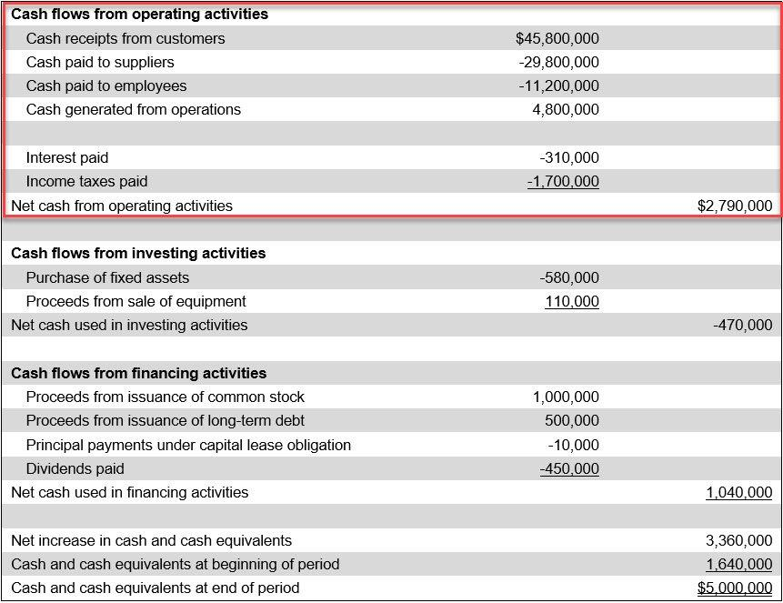

## Table of Contents

## What are operating activities in business?

Operating activities are the everyday tasks a business does to make money. These include things like selling products, providing services, and managing the costs of running the business. They are important because they show how well a company is doing its main job of making and selling things.

These activities are shown in a part of the financial statements called the cash flow statement. This statement tells you how much money is coming in and going out from the company's main business activities. By looking at this, you can see if the business is making enough money from its regular work to stay healthy and grow.

## Why are operating activities important for a company's financial health?

Operating activities are important for a company's financial health because they show how much money the company is making from its main business. This is the core of what the company does every day, like selling products or providing services. If a company makes more money from these activities than it spends, it's a good sign that the business is doing well. This money can be used to pay bills, buy new things, or save for the future.

If a company is not making enough money from its operating activities, it might have to borrow money or use savings to keep going. This can be risky because it means the company isn't [earning](/wiki/earning-announcement) enough from what it's supposed to be good at. Over time, this can lead to problems and make it hard for the company to grow or even stay open. So, keeping a close eye on operating activities helps a company know if it's on the right track financially.

## Can you list some common examples of operating activities?

Operating activities are the things a business does every day to make money. Some common examples are selling goods or services to customers. For example, if a store sells clothes, the money they get from selling those clothes is an operating activity. Another example is when a restaurant serves meals to people who come to eat there. The money they earn from the meals is also an operating activity.

There are also costs that come with running a business, and these are part of operating activities too. For instance, paying employees their salaries is an operating activity because it's a cost of doing business. Another cost is buying the things needed to make or sell products, like a bakery buying flour to make bread. Renting a space to run the business, like a store or office, is also an operating activity.

These activities show how well a business is doing its main job. If a business makes more money from selling things than it spends on costs, it's a good sign. But if it spends more than it makes, it might need to find other ways to get money, like borrowing or using savings.

## How do operating activities differ from investing and financing activities?

Operating activities are the everyday things a business does to make money, like selling products or services and paying for things like salaries and rent. These activities show how well a business is doing its main job. If a business makes more money from selling things than it spends on costs, it's doing well. But if it spends more than it makes, it might need to find other ways to get money.

Investing activities are different because they involve buying or selling things that will help the business in the long run, like machines, buildings, or other businesses. For example, if a company buys a new factory, that's an investing activity. It's not about making money right away, but about making the business better or bigger in the future.

Financing activities are about how a business gets money from outside sources or pays it back. This can include things like taking out a loan, borrowing money, or selling shares of the company to investors. When a business pays back a loan or gives money back to its owners, that's also a financing activity. These activities help the business grow or keep running, but they're different from the everyday work of making and selling things.

## What role do operating activities play in the cash flow statement?

Operating activities are a big part of the cash flow statement. This statement shows how money moves in and out of a business. The part about operating activities tells you how much money the business is making from its main job, like selling things or providing services. It also shows how much money the business is spending on things like salaries, rent, and buying stuff to sell. If the business is making more money than it's spending, that's a good sign. It means the business is doing well at its main job.

The cash flow statement also has sections for investing and financing activities, but the operating activities part is important because it shows the health of the business's core work. If a business isn't making enough money from its operating activities, it might have to borrow money or use savings to keep going. This can be risky because it means the business isn't earning enough from what it's supposed to be good at. So, by looking at the operating activities in the cash flow statement, you can see if the business is on the right track financially.

## How can operating activities be optimized to improve business performance?

To improve business performance, a company can focus on optimizing its operating activities. This means finding ways to make more money from selling things and spending less on running the business. One way to do this is by looking at the prices of products or services. If the prices are too low, the company might not be making enough money. Raising prices a little bit could help, as long as customers are still willing to pay. Another way is to sell more. This can be done by advertising more, making the products better, or finding new customers. It's also important to keep an eye on costs. If the business can find cheaper ways to buy things or save on rent and salaries, it will have more money left over.

Another important part of optimizing operating activities is making sure everything runs smoothly. This means managing the business well, so things like making products, selling them, and getting paid happen quickly and without problems. Using technology can help with this. For example, a good computer system can keep track of what's being sold and what needs to be bought, making everything more efficient. Also, training employees well can make them better at their jobs, which helps the whole business run better. By focusing on these things, a company can make more money from its operating activities and improve its overall performance.

## What are the key metrics used to analyze operating activities?

Key metrics used to analyze operating activities help show how well a business is doing its main job. One important metric is operating cash flow, which tells you how much money a business is making from its everyday work. This is shown on the cash flow statement and is a good sign of the business's health. If the operating cash flow is positive, it means the business is making more money than it's spending on things like salaries, rent, and buying stuff to sell.

Another key metric is net income, which is the money left over after all costs are paid. This is shown on the income statement and is important because it shows if the business is profitable. If net income is high, it means the business is doing well at making money from its operating activities. A third metric is the operating margin, which is the percentage of revenue that is left after paying for the costs of running the business. A high operating margin means the business is good at keeping costs low while making money from its main work.

These metrics all help to give a clear picture of how well a business is doing at its core activities. By looking at them, you can see if the business is making enough money to stay healthy and grow. If any of these metrics are low, it might be a sign that the business needs to find ways to make more money or spend less.

## How do operating activities impact a company's profitability?

Operating activities are the everyday things a business does to make money, like selling products or services and paying for things like salaries and rent. These activities directly affect a company's profitability because they show how much money the business is making from its main job. If a company makes more money from selling things than it spends on costs, it will have a higher profit. This means the business is doing well at its core work. On the other hand, if the company spends more money than it makes, it will have a lower profit or even a loss. This can be a problem because it means the business isn't earning enough from what it's supposed to be good at.

To improve profitability, a company can focus on making more money from its operating activities. This can be done by selling more products or services, raising prices if possible, or finding new customers. At the same time, the company can try to spend less on running the business. This might mean finding cheaper ways to buy things, saving on rent, or managing salaries better. By doing these things, the company can increase its profit. The key is to keep a close eye on the money coming in and going out from operating activities, because this will show if the business is on the right track to being profitable.

## Can you explain how operating activities are reported under different accounting standards?

Operating activities are reported differently under two main accounting standards: Generally Accepted Accounting Principles (GAAP) and International Financial Reporting Standards (IFRS). Under GAAP, which is used mostly in the United States, companies can use either the direct method or the indirect method to report operating activities in the cash flow statement. The direct method shows the actual cash received from customers and the cash paid to suppliers and employees. The indirect method starts with net income and adjusts it for non-cash items like depreciation and changes in working capital, like accounts receivable and inventory. Both methods should show the same total cash flow from operating activities, but the indirect method is more commonly used because it's easier to prepare.

Under IFRS, which is used in many countries around the world, companies are also allowed to use either the direct or indirect method to report operating activities. However, IFRS encourages the use of the direct method because it provides more detailed information about cash flows. Like GAAP, the indirect method under IFRS starts with net income and makes adjustments for non-cash items and changes in working capital. The main difference between GAAP and IFRS in reporting operating activities is that IFRS requires more disclosures and explanations about the cash flow statement, which helps users understand the financial health of the company better.

## What are some advanced strategies for managing operating activities?

One advanced strategy for managing operating activities is to use data analytics to understand how the business is doing. By looking at data from sales, costs, and other parts of the business, companies can find patterns and make better decisions. For example, they might see that certain products sell better at certain times of the year, so they can plan their inventory and marketing to match. They can also use data to find ways to save money, like seeing if there are cheaper suppliers or if they can make things more efficiently. This helps the business make more money from its operating activities and be more profitable.

Another strategy is to use technology to make operating activities smoother. This can mean using software to manage inventory, so the business always has the right amount of products without wasting money on too much stock. It can also mean using tools to manage customer relationships better, like keeping track of what customers buy and sending them special offers. Technology can help with things like payroll and accounting too, making it easier to keep track of costs and make sure everything is done right. By using technology, a business can make its operating activities more efficient and effective, which helps it make more money and be more successful.

## How do changes in operating activities reflect on a company's operational efficiency?

Changes in operating activities can show how well a company is doing its main job. If a company starts making more money from selling things and spends less on costs, it means the business is getting better at what it does every day. This is a good sign of operational efficiency because the company is finding ways to make more profit from its core work. For example, if a business finds a cheaper way to buy the things it needs to sell, it can keep more money as profit. Or if it starts selling more products without spending more on costs, that's also a sign of better efficiency.

On the other hand, if a company starts spending more money on operating activities than it's making, it might mean the business is not as efficient as it could be. This could happen if costs go up, like paying more for rent or salaries, or if the business is not selling as many products. When this happens, the company might need to look for ways to cut costs or find new ways to make more money. By watching changes in operating activities, a business can see if it's getting better or worse at running its main work, and then make changes to improve its operational efficiency.

## What are the potential risks associated with poor management of operating activities?

Poor management of operating activities can lead to a lot of problems for a business. If a company doesn't keep a close eye on how much money it's making from selling things and how much it's spending on costs, it might start losing money. This can happen if the business spends too much on things like rent, salaries, or buying stuff to sell, without making enough money back from customers. When this happens, the company might have to borrow money or use its savings to keep going, which can be risky. If the business can't pay back the money it borrows, it might have to close down.

Another big risk is that poor management can make the business less efficient. If the company doesn't manage its inventory well, it might end up with too much stock that doesn't sell, or not enough stock to meet customer demand. This can lead to lost sales and unhappy customers. Also, if the business doesn't keep track of its costs well, it might miss out on chances to save money. Over time, these problems can make it hard for the business to stay healthy and grow. So, it's really important for a company to manage its operating activities well to avoid these risks.

## What is the importance of understanding financial statements and operating activities?

Financial statements are vital instruments for evaluating a company's financial condition. They include balance sheets, income statements, and cash flow statements, each offering valuable insights into different aspects of a company's operations and financial status.

**Balance Sheets** provide a snapshot of a company's financial position at a specific point in time. They detail assets, liabilities, and shareholders' equity, highlighting the company's capital structure and liquidity. By examining balance sheets, stakeholders can assess the company's ability to sustain operations, satisfy short-term obligations, and plan for future growth.

**Income Statements** offer an overview of a company's performance over a specific period by detailing revenue, expenses, and profits or losses. This statement is essential for understanding how efficiently a company is generating profit from its operations. A thorough analysis of income statements reveals both strengths and potential areas for cost reduction or revenue enhancement.

**Cash Flow Statements** are crucial for understanding the flow of cash in and out of a business. They are divided into three segments: cash flow from operating activities, investing activities, and financing activities. 

Operating activities are the principal revenue-generating functions of the business and include day-to-day operational transactions. Cash flow from operating activities comprises transactions related to sales, purchases, and other expenses necessary to operate the business. Monitoring these activities provides insight into a company's operational efficiency and potential for generating cash flow sustainably.

For example, the formula for calculating cash flow from operating activities using the indirect method is:

$$
\text{Net Cash Flow from Operating Activities} = \text{Net Income} + \text{Non-Cash Expenses} - \text{Changes in Working Capital}
$$

Where:
- **Net Income** reflects the profit or loss after all expenses have been deducted from revenue.
- **Non-Cash Expenses** include items like depreciation and amortization.
- **Changes in Working Capital** refer to changes in current assets and liabilities such as inventories, accounts payable, and receivable.

By analyzing these financial statements, managers and investors gain insights into a company’s operational efficiency and financial stability. Understanding how revenue is generated and indicating potential risks related to core business functions allows stakeholders to plan strategically and make informed decisions.

## References & Further Reading

1. **Bodie, Z., Kane, A., & Marcus, A. J. (2017).** *Investments.* McGraw-Hill Education. This textbook provides a comprehensive understanding of investment principles, covering essential topics such as financial statements, cash flow analysis, and the basics of trading strategies.

2. **Chan, N., & Shelton, R. (2001).** *Electronic Commerce: A Managerial Perspective.* Prentice Hall. An insightful resource into the concepts of electronic trading and the influences of algorithmic strategies.

3. **Patterson, S. (2012).** *Dark Pools: High-Speed Traders, A.I. Bandits, and the Threat to the Global Financial System.* Crown Business. This book offers an in-depth exploration of the world of algorithmic trading, its benefits, and challenges, alongside real-world examples.

4. **Hull, J. (2018).** *Options, Futures, and Other Derivatives.* Pearson. A foundational text that explains derivative securities and how they relate to financial market data, including cash flows.

5. **Engle, R. F., & Russell, J. R. (1998).** *Autoregressive Conditional Duration: A New Model for Irregularly Spaced Transaction Data.* *Econometrica*, 66(5), 1127-1162. This academic paper introduces methods for modeling high-frequency trading data and how these models can be adapted for algorithmic trading.

6. **Treynor, J. L. (1965).** *How to Rate Management of Investment Funds.* *Harvard Business Review*. This article introduces performance measurement techniques critical for evaluating trading strategies based on financial reports, including cash flows.

7. **Tsay, R. S. (2010).** *Analysis of Financial Time Series.* Wiley. A technical guide for analyzing financial time series data, focusing on methods that are often employed in algorithmic trading including the integration of cash flow analysis.

8. **Litterman, R., Scheinkman, J., & Weiss, L. (1991).** *Volatility and the Yield Curve.* *Journal of Fixed Income.*, 1(1), 49-64. This paper discusses interest rate models critical for understanding trading dynamics influenced by cash flow trends.

These references offer a robust foundation for comprehending the nuances of [algorithmic trading](/wiki/algorithmic-trading), cash flow analysis, and business operations in the modern financial context.

