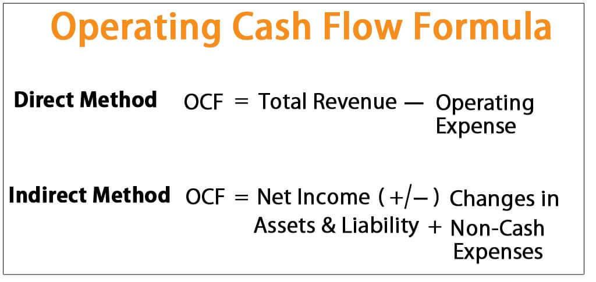

In today's competitive financial landscape, understanding and analyzing operating cash flow is crucial for both investors and businesses. Operating cash flow is a fundamental measure of a company's financial health, as it reflects the cash generated from core business operations. Unlike net income, which can be influenced by non-cash items and accounting adjustments, operating cash flow provides a clearer picture of a company's ability to generate cash to sustain and grow its operations without relying on external funding sources.

This article aims to explore the significance of operating cash flow, its calculation in Excel, and its impact on algorithmic trading. The precision and data-driven insights provided by cash flow analysis are invaluable in decision-making processes. By quantifying the cash-generating capability of core business activities, stakeholders can assess operational efficiency and financial stability, which are critical factors in strategic planning and investment decisions.



Calculating operating cash flow in Excel offers an efficient approach to financial analysis. Excel is a versatile tool that enables users to implement both the direct and indirect methods of cash flow calculation, using functions and formulas to create dynamic and adaptable financial models. With these models, traders and analysts can derive actionable insights and optimize financial strategies.

Furthermore, integrating cash flow analysis into financial models can significantly enhance decision-making, particularly in algorithmic trading. Algorithmic trading relies on precise and timely financial data to inform market predictions and trading decisions. By incorporating operating cash flow data into trading algorithms, traders can improve the reliability of buy or sell signals and refine market forecasts. This integration enables the development of more sophisticated trading strategies, providing a competitive edge in the fast-paced financial markets.

In conclusion, mastering operating cash flow analysis is essential for strategic financial decision-making. The ability to effectively calculate and interpret cash flow data in Excel enhances financial analysis and algo trading capabilities. By integrating these insights into trading algorithms, traders can develop more nuanced strategies, positioning themselves for success in the dynamic financial markets.

## Table of Contents

## Understanding Operating Cash Flow

Operating cash flow (OCF) is a key financial metric that represents the amount of cash generated by a company's normal business operations. This metric is crucial because it excludes cash flows associated with capital investments and financing activities, thereby focusing solely on the core operational activities of a business. The formula for calculating operating cash flow is:

$$
\text{Operating Cash Flow} = \text{Net Income} + \text{Non-Cash Expenses} + \text{Changes in Working Capital}
$$

Non-cash expenses typically include depreciation and amortization, which are added back to net income, as they do not involve actual cash outflow. Changes in working capital reflect adjustments to accounts such as accounts receivable, inventory, and accounts payable. 

Operating cash flow serves as a clear indicator of a company's ability to generate sufficient cash to sustain its operations and pursue growth opportunities without the need to rely on external financing sources. By analyzing this metric, stakeholders, including investors and management, can assess the operational efficiency of a company. It provides insights into the organization's capacity to generate cash sustainably, which is a vital sign of its financial health. High operating cash flow implies that a company can meet its short-term liabilities, invest in its growth, and provide returns to shareholders, thereby enhancing its overall stability and attractiveness to investors.

In summary, understanding operating cash flow is essential for stakeholders to make informed decisions about a company's financial viability and operational effectiveness. This information is fundamental for evaluating the company's performance and planning for future financial strategies.

## Calculating Operating Cash Flow in Excel

Calculating operating cash flow in Excel leverages its versatility as a tool for financial analysis, enabling users to employ either the direct or indirect method.

The direct method necessitates detailing all cash transactions related to operational activities. This involves recording cash inflows, such as cash receipts from customers, and cash outflows, such as payments to suppliers and employees. It provides a granular view of cash movements. To implement this method in Excel, one can create separate columns for each type of cash receipt and payment. The formula for calculating the net cash flow from operations using the direct method is:

$$
\text{Net Cash Flow from Operations} = \sum (\text{Cash Receipts}) - \sum (\text{Cash Payments})
$$

Using Excel's SUM function aids in aggregating the totals, allowing for an organized visualization of data.

The indirect method starts with the net income and adjusts for non-cash transactions, such as depreciation and changes in working capital. This approach reconciles net income with actual cash generated from operations, providing insights into the difference caused by accrual accounting. In Excel, formulas for this method typically adjust net income as follows:

$$
\text{Operating Cash Flow} = \text{Net Income} + \text{Non-Cash Expenses} + \Delta \text{Working Capital}
$$

Where non-cash expenses might include depreciation and amortization, and ΔWorking Capital represents changes in current assets and liabilities. Excel functions like SUMIF or direct cell references can be used to calculate these adjustments dynamically.

Both methods in Excel enable tailored cash flow models through a combination of cell references, basic arithmetic operations, and built-in functions. This adaptability makes Excel a potent platform for performing detailed cash flow calculations, vital for accurate financial modeling and analysis in business contexts.

## Implementing Cash Flow Analysis in Algo Trading

Algorithmic trading, often referred to as algo trading, relies heavily on data-driven strategies to optimize trading decisions. One valuable dataset that can be integrated into these algorithms is operating cash flow data, which provides insight into a company's financial stability and operational efficiency. By incorporating this information, trading algorithms can enhance market predictions and refine buy or sell signals based on the underlying financial health of companies.

Cash flow analysis is crucial for algo trading as it reflects a company's ability to generate cash from its operations, independent of external financing or investment activities. This aspect of financial analysis serves as a reliable indicator of a company’s [liquidity](/wiki/liquidity-risk-premium) and resilience in various market conditions. When operating cash flow data is programmed into trading algorithms, it can guide decision-making processes by highlighting companies that are fundamentally strong and potentially undervalued or overvalued by the market.

Programming tools like Python play a significant role in integrating cash flow analysis into [algorithmic trading](/wiki/algorithmic-trading). Python's robust libraries, such as Pandas for data manipulation and NumPy for numerical operations, facilitate the automation of data processing. For instance, financial analysts can use Python to develop scripts that periodically fetch financial data, including cash flow statements, from APIs or data providers. These scripts can parse the data and compute key metrics such as operating cash flow margins, which quantify operating cash flow relative to net sales.

A basic Python script to calculate the operating cash flow margin from a dataset could be implemented as follows:

```python
import pandas as pd

# Assume a dataframe 'df' with columns 'Operating Cash Flow' and 'Net Sales'
df['OCF Margin'] = df['Operating Cash Flow'] / df['Net Sales']

# Perform further analysis or incorporate this into a trading model
print(df[['Operating Cash Flow', 'Net Sales', 'OCF Margin']].head())
```

Beyond Python, Excel remains a staple for financial analysis due to its user-friendly interface and powerful capabilities for modeling. Analysts can utilize Excel to prepare and pre-process financial data before feeding it into trading algorithms. Functions and formulas can be set up to calculate operating cash flow through the direct or indirect method, providing a seamless transition of data from financial analysis to algo trading execution.

The integration of operating cash flow data into algorithmic trading not only streamlines data processing and model refinement but also enhances trading strategies by grounding them in substantive financial health metrics. This approach helps traders develop more sophisticated strategies with the potential for higher yield and reduced risk, ultimately offering a competitive edge in the fast-paced world of financial markets.

## Benefits and Limitations of Cash Flow Analysis

Cash flow analysis provides critical insights into a company’s liquidity, operational efficiency, and overall financial health. It acts as a transparent indicator of a company's ability to generate cash, meet its short-term obligations, and efficiently manage its operating expenses. By assessing operating cash flow, stakeholders can determine whether a business can sustain its operations through internally generated funds or if it relies heavily on external financing.

One of the primary advantages of cash flow analysis is its focus on cash movements, which helps identify how well a company can cover its debts, reinvest in its operations, pay dividends, and manage unexpected expenses. This analysis can aid in detecting potential liquidity issues early, allowing businesses to take corrective actions before they escalate.

Despite its benefits, cash flow statements reflect historical data, capturing the financial results of past operations rather than predicting future performance. This limitation means that changes in market conditions, future investment opportunities, or unexpected financial challenges are not accounted for in the cash flow analysis. Consequently, relying solely on historical cash flow data for forecasting or strategic decision-making can be misleading.

For comprehensive financial analysis, it is essential to use cash flow statements alongside other financial documents like income statements and balance sheets. The income statement provides insights into profit generation, while the balance sheet offers a snapshot of assets, liabilities, and shareholder equity. Together, these financial documents offer a holistic view of a company’s financial standing, enabling analysts to form a more rounded understanding of both current and future performance.

In conclusion, cash flow analysis is indispensable for assessing a company’s liquidity and operational efficiency. However, it should be part of a broader financial assessment framework to ensure that strategic financial decisions are well-informed and consider both historical performance and future prospects.

## Conclusion

Mastering operating cash flow analysis is essential for strategic financial decision-making. Operating cash flow acts as a fundamental measure, providing insights into the liquidity and operational efficiency of a business. This understanding is imperative not just for evaluating current financial health, but also for facilitating future growth without relying on external financing.

The ability to effectively calculate and interpret cash flow data in Excel significantly enhances both financial analysis and algorithmic trading capabilities. Excel serves as a versatile tool, allowing analysts to employ either the direct or indirect method for cash flow calculation. By creating dynamic spreadsheets with formulas and functions, Excel simplifies data manipulation and enhances the precision of financial models.

Integrating these cash flow insights into trading algorithms offers a competitive edge in the financial markets. Algorithms equipped with comprehensive cash flow analyses are better positioned to predict market movements and refine buy or sell signals. Python, in conjunction with Excel, can automate the data processing required for such tasks, facilitating rapid and informed decision-making. For instance, using Python's `pandas` library, one could automate the extraction and analysis of cash flow data from Excel, constructing algorithms that adapt to market conditions with greater accuracy.

By developing more nuanced strategies based on robust financial data, traders can better navigate dynamic financial markets. This integration of operating cash flow analysis into trading strategies not only optimizes transactional precision but also aligns with broader investment objectives, ultimately contributing to sustained financial success.

## References & Further Reading

[1]: ["Operating Cash Flow: A Better Indicator of Liquidity"](https://www.investopedia.com/terms/o/operatingcashflow.asp) on Investopedia

[2]: ["Microsoft Excel Data Analysis and Business Modeling"](https://www.microsoftpressstore.com/store/microsoft-excel-data-analysis-and-business-modeling-9780137613663) by Wayne Winston

[3]: ["Advances in Financial Machine Learning"](https://www.amazon.com/Advances-Financial-Machine-Learning-Marcos/dp/1119482089) by Marcos Lopez de Prado

[4]: ["Python for Finance: Analyze Big Financial Data"](https://books.google.com/books/about/Python_for_Finance.html?id=E93SBQAAQBAJ) by Yves Hilpisch

[5]: ["Excel Modeling in Corporate Finance"](https://fastercapital.com/content/Financial-modeling--How-to-Build-and-Use-Excel-Spreadsheets-for-Corporate-Finance.html) by Craig W. Holden

[6]: ["Free Cash Flow: Seeing Through the Accounting Fog Machine to Find Great Stocks"](https://www.amazon.com/Free-Cash-Flow-Through-Accounting/dp/0470391758) by George C. Christy