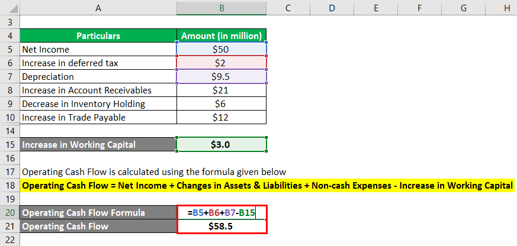

## Table of Contents

## What is operating cash flow and why is it important?

Operating cash flow is the money a business makes from its normal day-to-day activities, like selling products or services. It's different from other types of cash flow, like money from loans or investments. Operating cash flow shows how well a company can generate cash to pay for its bills, employees, and other expenses without relying on outside help.

This measure is important because it gives a clear picture of a company's financial health. If a company has a strong operating cash flow, it means it can keep running smoothly and grow without needing to borrow money or sell assets. Investors and managers look at operating cash flow to see if a business is doing well and can keep going strong in the future.

## What are the basic components needed to calculate operating cash flow?

To calculate operating cash flow, you need to start with the company's net income. Net income is what's left after all the expenses are subtracted from the revenue. But net income alone doesn't tell us the whole story because it includes non-cash items like depreciation and amortization. These are expenses that reduce net income but don't actually take cash out of the business. So, to get a true picture of cash flow, you add back these non-cash expenses to the net income.

Next, you need to consider changes in working capital. Working capital includes things like inventory, accounts receivable, and accounts payable. If a company's inventory goes up, it means they've spent more cash, so you subtract that increase from the operating cash flow. On the other hand, if accounts payable go up, it means the company owes more money but hasn't paid it yet, so you add that increase to the operating cash flow. By adjusting for these changes, you get a clearer view of how much cash the business is actually generating from its operations.

## How can I set up an Excel spreadsheet to begin calculating operating cash flow?

To set up an Excel spreadsheet for calculating operating cash flow, start by opening a new workbook and labeling the first column as 'Item' and the second column as 'Amount'. In the 'Item' column, list the components you need: Net Income, Depreciation & Amortization, and Changes in Working Capital. Under Changes in Working Capital, you can break it down further into Accounts Receivable, Inventory, and Accounts Payable. In the 'Amount' column next to each item, you'll enter the actual numbers from your company's financial statements.

Next, in a cell below these entries, you'll calculate the operating cash flow. Start with the Net Income, then add back the Depreciation & Amortization because these are non-cash expenses. Then, adjust for the changes in working capital. If Accounts Receivable or Inventory increase, you subtract these amounts because they represent cash spent. If Accounts Payable increases, you add this amount because it represents cash that hasn't been paid out yet. The formula in Excel would look something like this: =Net_Income + Depreciation_Amortization - Increase_in_Accounts_Receivable - Increase_in_Inventory + Increase_in_Accounts_Payable. This will give you the operating cash flow, showing how much cash your business is generating from its core operations.

## What is the formula for calculating operating cash flow in Excel?

To calculate operating cash flow in Excel, you need a few pieces of information from your company's financial statements. Start by finding the net income, which is the profit after all expenses. Then, find the amount of depreciation and amortization, which are expenses that reduce net income but don't use cash. You also need to know the changes in working capital, like accounts receivable, inventory, and accounts payable. These changes show how much cash is tied up or freed up in the business.

In Excel, set up your spreadsheet with these items listed in one column and their amounts in another. To calculate the operating cash flow, start with the net income and add back the depreciation and amortization because they are non-cash expenses. Then, subtract any increase in accounts receivable or inventory, as these represent cash spent. Finally, add any increase in accounts payable because it's cash you haven't paid out yet. The formula in Excel would look like this: =Net_Income + Depreciation_Amortization - Increase_in_Accounts_Receivable - Increase_in_Inventory + Increase_in_Accounts_Payable. This will give you the operating cash flow, showing how much cash your business is generating from its core operations.

## How do I input data into Excel for operating cash flow calculation?

To input data into Excel for calculating operating cash flow, start by opening a new Excel workbook. In the first column, label the cells with the items you need: Net Income, Depreciation & Amortization, Increase in Accounts Receivable, Increase in Inventory, and Increase in Accounts Payable. In the second column next to each label, enter the actual numbers from your company's financial statements. For example, if your net income is $50,000, type 50000 in the cell next to 'Net Income'. Do the same for the other items, making sure to use positive numbers for all increases, even if they represent a cash outflow like increases in accounts receivable or inventory.

Once you have entered all the data, you can calculate the operating cash flow. In a cell below your data, write the formula to calculate it. Start with the net income, then add back the depreciation and amortization because these are expenses that don't use cash. Next, subtract the increase in accounts receivable and the increase in inventory, as these represent cash that has been spent. Finally, add the increase in accounts payable because it's cash that hasn't been paid out yet. The formula in Excel would look like this: =Net_Income + Depreciation_Amortization - Increase_in_Accounts_Receivable - Increase_in_Inventory + Increase_in_Accounts_Payable. This will give you the operating cash flow, showing how much cash your business is generating from its core operations.

## What are common errors to avoid when calculating operating cash flow in Excel?

When calculating operating cash flow in Excel, one common mistake is mixing up the signs of the numbers. You need to add back depreciation and amortization because they are non-cash expenses, but you should subtract increases in accounts receivable and inventory because they represent cash that has been used. On the other hand, you add increases in accounts payable because it's cash you haven't paid out yet. If you get these signs wrong, your operating cash flow calculation will be incorrect.

Another error to watch out for is not updating your data regularly. If you use old numbers, your calculation won't reflect the current financial situation of your business. Make sure you pull the most recent figures from your financial statements every time you do the calculation. This way, you'll get an accurate picture of your operating cash flow.

## How can I use Excel functions to automate parts of the operating cash flow calculation?

To automate parts of the operating cash flow calculation in Excel, you can use cell references and formulas. Instead of typing in numbers directly, you can link your Excel cells to the actual financial statements. For example, if your net income is in cell A1, you can use A1 in your formula instead of typing in the number. This way, when you update the number in A1, the operating cash flow calculation will automatically update too. You can do the same for depreciation and amortization, accounts receivable, inventory, and accounts payable.

Using functions like SUM and IF can also help automate your calculation. For instance, if you have multiple entries for depreciation and amortization, you can use the SUM function to add them all up easily. You might also use the IF function to handle cases where there's no change in accounts receivable or inventory. By setting up your Excel sheet this way, you make it easier to update and maintain your operating cash flow calculation, reducing the chance of errors and saving time.

## How can I adjust the operating cash flow calculation for non-cash expenses like depreciation?

When you calculate operating cash flow, you start with the net income from your business. But net income includes expenses like depreciation, which don't actually use cash. Depreciation is a way to spread out the cost of things like machines or buildings over time, even though you paid for them upfront. To fix this in your operating cash flow calculation, you add back the amount of depreciation to your net income. This way, you get a clearer picture of the actual cash your business is making from its day-to-day operations.

To do this in Excel, find out how much depreciation your business has recorded for the period. Let's say it's in cell B2. If your net income is in cell A1, you can write a formula like this: =A1 + B2. This formula takes your net income and adds back the depreciation, giving you the adjusted operating cash flow. By doing this, you make sure your calculation reflects the real cash flow, not just the accounting numbers.

## How do I interpret the results of the operating cash flow calculation in Excel?

When you look at the operating cash flow number in Excel, it tells you how much cash your business is making from its normal day-to-day activities. If the number is positive, it means your business is generating more cash than it's spending on things like making products, paying employees, and other regular costs. This is a good sign because it shows your business can keep running and growing without needing to borrow money or sell assets. If the number is negative, it means your business is spending more cash than it's bringing in, which could be a warning sign that you need to look closer at your costs or find ways to increase your sales.

Understanding the operating cash flow also helps you see how well your business is doing over time. If you see the number going up from one period to the next, it means your business is getting better at making money from its operations. This can give you confidence that your business is on the right track. On the other hand, if the number is going down, it might be time to figure out what's going wrong and fix it. By keeping an eye on this number, you can make smarter decisions about how to manage your business and plan for the future.

## What advanced Excel features can enhance my operating cash flow analysis?

To make your operating cash flow analysis better in Excel, you can use a feature called PivotTables. PivotTables let you organize and sum up your data easily. You can drag and drop different pieces of your financial information to see how things like net income, depreciation, and changes in accounts receivable affect your cash flow. This helps you find trends and patterns quickly. For example, you could use a PivotTable to see how your operating cash flow changes from month to month or year to year, which can help you spot when your business is doing well or when you need to make changes.

Another useful feature is Excel's conditional formatting. This tool can color-code your data to make important numbers stand out. For instance, you could set it up so that positive operating cash flow numbers show up in green and negative numbers in red. This makes it easier to see at a glance whether your business is making or losing money. You can also use conditional formatting to highlight big changes in your cash flow, helping you focus on areas that need your attention. By using these advanced features, you can get a clearer and more detailed picture of your business's financial health.

## How can I compare operating cash flow over different periods using Excel?

To compare operating cash flow over different periods in Excel, you can set up a table with columns for each period you want to look at, like months or years. In each column, enter the operating cash flow numbers for that period. This way, you can see at a glance how the cash flow changes over time. You can also use a formula to calculate the difference between periods, like the change from one month to the next or from one year to another. This helps you understand if your business is getting better or worse at making money from its normal activities.

Another way to compare operating cash flow over different periods is by using Excel's charting features. You can create a line chart or a bar chart to show the operating cash flow for each period. This makes it easier to see trends and patterns. For example, a line chart can show you if your operating cash flow is going up or down over time. By looking at these charts, you can quickly see how your business is doing and make decisions about what to do next to improve your cash flow.

## What are some best practices for maintaining and updating an operating cash flow model in Excel?

To keep your operating cash flow model in Excel working well, it's important to update it regularly with the latest numbers from your financial statements. Make sure you use cell references instead of typing numbers directly into your formulas. This way, when you change the numbers in your financial statements, the operating cash flow calculation will update automatically. It's also a good idea to double-check your data entry to avoid mistakes. If you find any errors, fix them right away to keep your model accurate.

Another best practice is to keep your Excel sheet organized and easy to read. Use clear labels for each part of your calculation, like net income, depreciation, and changes in working capital. You can also use different colors or formatting to make important numbers stand out. If you're working with others, add notes or comments to explain your calculations so everyone understands how the model works. By keeping your model up to date and well-organized, you'll have a reliable tool to help you manage your business's cash flow.

## What is Understanding Operating Cash Flow?

Operating cash flow (OCF) is a key financial metric that represents the amount of cash generated by a company's normal business operations. This metric is crucial because it excludes cash flows associated with capital investments and financing activities, thereby focusing solely on the core operational activities of a business. The formula for calculating operating cash flow is:

$$
\text{Operating Cash Flow} = \text{Net Income} + \text{Non-Cash Expenses} + \text{Changes in Working Capital}
$$

Non-cash expenses typically include depreciation and amortization, which are added back to net income, as they do not involve actual cash outflow. Changes in working capital reflect adjustments to accounts such as accounts receivable, inventory, and accounts payable. 

Operating cash flow serves as a clear indicator of a company's ability to generate sufficient cash to sustain its operations and pursue growth opportunities without the need to rely on external financing sources. By analyzing this metric, stakeholders, including investors and management, can assess the operational efficiency of a company. It provides insights into the organization's capacity to generate cash sustainably, which is a vital sign of its financial health. High operating cash flow implies that a company can meet its short-term liabilities, invest in its growth, and provide returns to shareholders, thereby enhancing its overall stability and attractiveness to investors.

In summary, understanding operating cash flow is essential for stakeholders to make informed decisions about a company's financial viability and operational effectiveness. This information is fundamental for evaluating the company's performance and planning for future financial strategies.

## How do you calculate operating cash flow in Excel?

Calculating operating cash flow in Excel leverages its versatility as a tool for financial analysis, enabling users to employ either the direct or indirect method.

The direct method necessitates detailing all cash transactions related to operational activities. This involves recording cash inflows, such as cash receipts from customers, and cash outflows, such as payments to suppliers and employees. It provides a granular view of cash movements. To implement this method in Excel, one can create separate columns for each type of cash receipt and payment. The formula for calculating the net cash flow from operations using the direct method is:

$$
\text{Net Cash Flow from Operations} = \sum (\text{Cash Receipts}) - \sum (\text{Cash Payments})
$$

Using Excel's SUM function aids in aggregating the totals, allowing for an organized visualization of data.

The indirect method starts with the net income and adjusts for non-cash transactions, such as depreciation and changes in working capital. This approach reconciles net income with actual cash generated from operations, providing insights into the difference caused by accrual accounting. In Excel, formulas for this method typically adjust net income as follows:

$$
\text{Operating Cash Flow} = \text{Net Income} + \text{Non-Cash Expenses} + \Delta \text{Working Capital}
$$

Where non-cash expenses might include depreciation and amortization, and ΔWorking Capital represents changes in current assets and liabilities. Excel functions like SUMIF or direct cell references can be used to calculate these adjustments dynamically.

Both methods in Excel enable tailored cash flow models through a combination of cell references, basic arithmetic operations, and built-in functions. This adaptability makes Excel a potent platform for performing detailed cash flow calculations, vital for accurate financial modeling and analysis in business contexts.

## References & Further Reading

[1]: ["Operating Cash Flow: A Better Indicator of Liquidity"](https://www.investopedia.com/terms/o/operatingcashflow.asp) on Investopedia

[2]: ["Microsoft Excel Data Analysis and Business Modeling"](https://www.microsoftpressstore.com/store/microsoft-excel-data-analysis-and-business-modeling-9780137613663) by Wayne Winston

[3]: ["Advances in Financial Machine Learning"](https://www.amazon.com/Advances-Financial-Machine-Learning-Marcos/dp/1119482089) by Marcos Lopez de Prado

[4]: ["Python for Finance: Analyze Big Financial Data"](https://books.google.com/books/about/Python_for_Finance.html?id=E93SBQAAQBAJ) by Yves Hilpisch

[5]: ["Excel Modeling in Corporate Finance"](https://fastercapital.com/content/Financial-modeling--How-to-Build-and-Use-Excel-Spreadsheets-for-Corporate-Finance.html) by Craig W. Holden

[6]: ["Free Cash Flow: Seeing Through the Accounting Fog Machine to Find Great Stocks"](https://www.amazon.com/Free-Cash-Flow-Through-Accounting/dp/0470391758) by George C. Christy