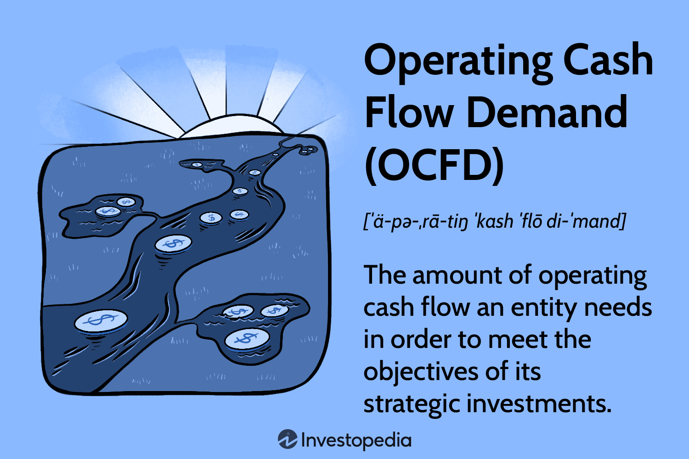

## Table of Contents

## What is operating cash flow demand?

Operating cash flow demand refers to the amount of cash a business needs to cover its day-to-day operating expenses. This includes costs like salaries, rent, utilities, and inventory purchases. It's a crucial measure because it shows whether a company can generate enough cash from its core business activities to keep running smoothly without relying on external financing or dipping into savings.

Understanding operating cash flow demand helps business owners and managers make informed decisions about managing their cash reserves and planning for future growth. If a company's operating cash flow demand is consistently higher than its cash inflows, it might need to find ways to increase revenue, cut costs, or secure additional funding to avoid cash flow problems. Keeping a close eye on this demand can help prevent financial difficulties and support sustainable business operations.

## Why is operating cash flow demand important for a business?

Operating cash flow demand is important for a business because it shows how much money the business needs to pay for its daily operations. This includes things like employee salaries, rent, and buying supplies. If a business knows its operating cash flow demand, it can make sure it has enough money to cover these costs. This helps the business keep running smoothly without running out of money.

Understanding operating cash flow demand also helps a business plan for the future. If the business sees that it will need more cash than it is making, it can take steps to fix this. It might try to increase sales, cut costs, or find other ways to get more money. By keeping track of operating cash flow demand, a business can avoid money problems and stay healthy and strong.

## How is operating cash flow demand calculated?

Operating cash flow demand is calculated by adding up all the money a business needs to spend on its day-to-day operations. This includes costs like salaries for employees, rent for the office or store, utilities like electricity and water, and money spent on buying inventory or supplies. You need to look at all these expenses over a certain period, like a month or a year, to figure out how much cash the business needs just to keep running.

Once you have added up all these costs, you have the operating cash flow demand. This number tells you the minimum amount of cash the business needs to generate from its regular activities to cover these expenses. If the business is making more cash than this demand, it is in a good position. But if the demand is higher than the cash coming in, the business might need to find ways to increase its income or cut down on expenses to avoid running out of money.

## What are the components of operating cash flow?

Operating cash flow is made up of the money that comes into and goes out of a business from its everyday activities. The main parts of operating cash flow include the money a business gets from selling its products or services, which is called cash receipts from customers. It also includes the money the business pays out, like salaries for employees, rent for the office or store, and the cost of buying materials or inventory. These are called cash payments for operating expenses.

Another part of operating cash flow is the money related to taxes and interest. This includes the taxes the business has to pay and any interest on loans or credit that the business needs to cover. Sometimes, operating cash flow can also include changes in working capital, like money tied up in inventory or money owed by customers. By looking at all these parts together, a business can see if it is making enough money from its daily operations to cover its costs and keep running smoothly.

## How does operating cash flow differ from net income?

Operating cash flow and net income are both important measures of a company's financial health, but they show different things. Operating cash flow tells you how much money a business is making or using from its everyday activities, like selling products or services and paying for things like salaries and rent. It's all about the actual cash coming in and going out. If a business has a positive operating cash flow, it means it's bringing in more cash than it's spending on its operations.

Net income, on the other hand, is what's left after a business subtracts all its expenses from its total revenue. This includes not just the costs of running the business, but also other things like taxes, interest on loans, and depreciation. Net income is more of an accounting measure and can be affected by non-cash items, like depreciation. So, a business can have a positive net income but still have trouble with cash flow if a lot of its income is tied up in accounts receivable or if it has big expenses that don't involve cash, like depreciation.

## What are common strategies to improve operating cash flow?

One way to improve operating cash flow is by speeding up the collection of money from customers. This can be done by offering discounts for early payments or by tightening up the credit terms. For example, a business might ask customers to pay within 30 days instead of 60 days. Another way is to manage inventory better. By keeping less stock on hand and ordering more frequently, a business can free up cash that would otherwise be tied up in unsold goods.

Cutting costs is another effective strategy. This can mean finding cheaper suppliers, reducing unnecessary expenses like travel or office supplies, or even laying off staff if needed. It's also important to keep a close eye on expenses and make sure they are not growing faster than the business's income. By reducing costs, a business can increase the cash it has available for its day-to-day operations.

Lastly, increasing sales can help improve operating cash flow. This might involve marketing efforts to attract more customers, launching new products, or expanding into new markets. Sometimes, raising prices can also help, but this needs to be done carefully to make sure it doesn't drive customers away. By boosting sales, a business can bring in more cash, which can then be used to cover its operating costs and improve its overall cash flow situation.

## How can operating cash flow demand affect a company's liquidity?

Operating cash flow demand can have a big impact on a company's [liquidity](/wiki/liquidity-risk-premium), which is how easily it can turn its assets into cash to pay for things. If a company's operating cash flow demand is high, it means the company needs a lot of money just to keep running day to day. If the company can't generate enough cash from its sales to meet this demand, it might have to use its savings or borrow money. This can make the company less liquid because it's using up its cash reserves or taking on debt, which can be hard to pay back if things don't improve.

On the other hand, if a company can keep its operating cash flow demand low or if it can generate more cash than it needs, it will be in a better position. It will have more cash on hand, which makes it more liquid. This means the company can easily pay its bills, invest in new opportunities, or handle unexpected expenses without having to worry about running out of money. Managing operating cash flow demand well is key to keeping a company liquid and financially healthy.

## What role does operating cash flow play in financial forecasting?

Operating cash flow plays a big role in financial forecasting because it helps a company predict how much money it will have in the future. By looking at past operating cash flows, a company can guess how much money it will make from its everyday activities. This helps the company plan for things like buying new equipment, hiring more workers, or expanding to new places. If a company knows it will have enough cash coming in, it can feel more confident about making these plans.

Understanding operating cash flow also helps a company spot potential problems before they happen. If the forecasts show that the company might not have enough cash to cover its costs, it can take action early. This might mean cutting expenses, finding ways to bring in more money, or even looking for outside funding. By using operating cash flow in financial forecasting, a company can make smarter decisions and avoid running into money troubles.

## How do seasonal variations impact operating cash flow demand?

Seasonal variations can really change how much money a business needs for its day-to-day operations. For example, if a business sells more during the holiday season, it might need more cash to buy extra inventory and pay for more workers. But if sales drop after the holidays, the business might not need as much cash. This means the business has to plan carefully to make sure it has enough money during busy times and doesn't spend too much when things slow down.

Managing these ups and downs can be tricky. A business might need to save extra money during the good times to use during the slower times. Or, it might need to take out loans to cover the extra costs during peak seasons. By understanding how seasonal changes affect operating cash flow demand, a business can make better plans and avoid running out of money when sales drop.

## What are the implications of negative operating cash flow?

Negative operating cash flow means a business is spending more money on its daily operations than it is making from selling its products or services. This can be a big problem because the business might run out of cash to pay for things like salaries, rent, and supplies. If this keeps happening, the business might have to borrow money or use up its savings, which can lead to more financial trouble down the road.

Having negative operating cash flow can also make it hard for a business to grow or invest in new opportunities. If all the money is going out to cover costs, there won't be any left to buy new equipment, hire more workers, or expand to new markets. It's important for a business to find ways to turn its operating cash flow positive again, like cutting costs or increasing sales, to stay healthy and keep running smoothly.

## How can a company use operating cash flow demand to assess its operational efficiency?

A company can use operating cash flow demand to assess its operational efficiency by comparing the cash it needs to run its day-to-day operations with the cash it actually brings in from sales. If a company can meet its operating cash flow demand with the money it makes, it's a sign that it's running efficiently. It means the company is good at managing its costs and generating enough revenue to keep things going without needing extra money from savings or loans.

On the other hand, if a company's operating cash flow demand is higher than the cash it's bringing in, it might mean the company is not as efficient as it could be. The company might be spending too much on things like salaries, rent, or inventory, or it might not be making enough sales. By looking at operating cash flow demand, the company can find areas where it can cut costs or boost sales to improve its efficiency and make sure it has enough cash to keep running smoothly.

## What advanced metrics can be used alongside operating cash flow demand to provide deeper financial insights?

A company can use free cash flow to get a better picture of its financial health alongside operating cash flow demand. Free cash flow is the money left over after a company pays for its daily operations and any big purchases like new equipment. If a company has a lot of free cash flow, it means it's doing well because it has extra money to save, pay down debt, or invest in new projects. But if free cash flow is low or negative, it might mean the company is struggling to make enough money to cover all its costs and investments.

Another useful metric is the cash conversion cycle, which shows how quickly a company turns its inventory into cash. It takes into account how long it takes to sell products, how long customers take to pay, and how long the company takes to pay its suppliers. A shorter cash conversion cycle means the company is more efficient at managing its cash flow. By looking at the cash conversion cycle along with operating cash flow demand, a company can see if it's doing a good job at managing its inventory and collecting payments, which can help it plan better and stay financially healthy.

## How can one calculate and manage OCFD?

Calculating and managing Operating Cash Flow Demand (OCFD) involves a detailed examination of a company's financial operations and obligations. The process begins with the analysis of core expenses, which are the essential costs required to maintain business operations. These typically include expenses such as salaries, utilities, and raw materials. Understanding these components is critical, as they form the baseline cash requirements for any business.

Another crucial aspect of OCFD calculation is the assessment of working capital. Working capital represents the net amount required to finance short-term assets minus short-term liabilities. It is computed using the formula:

$$
\text{Working Capital} = \text{Current Assets} - \text{Current Liabilities}
$$

A positive working capital indicates that a company can meet its short-term obligations, which is an important [factor](/wiki/factor-investing) in determining its liquidity.

Debt needs also have a significant impact on OCFD. Companies must consider both the principal and interest payments due on outstanding debt. The ability to service debt without affecting operational stability reflects sound financial health. Capital expenditures, which are investments in long-term assets like property, plant, and equipment, must be planned and allocated carefully. These expenditures represent not just a cash outflow but also an investment in the company's future capacity to generate revenue.

Incorporating tax obligations is vital for accurate OCFD calculation. Tax strategies should be integrated into financial planning to minimize liabilities effectively. Additionally, planning for maintenance expenditures ensures that the company can sustain its operational efficiency without unforeseen disruptions.

Technological tools play a significant role in managing OCFD efficiently. Enterprise Resource Planning (ERP) systems integrate various business processes, providing real-time insights into cash flow dynamics. Cash flow management software also aids in tracking cash inflows and outflows, offering predictive analytics capabilities. These technologies help automate complex calculations and enhance decision-making by providing comprehensive financial data and projections.

For practical implementation, Python can be used to model and simulate cash flow scenarios, incorporating various components such as core expenses, working capital, and debt needs. Below is a simple Python snippet illustrating how to calculate and manage OCFD components:

```python
def calculate_working_capital(current_assets, current_liabilities):
    return current_assets - current_liabilities

def ocfd_management(core_expenses, working_capital, debt_service, capex, taxes):
    total_ocfd = core_expenses + debt_service + capex + taxes
    if working_capital < 0:
        total_ocfd += abs(working_capital)  # Address negative working capital
    return total_ocfd

# Example inputs
current_assets = 100000
current_liabilities = 50000
core_expenses = 30000
debt_service = 10000
capex = 20000
taxes = 5000

# Calculating working capital and OCFD
working_capital = calculate_working_capital(current_assets, current_liabilities)
ocfd = ocfd_management(core_expenses, working_capital, debt_service, capex, taxes)
print(f"OCFD: ${ocfd}")
```

This code helps in summarizing and calculating OCFD by considering different financial components, making the process dynamic and adaptable to various business scenarios.

## References & Further Reading

[1]: ["Advances in Financial Machine Learning"](https://www.amazon.com/Advances-Financial-Machine-Learning-Marcos/dp/1119482089) by Marcos Lopez de Prado.

[2]: ["Evidence-Based Technical Analysis: Applying the Scientific Method and Statistical Inference to Trading Signals"](https://www.amazon.com/Evidence-Based-Technical-Analysis-Scientific-Statistical/dp/0470008741) by David Aronson.

[3]: ["Machine Learning for Algorithmic Trading"](https://github.com/stefan-jansen/machine-learning-for-trading) by Stefan Jansen.

[4]: ["Quantitative Trading: How to Build Your Own Algorithmic Trading Business"](https://www.amazon.com/Quantitative-Trading-Build-Algorithmic-Business/dp/1119800064) by Ernest P. Chan.

[5]: Alcaraz, C., Lopez de Prado, M. (2018). ["The 10 Reasons Most Machine Learning Funds Fail."](https://papers.ssrn.com/sol3/papers.cfm?abstract_id=3104816) The Journal of Portfolio Management, 44(5), 120-134.

[6]: Fabozzi, F. J., Focardi, S. M., & Kolm, P. N. (2010). ["Quantitative Equity Investing: Techniques and Strategies"](https://www.semanticscholar.org/paper/Quantitative-Equity-Investing%3A-Techniques-and-Fabozzi-Focardi/1c49a2a53919f7e65cb96f16691b8ff726fd3cd7). Wiley.