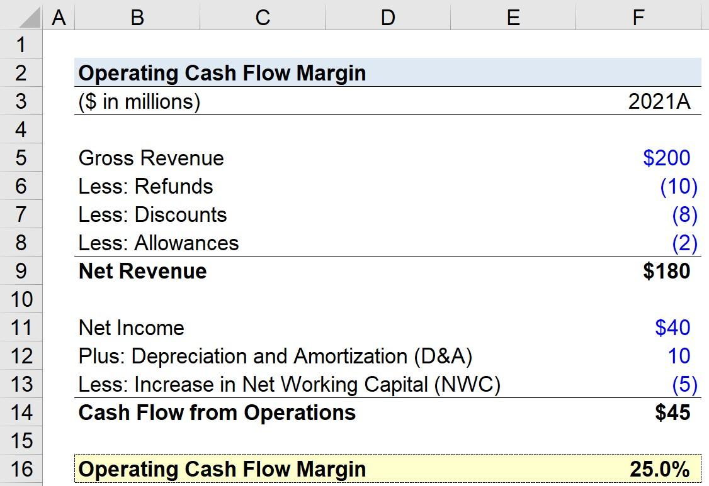

## Table of Contents

## What is Operating Cash Flow Margin?

Operating Cash Flow Margin is a financial ratio that shows how much cash a company generates from its operations relative to its total sales. It tells us what percentage of every dollar of revenue turns into cash from the company's core business activities. To find this margin, you take the operating cash flow and divide it by the net sales, then multiply by 100 to get a percentage.

This ratio is important because it gives investors and managers a clear picture of the company's financial health. A high Operating Cash Flow Margin means the company is good at turning its sales into cash, which is crucial for paying bills, investing in new projects, or returning money to shareholders. On the other hand, a low margin might signal that the company is struggling to generate enough cash from its sales, which could be a red flag for potential financial troubles.

## Why is Operating Cash Flow Margin important for a business?

Operating Cash Flow Margin is important for a business because it shows how well the company is doing at making money from what it sells. It tells you what part of every dollar in sales turns into cash that the company can use. If this number is high, it means the business is good at getting cash from its sales, which is great because it can use this cash to pay bills, buy new things, or give money back to people who own part of the company.

If the Operating Cash Flow Margin is low, it might mean the business is having a hard time turning its sales into cash. This can be a warning sign that the company might run into money problems. By keeping an eye on this margin, people who run the business and those who might want to invest in it can see how healthy the company's finances are and make better decisions about what to do next.

## How do you calculate Operating Cash Flow Margin?

To calculate Operating Cash Flow Margin, you need two numbers from a company's financial statements: the operating cash flow and the net sales. Operating cash flow is the amount of cash a company gets from its main business activities, like selling products or services. Net sales is the total amount of money the company makes from selling those products or services, after taking away any returns or discounts. Once you have these numbers, you divide the operating cash flow by the net sales. Then, to turn this into a percentage, you multiply the result by 100.

For example, if a company has an operating cash flow of $50,000 and net sales of $200,000, you would do the calculation like this: $50,000 divided by $200,000 equals 0.25. Multiply 0.25 by 100, and you get 25%. So, the Operating Cash Flow Margin for this company is 25%. This means that for every dollar of sales, the company is able to generate 25 cents in cash from its operations.

## What are the components needed to compute Operating Cash Flow Margin?

To compute Operating Cash Flow Margin, you need two main pieces of information from a company's financial statements: the operating cash flow and the net sales. Operating cash flow is the amount of money a company makes from its main business activities, like selling goods or services. Net sales is the total money the company earns from these sales, after taking away any returns or discounts.

To calculate the Operating Cash Flow Margin, you divide the operating cash flow by the net sales. Then, you multiply the result by 100 to get a percentage. This percentage tells you how much cash the company makes from each dollar of sales. For example, if a company has an operating cash flow of $50,000 and net sales of $200,000, you divide $50,000 by $200,000 to get 0.25. Multiply 0.25 by 100, and you find the Operating Cash Flow Margin is 25%. This means the company turns 25 cents of every sales dollar into cash from its operations.

## Can you provide a simple example of calculating Operating Cash Flow Margin?

Let's say a small bakery makes $100,000 from selling cakes and cookies in a year. After paying for ingredients and other costs, the bakery has $30,000 left over as operating cash flow. To find out the Operating Cash Flow Margin, you divide the operating cash flow by the total sales. So, you take $30,000 and divide it by $100,000, which gives you 0.30. Then, to turn this into a percentage, you multiply 0.30 by 100, which equals 30%.

This means the bakery's Operating Cash Flow Margin is 30%. In simple terms, for every dollar the bakery makes from selling its baked goods, it gets to keep 30 cents as cash from its operations. This cash can be used to pay bills, buy new equipment, or even give back to the owners of the bakery.

## How does Operating Cash Flow Margin differ from other profitability ratios?

Operating Cash Flow Margin is different from other profitability ratios because it focuses on the cash a business makes from its main activities, not just the profits shown on paper. For example, net profit margin looks at how much profit a company makes after all expenses, but it doesn't tell you how much of that profit is in cash. Operating Cash Flow Margin, on the other hand, shows how much cash a company gets from selling its products or services, which is important because cash is what a business uses to pay bills and grow.

Another common profitability ratio is the gross profit margin, which tells you the percentage of revenue that's left after paying for the cost of goods sold. While gross profit margin is useful for understanding how well a company controls its production costs, it doesn't show the cash flow from operations like the Operating Cash Flow Margin does. This makes Operating Cash Flow Margin a more direct measure of a company's ability to generate cash from its core business, which is crucial for its day-to-day operations and long-term health.

## What is considered a good Operating Cash Flow Margin?

A good Operating Cash Flow Margin can vary depending on the industry, but generally, a margin above 10% is considered healthy. This means the company is doing a good job at turning its sales into cash that it can use to pay bills, invest in new projects, or return to shareholders. For example, in industries like technology or software, where companies might have high initial costs but then generate a lot of cash from sales, a margin of 20% or higher could be seen as strong.

However, what's considered good can also depend on what other companies in the same industry are doing. If most companies in an industry have an Operating Cash Flow Margin around 5%, then a company with a margin of 7% might be doing well compared to its competitors. It's always a good idea to compare a company's margin to others in the same field to get a better idea of how well it's doing.

## How can Operating Cash Flow Margin be used to compare companies within the same industry?

Operating Cash Flow Margin can be used to compare companies within the same industry by looking at how much cash each company makes from its sales. If one company has a higher Operating Cash Flow Margin than another, it means that company is better at turning its sales into cash that it can use for things like paying bills or investing in new projects. For example, if Company A has an Operating Cash Flow Margin of 15% and Company B has a margin of 10%, Company A is doing a better job at generating cash from its sales.

This comparison can help investors and business owners see which companies are more financially healthy and efficient. By looking at the Operating Cash Flow Margin, they can figure out which companies are good at managing their money and might be a safer or better investment. It's important to remember that what's considered a good margin can change from one industry to another, so it's always best to compare companies within the same industry to get a fair idea of how they're doing.

## What are the limitations of using Operating Cash Flow Margin as a performance metric?

Operating Cash Flow Margin is a useful tool to see how well a company is doing at turning its sales into cash, but it has some limits. One big problem is that it doesn't show all the money a company is spending. For example, it doesn't include money spent on things like buying new equipment or paying back loans. So, even if a company has a high Operating Cash Flow Margin, it might still be spending a lot of cash in other areas, which could mean it's not as financially healthy as it looks.

Another limit is that Operating Cash Flow Margin can be different from one industry to another. What's considered a good margin in one industry might not be good in another. This makes it hard to compare companies from different industries using this measure. Also, companies can sometimes change their accounting methods to make their Operating Cash Flow Margin look better, which can make it hard to trust the numbers. So, while Operating Cash Flow Margin is helpful, it's important to look at other financial measures too to get a full picture of a company's health.

## How can changes in Operating Cash Flow Margin over time indicate a company's financial health?

Changes in Operating Cash Flow Margin over time can tell you a lot about a company's financial health. If the margin is going up, it means the company is getting better at turning its sales into cash. This is good because it shows the company is managing its money well and might be able to pay its bills easily, invest in new projects, or give money back to its owners. On the other hand, if the margin is going down, it could mean the company is having a hard time getting cash from its sales. This might be a warning sign that the company is struggling and could run into money problems in the future.

It's important to look at these changes over several years to see the full picture. A one-time change might not mean much, but a trend over time can show if the company is getting stronger or weaker. For example, if the margin keeps going up year after year, it's a good sign that the company is on a healthy path. But if it keeps going down, it might be time to worry and look closer at what's going wrong. By watching the Operating Cash Flow Margin over time, you can get a better idea of how well the company is doing and make smarter decisions about investing in it or running it.

## What factors can affect the Operating Cash Flow Margin of a business?

Several things can change a business's Operating Cash Flow Margin. One big [factor](/wiki/factor-investing) is how well the business manages its costs. If a company can keep its costs down, like spending less on making or buying things to sell, it will have more cash left over from its sales. Another factor is how fast the business gets paid by its customers. If customers pay quickly, the business gets more cash sooner, which can make the margin go up. On the other hand, if customers take a long time to pay, the business might have less cash coming in, and that can lower the margin.

Changes in how much people want to buy the company's products or services can also affect the margin. If more people want to buy, the company can sell more and make more cash. But if fewer people want to buy, the company might have to sell less, and that can make the margin go down. Also, things like new laws, taxes, or even the economy can play a role. If taxes go up or the economy slows down, it can be harder for the business to make as much cash from its sales, which can hurt the Operating Cash Flow Margin.

## How can a company improve its Operating Cash Flow Margin?

A company can improve its Operating Cash Flow Margin by focusing on managing its costs better. This means looking at all the money it spends on making or buying things to sell and trying to spend less. For example, if a company can find cheaper suppliers or make things more efficiently, it will have more cash left over from its sales. Another way to improve the margin is to get paid faster by customers. If a company can make its customers pay sooner, it will have more cash coming in, which can make the margin go up.

Another important way to boost the Operating Cash Flow Margin is by increasing sales. If more people want to buy what the company is selling, the company can make more money and turn more of that into cash. This might mean making better products, advertising more, or finding new customers. Also, the company needs to keep an eye on outside factors like taxes and the economy. If taxes go up or the economy slows down, the company might need to work even harder to keep its costs down and sales up to maintain or improve its margin.

## What is the understanding of Operating Cash Flow and Cash Flow Margin?

Operating cash flow (OCF) is a fundamental financial metric that quantifies the cash generated by a company's primary business activities, excluding any financing or investing activities. OCF is vital in financial analysis as it provides a clear picture of how efficiently a company can generate cash to support its operations, pay debts, and fund investments without relying on external financing. The formula for operating cash flow can be expressed as:

$$
\text{OCF} = \text{Net Income} + \text{Non-Cash Expenses} - \text{Increase in Working Capital}
$$

Where:
- **Net Income** is the profit a company reports after subtracting all expenses including taxes.
- **Non-Cash Expenses** include depreciation and amortization, which reduce net income without affecting cash flow.
- **Increase in Working Capital** reflects changes in current assets and liabilities impacting the cash available from operations.

Cash flow margin, on the other hand, is a related metric that provides a percentage measure of the OCF relative to the company’s total sales. This ratio is essential for evaluating the cash efficiency of a firm's sales operations and its ability to convert sales into cash. The cash flow margin is calculated as:

$$
\text{Cash Flow Margin} = \left( \frac{\text{Operating Cash Flow}}{\text{Total Sales}} \right) \times 100\%
$$

This metric indicates the proportion of each dollar of sales that turns into cash, which is crucial for assessing a company's [liquidity](/wiki/liquidity-risk-premium), operational efficiency, and overall financial health. For instance, a high cash flow margin signifies that a company has robust cash conversion ability, reflecting efficient operations that could shield the firm from financial stress.

Both OCF and cash flow margin are critical in evaluating a company's ability to sustain its operations and fuel growth. High values of these metrics suggest strong financial health, implying that the company can meet its short-term liabilities and invest in future opportunities without excessive reliance on mustering external funds. In contrast, lower metrics may signal potential liquidity concerns, indicating challenges in maintaining operational stability and scaling the business effectively.

These measures are particularly important for stakeholders like investors, creditors, and management teams as they provide insights into the underlying cash generation ability of the business. Therefore, consistently tracking and analyzing OCF and cash flow margin can aid in making more informed business decisions and forecasts.

## What is the importance of Operating Cash Flow Margin in Financial Analysis?

Operating Cash Flow Margin (OCFM) serves as a pivotal indicator of a company's financial performance, specifically its ability to convert sales into cash flow, which is crucial for maintaining day-to-day operations and ensuring long-term sustainability. The significance of OCFM lies in its capacity to provide a clear picture of how efficiently a company manages its operational expenses and capital investments. This efficiency is reflected in the conversion rate of sales revenue to cash flow, which is a more reliable metric than mere profit figures, as it eliminates non-cash transactions and provides a better representation of the company's liquidity position.

The formula for calculating the Operating Cash Flow Margin is:

$$
\text{OCFM} = \left( \frac{\text{Operating Cash Flow}}{\text{Total Sales}} \right) \times 100
$$

A higher OCFM is generally preferred as it indicates robust financial health and a lower dependency on external financing. Companies with high OCFM are typically adept at controlling costs and generating substantial cash from their core activities, which enhances their flexibility in funding growth initiatives, paying dividends, or reducing debt. For investors and analysts, a higher OCFM suggests a lower risk profile, as the company is likely to sustain operations and manage through economic downturns without excessive reliance on borrowed funds.

Conversely, a lower OCFM might signal that a company is struggling with higher operational costs or inefficiencies, limiting its ability to convert sales into actual cash. This scenario could compel a company to seek additional funding sources, which might not be sustainable in the long run. Thus, OCFM serves as a critical measure for assessing the operational soundness of a company and its capacity to generate cash flow from sales.

In-depth analysis of OCFM also facilitates benchmarking, allowing stakeholders to compare a company's operational efficiency with that of its industry peers. This comparison is indispensable for identifying competitive advantages or disadvantages. For instance, if a company has a consistently higher OCFM relative to its competitors, it may suggest superior management practices, innovative operational strategies, or economies of scale that contribute to better cash generation.

Overall, OCFM is integral to financial analysis and strategic decision-making. It helps investors and analysts gauge a company's financial health, operational efficiency, and long-term viability, ultimately guiding informed investment decisions.

## References & Further Reading

[1]: ["Operating Cash Flow: Definition and Formula"](https://www.investopedia.com/terms/o/operatingcashflow.asp) Article on Investopedia

[2]: ["Cash Flow Analysis: How Cash Flow Differs from Profit"](https://online.hbs.edu/blog/post/cash-flow-vs-profit) by the CFA Institute

[3]: ["Algorithmic Trading: Winning Strategies and Their Rationale"](https://www.wiley.com/en-us/Algorithmic+Trading%3A+Winning+Strategies+and+Their+Rationale-p-9781118746912) by Ernie Chan

[4]: ["Quantitative Momentum: A Practitioner's Guide to Building a Momentum-Based Stock Selection System"](https://www.amazon.com/Quantitative-Momentum-Practitioners-Momentum-Based-Selection/dp/111923719X) by Wesley R. Gray and Jack R. Vogel

[5]: ["Advances in Financial Machine Learning"](https://www.amazon.com/Advances-Financial-Machine-Learning-Marcos/dp/1119482089) by Marcos Lopez de Prado

[6]: ["Python for Finance: Mastering Data-Driven Finance"](https://www.amazon.com/Python-Finance-Mastering-Data-Driven/dp/1492024333) by Yves Hilpisch