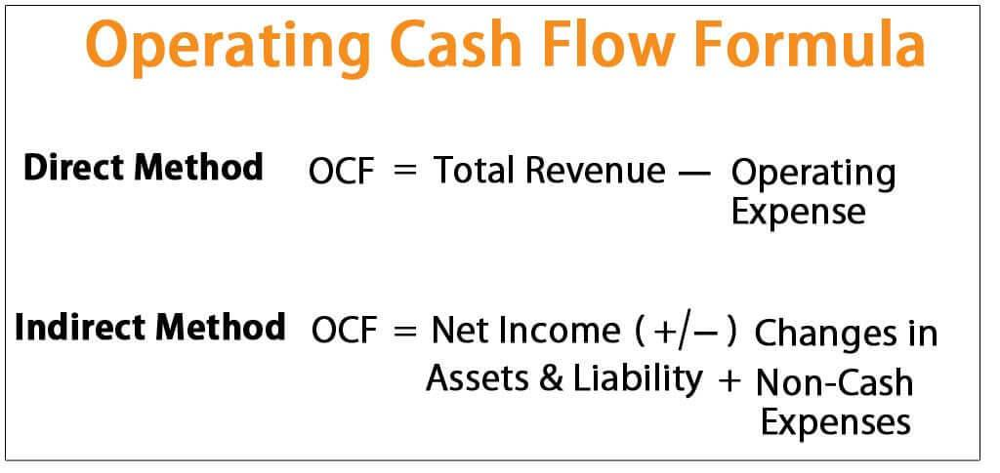

The financial landscape is increasingly intricate, demanding robust analytical tools and techniques. In such a dynamic environment, Operating Cash Flow (OCF) emerges as a crucial metric for assessing a company's ability to generate cash from its regular operations. OCF provides insights into the core profitability and operational efficiency of a business by focusing on cash transactions rather than accounting profits, thus offering a clearer picture of financial health.

Algorithmic trading has revolutionized the way financial markets operate by leveraging such financial insights to automate and optimize trading strategies. Algorithms execute trades based on predetermined criteria derived from various financial metrics, including OCF, enabling traders to act with precision and speed that surpasses human capabilities. The integration of OCF into algorithmic models allows traders to harness real-time financial data, creating opportunities for enhanced trading performance by adjusting to shifts in a company's financial operations swiftly.



This article will examine the intersection of OCF analysis and algorithmic trading, demonstrating how the integration of these tools can significantly enrich trading strategies. By understanding the practical applications of OCF within algorithmic frameworks, traders can potentially achieve better-informed, data-driven decisions, contributing to improved market outcomes.

## Table of Contents

## Understanding Operating Cash Flow

Operating Cash Flow (OCF) is a key financial metric that represents the amount of cash generated by a company's core business operations over a specified period, typically expressed on a quarterly or annual basis. It is an essential indicator in financial analysis, showcasing a company's ability to produce cash from its operational activities, separate from external financing or investment demands. OCF holds particular significance as it provides investors and analysts with insights into a company's operational efficiency, liquidity, and overall financial health.

### Calculation of Operating Cash Flow

Operating Cash Flow is typically calculated using the indirect method by adjusting net income for items that affected reported net income but did not involve cash transactions. The formula for OCF is:

$$
\text{OCF} = \text{Net Income} + \text{Non-cash Expenses} + \text{Changes in Working Capital}
$$

- **Net Income**: Represents the profit a company has earned over a period after all expenses have been deducted from revenues.

- **Non-cash Expenses**: Often include depreciation and amortization as these expenses reduce reported net income but do not involve cash outflows.

- **Changes in Working Capital**: Reflect adjustments for current assets and liabilities that impact operating cash flow. For example, an increase in accounts receivable represents sales made on credit and is subtracted from net income, whereas an increase in accounts payable indicates purchases on credit and is added back to the net income.

### Comparison with Other Cash Flow Metrics

Operating Cash Flow differs from other cash flow components such as Investing Cash Flow and Financing Cash Flow:

- **Investing Cash Flow**: Relates to the cash spent and received from buying and selling assets. It includes transactions for equipment, property, or long-term investments, fundamentally affecting a company's capital structure rather than its operational efficiency.

- **Financing Cash Flow**: Encompasses activities related to borrowing, repaying debt, and raising equity. This segment reflects how a company funds its operations and growth outside its core business activities.

### Importance of Evaluating Operating Cash Flow

Assessing Operating Cash Flow is crucial for understanding a company's ability to sustain its business operations without relying on external financing. A strong OCF indicates that a company has sufficient [liquidity](/wiki/liquidity-risk-premium) to cover operational costs, reinvest in the business, pay dividends, and handle unforeseen financial challenges. In contrast, weak or negative OCF may signal operational inefficiencies or a potential need for external funding to maintain operations.

Investors and analysts often prioritize OCF over net income because it offers a clearer picture of financial viability by focusing on cash generation rather than accounting profits. Understanding OCF allows stakeholders to evaluate a company’s sustainability and long-term financial well-being, making it a vital metric in comprehensive financial analysis and decision-making.

## Financial Analysis with Operating Cash Flow

Operating Cash Flow (OCF) plays a crucial role in financial analysis, particularly in evaluating a company's ability to meet its short-term liabilities using cash generated from its core business operations. OCF is derived from the cash flow statement and reflects the cash inflows and outflows arising from normal business activities. It is a significant indicator of a company's liquidity and operational efficiency, offering insights into whether a company can sustain itself financially without relying on external financing.

### Role of OCF in Covering Short-Term Liabilities

The primary role of OCF is to indicate a company's capacity to cover short-term obligations. A healthy positive OCF suggests that a company generates sufficient cash to not only reinvest in its business but also to pay off debts and fund other necessary expenditures. On the contrary, a consistently negative OCF may indicate potential liquidity issues, signaling that the company might struggle to meet its obligations without resorting to borrowing or selling assets.

### OCF Ratio and Liquidity Assessment

To further assess liquidity, investors and analysts often use the Operating Cash Flow Ratio. This ratio is calculated as:

$$
\text{Operating Cash Flow Ratio} = \frac{\text{Operating Cash Flow}}{\text{Current Liabilities}}
$$

A ratio greater than 1 indicates that the company has adequate cash flow to cover its current liabilities, which suggests financial health. It provides a more dynamic view of liquidity compared to static measures because it accounts for cash actually generated, rather than relying solely on balance sheet figures.

### Practical Applications of OCF in Financial Decision-Making

OCF is used extensively in investment and credit decisions. For instance, a potential investor might look at a company's OCF to assess its financial health and dividend-paying capability. Similarly, lenders might evaluate OCF to determine a company’s ability to repay loans.

For example, consider a technology firm with an OCF of $500 million and current liabilities of $300 million, resulting in an OCF ratio of 1.67. This suggests strong liquidity, reassuring investors and creditors about the firm’s capability to manage its obligations and invest in growth opportunities.

### Distinction Between OCF and Other Liquidity Ratios

While OCF provides dynamic insights, it is often compared with other liquidity ratios, such as the Current Ratio, which is calculated as:

$$
\text{Current Ratio} = \frac{\text{Current Assets}}{\text{Current Liabilities}}
$$

The Current Ratio offers a snapshot of assets versus liabilities at a given moment but does not account for how effectively cash from operations supports these liabilities. In contrast, OCF is a measure of cash flow effectiveness and sustainability, providing a more comprehensive view of financial resilience in changing market conditions.

In summary, Operating Cash Flow is a vital component of financial analysis, offering critical insights into a company's operational liquidity and financial health. By understanding and analyzing OCF, investors and analysts gain valuable information essential for informed decision-making, beyond what static ratios like the Current Ratio can offer.

## Algorithmic Trading: An Overview

Algorithmic trading, often called "algo trading," refers to the use of computer algorithms to automate and optimize the process of trading financial securities. These algorithms can execute trades at speeds and frequencies that surpass human capability, making them increasingly prevalent in financial markets. By utilizing complex mathematical models and statistical analyses, algo trading systems are able to analyze large volumes of market data in real-time, making it possible to capitalize on market inefficiencies more effectively.

The integration of financial data into [algorithmic trading](/wiki/algorithmic-trading) models enhances trading strategies by allowing algorithms to identify trends, execute orders, and manage risk with precision. These systems often incorporate technical indicators, historical data, and news analytics, among other data points, to predict price movements and make informed trading decisions. By analyzing patterns and correlations within the data, algorithms can determine optimal timing, pricing, or size for a trade.

Automating trading decisions based on real-time financial insights offers several benefits. Firstly, it eliminates human emotions from the trading process, such as fear and greed, which can lead to suboptimal decision-making. Secondly, it enables high-frequency trading ([HFT](/wiki/high-frequency-trading-strategies)), where numerous trades are executed in fractions of a second, optimizing profits through incremental gains. Lastly, automated trading allows for 24/7 market participation, thereby exploiting opportunities in global markets that operate outside traditional trading hours.

Given the speed and accuracy required in algorithmic trading, developers often use programming languages such as Python due to its simplicity and extensive libraries for data analysis, or C++ for situations demanding superior performance and speed. Here is a basic Python snippet illustrating a simplistic trading strategy based on moving averages:

```python
import pandas as pd

# Load market data
data = pd.read_csv('market_data.csv')

# Calculate moving averages
data['SMA_20'] = data['Close'].rolling(window=20).mean()
data['SMA_50'] = data['Close'].rolling(window=50).mean()

# Generate trading signals
data['Signal'] = 0
data.loc[data['SMA_20'] > data['SMA_50'], 'Signal'] = 1  # Buy signal
data.loc[data['SMA_20'] < data['SMA_50'], 'Signal'] = -1 # Sell signal

# Implement a basic trading strategy
position = 0
for i in range(1, len(data)):
    if data['Signal'][i] == 1 and position == 0:
        print(f"Buying 1 unit at {data['Close'][i]}")
        position = 1
    elif data['Signal'][i] == -1 and position == 1:
        print(f"Selling 1 unit at {data['Close'][i]}")
        position = 0
```

This code represents a simple moving average crossover strategy, where a short-term moving average crossing above a long-term moving average generates a buy signal, and a crossover in the opposite direction indicates a sell signal. While elementary, this example underscores the primary principle of algorithmic trading: automating decisions based on quantifiable data to achieve efficient and repeatable trading outcomes.

## Integrating OCF in Algo Trading Strategies

Operating Cash Flow (OCF) is increasingly being integrated into algorithmic trading strategies, serving as a critical component for constructing sophisticated algorithms. This financial metric, by highlighting the cash a company generates from its operations, provides traders with valuable insights that can be leveraged to predict stock price movements and adjust trading strategies accordingly.

OCF data can be incorporated into algorithmic trading models in several ways. One approach is through the development of predictive algorithms that use OCF as a core variable for evaluating the future performance of stocks. For instance, a significant increase in a company's OCF might indicate improved operational efficiency and potential future growth, thus suggesting a buying opportunity. Conversely, declining OCF could signal operational challenges, prompting a sell decision.

Python, a powerful programming language widely used in developing trading algorithms, offers several libraries like pandas and NumPy to handle and analyze financial data. An example Python code snippet for evaluating OCF changes might look like this:

```python
import pandas as pd

# Example OCF data for companies
data = {'Company': ['A', 'B', 'C'],
        'OCF_Year1': [1000, 2000, 1500],
        'OCF_Year2': [1200, 1800, 1600]}

df = pd.DataFrame(data)

# Calculating OCF growth rate
df['OCF_Growth'] = (df['OCF_Year2'] - df['OCF_Year1']) / df['OCF_Year1'] * 100

# Decision based on OCF growth
df['Decision'] = df['OCF_Growth'].apply(lambda x: 'Buy' if x > 10 else 'Sell')

print(df)
```

In this example, the algorithm calculates the growth rate of OCF for different companies and suggests a buy decision if the growth exceeds 10%. Traders can adapt the threshold based on market dynamics and additional factors such as industry trends.

Real-world case studies further highlight the successful integration of OCF analysis into algorithmic trading. Hedge funds and asset management firms have utilized OCF data to refine their trading models, allowing them to harness both quantitative and qualitative insights. For example, during an economic downturn, companies with resilient OCF often outperform the market, suggesting robust trading opportunities.

Moreover, these algorithms can be enhanced by integrating [machine learning](/wiki/machine-learning) techniques. By feeding historical OCF data along with other financial metrics into machine learning models, traders can uncover patterns and correlations that may not be immediately evident through traditional analysis. These models can continuously learn and adapt, improving their accuracy in predicting stock trends.

Integrating OCF into algorithmic trading presents challenges, including ensuring the accuracy and timeliness of data and adjusting algorithms to cope with market [volatility](/wiki/volatility-trading-strategies). Nonetheless, traders who effectively incorporate OCF data into their strategies can potentially achieve enhanced decision-making and improved market performance.

## Challenges and Considerations

Interpreting nuanced financial data within algorithmic models presents a series of intricate challenges that demand keen analytical foresight and robust computational methodologies. A primary challenge lies in the inherent complexity of financial data, which often comprises multiple layers and dimensions. Algorithmic models must be designed to parse, analyze, and interpret these data structures efficiently to extract actionable insights. This necessitates sophisticated algorithms capable of handling large datasets with diverse variables, requiring advanced techniques in data analysis and machine learning.

Market volatility further complicates the interpretation process, introducing elements of unpredictability that can adversely affect algorithmic trading performance. Volatility can lead to rapid changes in market conditions, necessitating algorithms that are not only precise but also adaptable. This requires the continuous refinement of trading models to ensure they remain responsive to real-time market shifts.

Ensuring data accuracy and timeliness is critical for effective financial analysis in algorithmic trading. Inaccuracies or delays in financial data can lead to significant errors in trading decisions, potentially resulting in substantial financial losses. Therefore, maintaining rigorous data validation protocols and ensuring access to real-time data streams are essential components of a reliable algorithmic trading strategy.

Balancing quantitative data analysis with qualitative market insights is another considerable challenge. While quantitative models provide a framework for decision-making, qualitative insights—such as market sentiment, news events, and macroeconomic indicators—play a crucial role in shaping market dynamics. Integrating these qualitative elements into algorithmic models requires a holistic approach, combining traditional financial analysis techniques with modern computational tools to capture the full spectrum of market behavior.

These challenges underscore the necessity for traders and analysts to employ a multifaceted approach in algorithmic trading, leveraging advanced technology and data science methods to navigate the complexities of modern financial markets.

## Conclusion

The convergence of traditional financial analysis and modern algorithmic trading represents a significant advancement in the financial sector, underscoring the necessity for precise financial insights to inform automated trading strategies. Operating Cash Flow (OCF), as a fundamental indicator of a company's financial health, becomes vital in this integration. By incorporating OCF into algorithmic trading systems, traders and analysts can access a deeper level of understanding regarding a company's ability to generate cash through its operations. This precision enhances decision-making processes, allowing for more accurate forecasts of stock performance based on real-time financial health indicators.

Financial markets are characterized by their volatility and rapid changes, necessitating a high degree of adaptability in trading strategies. The integration of comprehensive financial data, such as OCF, allows algorithms to adjust swiftly to new information, maintaining their effectiveness even in turbulent market conditions. This constant adaptation ensures that trading strategies remain aligned with current market realities, optimizing performance and mitigating risks associated with unexpected shifts in financial metrics. 

As the landscape continues to evolve, it is imperative for traders to continuously update and refine their algorithmic models, ensuring that they incorporate both quantitative and qualitative insights. By leveraging OCF data, traders can enhance their comprehension of market dynamics, leading to more informed and strategic trading decisions. Ultimately, this intersection of traditional and modern methodologies not only enriches the understanding of financial markets but also propels trading performance to new heights, encouraging a more strategic approach to investment and risk management.

## References & Further Reading

To further understand the synergy between Operating Cash Flow (OCF) and algorithmic trading, a variety of resources and literature can provide deeper insights. These materials range from foundational texts on financial analysis to comprehensive guides on modern trading strategies.

1. **Books and Scholarly Articles**:
   - *Financial Statement Analysis and Security Valuation* by Stephen Penman is widely regarded as a seminal text, offering a thorough understanding of financial statements, including OCF calculations.
   - For those interested in algorithmic trading, *Algorithmic Trading: Winning Strategies and Their Rationale* by Ernie Chan provides a detailed exploration of algorithmic strategies and the rationale behind their design.
   - Academic journals such as the *Journal of Financial Economics* and the *Review of Financial Studies* publish peer-reviewed articles covering advances in financial metrics and trading technologies.

2. **Online Courses and Tutorials**:
   - Platforms like Coursera and edX offer courses such as "Algorithmic Trading and Finance Models with Python, R, and Stata Essential Training," which teach practical skills in trading strategy development.
   - The CFA Institute provides resources and courses that delve into financial statement analysis, enhancing understanding of metrics like OCF.

3. **Technology Tools and Software**:
   - Python remains a dominant language for implementing algorithmic trading strategies. Libraries such as Pandas for data manipulation, NumPy for numerical operations, and Scikit-learn for machine learning model integration are pivotal.
   - Trading platforms like MetaTrader and Interactive Brokers offer APIs that allow traders to integrate custom algorithms directly into live trading environments.

4. **Industry Reports and Case Studies**:
   - White papers from financial institutions, such as JPMorgan or Goldman Sachs, often discuss the latest trends and technologies in algorithmic trading.
   - Case studies highlighting successful applications of OCF in trading strategies can be found in publications like Bloomberg and Reuters.

5. **Forums and Community Engagement**:
   - Engaging with communities on platforms like QuantConnect, Stack Exchange, and Reddit’s r/algotrading can provide real-time insights and peer support for both beginners and seasoned traders.

By exploring these resources, individuals can gain a comprehensive understanding of how OCF data can be integrated into algorithmic trading strategies, enhancing decision-making and market performance through detailed financial analysis.