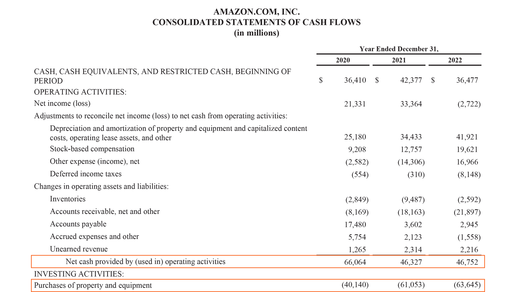

## Table of Contents

## What is operating cash flow?

Operating cash flow is the money a business makes from its regular operations. It shows how much cash a company is generating from its core business activities, like selling products or services. This is important because it tells us if the business can pay its bills, employees, and other regular expenses without needing to borrow money or use other sources of cash.

To calculate operating cash flow, you start with the company's net income, then add back any non-cash expenses like depreciation. You also need to adjust for changes in working capital, which includes things like inventory and accounts receivable. This gives you a clear picture of the cash that's actually coming in and going out from the day-to-day running of the business.

## Why is operating cash flow important for a business?

Operating cash flow is really important for a business because it shows how much money the company is making from its main activities, like selling things or providing services. This is different from other types of cash flow, like money from loans or selling assets. When a business has a good operating cash flow, it means they can pay their bills, employees, and other regular costs without needing to borrow money. This makes the business more stable and less risky.

If a business has a strong operating cash flow, it can also use that money to grow. They might invest in new equipment, open new locations, or even buy other companies. This helps the business get bigger and stronger over time. On the other hand, if a business has a low or negative operating cash flow, it might struggle to keep going and could need to borrow money or sell assets just to stay afloat. So, keeping an eye on operating cash flow is key to understanding how healthy a business is.

## How does operating cash flow differ from net income?

Operating cash flow and net income are two different ways to measure how a business is doing, but they tell us different things. Net income is what's left after a business subtracts all its costs from its revenue. It's the profit that shows up on the income statement. This number includes all sorts of expenses, like the cost of goods sold, salaries, rent, and even things like depreciation, which is a way of accounting for the wear and tear on equipment over time.

Operating cash flow, on the other hand, focuses on the actual cash that comes in and goes out from the business's main activities. It starts with net income but then adds back non-cash expenses like depreciation. It also adjusts for changes in working capital, like money tied up in inventory or what customers owe the business. This gives a clearer picture of the cash that the business is really generating from its day-to-day operations, which is important for understanding if the business can keep running smoothly without needing to borrow money or sell assets.

## What are the components of operating cash flow?

Operating cash flow is made up of a few key parts. It starts with the net income of the business, which is the profit after all expenses are subtracted from the revenue. But since net income includes non-cash expenses like depreciation, these are added back to get a better picture of the actual cash flow. Depreciation is an accounting way to spread out the cost of things like machines over time, but it doesn't involve real cash leaving the business.

The next part of operating cash flow involves changes in working capital. This includes things like inventory, which is the stuff a business has ready to sell, and accounts receivable, which is the money customers owe the business. If inventory goes up, it means the business spent cash to buy more stuff to sell, so that's subtracted from the cash flow. If accounts receivable go up, it means the business sold more on credit, so that's also subtracted because the cash hasn't come in yet. On the other hand, if accounts payable, which is money the business owes to suppliers, goes up, that's added back because it means the business held onto its cash longer.

Putting it all together, operating cash flow shows how much cash a business is making from its main activities, after taking into account the net income, adding back non-cash expenses, and adjusting for changes in working capital. This gives a clear picture of whether the business can keep running its day-to-day operations without needing to borrow money or sell off assets.

## Can you explain the operating cash flow formula?

The operating cash flow formula helps us see how much cash a business makes from its main activities. It starts with the net income, which is the money left after all expenses are paid. But because net income includes non-cash expenses like depreciation, we add those back to get a true picture of the cash flow. Depreciation is just an accounting way to spread out the cost of things like machines over time, but it doesn't mean real cash is leaving the business.

Next, we need to adjust for changes in working capital. This includes things like inventory, which is the stuff a business has to sell, and accounts receivable, which is the money customers owe the business. If inventory goes up, it means the business spent cash to buy more stuff, so we subtract that from the cash flow. If accounts receivable go up, it means the business sold more on credit, so we also subtract that because the cash hasn't come in yet. On the flip side, if accounts payable, which is money the business owes to suppliers, goes up, we add it back because it means the business held onto its cash longer. So, the operating cash flow formula is: Net Income + Depreciation - Increase in Inventory - Increase in Accounts Receivable + Increase in Accounts Payable.

## How do you calculate operating cash flow from the income statement and balance sheet?

To calculate operating cash flow, you start with the net income from the income statement. Net income is the money left after all expenses are subtracted from the revenue. But since net income includes non-cash expenses like depreciation, you need to add those back. Depreciation is an accounting way to spread out the cost of things like machines over time, but it doesn't mean real cash is leaving the business. So, you take the net income and add back the depreciation expense.

Next, you need to look at the balance sheet to adjust for changes in working capital. Working capital includes things like inventory, which is the stuff a business has to sell, and accounts receivable, which is the money customers owe the business. If inventory goes up, it means the business spent cash to buy more stuff, so you subtract that from the cash flow. If accounts receivable go up, it means the business sold more on credit, so you also subtract that because the cash hasn't come in yet. On the other hand, if accounts payable, which is money the business owes to suppliers, goes up, you add it back because it means the business held onto its cash longer. So, the full formula to calculate operating cash flow is: Net Income + Depreciation - Increase in Inventory - Increase in Accounts Receivable + Increase in Accounts Payable.

## What is the difference between direct and indirect methods of calculating operating cash flow?

The direct and indirect methods are two different ways to calculate operating cash flow. The direct method looks at the actual cash coming in and going out from the business's main activities. It adds up all the cash received from customers and subtracts all the cash paid out for things like salaries, supplies, and other operating expenses. This method gives a clear picture of where the cash is coming from and where it's going, but it can be harder to put together because businesses don't always keep detailed records of all their cash transactions.

The indirect method starts with the net income from the income statement and then makes adjustments to turn it into cash flow. It adds back non-cash expenses like depreciation, which is an accounting way to spread out the cost of things like machines over time. Then, it adjusts for changes in working capital, like inventory and accounts receivable. This method is easier to use because it starts with numbers that are already in the financial statements, but it doesn't show the exact cash transactions like the direct method does. Both methods should give the same final number for operating cash flow, but they show it in different ways.

## How can operating cash flow be used to assess a company's financial health?

Operating cash flow is a key way to see how healthy a company's finances are. It shows how much cash the company is making from its main business activities, like selling products or services. If a company has a strong operating cash flow, it means they can pay their bills, employees, and other regular costs without needing to borrow money. This is important because it makes the company more stable and less risky. If a company's operating cash flow is low or negative, it might struggle to keep going and could need to borrow money or sell assets just to stay afloat.

You can also use operating cash flow to see if a company is growing in a healthy way. If the operating cash flow is increasing over time, it means the company is getting better at turning its business activities into cash. This can help the company invest in new equipment, open new locations, or even buy other companies. On the other hand, if the operating cash flow is going down, it might be a sign that the company is facing problems and might not be able to keep growing or even stay in business. So, keeping an eye on operating cash flow is a good way to understand how well a company is doing financially.

## What are common adjustments made when calculating operating cash flow?

When calculating operating cash flow, you start with the net income from the income statement. But net income includes expenses that don't use up real cash, like depreciation. Depreciation is just an accounting way to spread out the cost of things like machines over time, so you add it back to the net income. This helps you see the actual cash the business is making.

Then, you need to look at changes in working capital from the balance sheet. Working capital includes things like inventory, which is the stuff a business has to sell, and accounts receivable, which is money customers owe the business. If inventory goes up, it means the business spent cash to buy more stuff, so you subtract that from the cash flow. If accounts receivable go up, it means the business sold more on credit, so you also subtract that because the cash hasn't come in yet. On the other hand, if accounts payable, which is money the business owes to suppliers, goes up, you add it back because it means the business held onto its cash longer.

## How does operating cash flow relate to free cash flow?

Operating cash flow and free cash flow are two important numbers that help us understand how much money a business has. Operating cash flow is the money a business makes from its main activities, like selling products or services. It shows how much cash the business is bringing in from its day-to-day operations. To find it, you start with the net income and add back things like depreciation, which is an accounting way to spread out the cost of equipment over time. You also adjust for changes in working capital, like inventory and money customers owe the business.

Free cash flow takes the operating cash flow a step further. It tells us how much money the business has left after it pays for everything it needs to keep running and growing. To calculate free cash flow, you start with the operating cash flow and then subtract the money the business spends on things like new equipment or buildings. This number is important because it shows how much cash the business can use for other things, like paying back loans, buying back its own stock, or even paying dividends to its owners. So, while operating cash flow shows the cash from the main business activities, free cash flow shows what's left after the business takes care of its needs.

## What are some limitations of using operating cash flow as a financial metric?

Operating cash flow is a good way to see how much money a business is making from its main activities, but it has some limits. One big limit is that it doesn't show the whole picture of a business's cash situation. For example, it doesn't include the cash spent on big investments like new buildings or machines. These costs can be important because they help the business grow or keep running smoothly. So, if you only look at operating cash flow, you might think a business is doing better than it really is.

Another limit is that operating cash flow can change a lot from one time to another. Things like when customers pay their bills or when the business buys more inventory can make the numbers go up and down. This can make it hard to know if the business is really doing well or if it's just having a good or bad month. Also, operating cash flow doesn't tell you about other important things like how much debt the business has or if it's making money from other sources, like selling off parts of the business. So, while operating cash flow is helpful, it's best to use it along with other financial numbers to get a full understanding of a business's health.

## How can investors use operating cash flow to make investment decisions?

Investors can use operating cash flow to see how well a business is doing with its main activities. Operating cash flow shows how much money a business is making from selling things or providing services, which is important because it tells investors if the business can pay its bills and keep running without needing to borrow money. If a business has a strong operating cash flow, it means the business is healthy and can handle its day-to-day costs. This makes the business a safer investment because it's less likely to run into money problems.

Investors also look at operating cash flow to see if a business is growing in a good way. If the operating cash flow is going up over time, it means the business is getting better at making money from its main activities. This can help the business grow by investing in new things, like equipment or new locations. If the operating cash flow is going down, it might be a sign that the business is having trouble, and it could be riskier to invest in. So, by looking at operating cash flow, investors can make smarter choices about where to put their money.

## What is Understanding Operating Cash Flow?

Operating Cash Flow (OCF) is a key financial metric that represents the amount of cash generated by a company's core business operations over a specified period, typically expressed on a quarterly or annual basis. It is an essential indicator in financial analysis, showcasing a company's ability to produce cash from its operational activities, separate from external financing or investment demands. OCF holds particular significance as it provides investors and analysts with insights into a company's operational efficiency, liquidity, and overall financial health.

### Calculation of Operating Cash Flow

Operating Cash Flow is typically calculated using the indirect method by adjusting net income for items that affected reported net income but did not involve cash transactions. The formula for OCF is:

$$
\text{OCF} = \text{Net Income} + \text{Non-cash Expenses} + \text{Changes in Working Capital}
$$

- **Net Income**: Represents the profit a company has earned over a period after all expenses have been deducted from revenues.

- **Non-cash Expenses**: Often include depreciation and amortization as these expenses reduce reported net income but do not involve cash outflows.

- **Changes in Working Capital**: Reflect adjustments for current assets and liabilities that impact operating cash flow. For example, an increase in accounts receivable represents sales made on credit and is subtracted from net income, whereas an increase in accounts payable indicates purchases on credit and is added back to the net income.

### Comparison with Other Cash Flow Metrics

Operating Cash Flow differs from other cash flow components such as Investing Cash Flow and Financing Cash Flow:

- **Investing Cash Flow**: Relates to the cash spent and received from buying and selling assets. It includes transactions for equipment, property, or long-term investments, fundamentally affecting a company's capital structure rather than its operational efficiency.

- **Financing Cash Flow**: Encompasses activities related to borrowing, repaying debt, and raising equity. This segment reflects how a company funds its operations and growth outside its core business activities.

### Importance of Evaluating Operating Cash Flow

Assessing Operating Cash Flow is crucial for understanding a company's ability to sustain its business operations without relying on external financing. A strong OCF indicates that a company has sufficient [liquidity](/wiki/liquidity-risk-premium) to cover operational costs, reinvest in the business, pay dividends, and handle unforeseen financial challenges. In contrast, weak or negative OCF may signal operational inefficiencies or a potential need for external funding to maintain operations.

Investors and analysts often prioritize OCF over net income because it offers a clearer picture of financial viability by focusing on cash generation rather than accounting profits. Understanding OCF allows stakeholders to evaluate a company’s sustainability and long-term financial well-being, making it a vital metric in comprehensive financial analysis and decision-making.

## What is Financial Analysis with Operating Cash Flow?

Operating Cash Flow (OCF) plays a crucial role in financial analysis, particularly in evaluating a company's ability to meet its short-term liabilities using cash generated from its core business operations. OCF is derived from the cash flow statement and reflects the cash inflows and outflows arising from normal business activities. It is a significant indicator of a company's liquidity and operational efficiency, offering insights into whether a company can sustain itself financially without relying on external financing.

### Role of OCF in Covering Short-Term Liabilities

The primary role of OCF is to indicate a company's capacity to cover short-term obligations. A healthy positive OCF suggests that a company generates sufficient cash to not only reinvest in its business but also to pay off debts and fund other necessary expenditures. On the contrary, a consistently negative OCF may indicate potential liquidity issues, signaling that the company might struggle to meet its obligations without resorting to borrowing or selling assets.

### OCF Ratio and Liquidity Assessment

To further assess liquidity, investors and analysts often use the Operating Cash Flow Ratio. This ratio is calculated as:

$$
\text{Operating Cash Flow Ratio} = \frac{\text{Operating Cash Flow}}{\text{Current Liabilities}}
$$

A ratio greater than 1 indicates that the company has adequate cash flow to cover its current liabilities, which suggests financial health. It provides a more dynamic view of liquidity compared to static measures because it accounts for cash actually generated, rather than relying solely on balance sheet figures.

### Practical Applications of OCF in Financial Decision-Making

OCF is used extensively in investment and credit decisions. For instance, a potential investor might look at a company's OCF to assess its financial health and dividend-paying capability. Similarly, lenders might evaluate OCF to determine a company’s ability to repay loans.

For example, consider a technology firm with an OCF of $500 million and current liabilities of $300 million, resulting in an OCF ratio of 1.67. This suggests strong liquidity, reassuring investors and creditors about the firm’s capability to manage its obligations and invest in growth opportunities.

### Distinction Between OCF and Other Liquidity Ratios

While OCF provides dynamic insights, it is often compared with other liquidity ratios, such as the Current Ratio, which is calculated as:

$$
\text{Current Ratio} = \frac{\text{Current Assets}}{\text{Current Liabilities}}
$$

The Current Ratio offers a snapshot of assets versus liabilities at a given moment but does not account for how effectively cash from operations supports these liabilities. In contrast, OCF is a measure of cash flow effectiveness and sustainability, providing a more comprehensive view of financial resilience in changing market conditions.

In summary, Operating Cash Flow is a vital component of financial analysis, offering critical insights into a company's operational liquidity and financial health. By understanding and analyzing OCF, investors and analysts gain valuable information essential for informed decision-making, beyond what static ratios like the Current Ratio can offer.

## References & Further Reading

To further understand the synergy between Operating Cash Flow (OCF) and algorithmic trading, a variety of resources and literature can provide deeper insights. These materials range from foundational texts on financial analysis to comprehensive guides on modern trading strategies.

1. **Books and Scholarly Articles**:
   - *Financial Statement Analysis and Security Valuation* by Stephen Penman is widely regarded as a seminal text, offering a thorough understanding of financial statements, including OCF calculations.
   - For those interested in algorithmic trading, *Algorithmic Trading: Winning Strategies and Their Rationale* by Ernie Chan provides a detailed exploration of algorithmic strategies and the rationale behind their design.
   - Academic journals such as the *Journal of Financial Economics* and the *Review of Financial Studies* publish peer-reviewed articles covering advances in financial metrics and trading technologies.

2. **Online Courses and Tutorials**:
   - Platforms like Coursera and edX offer courses such as "Algorithmic Trading and Finance Models with Python, R, and Stata Essential Training," which teach practical skills in trading strategy development.
   - The CFA Institute provides resources and courses that delve into financial statement analysis, enhancing understanding of metrics like OCF.

3. **Technology Tools and Software**:
   - Python remains a dominant language for implementing algorithmic trading strategies. Libraries such as Pandas for data manipulation, NumPy for numerical operations, and Scikit-learn for machine learning model integration are pivotal.
   - Trading platforms like MetaTrader and Interactive Brokers offer APIs that allow traders to integrate custom algorithms directly into live trading environments.

4. **Industry Reports and Case Studies**:
   - White papers from financial institutions, such as JPMorgan or Goldman Sachs, often discuss the latest trends and technologies in algorithmic trading.
   - Case studies highlighting successful applications of OCF in trading strategies can be found in publications like Bloomberg and Reuters.

5. **Forums and Community Engagement**:
   - Engaging with communities on platforms like QuantConnect, Stack Exchange, and Reddit’s r/algotrading can provide real-time insights and peer support for both beginners and seasoned traders.

By exploring these resources, individuals can gain a comprehensive understanding of how OCF data can be integrated into algorithmic trading strategies, enhancing decision-making and market performance through detailed financial analysis.

