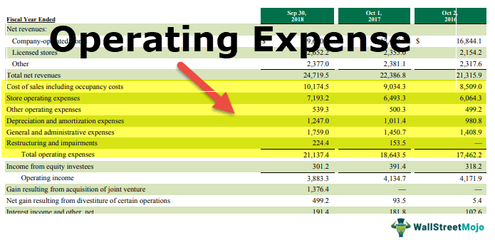

## Table of Contents

## What are operating costs?

Operating costs are the expenses a business has to pay to keep running every day. These costs include things like rent for the office or store, salaries for employees, utilities like electricity and water, and supplies needed for the business. They are different from one-time costs, like buying a new machine, because operating costs happen regularly and are needed to keep the business going.

Understanding operating costs is important for a business because it helps them know how much money they need to make to cover these expenses and start making a profit. If a business can keep its operating costs low, it might be able to offer lower prices to customers or make more profit. Keeping track of these costs also helps business owners see where they might be spending too much money and find ways to save.

## Why are operating costs important for businesses?

Operating costs are important for businesses because they show how much money the business needs to spend just to keep going every day. This includes things like rent, employee salaries, and utility bills. By knowing their operating costs, a business can figure out how much money they need to make to cover these expenses and start making a profit. If they don't make enough to cover these costs, the business might have to close.

Keeping operating costs low is also important. If a business can spend less on these regular expenses, they might be able to lower their prices for customers, which could attract more business. Or, they could keep their prices the same and make more profit. Tracking operating costs helps business owners see where they might be spending too much and find ways to save money, which is good for the long-term health of the business.

## What is the basic formula for calculating operating costs?

The basic formula for calculating operating costs is to add up all the regular expenses that a business has to pay to keep running. This includes things like rent for the office or store, salaries for employees, utility bills like electricity and water, and the cost of supplies needed for the business. You just add all these numbers together to get the total operating costs.

For example, if a business pays $1,000 for rent, $2,000 for employee salaries, $300 for utilities, and $200 for supplies each month, the operating costs would be $1,000 + $2,000 + $300 + $200 = $3,500. Knowing this number helps the business understand how much money they need to make each month to cover these expenses and start making a profit.

## Can you provide examples of common operating costs?

Common operating costs include the rent a business pays for its office or store. This is the money they have to pay each month to use the space. Another big operating cost is the salaries and wages for employees. This is how much the business has to pay its workers every month. Businesses also have to pay for utilities, like electricity, water, and gas, which they need to keep the lights on and the place running smoothly.

Another operating cost is the money spent on supplies. This could be things like paper, pens, or any other materials the business uses every day. If the business sells products, the cost of buying those products to sell is also an operating cost. Lastly, there are costs like insurance and maintenance, which help keep the business protected and in good shape. All these costs add up and need to be paid regularly to keep the business going.

## How do operating costs differ from capital expenditures?

Operating costs and capital expenditures are two different types of expenses for a business. Operating costs are the regular expenses that a business pays to keep running every day. These include things like rent, employee salaries, utilities like electricity and water, and the cost of supplies. They are ongoing expenses that happen month after month, and they are needed to keep the business operating smoothly.

Capital expenditures, on the other hand, are one-time costs for buying big things that will help the business in the long run. These can be things like new machinery, buildings, or vehicles. Unlike operating costs, capital expenditures are not regular expenses. They are investments in the business that usually last for a long time and can help the business grow or work better. While operating costs are needed to keep the business going day-to-day, capital expenditures are about improving and expanding the business for the future.

## What are the different types of operating costs?

Operating costs are the regular expenses a business has to pay to keep running every day. There are different types of operating costs, and they can be grouped into a few main categories. One big category is the costs for people, like employee salaries and wages. This is how much a business has to pay its workers each month. Another category is the costs for the place where the business operates, like rent for the office or store and utility bills for things like electricity, water, and gas.

Another important type of operating cost is the money spent on supplies and materials. This includes things like paper, pens, and any other materials the business uses every day. If the business sells products, the cost of buying those products to sell is also an operating cost. There are also other operating costs like insurance, which helps protect the business, and maintenance costs, which help keep everything in good shape.

These different types of operating costs all add up and need to be paid regularly to keep the business going. Understanding and managing these costs is important because it helps the business know how much money they need to make to cover these expenses and start making a profit.

## How can operating costs be categorized by function?

Operating costs can be categorized by function into different groups based on what they are used for in the business. One main category is costs for making or buying the products the business sells. This includes things like raw materials, supplies, and the cost of goods that are sold. Another category is costs for selling the products, like advertising, sales salaries, and commissions. These costs help the business reach customers and make sales.

Another important category is costs for running the business every day. This includes things like rent for the office or store, utilities like electricity and water, and salaries for employees who are not directly involved in making or selling products, like office staff. There are also costs for keeping the business running smoothly, like insurance, maintenance, and repairs. All these costs are needed to keep the business operating and need to be paid regularly.

By looking at operating costs by function, a business can see where they are spending money and find ways to save. For example, if the costs for making products are too high, the business might find cheaper suppliers. If the costs for running the business are too high, they might look for a cheaper office or ways to use less electricity. Understanding these costs by function helps the business manage their money better and make more profit.

## What strategies can businesses use to manage and reduce operating costs?

Businesses can manage and reduce operating costs by looking closely at where they spend money and finding ways to spend less. One way to do this is by looking at the costs of supplies and materials. They can try to find cheaper suppliers or buy in bulk to get a better price. Another way is to look at the costs of running the business, like rent and utilities. They might move to a cheaper office or find ways to use less electricity and water. It's also important to look at employee costs. Sometimes, businesses can save money by training employees to do more than one job or by using technology to do some tasks instead of hiring more people.

Another strategy is to keep a close eye on all expenses and cut out any costs that are not really needed. This could mean stopping subscriptions or services that the business doesn't use much. It's also helpful to set a budget and stick to it. This helps the business plan how much they will spend and make sure they don't spend too much. Regularly checking the budget and comparing it to actual spending can help find areas where costs are too high. By doing these things, businesses can manage their operating costs better and maybe even lower them, which can help them make more profit.

## How do operating costs impact financial statements?

Operating costs show up on a business's financial statements in a big way. They are part of the income statement, which is like a report card showing how much money the business made and spent. On the income statement, operating costs are subtracted from the money the business made from selling things. This helps the business figure out if they made a profit or a loss. If the operating costs are high, it can make the profit smaller or even turn it into a loss. So, keeping these costs low is important for showing a good profit on the income statement.

Operating costs also affect the cash flow statement, which shows how money moves in and out of the business. When a business pays for things like rent, salaries, and utilities, it shows up as money going out on the cash flow statement. If the business has a lot of operating costs, it can mean less money is left over for other things, like saving or investing. By managing and maybe even lowering these costs, a business can have more cash to use for growing or improving the business. So, understanding and controlling operating costs is key for keeping the financial statements looking healthy.

## What are the industry-specific considerations for operating costs?

Different industries have different kinds of operating costs because the businesses in each industry need different things to run. For example, a restaurant has to pay for food and kitchen supplies, which are big parts of their operating costs. They also have to pay for things like chefs and servers. On the other hand, a tech company might spend a lot on software and computer equipment. They need to pay for programmers and other tech workers. Each industry has its own special costs that businesses have to manage carefully.

Some industries have to deal with big changes in their operating costs because of things like the seasons or new rules from the government. For example, a ski resort has to spend more on snow-making machines and staff during the winter when it's busy. But in the summer, their operating costs might be lower because they don't need as many workers. In industries like healthcare, new rules about how to take care of patients can change what kind of supplies and training the business needs, which can make operating costs go up or down. Understanding these industry-specific costs helps businesses plan better and keep their money in check.

## How can advanced analytics be used to optimize operating costs?

Advanced analytics can help businesses save money by looking at a lot of information and finding patterns and ways to spend less. For example, by using special computer programs, a business can see where they are spending too much money and find ways to cut costs. These programs can look at things like how much electricity the business uses, how many supplies they need, and even how employees work. By understanding these things better, the business can make smart choices about where to spend less or change how they do things to save money.

Another way advanced analytics helps is by predicting what might happen in the future. If a business knows that they will need more supplies at certain times of the year, they can plan to buy them when they are cheaper. Also, these tools can help the business see if they are spending too much on things like rent or employee salaries. By using this information, the business can make changes to lower these costs and keep more money for themselves. This helps them run better and make more profit in the long run.

## What are the future trends in managing operating costs?

In the future, businesses will use more technology to manage their operating costs. They will use special computer programs and artificial intelligence to look at a lot of information quickly. This will help them see where they are spending too much money and find ways to spend less. For example, they might use sensors to see how much electricity they use and find ways to use less. They will also use these tools to predict what might happen in the future, like when they will need more supplies, so they can buy them when they are cheaper.

Another trend will be using more flexible ways of working to lower costs. This means businesses might let more employees work from home, which can save money on rent and utilities. They might also use more temporary workers or freelancers instead of hiring full-time employees, which can help them spend less on salaries. By being more flexible, businesses can change how they work quickly if costs go up or down. This will help them keep their operating costs low and make more profit.

## What is the Formula for Calculating Operating Costs?

The operating cost formula serves as a fundamental tool to ascertain the total expenses necessary for maintaining a trading operation. It is expressed as:

$$
\text{Operating Cost} = \text{Cost of Goods Sold (COGS)} + \text{Operating Expenses}
$$

In this context, the Cost of Goods Sold (COGS) specifically pertains to direct trading costs. These are explicit costs directly tied to executing trades, such as transaction fees, broker commissions, and any expenses directly related to the buying and selling of securities.

Operating Expenses encompass a broader range of indirect costs that the trading operation incurs. These include, but are not limited to, overheads such as salaries of non-trading staff, utilities, rent for physical office space, information technology services, and administrative support. This category can also cover the depreciation of assets like servers or proprietary trading software.

Both components, COGS and Operating Expenses, play critical roles in determining the financial health and efficiency of a trading operation. Efficient management of these costs is vital to sustain trading operations and optimize profitability. Reducing these expenses where possible, without compromising the capability and effectiveness of trading activities, is key to enhancing net trading performance.

In practice, calculating these costs accurately requires a comprehensive understanding of all elements involved in the trading process. Utilizing technology and software solutions can aid in tracking and analyzing these costs, providing more precise insights into where efficiencies can be gained. For instance, Python scripts can automate data collection on transaction fees and other variable expenses, facilitating a more streamlined calculation process.

## References & Further Reading

1. **"Algorithmic Trading: Winning Strategies and Their Rationale" by Ernest P. Chan** - This book provides a comprehensive guide to understanding algorithmic trading strategies, detailing how they can be implemented and the associated costs that need to be managed.

2. **"High-Frequency Trading: A Practical Guide to Algorithmic Strategies and Trading Systems" by Irene Aldridge** - Offers insights into high-frequency trading, covering the design and implementation of trading systems, while emphasizing cost control measures to enhance profitability.

3. **"Market Liquidity: Theory, Evidence, and Policy" by Thierry Foucault, Marco Pagano, and Ailsa Röell** - Explores market liquidity, how it affects trading costs, and strategies to optimize liquidity management in trading.

4. **"The New Trading for a Living" by Dr. Alexander Elder** - Although broader in scope, this book touches on financial management and trading psychology, which are essential for managing costs in algorithmic trading effectively.

5. **"Quantitative Trading: How to Build Your Own Algorithmic Trading Business" by Ernie Chan** - A practical resource on quantitative trading that includes sections on cost analysis and financial management for algorithmic strategies.

6. **Research Articles from The Journal of Finance** - This leading finance journal often publishes papers on cost management in finance and innovative algorithmic trading strategies. These articles are suitable for in-depth academic and professional research.

7. **"Trading and Exchanges: Market Microstructure for Practitioners" by Larry Harris** - Provides a deep look into market microstructure, which influences trading costs, and offers insights into strategies to reduce these costs.

8. **Online Resource: Investopedia's Algorithmic Trading Section** - Investopedia offers accessible articles and educational content on algorithmic trading, including cost optimization techniques and financial strategies.

9. **"Financial Modeling and Valuation: A Practical Guide to Investment Banking and Private Equity" by Paul Pignataro** - This book provides foundational knowledge in financial modeling, essential for cost analysis and optimization in trading contexts.

These readings offer valuable perspectives and strategies for those interested in understanding and managing the operating costs associated with algorithmic trading.

