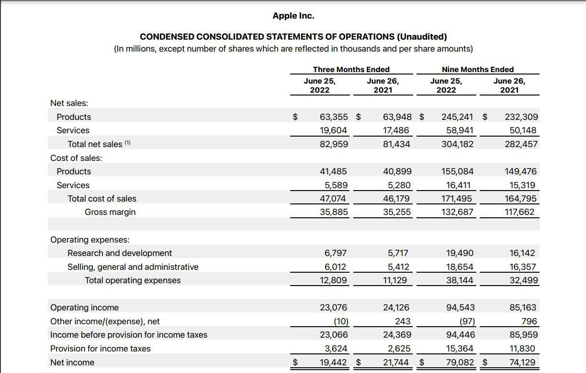

## Table of Contents

## What are operating earnings?

Operating earnings are the profits a company makes from its main business activities, before taking away interest and taxes. This number shows how well a company is doing at its core business, like making and selling products or providing services. It's important because it tells investors and managers how efficiently the company is running without considering other financial factors like loans or tax obligations.

To calculate operating earnings, you start with the company's total revenue and subtract the costs of goods sold and operating expenses. These expenses include things like salaries, rent, and utilities, but do not include interest on loans or taxes. By focusing on operating earnings, a company can see if its day-to-day business operations are profitable, which is crucial for long-term success and growth.

## Why are operating earnings important for a business?

Operating earnings are important for a business because they show how much money the company is making from its main activities, like selling products or services. This number helps business owners and investors see if the company is doing well at what it does every day. If operating earnings are high, it means the company is good at making money from its core business. If they are low or negative, it might mean the company needs to find ways to cut costs or increase sales.

Knowing the operating earnings also helps a business plan for the future. By looking at these earnings, a company can decide if it can afford to grow, like opening new stores or hiring more people. It also helps in making budgets and setting goals. If a company knows its operating earnings are strong, it might feel more confident about taking on new projects or investments. This makes operating earnings a key number to watch for anyone involved in running or investing in a business.

## How do operating earnings differ from net income?

Operating earnings and net income are two ways to measure how much money a company makes, but they look at different things. Operating earnings, also called operating income, focus on the money made from the main business activities, like selling products or services. To find operating earnings, you start with the total money made and then take away the costs of making those products or services and other day-to-day expenses, like rent and salaries. This shows how well the core business is doing without worrying about other things like loans or taxes.

Net income, on the other hand, is the final profit after everything is taken into account. To get net income, you start with operating earnings and then subtract interest on loans, taxes, and any other one-time costs or gains. Net income gives a complete picture of how much money the company has left at the end of the day, after all expenses. While operating earnings tell you about the health of the core business, net income shows the total financial result of the company, including all the other financial factors.

## What are the components included in operating earnings?

Operating earnings are made up of a few main parts. The first part is the money a company gets from selling its products or services, which is called revenue. From this revenue, the company takes away the costs of making those products or providing those services. These costs are called the cost of goods sold, and they include things like the materials used and the labor needed to make the products.

After subtracting the cost of goods sold from the revenue, the company then takes away its operating expenses. These are the costs of running the business day-to-day, like rent for the office or store, salaries for employees, and utilities like electricity and water. What's left after taking away these operating expenses is the operating earnings. This number shows how much money the company makes from its main business activities before thinking about other costs like loans or taxes.

## How do you calculate operating earnings?

To calculate operating earnings, you start with the total money a company makes from selling its products or services. This is called revenue. From this revenue, you subtract the cost of goods sold, which are the costs of making the products or providing the services. This includes things like the materials used and the labor needed to make the products.

After you subtract the cost of goods sold from the revenue, you get the gross profit. Then, you subtract the operating expenses from the gross profit. Operating expenses are the costs of running the business day-to-day, like rent, salaries, and utilities. What's left after subtracting these operating expenses is the operating earnings. This number shows how much money the company makes from its main business activities before thinking about other costs like loans or taxes.

## Can you provide an example of calculating operating earnings for a hypothetical company?

Let's say we have a company called "Healthy Snacks Inc." that makes and sells healthy snack bars. In a year, Healthy Snacks Inc. made $1 million from selling their snack bars. This is their revenue. To make these snack bars, they spent $400,000 on ingredients and labor. This is their cost of goods sold. When we subtract the cost of goods sold from the revenue, we get the gross profit. So, $1 million minus $400,000 equals $600,000. This is the gross profit.

Next, we need to subtract the operating expenses from the gross profit to find the operating earnings. Healthy Snacks Inc. had operating expenses of $300,000 for things like rent for their factory, salaries for their staff, and utility bills. When we subtract these operating expenses from the gross profit, we get the operating earnings. So, $600,000 minus $300,000 equals $300,000. This means that Healthy Snacks Inc. made $300,000 from their main business activities before thinking about other costs like loans or taxes.

## What are common adjustments made to arrive at operating earnings?

When figuring out operating earnings, companies sometimes make changes to the numbers to make them more accurate. One common change is to take away any one-time costs or gains that don't happen every day. For example, if a company sold a piece of old equipment and made money from it, they would not include that in their operating earnings because it's not part of their usual business.

Another change might be to adjust for things like depreciation and amortization. These are costs that spread out the price of big items like machines or buildings over time. Even though they're not cash going out the door every day, they still affect how much money the company is really making from its main business activities. By making these adjustments, the operating earnings give a clearer picture of how well the company is doing day-to-day.

## How do operating earnings impact financial analysis and valuation?

Operating earnings are very important for people who analyze a company's financial health and decide how much the company is worth. When looking at a company, analysts start by looking at its operating earnings because this number shows how well the company does at its main job, like making and selling things or offering services. If a company has high operating earnings, it means it's good at making money from its core business. This makes the company look more valuable because it can keep making money even if other costs, like loans or taxes, go up or down.

Operating earnings also help in comparing companies to each other. By focusing on operating earnings, analysts can see which companies are better at their main business, no matter how much they owe in loans or what their tax situation is. This is useful for investors who want to know which company might be a better choice to invest in. If a company's operating earnings are growing over time, it might be a sign that the company is getting better at making money and could be worth more in the future.

## What are the limitations of using operating earnings as a performance metric?

Operating earnings can be a good way to see how well a company is doing at its main job, but they don't tell the whole story. One problem is that operating earnings don't include costs like interest on loans or taxes. If a company has a lot of debt, it might still have high operating earnings but not much money left after paying off its loans. This means the company might look healthy based on operating earnings but could actually be in trouble.

Another limitation is that operating earnings can be changed by one-time events or costs. For example, if a company sells a big piece of equipment, it might show a sudden jump in operating earnings, but this doesn't mean the company is doing better at its main job. Also, companies can decide what to count as operating expenses, so different companies might show different operating earnings even if they're doing the same kind of work. This makes it hard to compare companies just by looking at their operating earnings.

## How do different industries report and interpret operating earnings?

Different industries report and interpret operating earnings in ways that make sense for their specific business. For example, in the manufacturing industry, operating earnings are very important because they show how well the company is doing at making and selling their products. They pay close attention to the cost of goods sold, which includes the raw materials and labor needed to make the products. If these costs are high, it can lower the operating earnings, so they try to keep these costs down to make their operating earnings look better.

In the service industry, like restaurants or hotels, operating earnings focus more on the money made from services and the costs of running the business day-to-day. They look at things like employee salaries, rent, and utilities. For these businesses, high operating earnings mean they're doing a good job at serving customers and keeping their costs under control. If their operating earnings are low, they might need to find ways to make more money or spend less on running the business.

In the tech industry, operating earnings can be a bit trickier because companies often spend a lot on research and development, which can affect their operating earnings. These costs are seen as investments in future products, so tech companies might have lower operating earnings in the short term but expect them to grow as new products hit the market. They also need to consider things like software licensing and cloud services costs, which can be big parts of their operating expenses. Understanding how operating earnings work in different industries helps people see how well a company is doing at its core business.

## What are the trends in operating earnings reporting over the past decade?

Over the past decade, there has been a growing focus on transparency and consistency in how companies report their operating earnings. Many companies have started to provide more detailed breakdowns of their operating earnings, showing exactly what costs are included and excluded. This helps investors and analysts understand the true performance of a company's core business. For example, companies now often report adjusted operating earnings, which take out one-time costs or gains to give a clearer picture of ongoing business performance. This trend towards more detailed reporting has been driven by demands from investors who want to make better-informed decisions.

Another trend is the increasing use of non-GAAP (Generally Accepted Accounting Principles) measures to report operating earnings. Companies have started using these measures to show operating earnings in a way that they believe better reflects their business's health. While GAAP measures are standard and required, non-GAAP measures allow companies to adjust for things like stock-based compensation or restructuring costs, which they argue give a more accurate view of their operating performance. However, this has also led to some concerns about the potential for companies to use these measures to make their performance look better than it really is. As a result, regulators and investors are paying closer attention to how these non-GAAP measures are used and reported.

## How can advanced financial modeling techniques enhance the analysis of operating earnings?

Advanced financial modeling techniques can help analysts get a better look at a company's operating earnings by making it easier to see how different things affect them. For example, analysts can use models that show how changes in sales, costs, or prices could change operating earnings. These models can also help look at different situations, like what might happen if the economy gets better or worse. By using these tools, analysts can make better guesses about future operating earnings and see how strong or weak a company's main business is.

Another way advanced financial modeling helps is by letting analysts take apart the numbers to see what's really going on. They can break down operating earnings into smaller parts to understand where the money is coming from and where it's going. This can show if a company is doing well because it's selling more, or if it's just cutting costs. By using these detailed models, analysts can give better advice to investors and help companies make smarter decisions about how to grow their business.

## What is the Formula for Operating Earnings?

Operating earnings, also known as operating income, are a vital indicator of a company's financial performance, as they reflect the profit generated from core business operations. To calculate operating earnings, several approaches can be utilized, each offering valuable insights into different aspects of a company's operational efficiency.

The first common approach to calculate operating earnings involves subtracting the cost of goods sold (COGS) and operating expenses from total revenue. This can be expressed as follows:

$$
\text{Operating Earnings} = \text{Total Revenue} - \text{COGS} - \text{Operating Expenses}
$$

This calculation provides a clear picture of profitability from core operations before accounting for interest and taxes. By focusing strictly on operational inputs, this method offers insights into how effectively a company is managing its primary business activities.

Another approach encapsulates operating earnings as the difference between gross profit and deductions such as depreciation, amortization, and other operating expenses. This can be represented mathematically as:

$$
\text{Operating Earnings} = \text{Gross Profit} - (\text{Depreciation} + \text{Amortization} + \text{Other Operating Expenses})
$$

This method delineates the impact of non-cash expenses like depreciation and amortization, which can affect the net profitability. By isolating these factors, investors and analysts gain a nuanced understanding of core earnings potential devoid of influences from accounting adjustments.

Understanding these formulas is crucial for accurately assessing a company's [earning](/wiki/earning-announcement) ability from its fundamental business activities. They provide a framework for evaluating operational profitability, independent of external factors like financing or taxation, thereby delivering a concentrated view of business efficiency and potential growth prospects. Analyzing operating earnings using these methods allows investors to gauge the core financial health of a company, enabling informed decision-making and robust financial analysis.

## How Do You Calculate Operating Earnings?

Consider a hypothetical company with specified financial details to understand how operating earnings are calculated. The company's financial figures are as follows:

- Total Revenue: $1,000,000
- Cost of Goods Sold (COGS): $400,000
- Operating Expenses: $300,000
- Depreciation & Amortization: $50,000

Operating earnings can be calculated using the formula:

$$
\text{Operating Earnings} = \text{Total Revenue} - \text{COGS} - \text{Operating Expenses} - \text{Depreciation \& Amortization}
$$

Applying the given financial data:

$$
= \$1,000,000 - \$400,000 - \$300,000 - \$50,000 = \$250,000
$$

This result indicates that the company's earnings generated strictly from its core business operations amount to $250,000. It is important to note that this figure excludes any non-operating components, such as interest and taxes, thereby providing an unaltered view of the company’s operational profitability. This measure is useful for investors and management to assess the sustainability and efficiency of the core business activities.

## What is the Importance of Operating Earnings in Algorithmic Trading?

Algorithmic trading fundamentally relies on quantitative data, including financial metrics such as operating earnings, to make informed trading decisions. Operating earnings offer a detailed view of a company's operational profitability by excluding non-operating components like interest and taxes. This metric is crucial in [algorithmic trading](/wiki/algorithmic-trading) as it aids in assessing a company's core operational efficiency, which is a vital indicator of financial health and business stability.

Trading algorithms are designed to automate the trading process by analyzing various financial metrics—operating earnings being one of them. By using such data, these algorithms can predict market trends, allowing them to execute trades based on predefined criteria automatically. The automated approach ensures trades are conducted at optimal moments, maximizing potential returns while minimizing risks.

When calculating operating earnings, a consistent methodology helps maintain accuracy, facilitating reliable data for algorithmic analysis. The common formula used is:

$$
\text{Operating Earnings} = \text{Total Revenue} - \text{Cost of Goods Sold (COGS)} - \text{Operating Expenses}
$$

Alternatively, it can be expressed as:

$$
\text{Operating Earnings} = \text{Gross Profit} - \text{Depreciation} \& \text{Amortization} - \text{Other Operating Expenses}
$$

In Python, calculating operating earnings can be implemented using simple arithmetic operations:

```python
def calculate_operating_earnings(total_revenue, cogs, operating_expenses, depreciation=0, other_expenses=0):
    return total_revenue - cogs - operating_expenses - depreciation - other_expenses

# Example usage
total_revenue = 1000000
cogs = 400000
operating_expenses = 300000
depreciation = 50000

operating_earnings = calculate_operating_earnings(total_revenue, cogs, operating_expenses, depreciation)
print(f"Operating Earnings: ${operating_earnings}")
```

Operating earnings are pivotal in developing trading strategies because they offer a concise picture of a company's ability to generate profit from its core business activities. Consistently strong operating earnings can signal to algorithmic systems that a company represents a stable investment opportunity. By identifying companies with robust operational profitability, algorithmic traders can devise strategies to capitalize on such strengths—thereby enhancing their portfolio's overall performance.

Understanding operating earnings as a primary input for trading algorithms is instrumental in creating effective automated trading systems. Well-constructed algorithms that [factor](/wiki/factor-investing) in reliable financial metrics like operating earnings empower traders and investors to make strategic, data-driven decisions that are aligned with market movements.

## References & Further Reading

[1]: ["Advances in Financial Machine Learning"](https://www.amazon.com/Advances-Financial-Machine-Learning-Marcos/dp/1119482089) by Marcos Lopez de Prado

[2]: ["Machine Learning for Algorithmic Trading"](https://github.com/stefan-jansen/machine-learning-for-trading) by Stefan Jansen

[3]: ["Quantitative Trading: How to Build Your Own Algorithmic Trading Business"](https://github.com/LucindaYa/quant-resources/blob/master/Quantitative%20Trading%20How%20to%20Build%20Your%20Own%20Algorithmic%20Trading%20Business.pdf) by Ernest P. Chan

[4]: ["Evidence-Based Technical Analysis: Applying the Scientific Method and Statistical Inference to Trading Signals"](https://www.amazon.com/Evidence-Based-Technical-Analysis-Scientific-Statistical/dp/0470008741) by David Aronson

[5]: Investopedia. ["Operating Income."](https://www.investopedia.com/terms/o/operatingincome.asp)

[6]: ["Financial Modeling and Valuation: A Practical Guide to Investment Banking and Private Equity"](https://www.amazon.com/Financial-Modeling-Valuation-Practical-Investment/dp/1118558766) by Paul Pignataro