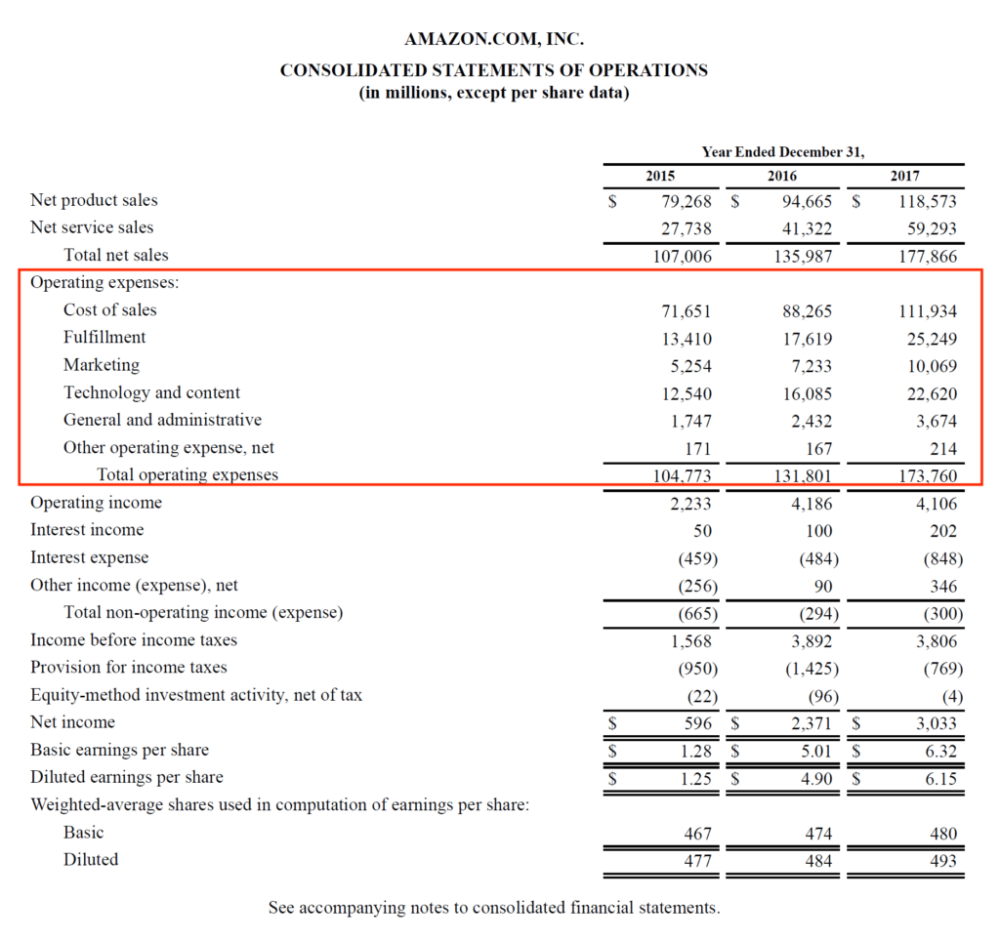

## Table of Contents

## What are operating expenses?

Operating expenses are the costs a business has to pay to keep running day-to-day. These expenses include things like rent for the office, salaries for employees, utilities like electricity and water, and supplies needed for the business. They are different from costs like buying new equipment or paying off loans, which are not part of the daily running of the business.

These expenses are important because they show how much it costs to keep the business going. By keeping track of operating expenses, a business can see if it is making enough money to cover these costs. If the operating expenses are too high, the business might need to find ways to cut costs or increase its income to stay profitable.

## How do operating expenses differ from capital expenses?

Operating expenses and capital expenses are two different types of costs that businesses have. Operating expenses are the costs that a business pays regularly to keep running every day. These include things like rent, salaries, utilities, and office supplies. They are the costs that come up all the time and are necessary for the day-to-day operations of the business.

Capital expenses, on the other hand, are costs for big items that a business buys to use over a long time. These can include things like new machinery, buildings, or vehicles. Unlike operating expenses, capital expenses are not regular costs but are investments in the business that are expected to last and help the business grow over many years.

The main difference between the two is how they are treated in the business's finances. Operating expenses are fully deducted in the year they are paid, reducing the business's taxable income for that year. Capital expenses, however, are not fully deducted right away. Instead, they are depreciated over time, meaning their cost is spread out over the years they are used, which affects the business's taxes differently.

## Can you list some common examples of operating expenses for a small business?

Operating expenses for a small business include many things that the business needs to pay for every day or every month. Some common examples are rent for the office or store, salaries for employees, and utilities like electricity, water, and internet. The business might also need to pay for office supplies, like paper and pens, and for things like cleaning services to keep the place tidy.

Another part of operating expenses can be insurance, which protects the business from unexpected problems. The business might also need to pay for advertising to attract new customers, and for accounting services to keep track of money coming in and going out. If the business has a website, the cost of keeping it running and up to date is also an operating expense.

These expenses are important because they help the business keep running smoothly every day. By understanding and managing these costs, a small business owner can make sure they have enough money to cover everything and still make a profit.

## How are operating expenses reported on financial statements?

Operating expenses are shown on a business's income statement, which is one of the main financial statements. The income statement lists all the money a business makes and all the money it spends during a certain time, like a month or a year. Operating expenses are usually listed after the business's main income, called revenue. They are subtracted from the revenue to find out how much money the business made before other costs, like taxes and interest, are taken out.

These expenses are grouped together on the income statement to make it easier to see how much it costs to run the business every day. Common categories might include things like salaries, rent, utilities, and supplies. By looking at the operating expenses, people who read the financial statements, like owners or investors, can see if the business is spending too much on daily costs or if it is managing its money well.

## What is the impact of operating expenses on a company's profitability?

Operating expenses have a big impact on a company's profitability. These are the costs a company pays every day to keep running, like rent, salaries, and utilities. When these expenses are high, they take a bigger chunk out of the company's revenue. This means there is less money left over as profit. If a company can't keep its operating expenses under control, it might struggle to make any profit at all.

On the other hand, if a company can manage its operating expenses well, it can increase its profitability. By finding ways to cut costs, like using less electricity or finding cheaper office space, the company can keep more of its revenue as profit. This makes the business more successful and gives it more money to grow or to save for the future. Keeping a close eye on operating expenses is important for any company that wants to stay profitable.

## How can a business manage and reduce its operating expenses?

A business can manage and reduce its operating expenses by first looking closely at where its money is going. This means checking all the regular costs like rent, salaries, utilities, and supplies to see if there are any savings to be made. For example, the business might find that it can save money on utilities by using energy-saving lights or by negotiating a better deal with the electricity company. It could also look at reducing office space if some employees can work from home, which would lower the rent costs. By understanding all the expenses, the business can make smart choices about where to cut back.

Another way to reduce operating expenses is by improving how the business works. This can mean training employees to be more efficient or using technology to automate tasks that used to take a lot of time. For instance, using software to handle accounting or customer service can save on the cost of hiring more staff. The business can also look for deals and discounts on supplies and services, which can add up to big savings over time. By always looking for ways to do things better and cheaper, a business can keep its operating expenses down and stay profitable.

## What are the tax implications of operating expenses?

Operating expenses can help a business save on taxes. When a business spends money on things like rent, salaries, and utilities, these costs are called operating expenses. The business can subtract these expenses from its income on its tax return. This lowers the amount of money the business has to pay taxes on. For example, if a business makes $100,000 in a year and has $40,000 in operating expenses, it only has to pay taxes on $60,000.

However, not all expenses can be subtracted right away. Some costs, like buying new equipment, are considered capital expenses and have to be spread out over time. Operating expenses, on the other hand, are usually subtracted in the year they are paid. This makes them very helpful for reducing the tax bill each year. By keeping good records and knowing which costs are operating expenses, a business can make sure it is getting all the tax savings it can.

## How do operating expenses vary across different industries?

Operating expenses can be very different depending on what kind of business it is. For example, a restaurant has to spend a lot of money on food and kitchen supplies every day. They also have to pay for things like cooks and servers. On the other hand, a software company might spend more on computer equipment and salaries for programmers. They might not need to spend as much on physical supplies, but they could have higher costs for things like internet and software licenses.

Even within the same industry, operating expenses can vary. A big retail store might have high rent costs because it needs a lot of space to show its products. A small online store, though, might not have to pay for a big store but could spend more on shipping and website maintenance. Understanding these differences helps businesses in different industries plan their budgets and find ways to save money on their operating expenses.

## What role do operating expenses play in budgeting and financial planning?

Operating expenses are really important when a business makes its budget and plans its finances. These are the costs that the business has to pay every day to keep running, like rent, salaries, and utilities. When making a budget, the business needs to guess how much it will spend on these things in the future. This helps the business make sure it has enough money to cover all its costs and still make a profit. If the business knows its operating expenses well, it can plan better and avoid surprises that could hurt its money situation.

In financial planning, operating expenses help the business see where it can save money. By looking at these costs, the business can find ways to spend less, like using less electricity or finding cheaper office space. This can make the business more profitable. Also, knowing the operating expenses helps the business set goals for the future, like growing the business or saving money. By keeping a close eye on these expenses, the business can make smart choices about how to use its money and stay successful.

## How can advanced analytics be used to optimize operating expenses?

Advanced analytics can help a business save money on operating expenses by looking at a lot of data and finding patterns. For example, the business can use analytics to see how much it spends on things like electricity, rent, and supplies every month. By studying this data, the business can find out if it's spending too much in some areas and where it can cut costs. Maybe the business finds out that it uses a lot of electricity at night when no one is working. With this information, the business can change its schedule or use energy-saving lights to save money.

Analytics can also help the business plan better for the future. By using data to predict how much it will spend on operating expenses, the business can make a budget that is more accurate. This helps the business avoid surprises and make sure it has enough money to cover all its costs. For example, if the data shows that the cost of supplies goes up every winter, the business can plan to buy more supplies in the fall when they are cheaper. By using advanced analytics, the business can make smarter choices about how to spend its money and keep its operating expenses under control.

## What are some strategies for forecasting future operating expenses?

Forecasting future operating expenses involves looking at past spending to guess what costs will be in the future. A business can start by looking at its old financial records to see how much it spent on things like rent, salaries, and utilities each month. By understanding these patterns, the business can predict how much it will need to spend in the coming months or years. For example, if the cost of utilities goes up every summer because of air conditioning, the business can plan for this increase and budget accordingly.

Another strategy is to use industry trends and economic forecasts to help predict future costs. If the business knows that the price of supplies is expected to go up because of inflation or other reasons, it can plan to buy more supplies now or find cheaper alternatives. Talking to other businesses in the same industry can also help, as they might share information about expected changes in costs. By combining past data with these outside insights, a business can make a more accurate forecast of its future operating expenses and plan its budget better.

## How do international operations affect the management of operating expenses?

When a business operates in different countries, managing operating expenses can become more complicated. Each country might have different costs for things like rent, salaries, and utilities. For example, the cost of labor in one country could be much higher than in another. Also, the business has to deal with different currencies and exchange rates, which can make it hard to predict and manage expenses. If the value of one currency goes down compared to another, the business might suddenly find that its costs in that country have gone up.

To manage operating expenses in international operations, a business needs to keep a close eye on costs in each country. This means regularly checking and comparing expenses to make sure they are in line with what was expected. The business might also need to adjust its strategies in different countries, like finding cheaper suppliers or using technology to cut down on labor costs. By understanding the unique challenges of each location and planning carefully, the business can better control its operating expenses and stay profitable no matter where it operates.

## References & Further Reading

[1]: Bergstra, J., Bardenet, R., Bengio, Y., & Kégl, B. (2011). ["Algorithms for Hyper-Parameter Optimization."](https://papers.nips.cc/paper/4443-algorithms-for-hyper-parameter-optimization) Advances in Neural Information Processing Systems 24.

[2]: ["Advances in Financial Machine Learning"](https://www.amazon.com/Advances-Financial-Machine-Learning-Marcos/dp/1119482089) by Marcos Lopez de Prado

[3]: ["Evidence-Based Technical Analysis: Applying the Scientific Method and Statistical Inference to Trading Signals"](https://www.amazon.com/Evidence-Based-Technical-Analysis-Scientific-Statistical/dp/0470008741) by David Aronson

[4]: ["Machine Learning for Algorithmic Trading"](https://github.com/stefan-jansen/machine-learning-for-trading) by Stefan Jansen

[5]: ["Quantitative Trading: How to Build Your Own Algorithmic Trading Business"](https://www.amazon.com/Quantitative-Trading-Build-Algorithmic-Business/dp/1119800064) by Ernest P. Chan