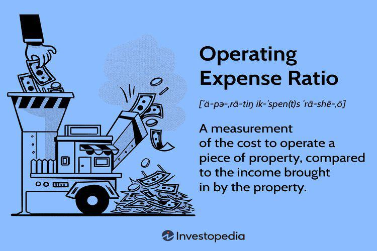

## Table of Contents

## What is an Operating Expense Ratio (OER)?

The Operating Expense Ratio (OER) is a financial measure that shows how much it costs a business to run its day-to-day operations compared to its revenue. It is calculated by dividing the total operating expenses by the total revenue and then multiplying by 100 to get a percentage. This ratio helps business owners and managers understand how efficiently their company is being run. A lower OER means that the company is spending less to earn each dollar of revenue, which is generally a sign of good management and operational efficiency.

For example, if a company has operating expenses of $50,000 and total revenue of $200,000, the OER would be calculated as follows: ($50,000 / $200,000) * 100 = 25%. This means that it costs the company 25 cents to earn every dollar of revenue. By tracking the OER over time, a business can see if its costs are going up or down relative to its revenue, which can help in making decisions about where to cut costs or how to increase efficiency.

## How is the Operating Expense Ratio calculated?

The Operating Expense Ratio (OER) is figured out by dividing a company's total operating expenses by its total revenue. After you do the division, you multiply the result by 100 to turn it into a percentage. This percentage tells you how much of every dollar earned is spent on running the business.

For example, if a company's operating expenses are $50,000 and its total revenue is $200,000, you would divide $50,000 by $200,000 to get 0.25. Then, you multiply 0.25 by 100 to find that the OER is 25%. This means the company spends 25 cents out of every dollar it makes just to keep the business going.

## Why is the Operating Expense Ratio important for businesses?

The Operating Expense Ratio (OER) is important for businesses because it shows how much money they spend to make money. It tells business owners and managers if they are doing a good job at keeping costs down while still making sales. A lower OER means the business is spending less to earn each dollar, which is a good sign that the business is being run well.

By keeping an eye on the OER, a business can see if its costs are getting too high compared to its income. If the OER goes up, it might mean the business needs to find ways to save money or make more sales. This helps business owners make smart choices about where to cut costs or how to make their operations more efficient.

## What are the typical components included in operating expenses?

Operating expenses are the costs a business pays to keep running day to day. These costs include things like rent for the office or store, utilities like electricity and water, and salaries for employees. If a business has a store, it might also pay for things like cleaning services and security. These are all regular costs that help the business keep going.

Another part of operating expenses is the money spent on supplies and materials needed for the business to work. This can be paper for the office, ingredients for a restaurant, or parts for manufacturing. Marketing and advertising costs also count as operating expenses because they help bring in customers. Keeping track of all these costs helps a business understand how much it spends to make money.

## Can you provide an example of how to calculate the OER for a small business?

Imagine you own a small bakery. Every month, you spend $3,000 on rent, $1,000 on utilities, $5,000 on employee salaries, and $1,000 on supplies like flour and sugar. So, your total operating expenses are $10,000. In the same month, your bakery earns $25,000 from selling cakes and pastries. To find the Operating Expense Ratio (OER), you divide your operating expenses by your total revenue and then multiply by 100 to get a percentage.

So, you take $10,000 (operating expenses) and divide it by $25,000 (total revenue). That gives you 0.4. Then, you multiply 0.4 by 100 to turn it into a percentage, which is 40%. This means your bakery spends 40 cents out of every dollar it makes just to keep running. Knowing this helps you see if you're spending too much or if you're doing a good job at keeping costs low.

## How does the OER differ across various industries?

The Operating Expense Ratio (OER) can be very different from one industry to another because each type of business has its own way of working and its own costs. For example, a restaurant might have a high OER because it needs to pay for things like food, cooks, and a place to serve customers. These costs can add up quickly, making the OER higher. On the other hand, a software company might have a lower OER because it doesn't need as many physical things to run its business. It might spend more on computers and programmers, but these costs are often less than running a restaurant.

Even within the same industry, the OER can change a lot depending on how big the business is and where it is located. A small local store might have a higher OER than a big chain store because the big store can buy things cheaper and spread its costs over more stores. Also, businesses in cities might have higher OERs because rent and other costs are usually higher in cities than in smaller towns. By understanding these differences, business owners can see if their OER is normal for their industry or if they need to find ways to cut costs.

## What is considered a good Operating Expense Ratio?

A good Operating Expense Ratio (OER) depends on the type of business and the industry it's in. For example, in industries like retail or restaurants, where costs like rent and supplies can be high, an OER of around 60% to 70% might be seen as okay. But for businesses like software companies or consulting firms, where the costs are usually lower, a good OER might be around 30% to 40%. Knowing what's normal for your industry helps you see if your business is doing well.

It's also important to look at how your OER changes over time. If your OER is going down, it means you're getting better at keeping costs low compared to your income. This is a good sign that your business is becoming more efficient. But if your OER is going up, you might need to find ways to cut costs or increase your sales to keep your business healthy. Always comparing your OER to others in your industry and watching how it changes can help you make smart decisions for your business.

## How can a business improve its Operating Expense Ratio?

A business can improve its Operating Expense Ratio by finding ways to cut down on costs. This might mean looking at all the things the business spends money on, like rent, utilities, and supplies, and seeing if there are cheaper options. For example, a business might switch to a less expensive supplier for materials or move to a smaller office space to save on rent. Another way to save money is by using energy-efficient equipment to lower utility bills. By carefully managing these expenses, a business can spend less to make the same amount of money, which lowers the OER.

Another way to improve the OER is by increasing the amount of money the business makes. This can be done by finding new customers or selling more to existing ones. A business might do this by starting a new marketing campaign to attract more people or by offering special deals to get current customers to buy more. When the business earns more money without increasing its costs, the OER goes down because the business is making more money for each dollar it spends on operating expenses. By focusing on both cutting costs and increasing revenue, a business can make its OER better and run more efficiently.

## What are the limitations of using the Operating Expense Ratio as a performance metric?

The Operating Expense Ratio (OER) can be a helpful way to see how well a business is doing, but it has some limits. One big problem is that it doesn't tell the whole story about a business's health. The OER only looks at operating expenses and revenue, but there are other important things like how much debt the business has or how much money it has saved up. If a business has a lot of debt, it might look like it's doing well because of a low OER, but really, it could be in trouble because it has to pay back a lot of money.

Another limitation is that the OER can be different depending on the industry. What's a good OER for one type of business might not be good for another. For example, a restaurant might have a higher OER than a software company because it has to pay for more things like food and a place to serve customers. So, just looking at the OER without knowing what's normal for the industry can make it hard to tell if a business is doing well or not. It's important to compare the OER to other businesses in the same industry to get a better idea of performance.

## How does the Operating Expense Ratio relate to other financial ratios like the Net Profit Margin?

The Operating Expense Ratio (OER) and the Net Profit Margin are both important for understanding how well a business is doing, but they look at different things. The OER tells you how much of the money a business makes goes towards running the business every day. It's like figuring out how much it costs to keep the lights on and pay the employees. On the other hand, the Net Profit Margin shows how much money the business has left after paying all its costs, including operating expenses, taxes, and interest on loans. It's like looking at the final amount of money the business keeps as profit.

These two ratios can help give a fuller picture of a business's financial health. If a business has a low OER, it means it's good at keeping its daily costs down. But if the Net Profit Margin is also low, it might mean the business is spending too much on other things like taxes or loans. By looking at both the OER and the Net Profit Margin together, business owners can see where they might need to cut costs or find ways to make more money. This helps them make smarter choices to keep their business strong and healthy.

## What are the trends in Operating Expense Ratios over the past decade?

Over the past decade, the Operating Expense Ratio (OER) has shown some interesting trends across different industries. In general, businesses have been trying to become more efficient, which means they want to spend less money to make the same amount of money. Many companies have been using technology to help with this. For example, businesses might use software to manage their inventory or automate some of their work, which can help lower their operating expenses. This push towards efficiency has led to a gradual decrease in OERs in industries like manufacturing and retail, where technology can make a big difference in how much it costs to run the business.

However, not all industries have seen a decrease in their OERs. In sectors like healthcare and education, operating expenses have sometimes gone up. This is because these businesses often need more people to do the work, and the cost of hiring and keeping good employees has been going up. Also, new rules and regulations can make it more expensive to run these types of businesses. So, while some industries have been able to lower their OERs by using technology and other methods, others have faced challenges that make it harder to keep their costs down.

## How do international accounting standards affect the calculation and interpretation of the OER?

International accounting standards can change how businesses calculate and understand their Operating Expense Ratio (OER). These standards, like the International Financial Reporting Standards (IFRS), make sure that businesses around the world report their money in a similar way. This means that when a business calculates its OER, it needs to follow these rules to make sure it's doing it right. For example, different standards might say how to count certain costs or when to record them. If a business follows these standards, its OER will be easier to compare with other businesses around the world, but it might also be different from what it would be if the business used a different set of rules.

Because of these standards, it's important for people looking at the OER to know which rules the business used. If two businesses use different standards, their OERs might not be the same even if they are doing similar things. This can make it hard to compare businesses from different countries or industries. But if everyone follows the same rules, it's easier to see if a business is doing well compared to others. So, international accounting standards help make the OER more useful for comparing businesses globally, but they can also make it more complicated to understand without knowing the details of the standards.

## What is the Operating Expense Ratio (OER) and how is it understood?

The Operating Expense Ratio (OER) is a critical financial metric that evaluates the efficiency of an investment by analyzing its operational costs relative to its revenue. It is defined mathematically as:

$$
\text{OER} = \left( \frac{\text{Total Operating Expenses}}{\text{Total Revenue}} \right) \times 100
$$

This ratio provides investors and managers with insight into a company's cost management capabilities by highlighting the percentage of revenue consumed by operating costs. In [algorithmic trading](/wiki/algorithmic-trading), comprehending and managing OER is crucial for assessing the cost-effectiveness of trading operations. Given the substantial resources required for such strategies, ranging from computational power to data acquisition, the OER serves as a benchmark for optimizing operational efficiency.

A lower OER signifies effective cost management and is typically linked to higher profitability. This is because a reduced ratio indicates that a smaller portion of revenue is expended on operational costs, thereby leaving a larger amount as profit. Conversely, a high OER can be a red flag, indicating excessive operational expenses which might erode profit margins even if the trading strategies themselves are profitable.

Beyond its role in general cost management, the OER is an important [factor](/wiki/factor-investing) in algorithm-driven investment decisions. It provides a quantifiable measure to assess whether the operational costs of a trading strategy align with or detract from the potential returns. When traders thoroughly understand and effectively manage their OER, they can ensure that algorithmic trading operations run efficiently, maximizing net returns and sustaining profitability in a competitive financial environment.

## How do you calculate OER for Algorithmic Trading?

Calculating the Operating Expense Ratio (OER) in algorithmic trading is pivotal for understanding the efficiency and cost-management capabilities of trading operations. It requires a comprehensive breakdown and categorization of both direct and indirect expenses associated with the operational aspects of trading algorithms.

Direct operating expenses in algorithmic trading typically include costs such as data fees, software licensing, transaction costs, and other immediate expenses directly tied to trading activities. For instance, obtaining market data in real-time for executing trading strategies can incur significant costs. Additionally, software tools and platforms used for developing and deploying algorithms often require paid licenses, adding to the direct expenses.

Indirect expenses, on the other hand, encompass broader operational costs that may not be tied directly to specific trading activities. These can include staffing, where specialists are employed to manage and optimize trading algorithms. Infrastructure expenses, such as server maintenance, electricity, and networking costs, also fall under this category. These expenses are crucial for maintaining the performance and reliability of the technological framework supporting algorithmic trading operations.

The formula for calculating OER is straightforward:

$$
\text{OER} = \left(\frac{\text{Total Operating Expenses}}{\text{Total Revenue}}\right) \times 100
$$

This calculation provides a percentage that represents the proportion of revenue consumed by operating expenses. A lower OER indicates higher operational efficiency, suggesting the trading operation is able to convert a greater portion of its revenue into profit.

To compute OER accurately in the context of algorithmic trading, it is essential to comprehensively capture and categorize all relevant costs. This involves maintaining detailed financial records and employing robust accounting practices to ensure no expense goes unnoticed. Integration with financial management software can facilitate the aggregation of cost data and its subsequent analysis.

A practical example specific to algorithmic trading could involve a trading operation with the following annual expenses: $50,000 in direct expenses (comprising data and software fees) and $30,000 in indirect expenses (including infrastructure and staffing costs). If the total revenue generated by this trading operation is $500,000, the OER would be calculated as follows:

$$
\text{Total Operating Expenses} = \$50,000 + \$30,000 = \$80,000
$$

$$
\text{OER} = \left(\frac{\$80,000}{\$500,000}\right) \times 100 = 16\%
$$

Thus, 16% of the revenue is used to cover operating expenses, highlighting a specific level of cost efficiency. Regularly monitoring and recalculating OER can help traders make informed decisions about cost management and operational adjustments necessary for maintaining a competitive edge and optimizing profitability.

## References & Further Reading

[1]: Bergstra, J., Bardenet, R., Bengio, Y., & Kégl, B. (2011). ["Algorithms for Hyper-Parameter Optimization."](https://proceedings.neurips.cc/paper/2011/file/86e8f7ab32cfd12577bc2619bc635690-Paper.pdf) Advances in Neural Information Processing Systems 24.

[2]: ["Advances in Financial Machine Learning"](https://www.amazon.com/Advances-Financial-Machine-Learning-Marcos/dp/1119482089) by Marcos Lopez de Prado

[3]: ["Evidence-Based Technical Analysis: Applying the Scientific Method and Statistical Inference to Trading Signals"](https://www.amazon.com/Evidence-Based-Technical-Analysis-Scientific-Statistical/dp/0470008741) by David Aronson

[4]: ["Machine Learning for Algorithmic Trading"](https://github.com/stefan-jansen/machine-learning-for-trading) by Stefan Jansen

[5]: ["Quantitative Trading: How to Build Your Own Algorithmic Trading Business"](https://www.amazon.com/Quantitative-Trading-Build-Algorithmic-Business/dp/1119800064) by Ernest P. Chan