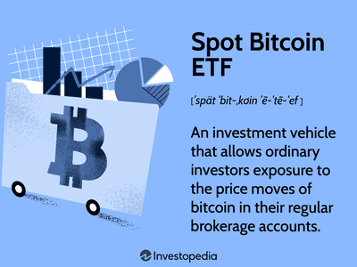

In the evolving world of finance, cryptocurrency has emerged as a revolutionary force, disrupting traditional banking systems and investment paradigms. At the forefront of this digital currency movement is Bitcoin, which has not only pioneered the concept of decentralized money but also laid the foundation for the proliferation of thousands of alternative cryptocurrencies. As of its inception, Bitcoin has provided a novel approach to how financial transactions can be conducted securely and transparently, without the need for intermediaries.

Investing in Bitcoin and its associated technological frameworks demands a nuanced understanding of both the underlying technology and the market dynamics. Bitcoin's infrastructure is supported by a network of nodes, which are essential to maintaining the integrity and security of the blockchain. These nodes, which perform tasks such as validating and broadcasting transactions, form the backbone of the decentralized network. This article will explore the roles and significance of Bitcoin nodes, offering insights into how they contribute to both the robustness of the network and potential investment strategies.



Moreover, the cryptocurrency space offers various investment strategies that differ significantly from those in traditional markets. Given the high volatility and unique attributes of digital assets, investors must carefully consider approaches such as long-term holding, active trading, and diversification within the context of cryptocurrencies. The advent of algorithmic trading — a method that leverages sophisticated software to automate the trading process — has further transformed the landscape of crypto investments. By utilizing algorithms that can quickly detect market patterns and execute trades at high speed, traders can potentially maximize their returns while minimizing emotional bias.

In this article, we will examine how the synergy between Bitcoin nodes, various investment strategies, and algorithmic trading can enhance the potential for returns in the cryptocurrency sector. By understanding these components, investors and technologists can better navigate the complex and rapidly evolving financial environment that cryptocurrencies create.

## Table of Contents

## Understanding Bitcoin Nodes

Bitcoin nodes are integral to the functionality and security of the Bitcoin network, serving as the backbone of its decentralized architecture. A Bitcoin node is a software that connects to the Bitcoin network and performs various tasks essential for the network's integrity. Primarily, nodes validate and broadcast transactions, confirming that they adhere to protocol rules and propagating them through the network. This validation process is crucial for ensuring that double-spending is prevented and that the financial ledger remains accurate and trustworthy.

There are several types of Bitcoin nodes, predominantly categorized into full nodes and lightweight nodes. Full nodes download and verify the entire blockchain's history, ensuring complete fidelity to the Bitcoin protocol. By doing this, they play a pivotal role in maintaining the trust and decentralization of the network, as they check every block and transaction against consensus rules. Lightweight nodes, on the other hand, do not download the full blockchain. Instead, they rely on full nodes to provide necessary information, which reduces their bandwidth and storage requirements. This makes lightweight nodes more accessible for users with limited resources but less authoritative in terms of transaction verification.

Operating a Bitcoin node not only supports the decentralized nature of the financial system but also offers specific potential financial benefits. Running a node allows users to independently verify their transactions without relying on third-party services, which enhances privacy and security. Moreover, businesses and individuals can leverage nodes to provide transactional services or participate in fee-based infrastructures. For instance, nodes can facilitate more efficient transaction routing, potentially [earning](/wiki/earning-announcement) compensation or reduced fees within network services.

From a decentralized finance (DeFi) perspective, Bitcoin nodes are foundational in promoting financial inclusivity without the need for centralized intermediaries. By verifying transactions and maintaining ledger consensus, nodes empower users to trust and participate in DeFi applications, which often depend on cryptographically secure and authenticated blockchain data.

In conclusion, Bitcoin nodes play a critical role in the Bitcoin network by underpinning its security, decentralization, and overall functionality. Understanding the distinctions between full and lightweight nodes is essential for appreciating their contributions to decentralized finance and recognizing the potential economic advantages that operating a node can confer.

## Investment Strategies in Cryptocurrency

Cryptocurrency investment requires a nuanced approach, distinct from traditional financial markets. Unlike stocks or bonds, cryptocurrencies like Bitcoin and Ethereum are known for their extreme [volatility](/wiki/volatility-trading-strategies) and unique market dynamics. This section explores two primary investment strategies, the importance of diversification, tools and platforms that aid investment, and the inherent risks associated with digital assets.

**Long-term Holding vs. Active Trading**

Long-term holding, often referred to as "HODLing" in the crypto community, involves purchasing cryptocurrencies with the intention of holding them over an extended period, regardless of market volatility. This strategy is predicated on the belief that the value of cryptocurrencies will increase significantly over time as adoption grows. Historical data suggests that investors who held Bitcoin over several years have seen substantial returns despite periodic market downturns.

Conversely, active trading involves frequent buying and selling activities to capitalize on price fluctuations. This strategy requires a keen understanding of market trends, technical analysis, and potentially, real-time data analytics. Traders employ various techniques such as [day trading](/wiki/day-trading-spy), swing trading, or [scalping](/wiki/gamma-scalping) to generate profits. Active trading demands constant market monitoring and can be resource-intensive, yet offers the potential for significant gains if executed with precision.

**Importance of Portfolio Diversification**

Diversification is a risk management strategy that involves spreading investments across various assets to mitigate risk. In [cryptocurrency](/wiki/cryptocurrency), this entails investing in a mix of established coins like Bitcoin and Ethereum, as well as promising altcoins and tokens with potential growth prospects. A diversified portfolio can reduce the impact of volatility, as the performance of assets can vary widely. For example, when Bitcoin's price drops, some altcoins may be unaffected or even rise due to market dynamics or independent developments within those projects.

**Tools and Platforms Facilitating Crypto Investment**

Several tools and platforms have emerged to support cryptocurrency investment, catering to both novice and experienced investors. Exchanges such as Coinbase, Binance, and Kraken offer user-friendly interfaces for buying and selling cryptocurrencies. These platforms provide tools for technical analysis, charting, and market predictions.

Additionally, wallets like Ledger and Trezor offer secure storage solutions while software wallets like MetaMask and Trust Wallet facilitate easy access to decentralized finance (DeFi) platforms. Investment apps and robo-advisors also assist in portfolio management, providing tailored investment strategies based on individual risk tolerance and investment goals.

**Risks and Volatility of Digital Assets**

Digital assets are highly volatile and risky, presenting unique challenges to investors. Price manipulation, regulatory uncertainties, security breaches, and technological changes can significantly impact market stability. Investors must be prepared for sharp price swings, which can be exacerbated by low [liquidity](/wiki/liquidity-risk-premium) in certain markets.

Regulatory developments globally can also affect cryptocurrency markets. Government actions, such as bans or the introduction of new tax legislation, can lead to sudden market shifts. It's crucial for investors to remain informed about regulatory changes and to understand the legal landscape of their investments.

In conclusion, while cryptocurrency investment provides opportunities for substantial returns, it requires careful strategic planning and risk management. Whether through long-term holding or active trading, diversification is key in minimizing risks associated with volatile digital assets. By leveraging the right tools and platforms, investors can optimize their strategies and potentially succeed in the dynamic cryptocurrency market.

## Algorithmic Trading: Revolutionizing Crypto Investments

Algorithmic trading, often referred to as algo trading, plays a transformative role in cryptocurrency investments by leveraging software to automate the buying and selling of digital assets. This approach utilizes algorithms capable of identifying patterns and recognizing trading opportunities, significantly enhancing trading efficiency.

### Identifying Patterns and Opportunities

Algorithms are designed to detect and exploit market trends and patterns that might be too complex for human traders to analyze swiftly. Using historical data, these algorithms implement statistical and mathematical theories to predict future price actions. For instance, [machine learning](/wiki/machine-learning) algorithms can process extensive datasets to discover subtle shifts in trading patterns that signal potential buy or sell opportunities.

### Advantages of Algorithmic Trading

One of the primary advantages of [algorithmic trading](/wiki/algorithmic-trading) is speed. Trading decisions are executed faster than human capability, ensuring the best possible transaction prices. Additionally, algorithms operate with precision, reducing the likelihood of errors associated with human traders who might be influenced by emotions such as fear and greed. This emotionless trading ensures a consistent strategy implementation devoid of impulsive decisions.

### Frameworks for Developing Trading Algorithms 

The development of a trading algorithm typically follows a structured framework:

1. **Define Strategy**: Outline the trading strategy based on quantitative analysis.
2. **Backtesting**: Test the strategy using historical data to evaluate its potential success.
3. **Risk Management**: Establish rules for risk management to protect the investment.
4. **Execution**: Implement the strategy via a trading system capable of executing trades automatically.
5. **Monitoring**: Constantly monitor performance and tweak the algorithm to adapt to market changes.

In Python, a framework for developing a simple moving average crossover strategy may look like this:

```python
import pandas as pd

# Load historical data
data = pd.read_csv('historical_prices.csv')
data['SMA_Short'] = data['Close'].rolling(window=50).mean()
data['SMA_Long'] = data['Close'].rolling(window=200).mean()

# Define Buy/Sell signals
data['Signal'] = 0
data['Signal'][50:] = np.where(data['SMA_Short'][50:] > data['SMA_Long'][50:], 1, 0)

# Generate trading orders
data['Position'] = data['Signal'].diff()
```

### Case Studies: Successful Algorithmic Trading Strategies

Various case studies highlight the success of algorithmic trading in crypto markets. For example, the implementation of [momentum](/wiki/momentum)-based strategies has shown to effectively yield returns by capitalizing on the persistence of asset price movements. Another successful strategy involves [arbitrage](/wiki/arbitrage), where algorithms exploit price differences of the same asset on different exchanges, buying low on one and selling high on another.

Algorithmic trading continually evolves with advancements in technology, reinforcing its role in revolutionizing crypto investments. As traders and investors continue to adopt these strategies, the ability to automate and optimize trading processes presents a significant advantage in the fast-paced nature of cryptocurrency marketplaces.

## Leveraging Bitcoin Nodes in Algo Trading

Bitcoin nodes are integral to the Bitcoin network's operation, serving as the heart of the decentralized ledger system by validating and broadcasting transactions. For algorithmic trading, particularly within the cryptocurrency space, the role of Bitcoin nodes is pivotal. They offer real-time data, which is crucial for executing trading strategies that rely on up-to-the-minute information.

**Improving Accuracy and Speed in Trading Algorithms**

Running a Bitcoin node can significantly enhance the accuracy and speed of trading algorithms. By operating a node, traders receive data directly from the Bitcoin network, reducing the latency typically experienced when relying on third-party data providers. This can be critical in high-frequency trading, where every millisecond counts. The immediacy of information allows algorithms to make quicker and more informed decisions, potentially yielding better trading outcomes.

**Enhancing Security and Data Privacy**

Bitcoin nodes inherently offer advantages in security and data privacy. By managing a personal node, traders avoid dependence on centralized data sources that might be susceptible to hacking or data manipulation. Nodes verify all transactions through consensus algorithms, thus maintaining data integrity. This decentralized structure not only strengthens security but also ensures that sensitive trading data remains private, protected from third-party access.

**Integration Challenges and Software Solutions**

Integrating Bitcoin nodes into algorithmic trading systems is not without its challenges. One significant hurdle is the technical complexity involved in setting up and maintaining a node, which requires both hardware and expertise. Additionally, there may be compatibility issues with existing trading platforms. However, software solutions have emerged to bridge these gaps. For instance, node management systems and APIs are available to facilitate smoother integration. These tools allow traders to connect their algorithms with nodes more seamlessly, thus enabling efficient data flow.

**Cost-Benefit Analysis of Deploying Bitcoin Nodes**

Deploying Bitcoin nodes for algorithmic trading involves weighing both the costs and benefits. On the cost side, running a node requires investment in computing resources and reliable internet connectivity. Furthermore, ongoing maintenance demands technical knowledge and time. However, the benefits—such as improved data accuracy, increased trading speed, enhanced security, and data privacy—can outweigh these costs, particularly for traders who rely heavily on real-time data.

Assessing whether to deploy Bitcoin nodes in trading operations ultimately depends on individual trading goals and resources. For high-frequency traders or those with significant capital to manage, the advantages of having direct access to the Bitcoin network may provide a competitive edge. As the cryptocurrency market continues to evolve, leveraging Bitcoin nodes in algorithmic trading represents a strategic investment that could enhance the effectiveness and security of trading activities.

## Future of Cryptocurrency Investments and Algorithmic Trading

Cryptocurrencies are solidifying their position as mainstream financial assets due to rapid technological advancements and broader acceptance. Future trends highlight the increasing adoption of blockchain technologies and decentralized finance (DeFi) platforms, which offer peer-to-peer financial transactions without intermediaries. This shift fosters greater accessibility and inclusivity in financial systems worldwide.

Technological advancements are pivotal in shaping the cryptocurrency landscape. Enhanced blockchain protocols promise improved scalability and transaction speeds, crucial for handling increased demand. Innovations like layer-2 solutions—off-chain networks built on top of layer-1 blockchains—are designed to process transactions quickly and efficiently. Furthermore, advancements in cryptographic techniques, such as zero-knowledge proofs, enhance privacy and security, which are essential for fostering trust and adoption.

In algorithmic trading, developments in [artificial intelligence](/wiki/ai-artificial-intelligence) (AI) and machine learning (ML) have profound implications. These technologies can refine trading algorithms by identifying and capitalizing on market patterns much more swiftly than human traders. Sophisticated algorithms can analyze vast datasets for volatile asset classes like cryptocurrencies, optimizing trading strategies for better returns. Python remains a preferred language for developing these sophisticated trading algorithms due to its robust libraries and frameworks.

```python
# Example: A basic structure of a trading algorithm using Python and Pandas
import pandas as pd

# Load market data
data = pd.read_csv('market_data.csv')

# Simple moving average strategy
data['SMA_20'] = data['Close'].rolling(window=20).mean()
data['SMA_50'] = data['Close'].rolling(window=50).mean()

# Generate trading signals
data['Buy_Signal'] = (data['SMA_20'] > data['SMA_50'])
data['Sell_Signal'] = (data['SMA_20'] < data['SMA_50'])
```

Regulatory challenges remain a significant concern, with governments worldwide developing frameworks to govern the cryptocurrency market. Regulatory clarity is crucial for investor confidence, but regulatory measures need careful balancing to avoid stifling innovation while protecting investors. Countries are at various stages of implementing regulations, influencing the scalability and sustainability of cryptocurrency investments.

The potential for sustainable and scalable investment solutions is vast. Sustainable cryptocurrency practices, such as environmentally-friendly blockchain technologies, address ecological concerns associated with mining activities. Scalable solutions that cater to wider audiences, including institutional investors, are key to sustained growth. 

In conclusion, as cryptocurrencies evolve, the integration of advanced technologies and balanced regulatory approaches can facilitate stable growth and secure investments, making them viable financial instruments for future portfolios.

## Conclusion

Cryptocurrency investing is a frontier with boundless opportunities due to its decentralized nature and potential for high returns. Bitcoin nodes and algorithmic trading are integral to maximizing strategy efficiency in the cryptocurrency markets. Bitcoin nodes play a crucial role in maintaining the integrity of the network while providing real-time data essential for informed trading decisions. Algorithmic trading, on the other hand, leverages technology to automate and optimize trading strategies, offering precision and speed that are hard to match manually.

Understanding the interaction between Bitcoin nodes and algorithmic trading is vital for successful investments. Nodes ensure data accuracy and network security, which are fundamental to developing robust trading algorithms. By integrating node-derived data, algorithmic trading strategies can enhance their effectiveness, adapting to market changes swiftly and accurately.

While challenges such as volatility, regulatory uncertainties, and security threats are inherent in cryptocurrency investments, advances in technology continue to propose innovative solutions. The ongoing development of secure nodes and more sophisticated algorithms can mitigate these risks, providing investors with better tools to manage their portfolios.

To harness the full potential of cryptocurrency markets, staying informed and agile is paramount. Investors should continuously update themselves on technological advancements, regulatory changes, and market trends. Engaging with the evolving landscape can reveal new opportunities and strategies, paving the way for sustainable and scalable investment solutions in the digital currency space.

## References & Further Reading

[1]: Nakamoto, S. (2008). ["Bitcoin: A Peer-to-Peer Electronic Cash System."](https://nakamotoinstitute.org/library/bitcoin/) Bitcoin.org.

[2]: Antonopoulos, A. M. (2017). ["Mastering Bitcoin: Unlocking Digital Cryptocurrencies."](https://books.google.com/books/about/Mastering_Bitcoin.html?id=IXmrBQAAQBAJ) O'Reilly Media.

[3]: Poon, J., & Dryja, T. (2016). ["The Bitcoin Lightning Network: Scalable Off-Chain Instant Payments."](https://lightning.network/lightning-network-paper.pdf)

[4]: Lopez de Prado, M. (2018). ["Advances in Financial Machine Learning."](https://www.amazon.com/Advances-Financial-Machine-Learning-Marcos/dp/1119482089) Wiley.

[5]: Chan, E. P. (2009). ["Quantitative Trading: How to Build Your Own Algorithmic Trading Business."](https://github.com/ftvision/quant_trading_echan_book) Wiley.

[6]: Jansen, S. (2018). ["Machine Learning for Algorithmic Trading."](https://github.com/stefan-jansen/machine-learning-for-trading)

[7]: Böhme, R., Christin, N., Edelman, B., & Moore, T. (2015). ["Bitcoin: Economics, Technology, and Governance."](https://www.aeaweb.org/articles?id=10.1257/jep.29.2.213) Journal of Economic Perspectives, 29(2), 213-238.