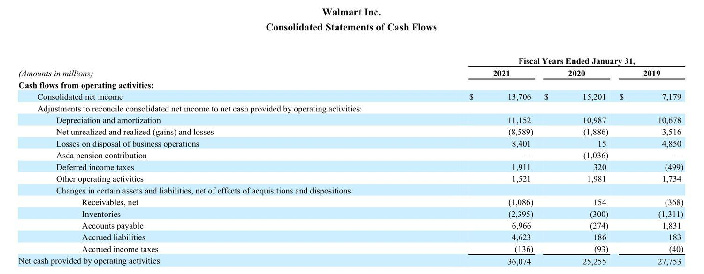

Operating Income Before Depreciation and Amortization (OIBDA) is a crucial financial metric that plays a significant role in evaluating a company's core business profitability. By focusing on a company's operational performance without the impact of non-cash expenses like depreciation and amortization, OIBDA provides a clearer picture of the company's financial health. This article will examine the relationship among operating income, OIBDA, and algorithmic trading.

For investors and analysts, an in-depth understanding of these metrics is essential to making well-informed decisions regarding investments. OIBDA reflects a company's operating efficiency, and it can become an integral part of the analysis used to compare companies' performances. In particular, algorithmic trading, which relies heavily on data-driven decisions, often incorporates such financial metrics to achieve precision in trading strategies.



Algorithmic trading involves using quantitative models to execute trades based on pre-set criteria, and the use of real-time financial data is critical for its success. Within this realm, OIBDA acts as a fundamental input by providing insights into a company's financial performance. By reducing the distortion caused by non-cash factors, OIBDA enables traders to more accurately assess a company's operational efficiency, thereby improving the reliability of predictions made by trading algorithms.

In conclusion, by scrutinizing OIBDA, investors are better equipped to evaluate a company's ability to generate earnings from its core operations. Understanding OIBDA not only aids in discerning operational efficiency but also enhances the capability of algorithmic trading systems.

## Table of Contents

## Understanding Operating Income and OIBDA

Operating income represents the profit a company earns from its core operational activities, excluding any income or expenses derived from non-operating activities such as interest and taxes. It serves as an indicator of how well a company can cover its operational expenses and is a crucial measure of operating efficiency. The formula for operating income is:

$$
\text{Operating Income} = \text{Revenue} - \text{Operating Expenses}
$$

where operating expenses include costs such as wages, cost of goods sold, and administrative expenses.

Operating Income Before Depreciation and Amortization (OIBDA) extends the concept of operating income by excluding depreciation and amortization from the calculation. This adjustment provides a purer view of a company's operational profitability by focusing solely on cash-based expenses and excluding non-cash charges. Depreciation and amortization are accounting methods that spread the cost of an asset over its useful life, reflecting investment decisions rather than operational activities. The formula for OIBDA is:

$$
\text{OIBDA} = \text{Operating Income} + \text{Depreciation} + \text{Amortization}
$$

The exclusion of these non-cash charges makes OIBDA particularly useful for evaluating the financial performance of companies in industries with significant capital expenditures. Industries like telecommunications, utilities, and manufacturing incur substantial costs in acquiring and maintaining long-term assets. In these sectors, depreciation and amortization can represent a large portion of operating expenses, potentially obscuring the picture of pure operational performance. By using OIBDA, investors and analysts gain a clearer view of a company's profitability from its core business activities.

While operating income facilitates an understanding of a company's expense management and operational efficiency, OIBDA goes a step further by providing insights that are less affected by capital structure and accounting practices. This distinction is crucial for accurate financial analysis and comparison across companies, especially where asset intensity and capital investment differ significantly.

In summary, while both operating income and OIBDA are vital measures in financial analysis, OIBDA offers an enhanced perspective by eliminating some accounting assumptions inherent in non-cash expenses, making it a preferred metric for assessing operational performance in capital-intensive industries.

## The Role of OIBDA in Algorithmic Trading

Algorithmic trading, a sophisticated method of executing trades, employs quantitative models to automate decision-making processes based on a variety of financial metrics. A key metric that can be integral in these models is Operating Income Before Depreciation and Amortization (OIBDA). OIBDA serves as an essential indicator of a company's operational performance by focusing on core business profits, devoid of non-cash expenses such as depreciation and amortization.

In [algorithmic trading](/wiki/algorithmic-trading), OIBDA can be leveraged as an input variable within trading algorithms to evaluate a company's financial health. This is particularly pertinent in sectors with substantial capital investment requirements. The exclusion of depreciation and amortization in OIBDA enables a clearer assessment of how well a company is performing without the noise of accounting adjustments. Here's an example of how OIBDA can be incorporated into a simple algorithm:

```python
def calculate_oibda(operating_income, depreciation, amortization):
    return operating_income + depreciation + amortization

def evaluate_company(oibda, threshold):
    if oibda > threshold:
        return "Strong Performance"
    else:
        return "Weak Performance"

# Example usage:
operating_income = 500000
depreciation = 100000
amortization = 50000

oibda_value = calculate_oibda(operating_income, depreciation, amortization)
analysis = evaluate_company(oibda_value, 600000)
print(analysis)
```

This simple model exemplifies how OIBDA can be employed to categorize companies based on a threshold, which represents acceptable operational performance levels relative to industry standards.

Additionally, analyzing OIBDA trends can offer insights into potential stock performance. Consistent OIBDA growth may indicate robust operational efficiency, leading to improved investor confidence and potentially higher stock valuations. Traders can utilize historical OIBDA data to forecast future trends, enhancing predictive accuracy within their algorithms. A decrease in OIBDA, however, might signify operational challenges, possibly impacting the stock negatively. Incorporating OIBDA trends helps in identifying both long-term growth opportunities and short-term trading signals, forming a comprehensive approach to trading strategy optimization.

## Calculating OIBDA

Operating Income Before Depreciation and Amortization (OIBDA) is calculated by starting with a company's operating income, then adjusting for depreciation and amortization expenses. The goal of this calculation is to provide a clearer picture of a company's operational profitability by excluding certain non-cash charges.

The standard formula to calculate OIBDA is:

$$
\text{OIBDA} = \text{Operating Income} + \text{Depreciation} + \text{Amortization}
$$

### Steps to Calculate OIBDA:

1. **Identify Operating Income:**
   Operating income, sometimes referred to as operating profit, is found on the income statement. This figure represents the profit a company makes from its core business activities, excluding any income from non-operating sources.

2. **Add Back Depreciation and Amortization:**
   Depreciation and amortization are non-cash expenses that are typically reported on the cash flow statement. They reflect the allocation of the cost of tangible and intangible assets over their useful lives. These are added back to the operating income to derive OIBDA since they do not directly impact cash flow.

3. **Adjust for Embedded Costs:**
   In some cases, depreciation and amortization are not explicitly listed as separate line items on the financial statements. They might be embedded within other costs or expenses. Thus, it may require careful analysis to extract and accurately add them back.

4. **Consider Interest and Tax Adjustments:**
   Occasionally, interest and tax expenses might be incorporated into operating income, depending on the accounting practices of the company. While calculating OIBDA, ensure these are added back if they were initially subtracted, as OIBDA is intended to reflect operational profitability independent of financing and tax structures.

5. **Use the Cash Flow Statement:**
   The cash flow statement is a supplementary source where one can verify the depreciation and amortization amounts. This document can help reinforce or clarify the figures reported in the income statement, should there be any ambiguity.

### Example in Python:
To automate the calculation of OIBDA using Python, you could implement a simple function as follows:

```python
def calculate_oibda(operating_income, depreciation, amortization, embedded_interest=0, embedded_tax=0):
    # Add back depreciation, amortization, any embedded interest and taxes
    oibda = operating_income + depreciation + amortization + embedded_interest + embedded_tax
    return oibda

# Example Usage
operating_income = 500000  # Example value in dollars
depreciation = 75000       # Example value in dollars
amortization = 25000       # Example value in dollars

oibda = calculate_oibda(operating_income, depreciation, amortization)
print("OIBDA:", oibda)
```

By adhering to these guidelines, OIBDA can be accurately calculated and used effectively to evaluate a company's core business performance, devoid of the noise created by depreciation and amortization. This meticulous approach ensures that analysts and investors have a consistent basis for comparison across companies and industries with varying capital investments.

## Comparison: OIBDA vs. EBITDA

Both Operating Income Before Depreciation and Amortization (OIBDA) and Earnings Before Interest, Taxes, Depreciation, and Amortization (EBITDA) are important metrics used to evaluate a company's profitability, but they differ significantly in their scope and focus. Understanding these differences can provide investors and analysts with more nuanced insights into a company's financial performance.

EBITDA is calculated by taking the net income and adding back interest, taxes, depreciation, and amortization. This measure is widely used because it offers an overview of a company's profitability from its core operations before these non-operating expenses are considered. The EBITDA formula can be expressed as follows:

$$
\text{EBITDA} = \text{Net Income} + \text{Interest} + \text{Taxes} + \text{Depreciation} + \text{Amortization}
$$

EBITDA includes non-operating income, providing a broad picture that encompasses all revenue streams and costs associated with generating that revenue, excluding financing and accounting choices.

Conversely, OIBDA begins with operating income, which is a more refined measure that excludes any non-operating income and expenses from the start. This makes OIBDA particularly focused on the company's ability to generate profits from core business activities. The formula for OIBDA is:

$$
\text{OIBDA} = \text{Operating Income} + \text{Depreciation} + \text{Amortization}
$$

By excluding non-operating income and beginning with operating income, OIBDA offers a purer look at how efficiently a company is operating its core business rather than reflecting the outcomes of financial or accounting strategies. This narrower scope may provide a more consistent measure for evaluating ongoing operations, especially in industries with high capital expenditures where these non-cash charges are significant.

In summary, while both metrics serve to highlight different aspects of financial performance, OIBDA is potentially more consistent for evaluating a company's operational efficiency, focusing strictly on core business profitability. EBITDA offers a broader financial perspective by incorporating additional non-operating factors. Both should be used in conjunction to fully understand a company's financial health and operational success.

## Significance of OIBDA for Investors and Analysts

OIBDA (Operating Income Before Depreciation and Amortization) is a significant metric for investors and analysts seeking insights into a company's operational efficiency, as it excludes non-cash items such as depreciation and amortization. By focusing solely on cash-generating activities, OIBDA provides a clearer understanding of how effectively a company is managing its core business operations.

One of the key benefits of using OIBDA is its applicability across industries with varying capital investment needs. This is particularly useful when comparing companies in capital-intensive sectors, such as telecommunications or manufacturing, with those in less capital-demanding industries. The exclusion of depreciation and amortization means that investors can make more apples-to-apples comparisons by minimizing the noise from accounting decisions related to capital assets.

Additionally, OIBDA can help investors evaluate a company's potential for future growth and profitability. By focusing on earnings from primary business activities, it provides a baseline for assessing how effectively a company is generating profits without the influence of capital structure and tax strategies. This can be pivotal when developing growth forecasts and setting valuation metrics.

In the context of algorithmic trading, OIBDA serves as a valuable input for predictive models. Algorithms typically rely on historical financial data to identify patterns and make informed trading decisions. By incorporating OIBDA, traders can enhance the accuracy of their models, as it reflects the true operational cash flows of a business, potentially leading to more precise predictions of stock performance. The metric's ability to strip out the effects of non-cash charges and financing decisions enables algorithms to focus on the core profitability of an enterprise, which is crucial in fast-paced trading environments where precision and timeliness are vital.

## Limitations of OIBDA

Operating Income Before Depreciation and Amortization (OIBDA) is a useful financial metric, but it has several limitations that should be considered in financial analysis and decision-making. 

OIBDA, by its design, does not include essential financial obligations such as debt and taxes. This exclusion means that while OIBDA can provide a snapshot of operational profit without the influence of non-cash charges, it neglects significant outlays that affect a company's net profitability. This limitation poses a risk for investors who rely solely on OIBDA to assess a company's financial health, as it might present an overly optimistic view of profitability by ignoring financing costs and tax burdens.

Another concern is the potential manipulation of OIBDA through accounting practices. Companies may choose to adjust depreciation schedules or the amortization of intangible assets to paint a more favorable picture of their financial performance. Such practices necessitate caution, prompting investors and analysts to use OIBDA in conjunction with other financial metrics to obtain a comprehensive understanding of a company’s performance.

For a holistic financial analysis, it is advisable for investors to examine OIBDA alongside net income and cash flow statements. While OIBDA focuses on operating performance by excluding depreciation and amortization, net income includes all expenses and revenues, providing an overview of the financial position. Similarly, cash flow analysis gives insights into the actual [liquidity](/wiki/liquidity-risk-premium) and cash generation capabilities of a business, which OIBDA does not capture perfectly.

Lastly, OIBDA might not accurately represent future cash flows, especially in industries where capital expenditure fluctuates significantly year to year. Since OIBDA excludes depreciation and amortization, it may not fully reflect the impact of capital investments on a company's future profitability and cash flow potential. This limitation is particularly significant in capital-intensive sectors, where substantial and varying investments in fixed assets are common.

Thus, while OIBDA is a helpful measure of operational efficiency, its limitations underscore the importance of integrating it with other financial metrics to form a well-rounded view of a company's financial performance and prospects.

## Conclusion

Operating Income Before Depreciation and Amortization (OIBDA) is recognized as a significant metric for evaluating the profitability and operational efficiency of a company's core business. It isolates operating performance by eliminating the effects of depreciation and amortization, offering insights into how efficiently a company runs its operations without the distortion of non-cash accounting charges. By focusing on these elements, OIBDA can highlight a firm's ability to generate profits from its primary activities, which is crucial for long-term viability.

Incorporating OIBDA into algorithmic trading strategies is advantageous for enhancing decision-making accuracy. Algorithms generally rely on quantitative models to process vast amounts of data rapidly. By integrating OIBDA as a financial input, these models can more accurately gauge a company's operational health and efficiency. This can lead to more precise forecasting of stock performance, particularly in industries that are sensitive to operating income fluctuations, such as those with high capital expenditures.

Despite its clear benefits, OIBDA has limitations. It does not consider crucial financial obligations such as debt servicing and tax expenses, which could affect a company's overall profitability. Moreover, as it can be susceptible to manipulation through accounting practices, it should be used in conjunction with other financial metrics like net income and cash flow from operations. This comprehensive approach provides a more holistic view of a company's financial health.

Consistent analysis and deeper understanding of OIBDA are essential for investors aiming to make well-informed investment decisions. By utilizing OIBDA alongside other financial tools, investors and analysts can gain a robust understanding of a company's potential for future growth and profitability, therefore improving the precision of their investment strategies.

## References & Further Reading

[1]: ["Advances in Financial Machine Learning"](https://www.amazon.com/Advances-Financial-Machine-Learning-Marcos/dp/1119482089) by Marcos Lopez de Prado

[2]: ["Evidence-Based Technical Analysis: Applying the Scientific Method and Statistical Inference to Trading Signals"](https://www.amazon.com/Evidence-Based-Technical-Analysis-Scientific-Statistical/dp/0470008741) by David Aronson

[3]: ["Machine Learning for Algorithmic Trading"](https://github.com/stefan-jansen/machine-learning-for-trading) by Stefan Jansen

[4]: ["Quantitative Trading: How to Build Your Own Algorithmic Trading Business"](https://www.amazon.com/Quantitative-Trading-Build-Algorithmic-Business/dp/1119800064) by Ernest P. Chan

[5]: ["Investing in the Second Machine Age: Applications of AI in the Data-Driven Financial Industry"](https://www.statista.com/topics/7083/artificial-intelligence-ai-in-finance/) by Malcolm P. Bouldry