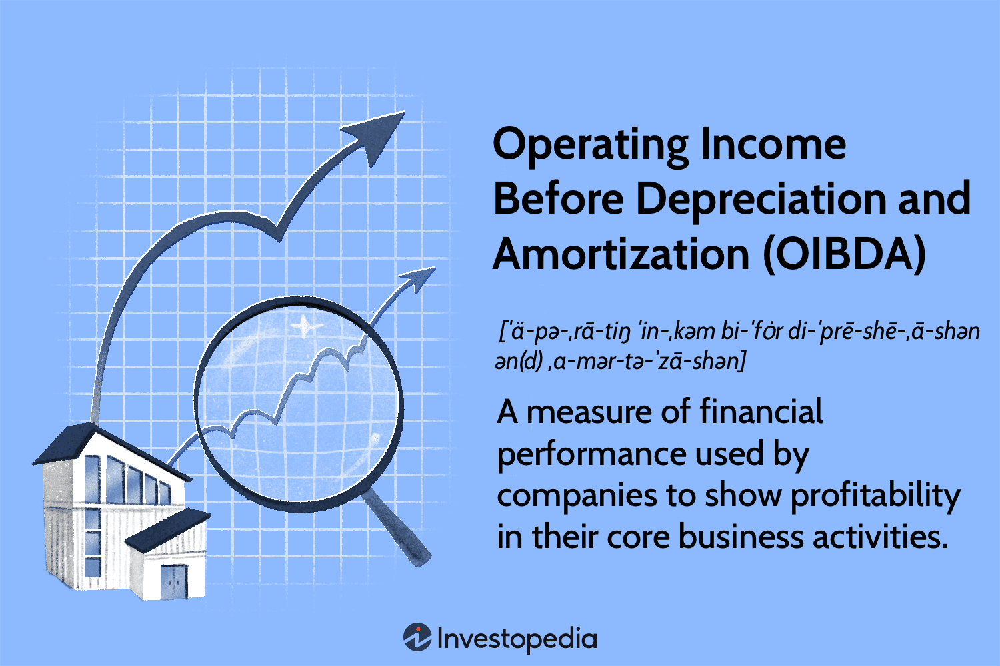

## Table of Contents

## What is Operating Income Before Depreciation and Amortization (OIBDA)?

Operating Income Before Depreciation and Amortization (OIBDA) is a measure of a company's financial performance. It shows how much money a company makes from its main business activities before taking into account the costs of depreciation and amortization. Depreciation is the reduction in value of physical assets like buildings and equipment over time, while amortization is the similar reduction in value of intangible assets like patents. By not including these costs, OIBDA gives a clearer picture of the cash flow generated from the company's core operations.

OIBDA is often used by businesses and investors to assess the profitability of a company's operations without the influence of accounting decisions related to depreciation and amortization. These costs can vary greatly depending on the accounting methods used, so OIBDA helps to focus on the actual cash being generated. It is particularly useful for comparing the performance of companies in industries like telecommunications or media, where large investments in assets are common. However, it's important to remember that OIBDA does not account for all expenses, so it should be used alongside other financial metrics for a complete view of a company's health.

## How is OIBDA calculated?

To calculate Operating Income Before Depreciation and Amortization (OIBDA), you start with the company's revenue. From this, you subtract all the operating expenses except for depreciation and amortization. Operating expenses include things like salaries, rent, and the cost of goods sold. So, OIBDA is what's left after you take away these costs but before you account for the wear and tear on the company's assets.

For example, if a company has revenue of $1 million and operating expenses (excluding depreciation and amortization) of $600,000, the OIBDA would be $400,000. This number shows how much money the company is making from its main business activities before considering the costs of using up its assets over time. It's a useful way to see how well the company is doing at generating cash from its core operations.

## Why is OIBDA important for businesses?

OIBDA is important for businesses because it helps them see how much money they are making from their main activities before they account for the costs of using up their assets over time. This measure is useful because it shows the cash being generated from the business's core operations, without the influence of accounting decisions about how to spread out the cost of assets. This can be especially helpful for companies that have a lot of big equipment or other long-term assets, because the costs of these can change the picture of how the business is doing.

By focusing on OIBDA, businesses and investors can get a clearer idea of the company's ability to generate cash from its day-to-day operations. This can be a good way to compare the performance of different companies, especially in industries where big investments in assets are common, like telecommunications or media. However, it's important to remember that OIBDA doesn't tell the whole story, because it leaves out some important costs. So, while it's a useful tool, it should be used alongside other financial measures to get a complete view of the company's health.

## How does OIBDA differ from EBITDA?

OIBDA and EBITDA are both ways to measure how well a business is doing, but they look at slightly different things. OIBDA stands for Operating Income Before Depreciation and Amortization. It shows how much money a business makes from its main activities before it counts the costs of wearing out its assets over time. OIBDA focuses only on the operating part of the business, so it doesn't include any other income or expenses that aren't part of the day-to-day running of the company.

EBITDA, on the other hand, stands for Earnings Before Interest, Taxes, Depreciation, and Amortization. It's a bit broader than OIBDA because it takes into account all the earnings of the business, not just the operating part. So, EBITDA includes any other income the business might have, like interest from investments, and it doesn't count the costs of interest or taxes. Both measures are useful, but they give a slightly different view of the business's financial health. OIBDA is more focused on the core business operations, while EBITDA gives a bigger picture of the company's overall earnings.

## What are the common uses of OIBDA in financial analysis?

OIBDA is often used in financial analysis to help people understand how much money a company is making from its main business activities. It's a way to see the cash flow from the core operations without the costs of depreciation and amortization, which can change a lot depending on how a company decides to account for them. This makes OIBDA a useful tool for comparing the performance of different companies, especially in industries like telecom or media where big investments in equipment are common. By looking at OIBDA, analysts and investors can get a clearer picture of how well a company is doing at generating cash from its day-to-day business.

Another common use of OIBDA is to help businesses plan and make decisions. Since OIBDA shows the money coming in from the main operations, it can help managers see if their business strategies are working. It's also helpful for figuring out how much money the company has to spend on new projects or to pay down debts. However, it's important to remember that OIBDA doesn't include all costs, so it should be used along with other financial measures to get a full view of the company's health.

## Can you provide an example of how to compute OIBDA from a company's financial statements?

Let's say a company called ABC Corp has the following financial information from its income statement. The company's total revenue for the year is $5 million. The operating expenses, which include the cost of goods sold, salaries, rent, and other day-to-day costs, add up to $3.2 million. The depreciation expense for the year is $400,000, and the amortization expense is $100,000. To calculate OIBDA, we start with the revenue and subtract the operating expenses, but we don't include depreciation and amortization.

So, we take the revenue of $5 million and subtract the operating expenses of $3.2 million. That gives us an OIBDA of $1.8 million. This number shows how much money ABC Corp made from its main business activities before accounting for the costs of wearing out its assets over time. It's a useful figure for understanding the company's ability to generate cash from its core operations.

## How does OIBDA impact the assessment of a company's operational efficiency?

OIBDA helps us see how good a company is at making money from what it does every day. It shows the cash that comes in from the main business stuff, without counting the costs of using up things like machines or buildings over time. By looking at OIBDA, we can tell if a company is doing well at its core business, which is important for figuring out how efficient it is. If a company has a high OIBDA, it means it's making a lot of money from its main activities, which is a good sign of operational efficiency.

However, OIBDA doesn't tell the whole story. It leaves out some costs that can be important, like the money spent on keeping equipment running or paying off debts. So, while OIBDA can give us a clear picture of how much cash a company is making from its day-to-day work, it's best to use it along with other numbers to get a full view of how efficient the company really is. By comparing OIBDA with other financial measures, we can better understand if a company is truly good at running its business.

## What are the limitations of using OIBDA as a financial metric?

OIBDA can be a helpful way to see how much money a company makes from its main work, but it has some limits. One big problem is that it doesn't count all the costs a company has to pay. For example, it leaves out the money spent on keeping machines or buildings in good shape, which can be really important. Also, OIBDA doesn't include the costs of paying off debts or the taxes a company has to pay. If these costs are high, a company might look like it's doing well when it's really struggling.

Another thing to think about is that OIBDA can be different from one company to another because of how they account for things. Different companies might use different ways to figure out how much their machines or buildings are worth over time, which can make it hard to compare them. Also, OIBDA doesn't show if a company is spending too much on things that don't help its main business. So, while OIBDA can give us a good idea of how much cash a company is making from its day-to-day work, it's best to use it along with other financial numbers to get a full picture of how the company is doing.

## How can OIBDA be used to compare companies within the same industry?

OIBDA can help us compare how well companies in the same industry are doing at making money from their main work. Since OIBDA looks at the cash coming in from the day-to-day business without counting the costs of using up machines or buildings, it gives us a clear way to see how efficient each company is. For example, if two telecom companies have similar revenues but one has a higher OIBDA, it might mean that company is better at running its business and making money from its services.

However, it's important to remember that OIBDA doesn't tell the whole story. It leaves out some important costs like the money spent on keeping equipment running or paying off debts. So, when we use OIBDA to compare companies, we should also look at other financial numbers to get a full picture. By using OIBDA along with other measures, we can better understand which company is really doing better in the industry.

## What role does OIBDA play in investment decisions?

OIBDA helps investors figure out how much money a company is making from its main work before counting the costs of using up its machines or buildings. This can be useful because it shows how good the company is at making cash from its day-to-day business. Investors might look at a company's OIBDA to see if it's doing well at its core business and if it's a good investment. If a company has a high OIBDA, it might mean it's efficient and making a lot of money, which could make it a good choice for investing.

But, OIBDA doesn't tell the whole story. It leaves out some important costs like the money spent on keeping equipment running or paying off debts. So, while OIBDA can give investors a good idea of how much cash a company is making from its main work, it's best to use it along with other financial numbers. By looking at OIBDA and other measures together, investors can get a fuller picture of a company's health and make better decisions about where to put their money.

## How do changes in depreciation and amortization policies affect OIBDA?

Changes in depreciation and amortization policies can have a big impact on OIBDA. Depreciation is how a company figures out the cost of using up things like buildings and machines over time. Amortization is similar but for things you can't touch, like patents. OIBDA doesn't count these costs, so if a company changes how it calculates depreciation or amortization, it won't change the OIBDA number. This means OIBDA stays the same even if the company decides to spread out the cost of its assets differently.

However, while OIBDA itself doesn't change, the way investors and managers look at the company can. If a company starts using a new method that makes depreciation or amortization costs go up or down, it can change other financial numbers like net income. So, even though OIBDA stays the same, people might think differently about the company's overall financial health. It's important for investors to understand these changes and look at other financial measures too to get the full picture.

## What advanced analytical techniques can be applied to OIBDA for deeper financial insights?

To get deeper financial insights from OIBDA, one advanced technique is trend analysis. This means looking at how OIBDA changes over time for a company. By doing this, you can see if the company is getting better or worse at making money from its main work. You can also compare the OIBDA trends of different companies in the same industry to see which one is doing better. This can help investors and managers understand if a company's strategies are working and if it's a good investment.

Another technique is ratio analysis, where you compare OIBDA to other financial numbers. For example, you can look at the OIBDA margin, which is OIBDA divided by revenue. This shows how much of every dollar of revenue is left after paying for the day-to-day costs but before counting depreciation and amortization. You can also compare OIBDA to things like total assets or debt to see how well the company is using its resources or if it can pay off its debts. By using these ratios, you can get a clearer picture of the company's financial health and efficiency.

Lastly, regression analysis can be used to see how different factors affect OIBDA. This involves looking at data to find out how things like sales, costs, or even economic conditions impact the OIBDA. By understanding these relationships, you can predict how OIBDA might change in the future and make better decisions about investments or business strategies. This kind of analysis can be really helpful for planning and understanding what drives a company's financial performance.

## What is the understanding of Operating Income and OIBDA?

Operating income represents the profit a company earns from its core operational activities, excluding any income or expenses derived from non-operating activities such as interest and taxes. It serves as an indicator of how well a company can cover its operational expenses and is a crucial measure of operating efficiency. The formula for operating income is:

$$
\text{Operating Income} = \text{Revenue} - \text{Operating Expenses}
$$

where operating expenses include costs such as wages, cost of goods sold, and administrative expenses.

Operating Income Before Depreciation and Amortization (OIBDA) extends the concept of operating income by excluding depreciation and amortization from the calculation. This adjustment provides a purer view of a company's operational profitability by focusing solely on cash-based expenses and excluding non-cash charges. Depreciation and amortization are accounting methods that spread the cost of an asset over its useful life, reflecting investment decisions rather than operational activities. The formula for OIBDA is:

$$
\text{OIBDA} = \text{Operating Income} + \text{Depreciation} + \text{Amortization}
$$

The exclusion of these non-cash charges makes OIBDA particularly useful for evaluating the financial performance of companies in industries with significant capital expenditures. Industries like telecommunications, utilities, and manufacturing incur substantial costs in acquiring and maintaining long-term assets. In these sectors, depreciation and amortization can represent a large portion of operating expenses, potentially obscuring the picture of pure operational performance. By using OIBDA, investors and analysts gain a clearer view of a company's profitability from its core business activities.

While operating income facilitates an understanding of a company's expense management and operational efficiency, OIBDA goes a step further by providing insights that are less affected by capital structure and accounting practices. This distinction is crucial for accurate financial analysis and comparison across companies, especially where asset intensity and capital investment differ significantly.

In summary, while both operating income and OIBDA are vital measures in financial analysis, OIBDA offers an enhanced perspective by eliminating some accounting assumptions inherent in non-cash expenses, making it a preferred metric for assessing operational performance in capital-intensive industries.

## How do you calculate OIBDA?

Operating Income Before Depreciation and Amortization (OIBDA) is calculated by starting with a company's operating income, then adjusting for depreciation and amortization expenses. The goal of this calculation is to provide a clearer picture of a company's operational profitability by excluding certain non-cash charges.

The standard formula to calculate OIBDA is:

$$
\text{OIBDA} = \text{Operating Income} + \text{Depreciation} + \text{Amortization}
$$

### Steps to Calculate OIBDA:

1. **Identify Operating Income:**
   Operating income, sometimes referred to as operating profit, is found on the income statement. This figure represents the profit a company makes from its core business activities, excluding any income from non-operating sources.

2. **Add Back Depreciation and Amortization:**
   Depreciation and amortization are non-cash expenses that are typically reported on the cash flow statement. They reflect the allocation of the cost of tangible and intangible assets over their useful lives. These are added back to the operating income to derive OIBDA since they do not directly impact cash flow.

3. **Adjust for Embedded Costs:**
   In some cases, depreciation and amortization are not explicitly listed as separate line items on the financial statements. They might be embedded within other costs or expenses. Thus, it may require careful analysis to extract and accurately add them back.

4. **Consider Interest and Tax Adjustments:**
   Occasionally, interest and tax expenses might be incorporated into operating income, depending on the accounting practices of the company. While calculating OIBDA, ensure these are added back if they were initially subtracted, as OIBDA is intended to reflect operational profitability independent of financing and tax structures.

5. **Use the Cash Flow Statement:**
   The cash flow statement is a supplementary source where one can verify the depreciation and amortization amounts. This document can help reinforce or clarify the figures reported in the income statement, should there be any ambiguity.

### Example in Python:
To automate the calculation of OIBDA using Python, you could implement a simple function as follows:

```python
def calculate_oibda(operating_income, depreciation, amortization, embedded_interest=0, embedded_tax=0):
    # Add back depreciation, amortization, any embedded interest and taxes
    oibda = operating_income + depreciation + amortization + embedded_interest + embedded_tax
    return oibda

# Example Usage
operating_income = 500000  # Example value in dollars
depreciation = 75000       # Example value in dollars
amortization = 25000       # Example value in dollars

oibda = calculate_oibda(operating_income, depreciation, amortization)
print("OIBDA:", oibda)
```

By adhering to these guidelines, OIBDA can be accurately calculated and used effectively to evaluate a company's core business performance, devoid of the noise created by depreciation and amortization. This meticulous approach ensures that analysts and investors have a consistent basis for comparison across companies and industries with varying capital investments.

## What is the comparison between OIBDA and EBITDA?

Both Operating Income Before Depreciation and Amortization (OIBDA) and Earnings Before Interest, Taxes, Depreciation, and Amortization (EBITDA) are important metrics used to evaluate a company's profitability, but they differ significantly in their scope and focus. Understanding these differences can provide investors and analysts with more nuanced insights into a company's financial performance.

EBITDA is calculated by taking the net income and adding back interest, taxes, depreciation, and amortization. This measure is widely used because it offers an overview of a company's profitability from its core operations before these non-operating expenses are considered. The EBITDA formula can be expressed as follows:

$$
\text{EBITDA} = \text{Net Income} + \text{Interest} + \text{Taxes} + \text{Depreciation} + \text{Amortization}
$$

EBITDA includes non-operating income, providing a broad picture that encompasses all revenue streams and costs associated with generating that revenue, excluding financing and accounting choices.

Conversely, OIBDA begins with operating income, which is a more refined measure that excludes any non-operating income and expenses from the start. This makes OIBDA particularly focused on the company's ability to generate profits from core business activities. The formula for OIBDA is:

$$
\text{OIBDA} = \text{Operating Income} + \text{Depreciation} + \text{Amortization}
$$

By excluding non-operating income and beginning with operating income, OIBDA offers a purer look at how efficiently a company is operating its core business rather than reflecting the outcomes of financial or accounting strategies. This narrower scope may provide a more consistent measure for evaluating ongoing operations, especially in industries with high capital expenditures where these non-cash charges are significant.

In summary, while both metrics serve to highlight different aspects of financial performance, OIBDA is potentially more consistent for evaluating a company's operational efficiency, focusing strictly on core business profitability. EBITDA offers a broader financial perspective by incorporating additional non-operating factors. Both should be used in conjunction to fully understand a company's financial health and operational success.

## References & Further Reading

[1]: ["Advances in Financial Machine Learning"](https://www.amazon.com/Advances-Financial-Machine-Learning-Marcos/dp/1119482089) by Marcos Lopez de Prado

[2]: ["Evidence-Based Technical Analysis: Applying the Scientific Method and Statistical Inference to Trading Signals"](https://www.amazon.com/Evidence-Based-Technical-Analysis-Scientific-Statistical/dp/0470008741) by David Aronson

[3]: ["Machine Learning for Algorithmic Trading"](https://github.com/stefan-jansen/machine-learning-for-trading) by Stefan Jansen

[4]: ["Quantitative Trading: How to Build Your Own Algorithmic Trading Business"](https://www.amazon.com/Quantitative-Trading-Build-Algorithmic-Business/dp/1119800064) by Ernest P. Chan

[5]: ["Investing in the Second Machine Age: Applications of AI in the Data-Driven Financial Industry"](https://www.statista.com/topics/7083/artificial-intelligence-ai-in-finance/) by Malcolm P. Bouldry