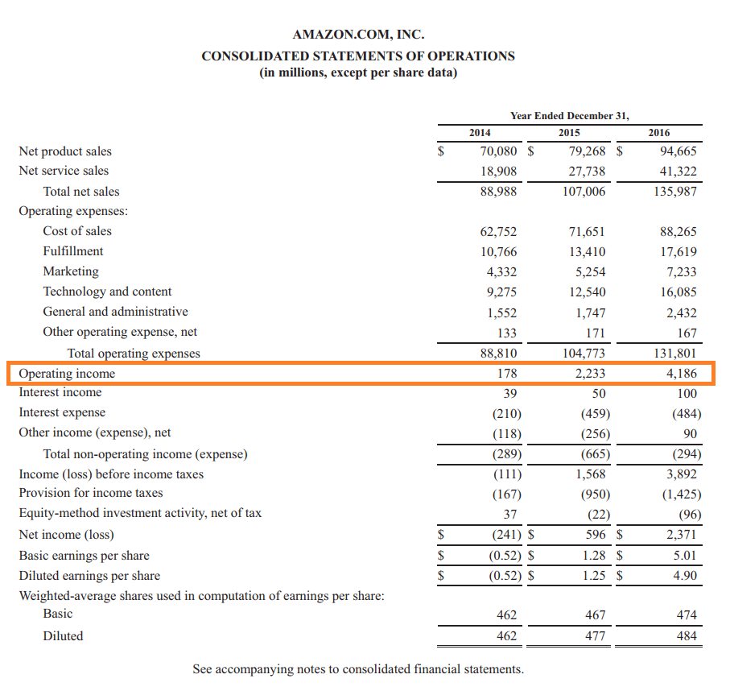

## Table of Contents

## What is operating income?

Operating income is the money a company makes from its main business activities before paying taxes and interest. It is also called operating profit or EBIT (Earnings Before Interest and Taxes). To find operating income, you start with the company's total revenue and then subtract the costs of running the business, like the cost of goods sold and operating expenses. These expenses include things like salaries, rent, and utilities.

Operating income is important because it shows how well a company is doing at its core business, without considering other factors like taxes or loans. If a company has a high operating income, it means the company is good at making money from what it does every day. Investors and managers look at operating income to see if the company is healthy and efficient. If operating income is low or negative, it might mean the company needs to cut costs or find ways to increase sales.

## How is operating income calculated?

Operating income is calculated by taking a company's total revenue and then subtracting the costs that come from running the business. These costs include the cost of goods sold, which is what the company spends to make or buy the products it sells, and operating expenses, which are the costs of day-to-day operations like salaries, rent, and utilities.

This calculation gives you the amount of money the company makes from its main business activities before it pays taxes and interest on loans. It's a useful number because it shows how well the company is doing at its core business, without other factors like taxes or borrowing costs getting in the way. If the operating income is high, it means the company is good at making money from what it does every day.

## Why is operating income important in financial accounting?

Operating income is important in financial accounting because it shows how much money a company makes from its main business activities before paying taxes and interest. This number helps people understand if the company is good at its core business, without other factors like loans or taxes getting in the way. It's like looking at the score of a game to see who's winning, but only counting the points from the main part of the game, not any extra points from other things.

If a company has a high operating income, it means they are doing well at making money from what they do every day. This is useful for investors and managers because it helps them see if the company is healthy and efficient. If the operating income is low or negative, it might mean the company needs to cut costs or find ways to sell more to make more money. So, operating income is a key number that helps everyone understand how well the company is doing at its main job.

## What is the difference between operating income and net income?

Operating income and net income are both important numbers in a company's financial report, but they show different things. Operating income is the money a company makes from its main business activities before paying taxes and interest. It's like looking at how much money you make from your job before you pay taxes or any loans. If you run a lemonade stand, operating income would be the money you make from selling lemonade, minus the cost of lemons, sugar, and cups.

Net income, on the other hand, is what's left after you take away all expenses, including taxes and interest. It's the final amount of money a company has after everything is paid. Going back to the lemonade stand example, net income would be what you have left after you pay for the lemons, sugar, cups, and also any taxes you owe and interest on any loans you took to start your stand. So, net income gives you a complete picture of how much money the company actually keeps at the end of the day.

## Can you provide an example of how to calculate operating income?

Let's say you run a small bakery. Last month, you made $10,000 from selling cakes and cookies. This is your total revenue. But to make these treats, you spent $4,000 on flour, sugar, and other ingredients. This is your cost of goods sold. You also had to pay $3,000 for rent, utilities, and salaries, which are your operating expenses. To find your operating income, you start with your total revenue and subtract both the cost of goods sold and the operating expenses. So, you take $10,000 and subtract $4,000 for ingredients and $3,000 for other costs. That leaves you with $3,000. This $3,000 is your operating income for the month.

Operating income is important because it shows how well your bakery is doing at making money from selling cakes and cookies, before you pay any taxes or interest on loans. If your operating income is high, like the $3,000 in this example, it means your bakery is doing well at its main job. But if your operating income was low or negative, it might mean you need to find ways to cut costs or sell more baked goods to make more money.

## How does operating income relate to operating expenses?

Operating income is what's left after you take away operating expenses from the money you make from your main business. Operating expenses are the costs you have to pay to keep your business running every day, like rent, salaries, and utilities. If you run a pizza shop, your operating expenses would be things like the cost of the flour and cheese, the rent for your shop, and the salaries of your employees. When you subtract these expenses from the money you make from selling pizzas, you get your operating income.

Operating income is important because it shows how well your business is doing at making money from its main activities, before you pay taxes or interest on any loans. If your operating income is high, it means your business is good at making money from what it does every day. For example, if your pizza shop makes $10,000 from selling pizzas but spends $7,000 on operating expenses, your operating income would be $3,000. This number helps you see if your business is healthy and efficient. If your operating income is low or negative, it might mean you need to find ways to cut costs or sell more pizzas to make more money.

## What are common adjustments made to calculate operating income?

When calculating operating income, you might need to make some adjustments to get a clear picture of how well your business is doing. One common adjustment is to add back any non-operating expenses that were subtracted from your revenue. These are costs that don't come from your main business activities, like interest on loans or losses from selling old equipment. By adding these back, you focus only on the money made and spent from your main business.

Another adjustment could be to subtract any non-operating income that was included in your total revenue. This might include money from investments or selling assets that aren't part of your main business. By taking this out, you make sure your operating income only shows the money made from your core business activities. These adjustments help you see how well your business is doing at its main job, without other things getting in the way.

## How does operating income impact a company's profitability analysis?

Operating income is a key number in figuring out how profitable a company is. It shows how much money the company makes from its main business activities before paying taxes and interest. If a company's operating income is high, it means the company is good at making money from what it does every day. This is important for investors and managers because it helps them see if the company is healthy and efficient. If the operating income is low or negative, it might mean the company needs to cut costs or find ways to sell more to make more money.

Operating income helps in comparing how well a company is doing compared to other companies in the same industry. By looking at operating income, people can see which companies are better at making money from their main business. This number also helps in planning for the future. If a company knows its operating income, it can make better decisions about where to spend money or how to grow the business. So, operating income is a big part of understanding a company's profitability and making smart business choices.

## What are the limitations of using operating income as a performance metric?

Operating income is a good way to see how well a company is doing at its main job, but it has some limits. One big limit is that it doesn't include all the costs a company has to pay. For example, it doesn't count taxes or the money the company has to pay back on loans. So, if a company has a lot of debt or high taxes, its operating income might look good, but it might not have much money left after paying everything.

Another limit is that operating income can be different from one company to another, even if they are in the same business. This is because companies might count some costs differently. For example, one company might include the cost of a new machine in its operating expenses, while another might not. This makes it hard to compare companies fairly just by looking at their operating income. So, while operating income is useful, it's not the only thing to look at when figuring out how well a company is doing.

## How can operating income be used to compare companies within the same industry?

Operating income can be a helpful way to compare how well companies in the same industry are doing. It shows the money each company makes from its main business activities before paying taxes and interest. By looking at operating income, you can see which companies are better at making money from what they do every day. For example, if two car companies have the same amount of sales but one has a higher operating income, it means that company is better at keeping costs down and making more money from selling cars.

However, there are some things to keep in mind when using operating income to compare companies. Not all companies count their costs in the same way. One company might include the cost of new equipment in its operating expenses, while another might not. This can make it hard to compare them fairly just by looking at operating income. So, while operating income is useful, it's important to look at other numbers too, like net income and how much debt a company has, to get a full picture of how well each company is doing.

## What role does operating income play in financial forecasting and budgeting?

Operating income is really important for financial forecasting and budgeting because it shows how much money a company makes from its main business before paying taxes and interest. When companies make plans for the future, they use operating income to see if their main business is doing well. If operating income is high, it means the company is good at making money from what it does every day. This helps them guess how much money they might make in the future and plan how to spend it. For example, if a company sees that its operating income is going up, it might decide to spend more money on new projects or expanding the business.

But operating income is not the only thing companies look at when making plans. They also need to think about other costs like taxes and interest on loans. If a company has a lot of debt, its operating income might look good, but it might not have much money left after paying everything. So, when companies make budgets, they use operating income along with other numbers to make sure their plans are realistic. This helps them make smart choices about where to spend money and how to grow the business without running into money problems.

## How do changes in accounting standards affect the calculation and interpretation of operating income?

Changes in accounting standards can affect how companies calculate and interpret their operating income. These standards are rules that tell companies how to keep track of their money and report it. If the rules change, it might mean that some costs or income that were not part of operating income before now have to be included, or the other way around. For example, if a new rule says that the cost of a new machine should be counted as an operating expense, then the operating income might go down because the costs are higher. This can make it harder to compare operating income from one year to the next if the rules changed in between.

When accounting standards change, it can also make it tricky to compare operating income between different companies. If one company follows the old rules and another follows the new rules, their operating incomes might look different even if they are doing the same kind of business. This can confuse investors and managers who are trying to figure out which company is doing better. So, it's important for everyone to know about any changes in accounting standards and understand how they might affect the numbers they are looking at.

## What is the relationship between profitability and operating income?

Profitability is a fundamental measure of a business's capability to generate earnings relative to its expenses and other costs over a specific period. It serves as a crucial indicator of a company's financial health and potential for growth. Profitability can be analyzed through various metrics, including net profit margin, return on assets (ROA), and return on equity (ROE). These ratios provide insights into how efficiently a company is utilizing its resources to generate profits.

Operating income, often referred to as operating profit, is a primary determinant of profitability. It is calculated as the revenue generated from normal business operations minus the operating expenses, which include costs of goods sold (COGS), wages, rent, and other administrative costs. The formula for operating income is expressed as:

$$
\text{Operating Income} = \text{Revenue} - (\text{COGS} + \text{Operating Expenses})
$$

This metric is pivotal in understanding the core business operations' profitability, excluding the effects of external financing and taxation. By focusing on operating income, analysts can assess how effectively management is controlling costs and generating profit from day-to-day business activities.

Operating income plays a vital role in financial performance analysis. It highlights the efficiency and effectiveness of management in steering the company's resources toward productive activities. An increase in operating income generally signals improved management proficiency in optimizing operational costs and boosting sales without proportionate cost escalations. Conversely, declining operating income may indicate inefficiencies or strategic missteps.

Furthermore, operating income is a key input in various financial assessments and valuations. It serves as a base for calculating the operating margin, which is a percentage representation of operating income relative to revenue. The operating margin provides insights into how much profit a company makes before taxes and interest for every dollar of sales, showcasing the operational profit efficiency.

Understanding these metrics is crucial for stakeholders, including investors, analysts, and management, as they offer a window into the company's operational success and strategic positioning. A consistent increase in operating income suggests that a company is adeptly managing its operational framework, thereby boosting its potential for long-term profitability and sustainability.

## What is the Role of Financial Accounting?

Financial accounting is a systematic process of recording, summarizing, and reporting the myriad of transactions resulting from business operations over a specific period. These transactions are summarized in financial statements, including the income statement, balance sheet, and cash flow statement, which reflect the company's financial health and performance.

One of the primary objectives of financial accounting is to provide useful information to stakeholders for decision-making. This involves the calculation of operating income, a critical metric for assessing a company’s profitability. Operating income is calculated as:

$$
Operating \, Income = Gross \, Profit - Operating \, Expenses
$$

where:
- **Gross Profit** is the difference between revenue and the cost of goods sold (COGS).
- **Operating Expenses** include costs not directly tied to production, such as salaries, rent, and utilities.

Operating income excludes non-operating income and expenses, like interest and tax, thus offering a clearer view of the income generated from the core business operations. This metric is pivotal for evaluating management efficiency and operational effectiveness.

Financial statements serve as essential tools within this framework. The income statement provides a detailed breakdown of revenues and expenses, ultimately arriving at the net income. This statement informs on profitability, showcasing how effectively a company can convert sales into profits.

The balance sheet complements this by snapshotting a company's financial position at a given point in time, highlighting assets, liabilities, and shareholder equity. It allows stakeholders to assess [liquidity](/wiki/liquidity-risk-premium) and financial strength, ensuring that operating income suffices to meet both short-term liabilities and contribute to long-term growth.

Moreover, the cash flow statement records the inflow and outflow of cash, aiding in the evaluation of a company’s liquidity, solvency, and financial flexibility. It ensures that operating income translates into cash flow, supporting sustainable operations and investments.

Together, these financial statements underpin the strategic decisions of investors, creditors, and management, each relying on accurate and timely financial reporting to guide their actions. In summary, financial accounting is indispensable in computing operating income and assessing profitability, providing a comprehensive view of a company’s financial health and operational success.

## How do profitability, operating income, and algorithmic trading interconnect?

Algorithmic trading integrates financial metrics such as operating income to pinpoint profitable trading opportunities. Operating income, a reflection of a company's profit from core business operations, is pivotal for traders assessing a company's financial health. It excludes non-operational revenues and expenses, offering a clearer picture of a firm's operational efficiency. By analyzing operating income, algorithmic models can extract signals about a company's ability to maintain profitability, a critical [factor](/wiki/factor-investing) in strategic trading decisions.

Consider the formula for operating income: 

$$
\text{Operating Income} = \text{Revenue} - \text{COGS} - \text{Operating Expenses}
$$

where COGS represents the cost of goods sold. This formula highlights the areas impacting a company's operational efficiency.

Profit margins, derived from operating income, further refine the trading strategy by indicating the efficiency of resource utilization. A high profit margin suggests the company is efficient in managing operational costs relative to revenue generated. These margins inform algorithms about potential for sustained profitability and influence buy-sell decisions based on projected earnings growth.

Furthermore, balancing profitability with technology investments is essential for optimizing [algorithmic trading](/wiki/algorithmic-trading) outcomes. The integration of sophisticated computational models requires considerable financial resources. However, these investments in technology must not overshadow profitability objectives. By maintaining an equilibrium, firms can leverage technology to enhance trading precision without sacrificing financial viability.

Investment in algorithmic trading technology should focus on areas like improving latency, data processing speed, and advanced predictive analytics. For example, Python, with libraries such as NumPy and pandas, allows for efficient handling of large datasets and complex calculations, enhancing the capability to process financial data swiftly.

```python
import pandas as pd
import numpy as np

# Example: Calculate Operating Income Margin for a dataset
def calculate_operating_income_margin(data):
    data['Operating Income Margin'] = (data['Operating Income'] / data['Revenue']) * 100
    return data

# Assuming we have a DataFrame df with columns 'Operating Income' and 'Revenue'
df = pd.DataFrame({
    'Operating Income': [50000, 150000, 230000],
    'Revenue': [200000, 400000, 600000]
})

result = calculate_operating_income_margin(df)
print(result)
```

Engaging with these advanced trading models necessitates a careful balance between leveraging operational data and maintaining robust profit margins. The strategic intersection of operating income insights and technological prowess equips traders to make informed, data-driven decisions, ultimately optimizing both trading efficacy and financial performance.

## What are the challenges and considerations?

Algorithmic trading is a formidable tool with significant benefits, but it also presents several challenges and complexities that need careful management. One critical challenge is ensuring data quality, as these models heavily depend on accurate and timely data to function effectively. Poor data can lead to erroneous trading decisions and substantial financial loss. Maintaining data integrity requires robust data management systems and continuous monitoring.

Regulatory changes pose another challenge for algorithmic trading. Financial markets are subject to a constantly evolving regulatory environment, and staying compliant while optimizing trading strategies is crucial. Firms engaged in algorithmic trading must adapt to new regulations swiftly to avoid legal repercussions and potential market disadvantages.

The costs associated with technology cannot be overlooked. Advanced computing resources and sophisticated software are necessary for developing and deploying trading algorithms. This technological investment, while potentially yielding high returns, requires careful financial planning to ensure it does not erode profitability.

Understanding and analyzing operating income is essential for informed decision-making in trading. Financial literacy is vital; lacking the ability to interpret financial metrics like operating income can lead to misguided strategies. Operating income, calculated as:

$$
\text{Operating Income} = \text{Gross Profit} - \text{Operating Expenses}
$$

provides insights into the efficiency of a company's core business operations, serving as a benchmark for profitability analyses.

Risk management is a cornerstone of successful algorithmic trading. Balancing operational expenses with profitability is necessary to manage risks effectively. Proper risk management involves setting limits, diversifying portfolios, and employing mechanisms like stop-loss orders to mitigate potential losses. Implementing these strategies helps maintain financial stability while pursuing profitable outcomes.

In conclusion, addressing these challenges requires a strategic approach that integrates thorough data management, regulatory awareness, technological investment, financial literacy, and robust risk management policies.

## References & Further Reading

[1]: Bergstra, J., Bardenet, R., Bengio, Y., & Kégl, B. (2011). ["Algorithms for Hyper-Parameter Optimization."](https://dl.acm.org/doi/10.5555/2986459.2986743) Advances in Neural Information Processing Systems 24.

[2]: ["Advances in Financial Machine Learning"](https://www.amazon.com/Advances-Financial-Machine-Learning-Marcos/dp/1119482089) by Marcos Lopez de Prado

[3]: ["Evidence-Based Technical Analysis: Applying the Scientific Method and Statistical Inference to Trading Signals"](https://www.amazon.com/Evidence-Based-Technical-Analysis-Scientific-Statistical/dp/0470008741) by David Aronson

[4]: ["Machine Learning for Algorithmic Trading"](https://github.com/stefan-jansen/machine-learning-for-trading) by Stefan Jansen

[5]: ["Quantitative Trading: How to Build Your Own Algorithmic Trading Business"](https://www.amazon.com/Quantitative-Trading-Build-Algorithmic-Business/dp/1119800064) by Ernest P. Chan